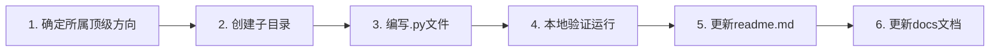

# 贡献指南 / Contributing Guide

感谢你对 Python 数据挖掘项目的关注！欢迎通过以下方式参与贡献。

---

## 🤝 如何贡献

### 报告问题

如果你发现了 Bug 或有改进建议：

1. 在 GitHub Issues 中搜索是否已有相关 Issue
2. 如果没有，创建新 Issue，包含以下信息：
   - **问题描述**：清晰描述遇到的问题或建议
   - **复现步骤**：如果是 Bug，提供复现步骤
   - **环境信息**：Python 版本、操作系统、依赖版本
   - **期望行为**：你期望的正确行为

### 提交代码

1. **Fork** 本仓库到你的 GitHub 账户
2. 从 `main` 分支创建特性分支：
   ```bash
   git checkout -b feature/你的特性名称
   ```
3. 按照编码规范编写代码（参见 [实施与开发文档](./docs/05-实施与开发文档.md)）
4. 确保代码可独立运行：`python <你的模块>.py`
5. 提交代码，遵循提交信息规范：
   ```
   <type>(<scope>): <subject>
   
   type:
     feat:     新增功能/模块
     fix:      修复缺陷
     docs:     文档更新
     refactor: 代码重构
     style:    格式调整
     test:     测试相关
   
   scope: 模块编号或名称（如 04、docs）
   
   示例:
     feat(04): 添加XGBoost分类器
     fix(07): 修复Apriori算法空集bug
     docs: 更新架构设计文档
   ```
6. 推送到你的 Fork 仓库
7. 创建 Pull Request，描述你的改动内容

---

## 📝 编码规范

### 文件命名

| 规则 | 格式 | 示例 |
|------|------|------|
| 顶级目录 | `NN_中文名称` | `04_分类算法` |
| 子目录 | `NN_中文名称` | `01_K近邻算法` |
| 核心算法文件 | `中文名称.py` | `K近邻算法.py` |
| 案例文件 | `NN_案例名称.py` | `02_手写数字识别.py` |
| 辅助模块 | `英文名称.py` | `treePlotter.py` |

### 代码结构模板

```python
"""
模块中文名称 - Module English Name
================================================
涵盖XXX的核心内容：
1. 功能1
2. 功能2
3. 功能3

参考：XXX教材第X章
"""

import numpy as np
import pandas as pd
# ... 其他导入

# ============================================================
# 1. 功能1
# ============================================================
def function_one():
    """功能1的中文说明"""
    pass


# ============================================================
# 主程序演示
# ============================================================
if __name__ == '__main__':
    print("=" * 60)
    print("模块名称完整流程演示")
    print("=" * 60)

    # --- 1. 功能1演示 ---
    print("\n--- 1. 功能1 ---")
    function_one()
```

### 关键要求

| 项目 | 规范 |
|------|------|
| Python 版本 | 3.8+ |
| 代码风格 | PEP 8 |
| 字符编码 | UTF-8 |
| 注释语言 | 中文 |
| 函数文档 | 三引号 docstring，中文说明 |
| 分节标记 | `# ====...====` 分隔各功能节 |
| 中文显示 | `plt.rcParams['font.sans-serif'] = ['SimHei']` |
| 随机种子 | `random_state=42` 或 `np.random.seed(42)` |
| 模块独立性 | 每个模块可独立 `python xxx.py` 运行，无跨模块硬编码依赖 |

---

## 🆕 添加新算法模块

### 步骤



**示例：添加 XGBoost 分类器**

1. 确定方向 → `04_分类算法`
2. 创建目录 → `04_分类算法/06_XGBoost/`
3. 编写文件 → `04_分类算法/06_XGBoost/XGBoost分类.py`
4. 运行验证 → `python "04_分类算法/06_XGBoost/XGBoost分类.py"`
5. 更新文档：
   - [readme.md](./readme.md) — 添加到对应阶段详解
   - [02-需求规格说明书.md](./docs/02-需求规格说明书.md) — 添加功能需求条目
   - [05-实施与开发文档.md](./docs/05-实施与开发文档.md) — 添加源码导读条目

---

## ✅ 代码审查清单

提交 PR 前请自查：

- [ ] 模块可独立运行，无跨模块硬编码依赖
- [ ] 模块 docstring 完整（包含模块说明、功能列表、参考）
- [ ] 每个函数/类有中文 docstring
- [ ] 关键步骤有行内注释
- [ ] 遵循 PEP 8 代码风格
- [ ] 使用 `# ====...====` 分节标记
- [ ] 中文图表可正确显示（SimHei 字体设置）
- [ ] 随机种子固定（`random_state=42`）
- [ ] 无外部数据依赖（使用 sklearn 内置数据集或合成数据）
- [ ] readme.md 和相关文档已同步更新

---

## 📜 许可协议

通过向本项目提交代码，你同意你的贡献将按照 [MIT License](./LICENSE) 发布。

---

## 💬 交流与反馈

- **Issue**：[GitHub Issues](../../issues) — Bug 报告和功能建议
- **Discussion**：[GitHub Discussions](../../discussions) — 问题讨论和经验分享

感谢你的贡献！🎉
