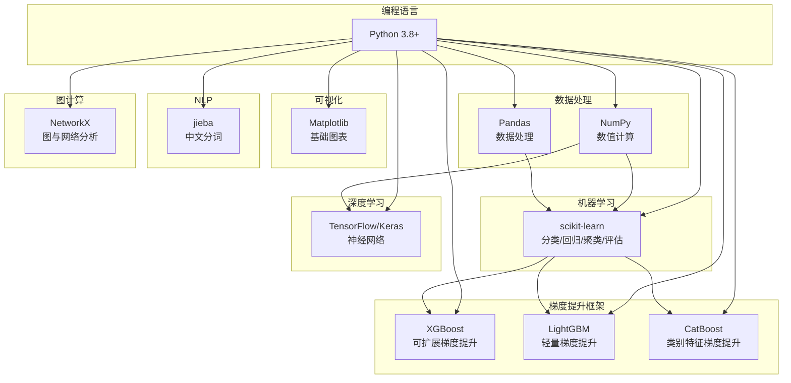

# 快速上手与项目概述

> 🏠 [项目首页](../README.md) | 📚 [文档中心](./README.md) | 📍 快速上手与项目概述 | ➡ [学习路线](./02-学习路线.md)

---

## 1. 项目简介

**Python 数据挖掘学习路径**（python-data-mining）— 系统化的数据挖掘知识库与代码实现集，遵循 CRISP-DM 标准流程，按"认知与数据 → 预测建模 → 模式发现 → 场景实战"4阶段渐进学习。

每个模块均为独立可运行的 Python 脚本，含完整示例数据，从手动实现到 sklearn 调用双线并行。

## 2. 项目定位与目标

### 2.1 项目定位

本项目是一个**系统化的数据挖掘知识库与代码实现集**，以 Python 为主要编程语言，完整覆盖从数据仓库到深度学习、从基础算法到行业应用的数据挖掘知识体系。项目遵循 **CRISP-DM**（Cross-Industry Standard Process for Data Mining）标准流程组织内容，使学习者按照"认知与数据 → 预测建模 → 模式发现 → 场景实战"的4阶段路线渐进学习。

### 2.2 项目目标

| 目标 | 说明 |
|------|------|
| **知识覆盖** | 覆盖 Han & Kamber《数据挖掘：概念与技术》核心章节内容 |
| **代码可运行** | 每个模块均为独立可运行的 Python 脚本，含完整示例数据 |
| **教学导向** | 从手动实现到 sklearn 调用，从理论到实践双线并行 |
| **企业可用** | 新成员可通过本项目快速掌握数据挖掘全栈技能 |

## 3. 目标用户

- 数据挖掘/机器学习方向的初学者
- 企业数据团队新入职成员
- 需要快速查阅特定算法实现的学习者
- 数据挖掘课程的教学参考

## 4. 技术栈

### 4.1 技术栈全景



### 4.2 依赖清单

| 库 | 版本 | 用途 | 使用模块 |
|----|------|------|----------|
| numpy | ≥1.20 | 数值计算、矩阵运算 | 全部模块 |
| pandas | ≥1.3 | 数据处理、ETL演示 | 01数据仓库、02数据探索 |
| matplotlib | ≥3.4 | 数据可视化 | 02数据可视化、03回归、04分类 |
| scikit-learn | ≥1.0 | 机器学习算法与评估 | 02~08全部算法模块 |
| scipy | ≥1.7 | 统计检验、优化 | 03回归分析 |
| tensorflow | ≥2.6 | 深度学习 | 08深度学习（神经网络基础、CNN文本分类、自编码器与VAE、对比学习与自监督学习、Transformer与注意力机制） |
| h5py | ≥3.0 | 模型存储 | 08深度学习 |
| lightgbm | ≥3.0 | 梯度提升框架 | 06集成学习/现代梯度提升 |
| catboost | ≥1.0 | 梯度提升框架 | 06集成学习/现代梯度提升 |
| networkx | ≥2.6 | 图与网络分析 | 09应用领域/图与网络挖掘、图神经网络 |
| jieba | ≥0.42 | 中文分词 | 09应用领域/NLP |

## 5. 项目统计

| 指标 | 数值 |
|------|------|
| 顶级模块数 | 10 |
| Python 文件总数 | 78（67 源码 + 11 测试） |
| 知识方向数 | 4阶段 / 10模块 / 30+子方向 |
| 涵盖算法 | 115+ |
| 测试用例数 | 119 |
| 测试文件数 | 11 |
| 参考标准 | CRISP-DM、Han & Kamber 第3版 |

### 5.1 算法覆盖一览

| 模块 | 核心算法 |
|------|----------|
| 00 数据挖掘导论 | CRISP-DM、欧氏/曼哈顿/余弦/闵可夫斯基/马氏距离、Jaccard相似度 |
| 01 数据仓库与OLAP | 星型/雪花模型、ETL流水线、ROLAP/MOLAP、上卷/下钻/切片/切块 |
| 02 数据探索与处理 | 缺失值处理、标准化/归一化、独热编码/目标编码、PCA特征选择、箱线图/散点图/热力图 |
| 03 回归分析 | 线性回归（正规方程/梯度下降）、岭回归/Lasso、逻辑回归、Softmax回归 |
| 04 分类算法 | KNN、朴素贝叶斯、ID3/C4.5/CART决策树、SVM（线性/RBF/SMO）、半监督学习（自训练/协同训练）、迁移学习 |
| 05 模型评估与调优 | 交叉验证、网格搜索/随机搜索、ROC-AUC/PR曲线、过采样/欠采样/SMOTE、LIME/SHAP/PDP/ICE |
| 06 集成学习 | Bagging/随机森林、AdaBoost/GBDT/XGBoost、LightGBM（GOSS/EFB）、CatBoost（有序目标编码）、Stacking |
| 07 无监督学习 | KMeans/Mini-Batch KMeans/DBSCAN/GMM/层次聚类、Apriori/FP-Growth/序列模式、PCA/SVD、孤立森林/LOF |
| 08 深度学习 | BP神经网络、CNN文本分类、自编码器/去噪自编码器/VAE、SimCLR/NT-Xent、Transformer/多头注意力/位置编码 |
| 09 应用领域 | TF-IDF/TextRank、ARIMA/指数平滑、协同过滤/SVD推荐、PageRank/GCN/GAT/GraphSAGE、DP-SGD/FedAvg |

## 6. 环境搭建

```bash
# 1. 克隆项目
git clone <repository-url>
cd python-data-mining

# 2. 创建虚拟环境（推荐）
python -m venv venv

# Windows 激活
venv\Scripts\activate

# macOS/Linux 激活
source venv/bin/activate

# 3. 安装核心依赖
pip install numpy pandas matplotlib scikit-learn scipy

# 4. 安装可选依赖
pip install tensorflow h5py              # 深度学习
pip install lightgbm catboost            # 现代梯度提升
pip install networkx                     # 图与网络挖掘
pip install jieba                        # 中文NLP

# 或一键安装全部依赖
pip install -r requirements.txt
```

## 7. 数据文件准备

本项目包含部分数据文件用于算法演示。数据文件采用**压缩版跟踪 + 未压缩版忽略**的 Git 管理策略：

- **压缩包（.zip）**：被 Git 跟踪，克隆仓库后即可获取
- **未压缩数据**：被 `.gitignore` 排除，需从 zip 解压后才能运行对应模块
- **小型数据文件**：决策树、SVM、KNN 等使用的 .txt 文件，直接被 Git 跟踪

> 本项目**不使用 Git LFS**。所有大文件以 .zip 压缩形式存放在仓库中，未压缩版通过 `.gitignore` 排除。

### 7.1 数据文件总览

| 文件/目录 | 路径 | 大小 | 格式 | 用途 | 必须性 |
|-----------|------|------|------|------|:------:|
| `digits.zip` | `04_分类算法/01_K近邻算法/` | ~0.66 MB | zip | KNN 手写数字识别 | 可选¹ |
| `email.zip` | `04_分类算法/02_朴素贝叶斯/` | ~14.6 KB | zip | 朴素贝叶斯垃圾邮件分类 | 可选¹ |
| `digits.zip` | `04_分类算法/04_支持向量机/` | ~0.62 MB | zip | SVM 手写数字识别 | 可选¹ |
| `kosarak.zip` | `07_无监督学习/02_关联规则挖掘/02_FPGrowth算法/` | ~7.5 MB | zip | FPGrowth 频繁项集挖掘 | 必须 |
| `mushroom.zip` | `07_无监督学习/02_关联规则挖掘/01_Apriori算法/` | ~100 KB | zip | Apriori 关联规则挖掘 | 必须 |
| `secom.zip` | `07_无监督学习/03_降维与矩阵分解/01_PCA主成分分析/` | ~2.6 MB | zip | PCA 降维分析 | 必须 |
| `data.zip` | `08_深度学习/02_文本分类模型对比/` | ~9.64 MB | zip | CNN/SVM 文本分类数据 | 必须 |
| `0_5.txt` | `07_无监督学习/03_降维与矩阵分解/03_SVD图像压缩/` | ~1 KB | txt | SVD 图像压缩演示 | 必须 |
| `lenses.txt` | `04_分类算法/03_决策树/01_ID3决策树/` | ~0.8 KB | txt | ID3 决策树分类 | 必须 |
| `sine.txt` | `04_分类算法/03_决策树/`（3个目录） | ~3.8 KB | txt | CART 回归树可视化 | 必须 |
| `datingTestSet2.txt` | `04_分类算法/01_K近邻算法/` | ~4.5 KB | txt | KNN 约会数据集分类测试 | 必须 |
| `bikeSpeedVsIq_train.txt` | `04_分类算法/03_决策树/`（2个目录） | ~1 KB | txt | CART 回归树训练数据 | 必须 |
| `bikeSpeedVsIq_test.txt` | `04_分类算法/03_决策树/`（2个目录） | ~1 KB | txt | CART 回归树测试数据 | 必须 |
| `testSetRBF.txt` | `04_分类算法/04_支持向量机/` | ~0.5 KB | txt | RBF 核函数测试集 1 | 必须 |
| `testSetRBF2.txt` | `04_分类算法/04_支持向量机/` | ~0.5 KB | txt | RBF 核函数测试集 2 | 必须 |

> ¹ 标记为"可选"的文件已有 sklearn 内置数据集替代方案，详见下方[已内嵌数据的替代方案](#已内嵌数据的替代方案)章节。

### 7.2 解压方法

**一次性解压所有 zip 文件**（在项目根目录执行）：

```bash
Get-ChildItem -Recurse -Filter "*.zip" | ForEach-Object {
    Expand-Archive -Path $_.FullName -DestinationPath $_.DirectoryName -Force
    Write-Output "已解压: $($_.Name)"
}
```

**单独解压指定文件**：

```bash
Expand-Archive -Path "04_分类算法/01_K近邻算法/digits.zip" -DestinationPath "04_分类算法/01_K近邻算法" -Force
Expand-Archive -Path "04_分类算法/02_朴素贝叶斯/email.zip" -DestinationPath "04_分类算法/02_朴素贝叶斯" -Force
Expand-Archive -Path "04_分类算法/04_支持向量机/digits.zip" -DestinationPath "04_分类算法/04_支持向量机" -Force
Expand-Archive -Path "07_无监督学习/02_关联规则挖掘/01_Apriori算法/mushroom.zip" -DestinationPath "07_无监督学习/02_关联规则挖掘/01_Apriori算法" -Force
Expand-Archive -Path "07_无监督学习/02_关联规则挖掘/02_FPGrowth算法/kosarak.zip" -DestinationPath "07_无监督学习/02_关联规则挖掘/02_FPGrowth算法" -Force
Expand-Archive -Path "07_无监督学习/03_降维与矩阵分解/01_PCA主成分分析/secom.zip" -DestinationPath "07_无监督学习/03_降维与矩阵分解/01_PCA主成分分析" -Force
Expand-Archive -Path "08_深度学习/02_文本分类模型对比/data.zip" -DestinationPath "08_深度学习/02_文本分类模型对比" -Force
```

> 解压后的未压缩文件已被 `.gitignore` 排除，不会被 Git 跟踪，无需担心误提交。

### 7.3 已内嵌数据的替代方案

以下模块已提供使用 sklearn 内置数据集的替代函数，**无需解压 zip 文件即可运行**：

| 模块 | 原始函数（需外部数据） | 替代函数（使用 sklearn 数据） | 说明 |
|------|----------------------|---------------------------|------|
| 朴素贝叶斯 | `spamTest()` — 需 `email/` 目录 | `spamTestSklearn()` — 内嵌合成数据 | 使用 24 条中英文合成邮件替代 |
| SVM | `testDigits()` — 需 `trainingDigits/` + `testDigits/` | `testDigitsSklearn()` — 使用 `sklearn.datasets.load_digits` | 使用 sklearn 8×8 手写数字数据替代 |

**使用示例**：

```python
import 朴素贝叶斯算法 as bayes
bayes.spamTestSklearn()

import SVM算法 as svmMLiA
svmMLiA.testDigitsSklearn(('rbf', 20))
```

> **注意**：KNN 模块的 `handwritingClassTest()` 目前仍需 `digits.zip` 解压后才能运行。如不想解压，可直接使用 sklearn 的 `load_digits()` 数据集。

### 7.4 常见问题

**Q: 运行 KNN 手写数字识别报错找不到 `digits/` 目录？**

需要先解压 `digits.zip`：

```bash
cd "04_分类算法/01_K近邻算法"
Expand-Archive -Path digits.zip -DestinationPath . -Force
```

**Q: 运行朴素贝叶斯垃圾邮件分类报错找不到 `email/` 目录？**

方式一：解压 `email.zip` 后使用 `spamTest()`

方式二：直接使用替代函数 `spamTestSklearn()`，无需解压

**Q: `data.zip` 解压后 `.hdf5` 文件报错找不到？**

确保解压到 `08_深度学习/02_文本分类模型对比/` 目录下，解压后应出现 `data/` 子目录：

```
08_深度学习/02_文本分类模型对比/
├── data/
│   ├── train_onehot.hdf5
│   └── test_onehot.hdf5
└── ...
```

**Q: CART 回归树报错找不到 `bikeSpeedVsIq_train.txt`？**

该文件位于 `04_分类算法/03_决策树/03_CART回归树/` 目录中。如缺失，可从 `machinelearninginaction-master/Ch09/` 复制。

## 8. 运行第一个模块

```bash
python "00_数据挖掘导论/数据挖掘导论.py"
```

运行后将输出：

- 数据挖掘任务分类体系（描述性 vs 预测性）
- CRISP-DM 标准流程六步骤
- 数据类型与数据质量分析
- 6种距离/相似度度量示例（欧氏、曼哈顿、闵可夫斯基、余弦、杰卡德、汉明）
- 数据挖掘典型应用场景

> 💡 每个模块均可独立运行，无跨模块依赖。如遇 Matplotlib 中文显示问题，请确认系统已安装 SimHei 或 Microsoft YaHei 字体。

## 9. 项目结构

```
python-data-mining/
├── 00_数据挖掘导论/
│   └── 数据挖掘导论.py
├── 01_数据仓库与OLAP/
│   ├── 01_数据仓库基础/
│   │   └── 数据仓库基础.py
│   └── 02_OLAP多维分析/
│       └── OLAP多维分析.py
├── 02_数据探索与处理/
│   ├── 01_数据预处理与特征工程/
│   │   ├── 数据预处理.py
│   │   └── 特征工程.py
│   └── 02_数据可视化/
│       └── 数据可视化.py
├── 03_回归分析/
│   ├── 01_线性回归.py
│   └── 02_逻辑回归.py
├── 04_分类算法/
│   ├── 01_K近邻算法/
│   │   ├── K近邻算法.py
│   │   └── 02_手写数字识别.py
│   ├── 02_朴素贝叶斯/
│   │   ├── 朴素贝叶斯算法.py
│   │   └── 02_垃圾邮件分类.py
│   ├── 03_决策树/
│   │   ├── 01_ID3决策树/
│   │   │   ├── trees.py
│   │   │   ├── treePlotter.py
│   │   │   ├── ID3分类案例.py
│   │   │   └── ID3补充实现.py
│   │   ├── 02_C45决策树/
│   │   │   └── C45决策树.py
│   │   ├── 03_CART回归树/
│   │   │   ├── CART.py
│   │   │   ├── regTrees.py
│   │   │   ├── treeExplore.py
│   │   │   └── CART回归树案例.py
│   │   └── 04_CART可视化GUI/
│   │       ├── CART.py
│   │       ├── GUI.py
│   │       ├── regTrees.py
│   │       └── test/
│   │           ├── GUI.py
│   │           └── regTrees.py
│   ├── 04_支持向量机/
│   │   ├── SVM算法.py
│   │   └── 02_手写数字识别.py
│   └── 05_半监督学习与迁移学习/
│       └── 半监督学习与迁移学习.py
├── 05_模型评估与调优/
│   ├── 01_模型评估与调优.py
│   ├── 02_类别不平衡处理.py
│   └── 03_可解释AI/
│       └── 可解释AI.py
├── 06_集成学习/
│   ├── 集成学习.py
│   └── 02_现代梯度提升/
│       └── 现代梯度提升.py
├── 07_无监督学习/
│   ├── 01_聚类分析/
│   │   ├── KMeans聚类.py
│   │   └── 高级聚类.py
│   ├── 02_关联规则挖掘/
│   │   ├── 01_Apriori算法/
│   │   │   └── Apriori.py
│   │   ├── 02_FPGrowth算法/
│   │   │   ├── FP_Growth.py
│   │   │   ├── FP_Growth算法.py
│   │   │   ├── fpGrowth.py
│   │   │   └── main.py
│   │   └── 03_序列模式挖掘/
│   │       └── 序列模式挖掘.py
│   ├── 03_降维与矩阵分解/
│   │   ├── 01_PCA主成分分析/
│   │   │   └── PCA.py
│   │   ├── 02_SVD推荐系统/
│   │   │   └── SVD.py
│   │   └── 03_SVD图像压缩/
│   │       └── SVD.py
│   └── 04_异常检测/
│       └── 异常检测.py
├── 08_深度学习/
│   ├── 01_神经网络基础/
│   │   └── 神经网络基础.py
│   ├── 02_文本分类模型对比/
│   │   ├── CNN文本分类.py
│   │   ├── CNN文本分类_GPU.py
│   │   ├── CNN文本分类_v2.py
│   │   ├── SVM文本分类.py
│   │   ├── SVM网格搜索调参.py
│   │   ├── SVM随机搜索调参.py
│   │   ├── 逻辑回归文本分类.py
│   │   ├── 随机森林文本分类.py
│   │   └── 随机森林文本分类_v2.py
│   ├── 03_自编码器与生成模型/
│   │   └── 自编码器与VAE.py
│   ├── 04_对比学习与自监督学习/
│   │   └── 对比学习与自监督学习.py
│   └── 05_Transformer与注意力机制/
│       └── Transformer与注意力机制.py
├── 09_应用领域/
│   ├── 01_自然语言处理/
│   │   └── NLP基础.py
│   ├── 02_时间序列分析/
│   │   └── 时间序列分析.py
│   ├── 03_推荐系统/
│   │   └── 推荐系统.py
│   ├── 04_图与网络挖掘/
│   │   ├── 图与网络挖掘.py
│   │   └── 02_图神经网络/
│   │       └── 图神经网络.py
│   ├── 05_Web挖掘/
│   │   └── Web挖掘.py
│   ├── 06_流数据挖掘/
│   │   └── 流数据挖掘.py
│   └── 07_联邦学习与隐私保护/
│       └── 联邦学习与隐私保护.py
├── docs/                              # 项目文档
├── tests/                             # 测试文件
├── utils.py                           # 公共工具函数
└── README.md                          # 学习路线总览
```

每个 `.py` 文件均可独立运行，无跨模块依赖。

## 10. 与同类项目对比

| 特性 | 本项目 | 典型教程仓库 | 纯理论课程 |
|------|--------|-------------|-----------|
| 代码可运行 | ✅ 独立运行 | ⚠️ 需额外配置 | ❌ 无代码 |
| 手动实现 | ✅ 从零实现核心算法 | ⚠️ 仅sklearn调用 | ❌ |
| 知识体系完整 | ✅ 覆盖10大方向30+子方向 | ⚠️ 常见3-5个方向 | ✅ |
| 数据仓库/OLAP | ✅ 权威教材级别 | ❌ 通常缺失 | ⚠️ |
| 应用领域 | ✅ 7大方向（NLP/时序/推荐/图/Web/流数据/联邦学习） | ⚠️ 1-2个 | ⚠️ |
| CRISP-DM流程 | ✅ 学习路线遵循 | ❌ | ⚠️ |
| 可解释AI | ✅ LIME/SHAP/PDP/ICE | ❌ 通常缺失 | ⚠️ |
| 现代梯度提升 | ✅ LightGBM/CatBoost/XGBoost对比 | ⚠️ 仅XGBoost | ⚠️ |
| 深度学习前沿 | ✅ VAE/对比学习/Transformer | ⚠️ 仅基础CNN | ⚠️ |
| 图神经网络 | ✅ GCN/GAT/GraphSAGE | ❌ 通常缺失 | ⚠️ |
| 联邦学习 | ✅ FedAvg/DP-SGD | ❌ 通常缺失 | ⚠️ |
| 测试覆盖 | ✅ 119个测试用例 | ❌ 通常无测试 | ❌ |
| 算法数量 | ✅ 115+ | ⚠️ 20-30 | ✅ |
