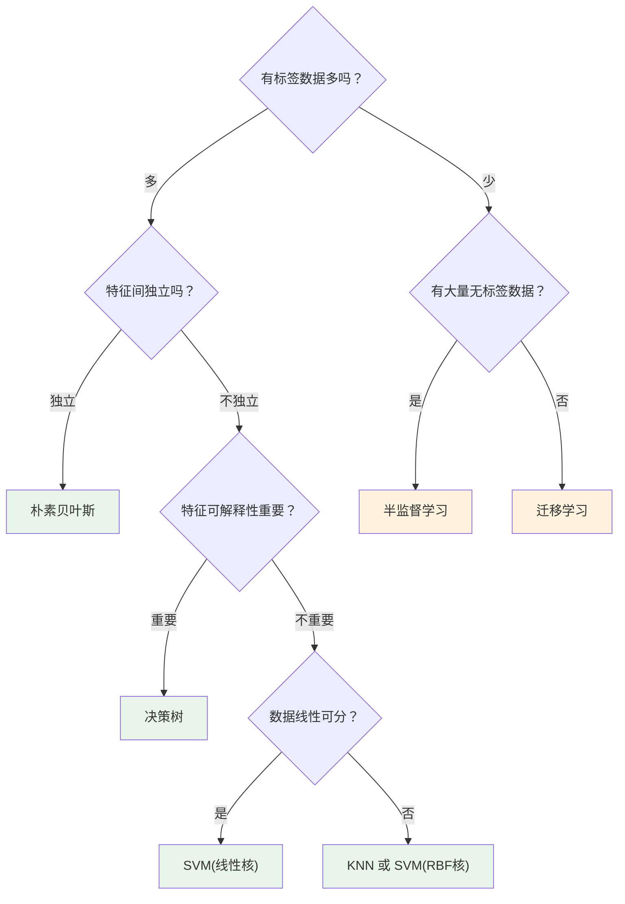
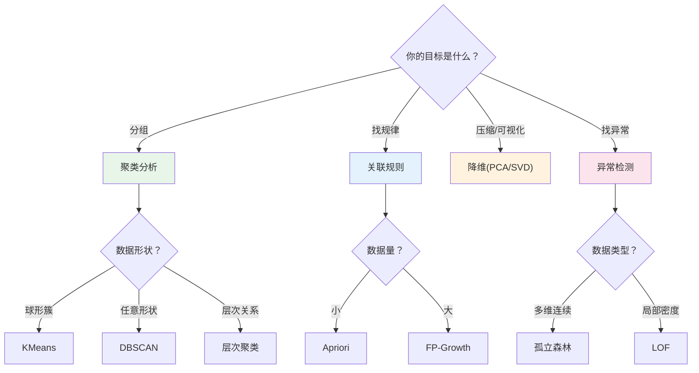

# 学习路线

> 🏠 [项目首页](../readme.md) | ⬅ [快速上手](./01-快速上手.md) | 📍 学习路线

---

## 学习原则

1. **先感后知**：先运行代码获得直觉，再阅读原理理解本质，最后深入源码掌握实现
2. **输出驱动**：每个阶段都有明确的产出目标，学完即可验证
3. **渐进深入**：从运行验证到理解原理，从调参观察到动手实现

---

## 学习路线总览

```
╔══════════════════════════════════════════════════════════════════════════╗
║  第一阶段：认知与数据 — "数据挖掘做什么？数据从哪来？数据长什么样？"       ║
╠══════════════════════════════════════════════════════════════════════════╣
║                                                                        ║
║  00 数据挖掘导论 ──▶ 01 数据仓库与OLAP ──▶ 02 数据探索与处理           ║
║  (全局视角/CRISP-DM)  (数据从哪来/如何组织)   (清洗/变换/可视化)        ║
║                                                                        ║
╚══════════════════════════════════════════════════════════════════════════╝
                                    │
                                    ▼
╔══════════════════════════════════════════════════════════════════════════╗
║  第二阶段：预测建模 — "如何从数据中学习并进行预测？"                       ║
╠══════════════════════════════════════════════════════════════════════════╣
║                                                                        ║
║  03 回归分析 ──▶ 04 分类算法 ──▶ 05 模型评估与调优 ──▶ 06 集成学习     ║
║  (连续值预测)     (离散标签预测)   (评估/调参/不平衡)    (组合提升)      ║
║                  └─含半监督与迁移学习─┘                                  ║
║                                                                        ║
╚══════════════════════════════════════════════════════════════════════════╝
                                    │
                                    ▼
╔══════════════════════════════════════════════════════════════════════════╗
║  第三阶段：模式发现 — "没有标签的数据中能发现什么？"                       ║
╠══════════════════════════════════════════════════════════════════════════╣
║                                                                        ║
║  07 无监督学习 ──────────────▶ 08 深度学习                              ║
║  ├ 01 聚类分析                 ├ 01 神经网络基础                        ║
║  ├ 02 关联规则挖掘             └ 02 文本分类模型对比                     ║
║  ├ 03 降维与矩阵分解                                                   ║
║  └ 04 异常检测                                                         ║
║                                                                        ║
╚══════════════════════════════════════════════════════════════════════════╝
                                    │
                                    ▼
╔══════════════════════════════════════════════════════════════════════════╗
║  第四阶段：场景实战 — "数据挖掘在各领域的真实应用"                         ║
╠══════════════════════════════════════════════════════════════════════════╣
║                                                                        ║
║  09 应用领域                                                           ║
║  ├ 01 自然语言处理 ── 分词/TF-IDF/情感分析/主题模型                     ║
║  ├ 02 时间序列分析 ── 平稳性检验/ARIMA/指数平滑/时序分解                 ║
║  ├ 03 推荐系统 ───── 协同过滤/矩阵分解/NDCG/冷启动                      ║
║  ├ 04 图与网络挖掘 ── 中心性/PageRank/社区发现/链接预测                  ║
║  ├ 05 Web挖掘 ────── PageRank·HITS/TF-IDF内容/日志模式                   ║
║  └ 06 流数据挖掘 ─── 滑动窗口/概念漂移/在线聚类                         ║
║                                                                        ║
╚══════════════════════════════════════════════════════════════════════════╝
```

---

## 第零阶段：基础入门（1天）

| 步骤 | 行动 | 产出 |
|:---:|------|------|
| 1 | 通读 [readme.md](../readme.md)，理解4阶段10模块结构 | 知道学习路线全貌 |
| 2 | 阅读 [快速上手](./01-快速上手.md)，搭建环境 | 环境就绪 |
| 3 | 运行 `python "00_数据挖掘导论/数据挖掘导论.py"` | 看到距离度量计算结果和CRISP-DM输出 |

**自检：**

- [ ] 我能说清这个项目是做什么的
- [ ] 我能在本地运行至少一个模块
- [ ] 我知道10个模块分别覆盖什么方向

---

## 第一阶段：认知与数据（1-2周）

> **核心问题**：数据挖掘做什么？数据从哪来？数据长什么样？

### 模块00：数据挖掘导论（2小时）

| 行动 | 内容 |
|------|------|
| 运行 | `python "00_数据挖掘导论/数据挖掘导论.py"` |
| 关注 | CRISP-DM流程、任务分类体系、6种距离度量的直觉理解 |
| 动手 | 修改距离度量的输入向量，观察结果变化；尝试添加曼哈顿距离的实现 |
| 产出 | 用自己的话描述CRISP-DM的6个步骤 |

**关键源码：**

| 函数 | 功能 | 源码 |
|------|------|------|
| `print_mining_tasks()` | 任务分类体系 | [数据挖掘导论.py#L22](../00_数据挖掘导论/数据挖掘导论.py#L22) |
| `print_crisp_dm()` | CRISP-DM流程 | [数据挖掘导论.py#L52](../00_数据挖掘导论/数据挖掘导论.py#L52) |
| `demo_distance_metrics()` | 距离度量演示 | [数据挖掘导论.py#L160](../00_数据挖掘导论/数据挖掘导论.py#L160) |

### 模块01：数据仓库与OLAP（3小时）

| 行动 | 内容 |
|------|------|
| 运行 | `python "01_数据仓库与OLAP/01_数据仓库基础/数据仓库基础.py"` |
| 运行 | `python "01_数据仓库与OLAP/02_OLAP多维分析/OLAP多维分析.py"` |
| 关注 | 数据仓库多层架构、星形/雪花/事实星座模型的区别、OLAP五大操作 |
| 动手 | 画一个星形模型的示意图（维度表+事实表）；修改ETL示例的数据源，观察转换过程 |
| 产出 | 说清OLAP上卷/下钻/切片/切块/旋转的区别 |

**关键源码：**

| 函数 | 功能 | 源码 |
|------|------|------|
| `demonstrate_warehouse_architecture()` | 数据仓库架构 | [数据仓库基础.py#L26](../01_数据仓库与OLAP/01_数据仓库基础/数据仓库基础.py#L26) |
| `demonstrate_etl_process()` | ETL过程演示 | [数据仓库基础.py#L145](../01_数据仓库与OLAP/01_数据仓库基础/数据仓库基础.py#L145) |
| `demonstrate_olap_operations()` | OLAP五大操作 | [OLAP多维分析.py#L71](../01_数据仓库与OLAP/02_OLAP多维分析/OLAP多维分析.py#L71) |

### 模块02：数据探索与处理（4小时）

| 行动 | 内容 |
|------|------|
| 运行 | `python "02_数据探索与处理/01_数据预处理与特征工程/数据预处理.py"` |
| 运行 | `python "02_数据探索与处理/01_数据预处理与特征工程/特征工程.py"` |
| 运行 | `python "02_数据探索与处理/02_数据可视化/数据可视化.py"` |
| 关注 | 缺失值处理策略、标准化方法选择、特征工程意义、图表类型选择 |
| 动手 | 对同一个数据集尝试不同标准化方法，对比可视化结果；用 `RFE` 替换方差阈值选择 |
| 产出 | 写出"数据清洗检查清单"（至少5项） |

**阶段自检：**

- [ ] 我能解释CRISP-DM流程的6个步骤
- [ ] 我能说清数据仓库和操作数据库的区别
- [ ] 我能列举至少3种数据预处理方法及其适用场景

---

## 第二阶段：预测建模（2-3周）

> **核心问题**：如何从数据中学习并进行预测？

### 模块03：回归分析（4小时）

| 行动 | 内容 |
|------|------|
| 运行 | `python "03_回归分析/01_线性回归.py"` |
| 运行 | `python "03_回归分析/02_逻辑回归.py"` |
| 关注 | 线性回归 vs 逻辑回归的本质区别、正则化的直觉理解、ROC曲线解读 |
| 动手 | 修改正则化强度(`alpha`)，观察过拟合/欠拟合变化；对比手动实现与 `sklearn` 的输出 |
| 产出 | 画出线性回归和逻辑回归的对比表（问题类型/输出/损失函数/评估指标） |

### 模块04：分类算法（8小时，最重模块）

> 建议分5天学习，每天一个子方向。

| 天 | 子方向 | 学习重点 | 核心源码 |
|:--:|--------|---------|----------|
| 1 | KNN | 理解"k近邻投票"思想，修改k值观察准确率变化，阅读 `classify()` 实现 | [K近邻算法.py](../04_分类算法/01_K近邻算法/K近邻算法.py) |
| 2 | 朴素贝叶斯 | 理解"条件独立假设"，看懂垃圾邮件分类流程，阅读概率计算和拉普拉斯平滑 | [朴素贝叶斯算法.py](../04_分类算法/02_朴素贝叶斯/朴素贝叶斯算法.py) |
| 3 | 决策树 | 理解信息增益/增益率/基尼指数三种分裂准则，阅读 `createTree()` 递归实现 | [trees.py](../04_分类算法/03_决策树/01_ID3决策树/trees.py) |
| 4 | SVM | 理解"最大间隔超平面"，看懂核函数的作用，阅读 SMO 算法实现 | [SVM算法.py](../04_分类算法/04_支持向量机/SVM算法.py) |
| 5 | 半监督学习 | 理解"标签稀缺场景"的现实意义和策略选择，阅读自训练/协同训练实现 | [半监督学习与迁移学习.py](../04_分类算法/05_半监督学习与迁移学习/半监督学习与迁移学习.py) |

**分类算法选择决策图：**



### 模块05：模型评估与调优（3小时）

| 行动 | 内容 |
|------|------|
| 运行 | `python "05_模型评估与调优/01_模型评估与调优.py"` |
| 运行 | `python "05_模型评估与调优/02_类别不平衡处理.py"` |
| 关注 | 准确率/精确率/召回率/F1/AUC的含义和选择、交叉验证的必要性 |
| 动手 | 对分类结果画出混淆矩阵，计算各项指标；实现简化版 K-Fold 交叉验证 |
| 产出 | 写出"模型评估指标选择指南"（二分类/多分类/回归各用什么） |

### 模块06：集成学习（3小时）

| 行动 | 内容 |
|------|------|
| 运行 | `python "06_集成学习/集成学习.py"` |
| 关注 | Bagging vs Boosting vs Stacking 的直觉理解 |
| 动手 | 对比单棵决策树 vs 随机森林 vs AdaBoost 的准确率；修改 `n_estimators`、`learning_rate` 绘制学习曲线 |
| 产出 | 画出三种集成策略的对比表（并行/串行/异质） |

**阶段自检：**

- [ ] 我能解释线性回归和逻辑回归的核心区别
- [ ] 我能说出至少4种分类算法及其适用场景
- [ ] 我能解释精确率和召回率的权衡关系
- [ ] 我能说明 Bagging 和 Boosting 的本质区别

---

## 第三阶段：模式发现（2周）

> **核心问题**：没有标签的数据中能发现什么？

### 模块07：无监督学习（8小时）

> 建议4天学习，每天一个子方向。

| 天 | 子方向 | 学习重点 | 核心源码 |
|:--:|--------|---------|----------|
| 1 | 聚类分析 | 理解KMeans"迭代更新质心"过程，K值选择（肘部法则/轮廓系数），手动实现KMeans | [KMeans聚类.py](../07_无监督学习/01_聚类分析/KMeans聚类.py) |
| 2 | 关联规则 | 理解支持度/置信度/提升度的含义，读懂Apriori逐层搜索思想 | [Apriori.py](../07_无监督学习/02_关联规则挖掘/01_Apriori算法/Apriori.py) |
| 3 | 降维 | 理解PCA"最大方差方向"的直觉，SVD协同过滤推荐实现 | [PCA.py](../07_无监督学习/03_降维与矩阵分解/01_PCA主成分分析/PCA.py) / [SVD.py](../07_无监督学习/03_降维与矩阵分解/02_SVD推荐系统/SVD.py) |
| 4 | 异常检测 | 理解"什么是异常"，4种检测方法的适用场景 | [异常检测.py](../07_无监督学习/04_异常检测/异常检测.py) |

**无监督方法选择指南：**



### 模块08：深度学习（6小时）

| 行动 | 内容 |
|------|------|
| 运行 | `python "08_深度学习/01_神经网络基础/神经网络基础.py"` |
| 关注 | 感知机→BP网络→CNN的演进逻辑、激活函数的作用、Dropout/BatchNorm的意义 |
| 动手 | 修改隐藏层节点数，观察训练曲线变化；从零实现反向传播，验证梯度计算正确性 |
| 产出 | 用自己的话解释"神经网络是如何学习的" |

**阶段自检：**

- [ ] 我能解释聚类和分类的本质区别
- [ ] 我能说明支持度、置信度、提升度的含义
- [ ] 我能解释PCA降维的直觉含义
- [ ] 我能说出孤立森林和LOF的适用场景差异
- [ ] 我能用自己话解释神经网络的前向传播和反向传播

---

## 第四阶段：场景实战（2-3周）

> **核心问题**：数据挖掘在各领域的真实应用是怎样的？

> **注意**：09应用领域各方向有前序知识依赖，请确保先完成对应模块的学习。

| 方向 | 前序依赖 | 学习重点 | 核心源码 |
|------|---------|---------|----------|
| 自然语言处理 | 04分类、07降维 | 分词→TF-IDF→分类的完整流程 | [NLP基础.py](../09_应用领域/01_自然语言处理/NLP基础.py) |
| 时间序列分析 | 03回归 | 平稳性检验→ARIMA建模→预测 | [时间序列分析.py](../09_应用领域/02_时间序列分析/时间序列分析.py) |
| 推荐系统 | 07SVD、05评估 | 协同过滤的直觉理解 | [推荐系统.py](../09_应用领域/03_推荐系统/推荐系统.py) |
| 图与网络挖掘 | 07聚类 | PageRank的直觉理解 | [图与网络挖掘.py](../09_应用领域/04_图与网络挖掘/图与网络挖掘.py) |
| Web挖掘 | 图挖掘、NLP | HITS vs PageRank的区别 | [Web挖掘.py](../09_应用领域/05_Web挖掘/Web挖掘.py) |
| 流数据挖掘 | 07聚类、07异常 | 滑动窗口和概念漂移 | [流数据挖掘.py](../09_应用领域/06_流数据挖掘/流数据挖掘.py) |

**阶段自检：**

- [ ] 我能说出至少4个数据挖掘的应用方向及其核心方法
- [ ] 我能针对一个新场景选择合适的数据挖掘方法

---

## 毕业产出

完成全部4阶段后，你应该能够产出：

1. **数据挖掘方法选择指南**：针对不同场景（分类/聚类/关联/推荐...）选择合适算法
2. **算法解读笔记**：对每个核心算法用自己的话描述原理、适用场景、优缺点
3. **参数调优经验**：记录关键参数（k、min_support、正则化强度等）对结果的影响

---

## 时间规划

| 阶段 | 模块 | 纯学习时长 | 含消化练习 |
|------|------|:---------:|:---------:|
| 基础入门 | — | 2小时 | 1天 |
| 认知与数据 | 00-02 | 9小时 | 1-2周 |
| 预测建模 | 03-06 | 18小时 | 2-3周 |
| 模式发现 | 07-08 | 14小时 | 2周 |
| 场景实战 | 09 | 12小时 | 2-3周 |
| **合计** | | **55小时** | **8-12周** |

**最小可行路线**：00 → 02 → 03 → 04(KNN+决策树) → 05 → 07(聚类+降维) ≈ 20小时

---

## 常见问题

### 学不完怎么办？

按需选学：每个阶段自检通过即可跳过，09应用方向可按兴趣选择3-4个。

### 如何验证学习效果？

每个阶段的**阶段自检**是最直接的验证。核心标准：**你能否用自己的话向他人解释这个算法？**
