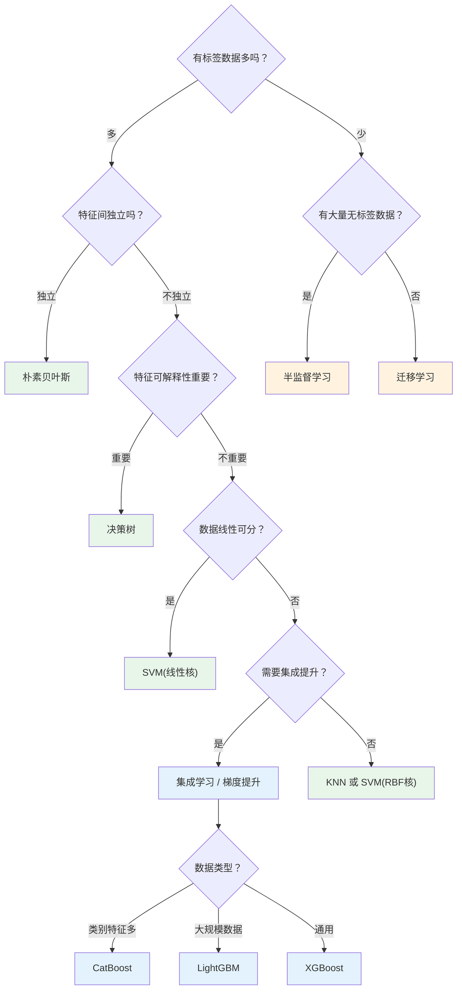
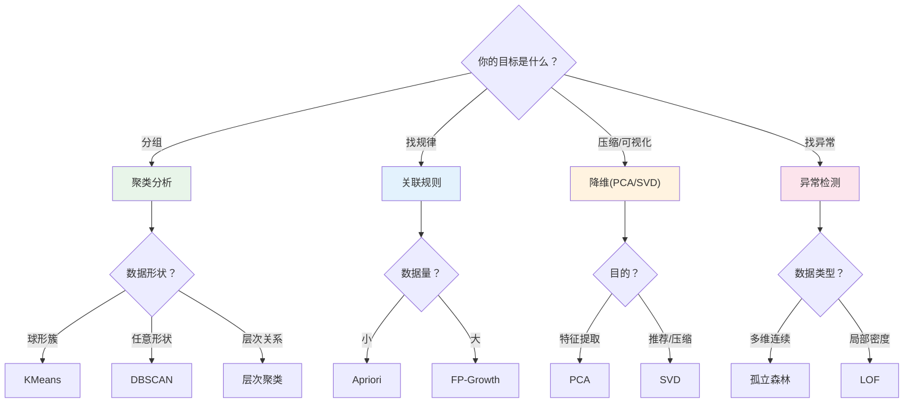

# 学习路线

> 🏠 [项目首页](../README.md) | 📚 [文档中心](./README.md) | ⬅ [快速上手](./01-快速上手.md) | 📍 学习路线 | ➡ [数据文件说明](./03-数据文件说明.md)

---

## 学习原则

1. **先感后知**：先运行代码获得直觉，再阅读原理理解本质，最后深入源码掌握实现
2. **输出驱动**：每个阶段都有明确的产出目标，学完即可验证
3. **渐进深入**：从运行验证到理解原理，从调参观察到动手实现

---

## CRISP-DM 学习活动图

本项目遵循 CRISP-DM 标准流程，4个学习阶段与 CRISP-DM 各环节紧密对应：

```mermaid
activityDiagram
    start
    note right: CRISP-DM 标准流程驱动学习

    stage 第一阶段：认知与数据
    note right of stage: 对应 CRISP-DM 业务理解 + 数据理解
    [*] --> 了解CRISP_DM流程
    了解CRISP_DM流程 --> 理解数据仓库架构
    理解数据仓库架构 --> 执行ETL过程
    执行ETL过程 --> 探索数据分布
    探索数据分布 --> 缺失值与异常处理
    缺失值与异常处理 --> 特征工程变换
    特征工程变换 --> 数据可视化分析

    stage 第二阶段：预测建模
    note right of stage: 对应 CRISP-DM 数据准备 + 建模
    数据可视化分析 --> 线性回归建模
    线性回归建模 --> 逻辑回归分类
    逻辑回归分类 --> 分类算法学习
    分类算法学习 --> 模型评估与调优
    模型评估与调优 --> 类别不平衡处理
    类别不平衡处理 --> 可解释AI分析
    可解释AI分析 --> 集成学习方法
    集成学习方法 --> 现代梯度提升

    stage 第三阶段：模式发现
    note right of stage: 对应 CRISP-DM 建模 + 评估（无监督）
    现代梯度提升 --> 聚类分析
    聚类分析 --> 关联规则挖掘
    关联规则挖掘 --> 降维与矩阵分解
    降维与矩阵分解 --> 异常检测
    异常检测 --> 神经网络基础
    神经网络基础 --> 自编码器与VAE
    自编码器与VAE --> 对比学习与自监督
    对比学习与自监督 --> Transformer与注意力机制

    stage 第四阶段：场景实战
    note right of stage: 对应 CRISP-DM 评估 + 部署
    Transformer与注意力机制 --> 自然语言处理
    自然语言处理 --> 时间序列分析
    时间序列分析 --> 推荐系统
    推荐系统 --> 图与网络挖掘
    图与网络挖掘 --> 图神经网络
    图神经网络 --> Web挖掘
    Web挖掘 --> 流数据挖掘
    流数据挖掘 --> 联邦学习与隐私保护

    联邦学习与隐私保护 --> [*]
    note right: 完成全部学习，产出数据挖掘方法选择指南
```

---

## 学习路线总览

```
╔══════════════════════════════════════════════════════════════════════════╗
║  第一阶段：认知与数据 — "数据挖掘做什么？数据从哪来？数据长什么样？"       ║
╠══════════════════════════════════════════════════════════════════════════╣
║                                                                        ║
║  00 数据挖掘导论 ──▶ 01 数据仓库与OLAP ──▶ 02 数据探索与处理           ║
║  (全局视角/CRISP-DM)  (数据从哪来/如何组织)   (清洗/变换/可视化)        ║
║                                                                        ║
╚══════════════════════════════════════════════════════════════════════════╝
                                    │
                                    ▼
╔══════════════════════════════════════════════════════════════════════════╗
║  第二阶段：预测建模 — "如何从数据中学习并进行预测？"                       ║
╠══════════════════════════════════════════════════════════════════════════╣
║                                                                        ║
║  03 回归分析 ──▶ 04 分类算法 ──▶ 05 模型评估与调优 ──▶ 06 集成学习     ║
║  (连续值预测)     (离散标签预测)   (评估/调参/不平衡)    (组合提升)      ║
║                  └─含半监督与迁移学习─┘                                  ║
║                                    │                                   ║
║                    05含: 可解释AI(LIME/SHAP/PDP)                        ║
║                    06含: 现代梯度提升(LightGBM/CatBoost)                ║
║                                                                        ║
╚══════════════════════════════════════════════════════════════════════════╝
                                    │
                                    ▼
╔══════════════════════════════════════════════════════════════════════════╗
║  第三阶段：模式发现 — "没有标签的数据中能发现什么？"                       ║
╠══════════════════════════════════════════════════════════════════════════╣
║                                                                        ║
║  07 无监督学习 ──────────────▶ 08 深度学习                              ║
║  ├ 01 聚类分析                 ├ 01 神经网络基础                        ║
║  ├ 02 关联规则挖掘             ├ 02 文本分类模型对比                     ║
║  ├ 03 降维与矩阵分解           ├ 03 自编码器与生成模型(AE/VAE)          ║
║  └ 04 异常检测                 ├ 04 对比学习与自监督(SimCLR/NT-Xent)    ║
║                                └ 05 Transformer与注意力(MHA/位置编码)   ║
║                                                                        ║
╚══════════════════════════════════════════════════════════════════════════╝
                                    │
                                    ▼
╔══════════════════════════════════════════════════════════════════════════╗
║  第四阶段：场景实战 — "数据挖掘在各领域的真实应用"                         ║
╠══════════════════════════════════════════════════════════════════════════╣
║                                                                        ║
║  09 应用领域                                                           ║
║  ├ 01 自然语言处理 ── 分词/TF-IDF/情感分析/主题模型                     ║
║  ├ 02 时间序列分析 ── 平稳性检验/ARIMA/指数平滑/时序分解                 ║
║  ├ 03 推荐系统 ───── 协同过滤/矩阵分解/NDCG/冷启动                      ║
║  ├ 04 图与网络挖掘 ── 中心性/PageRank/社区发现/链接预测                  ║
║  │  └ 02 图神经网络 ── GCN/GAT/GraphSAGE                               ║
║  ├ 05 Web挖掘 ────── PageRank·HITS/TF-IDF内容/日志模式                   ║
║  ├ 06 流数据挖掘 ─── 滑动窗口/概念漂移/在线聚类                         ║
║  └ 07 联邦学习与隐私 ── FedAvg/差分隐私/DP-SGD                          ║
║                                                                        ║
╚══════════════════════════════════════════════════════════════════════════╝
```

---

## 第零阶段：基础入门（1天）

| 步骤 | 行动 | 产出 |
|:---:|------|------|
| 1 | 通读 [README.md](../README.md)，理解4阶段10模块结构 | 知道学习路线全貌 |
| 2 | 阅读 [快速上手](./01-快速上手.md)，搭建环境 | 环境就绪 |
| 3 | 运行 `python "00_数据挖掘导论/数据挖掘导论.py"` | 看到距离度量计算结果和CRISP-DM输出 |

**自检：**

- [ ] 我能说清这个项目是做什么的
- [ ] 我能在本地运行至少一个模块
- [ ] 我知道10个模块分别覆盖什么方向

---

## 第一阶段：认知与数据（1-2周）

> **核心问题**：数据挖掘做什么？数据从哪来？数据长什么样？

### 模块00：数据挖掘导论（2小时）

| 行动 | 内容 |
|------|------|
| 运行 | `python "00_数据挖掘导论/数据挖掘导论.py"` |
| 关注 | CRISP-DM流程、任务分类体系、6种距离度量的直觉理解 |
| 动手 | 修改距离度量的输入向量，观察结果变化；尝试添加曼哈顿距离的实现 |
| 产出 | 用自己的话描述CRISP-DM的6个步骤 |

**关键源码：**

| 函数 | 功能 | GitHub | VSCode |
|------|------|--------|--------|
| `print_mining_tasks()` | 任务分类体系 | [print_mining_tasks](../00_数据挖掘导论/数据挖掘导论.py#L30) | [print_mining_tasks](file:///d:/Dev/DevWorkSpace/VS%20Code/Python/python-data-mining/00_数据挖掘导论/数据挖掘导论.py#L30) |
| `print_crisp_dm()` | CRISP-DM流程 | [print_crisp_dm](../00_数据挖掘导论/数据挖掘导论.py#L60) | [print_crisp_dm](file:///d:/Dev/DevWorkSpace/VS%20Code/Python/python-data-mining/00_数据挖掘导论/数据挖掘导论.py#L60) |
| `demo_distance_metrics()` | 距离度量演示 | [demo_distance_metrics](../00_数据挖掘导论/数据挖掘导论.py#L180) | [demo_distance_metrics](file:///d:/Dev/DevWorkSpace/VS%20Code/Python/python-data-mining/00_数据挖掘导论/数据挖掘导论.py#L180) |

### 模块01：数据仓库与OLAP（3小时）

| 行动 | 内容 |
|------|------|
| 运行 | `python "01_数据仓库与OLAP/01_数据仓库基础/数据仓库基础.py"` |
| 运行 | `python "01_数据仓库与OLAP/02_OLAP多维分析/OLAP多维分析.py"` |
| 关注 | 数据仓库多层架构、星形/雪花/事实星座模型的区别、OLAP五大操作 |
| 动手 | 画一个星形模型的示意图（维度表+事实表）；修改ETL示例的数据源，观察转换过程 |
| 产出 | 说清OLAP上卷/下钻/切片/切块/旋转的区别 |

**关键源码：**

| 函数 | 功能 | GitHub | VSCode |
|------|------|--------|--------|
| `demonstrate_warehouse_architecture()` | 数据仓库架构 | [demonstrate_warehouse_architecture](../01_数据仓库与OLAP/01_数据仓库基础/数据仓库基础.py#L31) | [demonstrate_warehouse_architecture](file:///d:/Dev/DevWorkSpace/VS%20Code/Python/python-data-mining/01_数据仓库与OLAP/01_数据仓库基础/数据仓库基础.py#L31) |
| `demonstrate_etl_process()` | ETL过程演示 | [demonstrate_etl_process](../01_数据仓库与OLAP/01_数据仓库基础/数据仓库基础.py#L150) | [demonstrate_etl_process](file:///d:/Dev/DevWorkSpace/VS%20Code/Python/python-data-mining/01_数据仓库与OLAP/01_数据仓库基础/数据仓库基础.py#L150) |
| `demonstrate_olap_operations()` | OLAP五大操作 | [demonstrate_olap_operations](../01_数据仓库与OLAP/02_OLAP多维分析/OLAP多维分析.py#L75) | [demonstrate_olap_operations](file:///d:/Dev/DevWorkSpace/VS%20Code/Python/python-data-mining/01_数据仓库与OLAP/02_OLAP多维分析/OLAP多维分析.py#L75) |

### 模块02：数据探索与处理（4小时）

| 行动 | 内容 |
|------|------|
| 运行 | `python "02_数据探索与处理/01_数据预处理与特征工程/数据预处理.py"` |
| 运行 | `python "02_数据探索与处理/01_数据预处理与特征工程/特征工程.py"` |
| 运行 | `python "02_数据探索与处理/02_数据可视化/数据可视化.py"` |
| 关注 | 缺失值处理策略、标准化方法选择、特征工程意义、图表类型选择 |
| 动手 | 对同一个数据集尝试不同标准化方法，对比可视化结果；用 `RFE` 替换方差阈值选择 |
| 产出 | 写出"数据清洗检查清单"（至少5项） |

**阶段自检：**

- [ ] 我能解释CRISP-DM流程的6个步骤
- [ ] 我能说清数据仓库和操作数据库的区别
- [ ] 我能列举至少3种数据预处理方法及其适用场景

---

## 第二阶段：预测建模（3-4周）

> **核心问题**：如何从数据中学习并进行预测？

### 模块03：回归分析（4小时）

| 行动 | 内容 |
|------|------|
| 运行 | `python "03_回归分析/01_线性回归.py"` |
| 运行 | `python "03_回归分析/02_逻辑回归.py"` |
| 关注 | 线性回归 vs 逻辑回归的本质区别、正则化的直觉理解、ROC曲线解读 |
| 动手 | 修改正则化强度(`alpha`)，观察过拟合/欠拟合变化；对比手动实现与 `sklearn` 的输出 |
| 产出 | 画出线性回归和逻辑回归的对比表（问题类型/输出/损失函数/评估指标） |

### 模块04：分类算法（8小时，最重模块）

> 建议分5天学习，每天一个子方向。

| 天 | 子方向 | 学习重点 | 核心源码 |
|:--:|--------|---------|----------|
| 1 | KNN | 理解"k近邻投票"思想，修改k值观察准确率变化，阅读 `classify()` 实现 | [K近邻算法.py](../04_分类算法/01_K近邻算法/K近邻算法.py) |
| 2 | 朴素贝叶斯 | 理解"条件独立假设"，看懂垃圾邮件分类流程，阅读概率计算和拉普拉斯平滑 | [朴素贝叶斯算法.py](../04_分类算法/02_朴素贝叶斯/朴素贝叶斯算法.py) |
| 3 | 决策树 | 理解信息增益/增益率/基尼指数三种分裂准则，阅读 `createTree()` 递归实现 | [trees.py](../04_分类算法/03_决策树/01_ID3决策树/trees.py) |
| 4 | SVM | 理解"最大间隔超平面"，看懂核函数的作用，阅读 SMO 算法实现 | [SVM算法.py](../04_分类算法/04_支持向量机/SVM算法.py) |
| 5 | 半监督学习 | 理解"标签稀缺场景"的现实意义和策略选择，阅读自训练/协同训练实现 | [半监督学习与迁移学习.py](../04_分类算法/05_半监督学习与迁移学习/半监督学习与迁移学习.py) |

**分类算法选择决策图：**



### 模块05：模型评估与调优（5小时）

> 建议分3天学习：评估调优 → 不平衡处理 → 可解释AI

| 天 | 子方向 | 学习重点 | 核心源码 |
|:--:|--------|---------|----------|
| 1 | 评估与调优 | 准确率/精确率/召回率/F1/AUC含义、交叉验证、网格/随机搜索 | [模型评估与调优.py](../05_模型评估与调优/01_模型评估与调优.py) |
| 2 | 类别不平衡 | 过采样/欠采样/SMOTE策略、代价敏感学习 | [类别不平衡处理.py](../05_模型评估与调优/02_类别不平衡处理.py) |
| 3 | 可解释AI | LIME局部解释、SHAP全局/局部解释、PDP/ICE特征依赖 | [可解释AI.py](../05_模型评估与调优/03_可解释AI/可解释AI.py) |

**可解释AI 学习指引：**

| 行动 | 内容 |
|------|------|
| 运行 | `python "05_模型评估与调优/03_可解释AI/可解释AI.py"` |
| 关注 | LIME如何用局部线性模型近似黑箱、SHAP值基于Shapley值的公平分配原理、PDP/ICE揭示特征边际效应 |
| 动手 | 对同一个模型分别用LIME和SHAP解释同一条样本，对比解释一致性；修改PDP的目标特征，观察不同特征对预测的影响 |
| 产出 | 写出"LIME vs SHAP vs PDP对比表"（局部/全局、计算开销、适用场景） |

**关键源码：**

| 函数 | 功能 | GitHub | VSCode |
|------|------|--------|--------|
| `print_xai_overview()` | 可解释AI概述 | [print_xai_overview](../05_模型评估与调优/03_可解释AI/可解释AI.py#L34) | [print_xai_overview](file:///d:/Dev/DevWorkSpace/VS%20Code/Python/python-data-mining/05_模型评估与调优/03_可解释AI/可解释AI.py#L34) |
| `compute_pdp()` | 部分依赖图计算 | [compute_pdp](../05_模型评估与调优/03_可解释AI/可解释AI.py#L196) | [compute_pdp](file:///d:/Dev/DevWorkSpace/VS%20Code/Python/python-data-mining/05_模型评估与调优/03_可解释AI/可解释AI.py#L196) |
| `plot_lime_explanation()` | LIME局部解释可视化 | [plot_lime_explanation](../05_模型评估与调优/03_可解释AI/可解释AI.py#L238) | [plot_lime_explanation](file:///d:/Dev/DevWorkSpace/VS%20Code/Python/python-data-mining/05_模型评估与调优/03_可解释AI/可解释AI.py#L238) |
| `plot_shap_summary()` | SHAP摘要图 | [plot_shap_summary](../05_模型评估与调优/03_可解释AI/可解释AI.py#L264) | [plot_shap_summary](file:///d:/Dev/DevWorkSpace/VS%20Code/Python/python-data-mining/05_模型评估与调优/03_可解释AI/可解释AI.py#L264) |
| `plot_pdp_ice()` | PDP/ICE曲线可视化 | [plot_pdp_ice](../05_模型评估与调优/03_可解释AI/可解释AI.py#L333) | [plot_pdp_ice](file:///d:/Dev/DevWorkSpace/VS%20Code/Python/python-data-mining/05_模型评估与调优/03_可解释AI/可解释AI.py#L333) |

**评估与调优关键源码：**

| 函数 | 功能 | GitHub | VSCode |
|------|------|--------|--------|
| `evaluate_classification()` | 分类评估指标 | [evaluate_classification](../05_模型评估与调优/01_模型评估与调优.py#L44) | [evaluate_classification](file:///d:/Dev/DevWorkSpace/VS%20Code/Python/python-data-mining/05_模型评估与调优/01_模型评估与调优.py#L44) |
| `demo_cross_validation()` | 交叉验证演示 | [demo_cross_validation](../05_模型评估与调优/01_模型评估与调优.py#L111) | [demo_cross_validation](file:///d:/Dev/DevWorkSpace/VS%20Code/Python/python-data-mining/05_模型评估与调优/01_模型评估与调优.py#L111) |
| `smote()` | SMOTE过采样 | [smote](../05_模型评估与调优/02_类别不平衡处理.py#L106) | [smote](file:///d:/Dev/DevWorkSpace/VS%20Code/Python/python-data-mining/05_模型评估与调优/02_类别不平衡处理.py#L106) |

### 模块06：集成学习（5小时）

> 建议分2天学习：经典集成 → 现代梯度提升

| 天 | 子方向 | 学习重点 | 核心源码 |
|:--:|--------|---------|----------|
| 1 | 经典集成 | Bagging vs Boosting vs Stacking的直觉理解、随机森林/AdaBoost/GBDT/Voting/Stacking | [集成学习.py](../06_集成学习/集成学习.py) |
| 2 | 现代梯度提升 | LightGBM直方图加速与叶子优先策略、CatBoost有序提升与类别特征原生支持 | [现代梯度提升.py](../06_集成学习/02_现代梯度提升/现代梯度提升.py) |

**现代梯度提升 学习指引：**

| 行动 | 内容 |
|------|------|
| 运行 | `python "06_集成学习/02_现代梯度提升/现代梯度提升.py"` |
| 关注 | LightGBM的直方图优化和叶子优先(leaf-wise)生长策略、CatBoost的有序提升(Ordered Boosting)避免预测偏移、类别特征的原生处理 |
| 动手 | 对比XGBoost/LightGBM/CatBoost在同一数据集上的训练速度和准确率；修改`num_leaves`和`learning_rate`观察过拟合变化 |
| 产出 | 画出"XGBoost vs LightGBM vs CatBoost对比表"（生长策略/类别特征/速度/适用场景） |

**关键源码：**

| 函数 | 功能 | GitHub | VSCode |
|------|------|--------|--------|
| `explain_lightgbm()` | LightGBM原理与演示 | [explain_lightgbm](../06_集成学习/02_现代梯度提升/现代梯度提升.py#L47) | [explain_lightgbm](file:///d:/Dev/DevWorkSpace/VS%20Code/Python/python-data-mining/06_集成学习/02_现代梯度提升/现代梯度提升.py#L47) |
| `explain_catboost()` | CatBoost原理与演示 | [explain_catboost](../06_集成学习/02_现代梯度提升/现代梯度提升.py#L96) | [explain_catboost](file:///d:/Dev/DevWorkSpace/VS%20Code/Python/python-data-mining/06_集成学习/02_现代梯度提升/现代梯度提升.py#L96) |
| `compare_frameworks()` | 三框架对比实验 | [compare_frameworks](../06_集成学习/02_现代梯度提升/现代梯度提升.py#L139) | [compare_frameworks](file:///d:/Dev/DevWorkSpace/VS%20Code/Python/python-data-mining/06_集成学习/02_现代梯度提升/现代梯度提升.py#L139) |
| `plot_comparison()` | 对比结果可视化 | [plot_comparison](../06_集成学习/02_现代梯度提升/现代梯度提升.py#L225) | [plot_comparison](file:///d:/Dev/DevWorkSpace/VS%20Code/Python/python-data-mining/06_集成学习/02_现代梯度提升/现代梯度提升.py#L225) |

**经典集成关键源码：**

| 函数 | 功能 | GitHub | VSCode |
|------|------|--------|--------|
| `demo_random_forest()` | 随机森林演示 | [demo_random_forest](../06_集成学习/集成学习.py#L39) | [demo_random_forest](file:///d:/Dev/DevWorkSpace/VS%20Code/Python/python-data-mining/06_集成学习/集成学习.py#L39) |
| `demo_adaboost()` | AdaBoost演示 | [demo_adaboost](../06_集成学习/集成学习.py#L69) | [demo_adaboost](file:///d:/Dev/DevWorkSpace/VS%20Code/Python/python-data-mining/06_集成学习/集成学习.py#L69) |
| `demo_stacking()` | Stacking演示 | [demo_stacking](../06_集成学习/集成学习.py#L171) | [demo_stacking](file:///d:/Dev/DevWorkSpace/VS%20Code/Python/python-data-mining/06_集成学习/集成学习.py#L171) |

**阶段自检：**

- [ ] 我能解释线性回归和逻辑回归的核心区别
- [ ] 我能说出至少4种分类算法及其适用场景
- [ ] 我能解释精确率和召回率的权衡关系
- [ ] 我能说明 Bagging 和 Boosting 的本质区别
- [ ] 我能解释LIME和SHAP的核心原理和适用场景差异
- [ ] 我能说出LightGBM和CatBoost各自的优势场景

---

## 第三阶段：模式发现（3-4周）

> **核心问题**：没有标签的数据中能发现什么？

### 模块07：无监督学习（8小时）

> 建议4天学习，每天一个子方向。

| 天 | 子方向 | 学习重点 | 核心源码 |
|:--:|--------|---------|----------|
| 1 | 聚类分析 | 理解KMeans"迭代更新质心"过程，K值选择（肘部法则/轮廓系数），手动实现KMeans | [KMeans聚类.py](../07_无监督学习/01_聚类分析/KMeans聚类.py) |
| 2 | 关联规则 | 理解支持度/置信度/提升度的含义，读懂Apriori逐层搜索思想 | [Apriori.py](../07_无监督学习/02_关联规则挖掘/01_Apriori算法/Apriori.py) |
| 3 | 降维 | 理解PCA"最大方差方向"的直觉，SVD协同过滤推荐实现 | [PCA.py](../07_无监督学习/03_降维与矩阵分解/01_PCA主成分分析/PCA.py) / [SVD.py](../07_无监督学习/03_降维与矩阵分解/02_SVD推荐系统/SVD.py) |
| 4 | 异常检测 | 理解"什么是异常"，4种检测方法的适用场景 | [异常检测.py](../07_无监督学习/04_异常检测/异常检测.py) |

**无监督方法选择指南：**



### 模块08：深度学习（12小时）

> 建议分5天学习，每天一个子方向。

| 天 | 子方向 | 学习重点 | 核心源码 |
|:--:|--------|---------|----------|
| 1 | 神经网络基础 | 感知机→BP网络→CNN的演进逻辑、激活函数的作用、Dropout/BatchNorm的意义 | [神经网络基础.py](../08_深度学习/01_神经网络基础/神经网络基础.py) |
| 2 | 文本分类对比 | CNN/SVM/逻辑回归/随机森林文本分类对比、超参搜索 | [CNN文本分类.py](../08_深度学习/02_文本分类模型对比/CNN文本分类.py) |
| 3 | 自编码器与VAE | AE重构学习/VAE变分推断/KL散度/重参数化/异常检测应用 | [自编码器与VAE.py](../08_深度学习/03_自编码器与生成模型/自编码器与VAE.py) |
| 4 | 对比学习与自监督 | SimCLR框架/NT-Xent损失/数据增强策略/线性评估协议 | [对比学习与自监督学习.py](../08_深度学习/04_对比学习与自监督学习/对比学习与自监督学习.py) |
| 5 | Transformer与注意力 | 缩放点积注意力/多头注意力/位置编码/自注意力机制 | [Transformer与注意力机制.py](../08_深度学习/05_Transformer与注意力机制/Transformer与注意力机制.py) |

#### 子方向03：自编码器与生成模型（3小时）

| 行动 | 内容 |
|------|------|
| 运行 | `python "08_深度学习/03_自编码器与生成模型/自编码器与VAE.py"` |
| 关注 | AE通过瓶颈层学习压缩表示、VAE的编码器输出均值/方差而非确定值、重参数化技巧使采样可微、KL散度正则化潜在空间 |
| 动手 | 修改潜在空间维度，观察重构质量和生成样本变化；对比AE和VAE在异常检测任务上的表现差异 |
| 产出 | 画出"AE vs VAE对比表"（目标/损失/潜在空间/生成能力） |

**关键源码：**

| 函数 | 功能 | GitHub | VSCode |
|------|------|--------|--------|
| `create_anomaly_data()` | 异常检测数据生成 | [create_anomaly_data](../08_深度学习/03_自编码器与生成模型/自编码器与VAE.py#L477) | [create_anomaly_data](file:///d:/Dev/DevWorkSpace/VS%20Code/Python/python-data-mining/08_深度学习/03_自编码器与生成模型/自编码器与VAE.py#L477) |
| `compute_anomaly_scores()` | 异常分数计算 | [compute_anomaly_scores](../08_深度学习/03_自编码器与生成模型/自编码器与VAE.py#L499) | [compute_anomaly_scores](file:///d:/Dev/DevWorkSpace/VS%20Code/Python/python-data-mining/08_深度学习/03_自编码器与生成模型/自编码器与VAE.py#L499) |
| `plot_latent_space()` | 潜在空间可视化 | [plot_latent_space](../08_深度学习/03_自编码器与生成模型/自编码器与VAE.py#L540) | [plot_latent_space](file:///d:/Dev/DevWorkSpace/VS%20Code/Python/python-data-mining/08_深度学习/03_自编码器与生成模型/自编码器与VAE.py#L540) |
| `plot_vae_samples()` | VAE生成样本可视化 | [plot_vae_samples](../08_深度学习/03_自编码器与生成模型/自编码器与VAE.py#L582) | [plot_vae_samples](file:///d:/Dev/DevWorkSpace/VS%20Code/Python/python-data-mining/08_深度学习/03_自编码器与生成模型/自编码器与VAE.py#L582) |
| `plot_training_loss()` | 训练损失曲线 | [plot_training_loss](../08_深度学习/03_自编码器与生成模型/自编码器与VAE.py#L594) | [plot_training_loss](file:///d:/Dev/DevWorkSpace/VS%20Code/Python/python-data-mining/08_深度学习/03_自编码器与生成模型/自编码器与VAE.py#L594) |

#### 子方向04：对比学习与自监督学习（3小时）

| 行动 | 内容 |
|------|------|
| 运行 | `python "08_深度学习/04_对比学习与自监督学习/对比学习与自监督学习.py"` |
| 关注 | SimCLR的两阶段架构(编码器+投影头)、NT-Xent损失如何拉近正例推开负例、数据增强构造正例对、线性评估协议衡量表征质量 |
| 动手 | 修改温度参数观察对比损失变化；尝试不同的数据增强组合，对比学习效果；修改投影头维度观察表征质量 |
| 产出 | 用自己的话解释"对比学习为什么能学到好的表征" |

**关键源码：**

| 函数 | 功能 | GitHub | VSCode |
|------|------|--------|--------|
| `print_overview()` | 对比学习概述 | [print_overview](../08_深度学习/04_对比学习与自监督学习/对比学习与自监督学习.py#L33) | [print_overview](file:///d:/Dev/DevWorkSpace/VS%20Code/Python/python-data-mining/08_深度学习/04_对比学习与自监督学习/对比学习与自监督学习.py#L33) |
| `nt_xent_loss()` | NT-Xent对比损失 | [nt_xent_loss](../08_深度学习/04_对比学习与自监督学习/对比学习与自监督学习.py#L100) | [nt_xent_loss](file:///d:/Dev/DevWorkSpace/VS%20Code/Python/python-data-mining/08_深度学习/04_对比学习与自监督学习/对比学习与自监督学习.py#L100) |
| `linear_evaluation()` | 线性评估协议 | [linear_evaluation](../08_深度学习/04_对比学习与自监督学习/对比学习与自监督学习.py#L283) | [linear_evaluation](file:///d:/Dev/DevWorkSpace/VS%20Code/Python/python-data-mining/08_深度学习/04_对比学习与自监督学习/对比学习与自监督学习.py#L283) |
| `visualize_tsne()` | t-SNE表征可视化 | [visualize_tsne](../08_深度学习/04_对比学习与自监督学习/对比学习与自监督学习.py#L306) | [visualize_tsne](file:///d:/Dev/DevWorkSpace/VS%20Code/Python/python-data-mining/08_深度学习/04_对比学习与自监督学习/对比学习与自监督学习.py#L306) |

#### 子方向05：Transformer与注意力机制（3小时）

| 行动 | 内容 |
|------|------|
| 运行 | `python "08_深度学习/05_Transformer与注意力机制/Transformer与注意力机制.py"` |
| 关注 | 缩放点积注意力的Q/K/V计算与缩放因子、多头注意力并行捕获不同模式、正弦位置编码的周期性设计、自注意力的全局感受野 |
| 动手 | 修改注意力头数观察注意力模式变化；修改位置编码类型对比学习效果；可视化不同层的注意力权重热力图 |
| 产出 | 画出"注意力机制计算流程图"（输入→Q/K/V→注意力权重→加权求和→输出） |

**关键源码：**

| 函数 | 功能 | GitHub | VSCode |
|------|------|--------|--------|
| `print_attention_principles()` | 注意力原理概述 | [print_attention_principles](../08_深度学习/05_Transformer与注意力机制/Transformer与注意力机制.py#L29) | [print_attention_principles](file:///d:/Dev/DevWorkSpace/VS%20Code/Python/python-data-mining/08_深度学习/05_Transformer与注意力机制/Transformer与注意力机制.py#L29) |
| `scaled_dot_product_attention()` | 缩放点积注意力 | [scaled_dot_product_attention](../08_深度学习/05_Transformer与注意力机制/Transformer与注意力机制.py#L57) | [scaled_dot_product_attention](file:///d:/Dev/DevWorkSpace/VS%20Code/Python/python-data-mining/08_深度学习/05_Transformer与注意力机制/Transformer与注意力机制.py#L57) |
| `positional_encoding()` | 位置编码 | [positional_encoding](../08_深度学习/05_Transformer与注意力机制/Transformer与注意力机制.py#L145) | [positional_encoding](file:///d:/Dev/DevWorkSpace/VS%20Code/Python/python-data-mining/08_深度学习/05_Transformer与注意力机制/Transformer与注意力机制.py#L145) |
| `plot_attention_heatmap()` | 注意力热力图 | [plot_attention_heatmap](../08_深度学习/05_Transformer与注意力机制/Transformer与注意力机制.py#L452) | [plot_attention_heatmap](file:///d:/Dev/DevWorkSpace/VS%20Code/Python/python-data-mining/08_深度学习/05_Transformer与注意力机制/Transformer与注意力机制.py#L452) |
| `plot_multihead_attention()` | 多头注意力可视化 | [plot_multihead_attention](../08_深度学习/05_Transformer与注意力机制/Transformer与注意力机制.py#L485) | [plot_multihead_attention](file:///d:/Dev/DevWorkSpace/VS%20Code/Python/python-data-mining/08_深度学习/05_Transformer与注意力机制/Transformer与注意力机制.py#L485) |

**阶段自检：**

- [ ] 我能解释聚类和分类的本质区别
- [ ] 我能说明支持度、置信度、提升度的含义
- [ ] 我能解释PCA降维的直觉含义
- [ ] 我能说出孤立森林和LOF的适用场景差异
- [ ] 我能用自己话解释神经网络的前向传播和反向传播
- [ ] 我能解释AE和VAE的核心区别及VAE的变分推断思想
- [ ] 我能说明SimCLR框架和NT-Xent损失的工作原理
- [ ] 我能解释缩放点积注意力和多头注意力的计算过程

---

## 第四阶段：场景实战（3-4周）

> **核心问题**：数据挖掘在各领域的真实应用是怎样的？

> **注意**：09应用领域各方向有前序知识依赖，请确保先完成对应模块的学习。

| 方向 | 前序依赖 | 学习重点 | 核心源码 |
|------|---------|---------|----------|
| 自然语言处理 | 04分类、07降维 | 分词→TF-IDF→分类的完整流程 | [NLP基础.py](../09_应用领域/01_自然语言处理/NLP基础.py) |
| 时间序列分析 | 03回归 | 平稳性检验→ARIMA建模→预测 | [时间序列分析.py](../09_应用领域/02_时间序列分析/时间序列分析.py) |
| 推荐系统 | 07SVD、05评估 | 协同过滤的直觉理解 | [推荐系统.py](../09_应用领域/03_推荐系统/推荐系统.py) |
| 图与网络挖掘 | 07聚类 | PageRank的直觉理解 | [图与网络挖掘.py](../09_应用领域/04_图与网络挖掘/图与网络挖掘.py) |
| Web挖掘 | 图挖掘、NLP | HITS vs PageRank的区别 | [Web挖掘.py](../09_应用领域/05_Web挖掘/Web挖掘.py) |
| 流数据挖掘 | 07聚类、07异常 | 滑动窗口和概念漂移 | [流数据挖掘.py](../09_应用领域/06_流数据挖掘/流数据挖掘.py) |

### 新增方向：图神经网络（4小时）

| 行动 | 内容 |
|------|------|
| 运行 | `python "09_应用领域/04_图与网络挖掘/02_图神经网络/图神经网络.py"` |
| 关注 | GCN的谱方法消息传递、GAT的注意力加权邻居聚合、GraphSAGE的采样聚合策略、节点分类半监督学习 |
| 动手 | 修改GAT注意力头数观察分类性能变化；对比GCN和GAT在不同图结构上的表现；调整社区数量和特征维度观察影响 |
| 产出 | 画出"GCN vs GAT vs GraphSAGE对比表"（聚合方式/注意力/采样/适用规模） |

**关键源码：**

| 函数 | 功能 | GitHub | VSCode |
|------|------|--------|--------|
| `demo_gnn_basics()` | GCN基础原理演示 | [demo_gnn_basics](../09_应用领域/04_图与网络挖掘/02_图神经网络/图神经网络.py#L28) | [demo_gnn_basics](file:///d:/Dev/DevWorkSpace/VS%20Code/Python/python-data-mining/09_应用领域/04_图与网络挖掘/02_图神经网络/图神经网络.py#L28) |
| `demo_gat_concepts()` | GAT注意力机制演示 | [demo_gat_concepts](../09_应用领域/04_图与网络挖掘/02_图神经网络/图神经网络.py#L146) | [demo_gat_concepts](file:///d:/Dev/DevWorkSpace/VS%20Code/Python/python-data-mining/09_应用领域/04_图与网络挖掘/02_图神经网络/图神经网络.py#L146) |
| `demo_graphsage_concepts()` | GraphSAGE采样演示 | [demo_graphsage_concepts](../09_应用领域/04_图与网络挖掘/02_图神经网络/图神经网络.py#L254) | [demo_graphsage_concepts](file:///d:/Dev/DevWorkSpace/VS%20Code/Python/python-data-mining/09_应用领域/04_图与网络挖掘/02_图神经网络/图神经网络.py#L254) |
| `run_node_classification()` | 节点分类实验 | [run_node_classification](../09_应用领域/04_图与网络挖掘/02_图神经网络/图神经网络.py#L319) | [run_node_classification](file:///d:/Dev/DevWorkSpace/VS%20Code/Python/python-data-mining/09_应用领域/04_图与网络挖掘/02_图神经网络/图神经网络.py#L319) |
| `visualize_results()` | 结果可视化 | [visualize_results](../09_应用领域/04_图与网络挖掘/02_图神经网络/图神经网络.py#L374) | [visualize_results](file:///d:/Dev/DevWorkSpace/VS%20Code/Python/python-data-mining/09_应用领域/04_图与网络挖掘/02_图神经网络/图神经网络.py#L374) |

### 新增方向：联邦学习与隐私保护（4小时）

| 行动 | 内容 |
|------|------|
| 运行 | `python "09_应用领域/07_联邦学习与隐私保护/联邦学习与隐私保护.py"` |
| 关注 | FedAvg的本地训练+全局聚合流程、IID vs Non-IID数据分布对收敛的影响、差分隐私的拉普拉斯/高斯机制、DP-SGD梯度裁剪与噪声注入 |
| 动手 | 修改客户端数量和Non-IID程度观察FedAvg收敛变化；调整隐私预算ε观察精度-隐私权衡；对比IID和Non-IID场景的收敛曲线 |
| 产出 | 画出"联邦学习 vs 集中学习对比表"和"差分隐私机制对比表"（拉普拉斯/高斯/DP-SGD） |

**关键源码：**

| 函数 | 功能 | GitHub | VSCode |
|------|------|--------|--------|
| `print_federated_learning_overview()` | 联邦学习概述 | [print_federated_learning_overview](../09_应用领域/07_联邦学习与隐私保护/联邦学习与隐私保护.py#L32) | [print_federated_learning_overview](file:///d:/Dev/DevWorkSpace/VS%20Code/Python/python-data-mining/09_应用领域/07_联邦学习与隐私保护/联邦学习与隐私保护.py#L32) |
| `split_noniid()` | Non-IID数据划分 | [split_noniid](../09_应用领域/07_联邦学习与隐私保护/联邦学习与隐私保护.py#L142) | [split_noniid](file:///d:/Dev/DevWorkSpace/VS%20Code/Python/python-data-mining/09_应用领域/07_联邦学习与隐私保护/联邦学习与隐私保护.py#L142) |
| `laplace_mechanism()` | 拉普拉斯机制 | [laplace_mechanism](../09_应用领域/07_联邦学习与隐私保护/联邦学习与隐私保护.py#L214) | [laplace_mechanism](file:///d:/Dev/DevWorkSpace/VS%20Code/Python/python-data-mining/09_应用领域/07_联邦学习与隐私保护/联邦学习与隐私保护.py#L214) |
| `gaussian_mechanism()` | 高斯机制 | [gaussian_mechanism](../09_应用领域/07_联邦学习与隐私保护/联邦学习与隐私保护.py#L220) | [gaussian_mechanism](file:///d:/Dev/DevWorkSpace/VS%20Code/Python/python-data-mining/09_应用领域/07_联邦学习与隐私保护/联邦学习与隐私保护.py#L220) |
| `demonstrate_privacy_utility_tradeoff()` | 隐私-效用权衡演示 | [demonstrate_privacy_utility_tradeoff](../09_应用领域/07_联邦学习与隐私保护/联邦学习与隐私保护.py#L226) | [demonstrate_privacy_utility_tradeoff](file:///d:/Dev/DevWorkSpace/VS%20Code/Python/python-data-mining/09_应用领域/07_联邦学习与隐私保护/联邦学习与隐私保护.py#L226) |
| `compare_dpsgd_vs_sgd()` | DP-SGD对比实验 | [compare_dpsgd_vs_sgd](../09_应用领域/07_联邦学习与隐私保护/联邦学习与隐私保护.py#L407) | [compare_dpsgd_vs_sgd](file:///d:/Dev/DevWorkSpace/VS%20Code/Python/python-data-mining/09_应用领域/07_联邦学习与隐私保护/联邦学习与隐私保护.py#L407) |
| `visualize_fedavg_convergence()` | FedAvg收敛可视化 | [visualize_fedavg_convergence](../09_应用领域/07_联邦学习与隐私保护/联邦学习与隐私保护.py#L465) | [visualize_fedavg_convergence](file:///d:/Dev/DevWorkSpace/VS%20Code/Python/python-data-mining/09_应用领域/07_联邦学习与隐私保护/联邦学习与隐私保护.py#L465) |

**阶段自检：**

- [ ] 我能说出至少6个数据挖掘的应用方向及其核心方法
- [ ] 我能针对一个新场景选择合适的数据挖掘方法
- [ ] 我能解释GCN和GAT的聚合方式差异
- [ ] 我能说明FedAvg的聚合流程和Non-IID数据的影响
- [ ] 我能解释差分隐私的核心思想和ε的直觉含义

---

## 毕业产出

完成全部4阶段后，你应该能够产出：

1. **数据挖掘方法选择指南**：针对不同场景（分类/聚类/关联/推荐/图挖掘/联邦学习...）选择合适算法
2. **算法解读笔记**：对每个核心算法用自己的话描述原理、适用场景、优缺点
3. **参数调优经验**：记录关键参数（k、min_support、正则化强度、学习率、隐私预算ε...）对结果的影响
4. **可解释性分析报告**：对训练好的模型使用LIME/SHAP/PDP进行解释分析
5. **前沿方法实践总结**：对比学习、Transformer、图神经网络等前沿方法的实践心得

---

## 时间规划

> 项目规模：78个.py文件（67源码 + 11测试）、115+算法、119测试用例

| 阶段 | 模块 | 纯学习时长 | 含消化练习 |
|------|------|:---------:|:---------:|
| 基础入门 | — | 2小时 | 1天 |
| 认知与数据 | 00-02 | 9小时 | 1-2周 |
| 预测建模 | 03-06 | 22小时 | 3-4周 |
| 模式发现 | 07-08 | 20小时 | 3-4周 |
| 场景实战 | 09 | 20小时 | 3-4周 |
| **合计** | | **73小时** | **10-15周** |

**最小可行路线**：00 → 02 → 03 → 04(KNN+决策树) → 05 → 07(聚类+降维) ≈ 25小时

---

## 常见问题

### 学不完怎么办？

按需选学：每个阶段自检通过即可跳过，09应用方向可按兴趣选择3-4个。新增的可解释AI、现代梯度提升、深度学习进阶方向可根据实际需求选学。

### 如何验证学习效果？

每个阶段的**阶段自检**是最直接的验证。核心标准：**你能否用自己的话向他人解释这个算法？**

### 新增模块需要额外依赖吗？

部分新增模块需要额外安装依赖：
- 可解释AI：`pip install lime shap`
- 现代梯度提升：`pip install lightgbm catboost`
- 图神经网络：`pip install networkx`
- 联邦学习：无额外依赖（纯NumPy实现）
