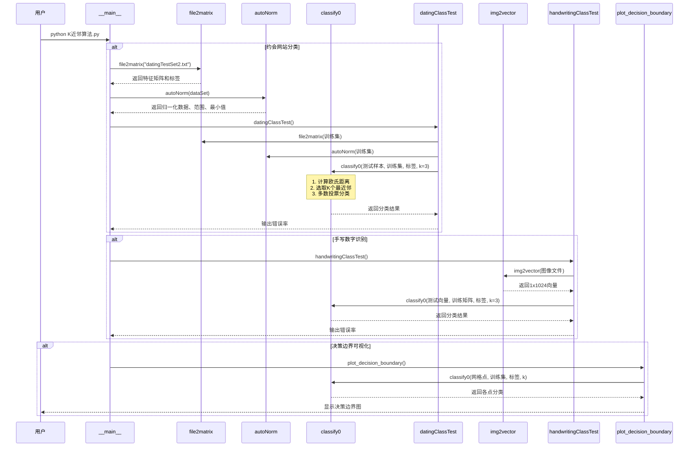

# 源码导读

> 🏠 [项目首页](../README.md) | 📚 [文档中心](./README.md) | ⬅ [学习路线](./02-学习路线.md) | 📍 源码导读 | ➡ [算法速查](./04-算法速查.md)

---

本文档逐文件讲解项目中每个 `.py` 源码文件的功能、核心函数与运行方式，帮助读者快速定位和理解代码。

---

## 目录

- [模块00：数据挖掘导论](#模块00数据挖掘导论)
- [模块01：数据仓库与OLAP](#模块01数据仓库与olap)
- [模块02：数据探索与处理](#模块02数据探索与处理)
- [模块03：回归分析](#模块03回归分析)
- [模块04：分类算法](#模块04分类算法)
- [模块05：模型评估与调优](#模块05模型评估与调优)
- [模块06：集成学习](#模块06集成学习)
- [模块07：无监督学习](#模块07无监督学习)
- [模块08：深度学习](#模块08深度学习)
- [模块09：应用领域](#模块09应用领域)
- [KNN分类调用序列图](#knn分类调用序列图)

---

## 模块00：数据挖掘导论

### 数据挖掘导论.py

**文件路径**: `00_数据挖掘导论/数据挖掘导论.py`

**功能概述**: 数据挖掘入门模块，介绍数据挖掘基本任务、CRISP-DM标准流程、数据类型分类，实现6种常见距离/相似度度量算法，并展示数据挖掘典型应用领域。

**核心函数列表**:

| 函数名 | 功能 | 行号 |
|--------|------|------|
| [print_mining_tasks](../00_数据挖掘导论/数据挖掘导论.py#L30) / [print_mining_tasks](file:///d:/Dev/DevWorkSpace/VS%20Code/Python/python-data-mining/00_数据挖掘导论/数据挖掘导论.py#L30) | 打印数据挖掘主要任务概览 | L30 |
| [print_crisp_dm](../00_数据挖掘导论/数据挖掘导论.py#L60) / [print_crisp_dm](file:///d:/Dev/DevWorkSpace/VS%20Code/Python/python-data-mining/00_数据挖掘导论/数据挖掘导论.py#L60) | 打印CRISP-DM流程六阶段 | L60 |
| [data_types_overview](../00_数据挖掘导论/数据挖掘导论.py#L90) / [data_types_overview](file:///d:/Dev/DevWorkSpace/VS%20Code/Python/python-data-mining/00_数据挖掘导论/数据挖掘导论.py#L90) | 展示数据类型分类体系 | L90 |
| [euclidean_distance](../00_数据挖掘导论/数据挖掘导论.py#L128) / [euclidean_distance](file:///d:/Dev/DevWorkSpace/VS%20Code/Python/python-data-mining/00_数据挖掘导论/数据挖掘导论.py#L128) | 计算欧氏距离 | L128 |
| [manhattan_distance](../00_数据挖掘导论/数据挖掘导论.py#L135) / [manhattan_distance](file:///d:/Dev/DevWorkSpace/VS%20Code/Python/python-data-mining/00_数据挖掘导论/数据挖掘导论.py#L135) | 计算曼哈顿距离 | L135 |
| [minkowski_distance](../00_数据挖掘导论/数据挖掘导论.py#L142) / [minkowski_distance](file:///d:/Dev/DevWorkSpace/VS%20Code/Python/python-data-mining/00_数据挖掘导论/数据挖掘导论.py#L142) | 计算闵可夫斯基距离 | L142 |
| [cosine_similarity](../00_数据挖掘导论/数据挖掘导论.py#L149) / [cosine_similarity](file:///d:/Dev/DevWorkSpace/VS%20Code/Python/python-data-mining/00_数据挖掘导论/数据挖掘导论.py#L149) | 计算余弦相似度 | L149 |
| [jaccard_similarity](../00_数据挖掘导论/数据挖掘导论.py#L158) / [jaccard_similarity](file:///d:/Dev/DevWorkSpace/VS%20Code/Python/python-data-mining/00_数据挖掘导论/数据挖掘导论.py#L158) | 计算Jaccard相似度 | L158 |
| [pearson_correlation](../00_数据挖掘导论/数据挖掘导论.py#L166) / [pearson_correlation](file:///d:/Dev/DevWorkSpace/VS%20Code/Python/python-data-mining/00_数据挖掘导论/数据挖掘导论.py#L166) | 计算皮尔逊相关系数 | L166 |
| [demo_distance_metrics](../00_数据挖掘导论/数据挖掘导论.py#L180) / [demo_distance_metrics](file:///d:/Dev/DevWorkSpace/VS%20Code/Python/python-data-mining/00_数据挖掘导论/数据挖掘导论.py#L180) | 演示各种距离度量计算 | L180 |
| [print_applications](../00_数据挖掘导论/数据挖掘导论.py#L207) / [print_applications](file:///d:/Dev/DevWorkSpace/VS%20Code/Python/python-data-mining/00_数据挖掘导论/数据挖掘导论.py#L207) | 打印数据挖掘应用领域 | L207 |
| [visualize_distance_metrics](../00_数据挖掘导论/数据挖掘导论.py#L248) / [visualize_distance_metrics](file:///d:/Dev/DevWorkSpace/VS%20Code/Python/python-data-mining/00_数据挖掘导论/数据挖掘导论.py#L248) | 可视化距离度量对比 | L248 |

**运行命令**:
```bash
python "00_数据挖掘导论/数据挖掘导论.py"
```

---

## 模块01：数据仓库与OLAP

### 数据仓库基础.py

**文件路径**: `01_数据仓库与OLAP/01_数据仓库基础/数据仓库基础.py`

**功能概述**: 介绍数据仓库体系架构、多维数据模型（星型/雪花）、ETL流程、元数据管理，对比数据仓库与OLTP系统差异。

**核心函数列表**:

| 函数名 | 功能 | 行号 |
|--------|------|------|
| [demonstrate_warehouse_architecture](../01_数据仓库与OLAP/01_数据仓库基础/数据仓库基础.py#L31) / [demonstrate_warehouse_architecture](file:///d:/Dev/DevWorkSpace/VS%20Code/Python/python-data-mining/01_数据仓库与OLAP/01_数据仓库基础/数据仓库基础.py#L31) | 演示数据仓库架构层次 | L31 |
| [demonstrate_multidimensional_model](../01_数据仓库与OLAP/01_数据仓库基础/数据仓库基础.py#L71) / [demonstrate_multidimensional_model](file:///d:/Dev/DevWorkSpace/VS%20Code/Python/python-data-mining/01_数据仓库与OLAP/01_数据仓库基础/数据仓库基础.py#L71) | 演示星型/雪花模型 | L71 |
| [demonstrate_etl_process](../01_数据仓库与OLAP/01_数据仓库基础/数据仓库基础.py#L150) / [demonstrate_etl_process](file:///d:/Dev/DevWorkSpace/VS%20Code/Python/python-data-mining/01_数据仓库与OLAP/01_数据仓库基础/数据仓库基础.py#L150) | 演示ETL抽取转换加载流程 | L150 |
| [demonstrate_metadata](../01_数据仓库与OLAP/01_数据仓库基础/数据仓库基础.py#L211) / [demonstrate_metadata](file:///d:/Dev/DevWorkSpace/VS%20Code/Python/python-data-mining/01_数据仓库与OLAP/01_数据仓库基础/数据仓库基础.py#L211) | 演示元数据管理 | L211 |
| [compare_warehouse_vs_oltp](../01_数据仓库与OLAP/01_数据仓库基础/数据仓库基础.py#L241) / [compare_warehouse_vs_oltp](file:///d:/Dev/DevWorkSpace/VS%20Code/Python/python-data-mining/01_数据仓库与OLAP/01_数据仓库基础/数据仓库基础.py#L241) | 对比数据仓库与OLTP | L241 |

**运行命令**:
```bash
python "01_数据仓库与OLAP/01_数据仓库基础/数据仓库基础.py"
```

### OLAP多维分析.py

**文件路径**: `01_数据仓库与OLAP/02_OLAP多维分析/OLAP多维分析.py`

**功能概述**: 实现OLAP多维数据立方体构建与操作（上卷、下钻、切片、切块、旋转），展示OLAP架构类型、预计算策略及面向属性归纳方法。

**核心函数列表**:

| 函数名 | 功能 | 行号 |
|--------|------|------|
| [build_data_cube](../01_数据仓库与OLAP/02_OLAP多维分析/OLAP多维分析.py#L30) / [build_data_cube](file:///d:/Dev/DevWorkSpace/VS%20Code/Python/python-data-mining/01_数据仓库与OLAP/02_OLAP多维分析/OLAP多维分析.py#L30) | 构建多维数据立方体 | L30 |
| [demonstrate_olap_operations](../01_数据仓库与OLAP/02_OLAP多维分析/OLAP多维分析.py#L75) / [demonstrate_olap_operations](file:///d:/Dev/DevWorkSpace/VS%20Code/Python/python-data-mining/01_数据仓库与OLAP/02_OLAP多维分析/OLAP多维分析.py#L75) | 演示OLAP五大操作 | L75 |
| [demonstrate_olap_architectures](../01_数据仓库与OLAP/02_OLAP多维分析/OLAP多维分析.py#L125) / [demonstrate_olap_architectures](file:///d:/Dev/DevWorkSpace/VS%20Code/Python/python-data-mining/01_数据仓库与OLAP/02_OLAP多维分析/OLAP多维分析.py#L125) | 演示OLAP架构类型 | L125 |
| [demonstrate_precomputation_strategies](../01_数据仓库与OLAP/02_OLAP多维分析/OLAP多维分析.py#L149) / [demonstrate_precomputation_strategies](file:///d:/Dev/DevWorkSpace/VS%20Code/Python/python-data-mining/01_数据仓库与OLAP/02_OLAP多维分析/OLAP多维分析.py#L149) | 演示预计算策略 | L149 |
| [demonstrate_attribute_oriented_induction](../01_数据仓库与OLAP/02_OLAP多维分析/OLAP多维分析.py#L189) / [demonstrate_attribute_oriented_induction](file:///d:/Dev/DevWorkSpace/VS%20Code/Python/python-data-mining/01_数据仓库与OLAP/02_OLAP多维分析/OLAP多维分析.py#L189) | 演示面向属性归纳 | L189 |
| [visualize_olap_operations](../01_数据仓库与OLAP/02_OLAP多维分析/OLAP多维分析.py#L249) / [visualize_olap_operations](file:///d:/Dev/DevWorkSpace/VS%20Code/Python/python-data-mining/01_数据仓库与OLAP/02_OLAP多维分析/OLAP多维分析.py#L249) | 可视化OLAP操作结果 | L249 |

**运行命令**:
```bash
python "01_数据仓库与OLAP/02_OLAP多维分析/OLAP多维分析.py"
```

---

## 模块02：数据探索与处理

### 数据预处理.py

**文件路径**: `02_数据探索与处理/01_数据预处理与特征工程/数据预处理.py`

**功能概述**: 数据预处理工具集，涵盖缺失值处理、异常值检测（IQR/Z-Score）、特征缩放（Standard/MinMax/Robust）、分类变量编码（OneHot/Label）及数据集划分。

**核心函数列表**:

| 函数名 | 功能 | 行号 |
|--------|------|------|
| [create_sample_data](../02_数据探索与处理/01_数据预处理与特征工程/数据预处理.py#L22) / [create_sample_data](file:///d:/Dev/DevWorkSpace/VS%20Code/Python/python-data-mining/02_数据探索与处理/01_数据预处理与特征工程/数据预处理.py#L22) | 创建含缺失值和异常值的示例数据 | L22 |
| [handle_missing_values](../02_数据探索与处理/01_数据预处理与特征工程/数据预处理.py#L51) / [handle_missing_values](file:///d:/Dev/DevWorkSpace/VS%20Code/Python/python-data-mining/02_数据探索与处理/01_数据预处理与特征工程/数据预处理.py#L51) | 缺失值处理（均值/中位数/众数/删除） | L51 |
| [detect_outliers_iqr](../02_数据探索与处理/01_数据预处理与特征工程/数据预处理.py#L74) / [detect_outliers_iqr](file:///d:/Dev/DevWorkSpace/VS%20Code/Python/python-data-mining/02_数据探索与处理/01_数据预处理与特征工程/数据预处理.py#L74) | IQR方法检测异常值 | L74 |
| [detect_outliers_zscore](../02_数据探索与处理/01_数据预处理与特征工程/数据预处理.py#L85) / [detect_outliers_zscore](file:///d:/Dev/DevWorkSpace/VS%20Code/Python/python-data-mining/02_数据探索与处理/01_数据预处理与特征工程/数据预处理.py#L85) | Z-Score方法检测异常值 | L85 |
| [handle_outliers](../02_数据探索与处理/01_数据预处理与特征工程/数据预处理.py#L92) / [handle_outliers](file:///d:/Dev/DevWorkSpace/VS%20Code/Python/python-data-mining/02_数据探索与处理/01_数据预处理与特征工程/数据预处理.py#L92) | 异常值处理（截断/替换/删除） | L92 |
| [scale_features](../02_数据探索与处理/01_数据预处理与特征工程/数据预处理.py#L118) / [scale_features](file:///d:/Dev/DevWorkSpace/VS%20Code/Python/python-data-mining/02_数据探索与处理/01_数据预处理与特征工程/数据预处理.py#L118) | 特征缩放（Standard/MinMax/Robust） | L118 |
| [encode_categorical](../02_数据探索与处理/01_数据预处理与特征工程/数据预处理.py#L146) / [encode_categorical](file:///d:/Dev/DevWorkSpace/VS%20Code/Python/python-data-mining/02_数据探索与处理/01_数据预处理与特征工程/数据预处理.py#L146) | 分类变量编码（OneHot/Label） | L146 |
| [split_data](../02_数据探索与处理/01_数据预处理与特征工程/数据预处理.py#L172) / [split_data](file:///d:/Dev/DevWorkSpace/VS%20Code/Python/python-data-mining/02_数据探索与处理/01_数据预处理与特征工程/数据预处理.py#L172) | 数据集划分（训练/验证/测试） | L172 |

**运行命令**:
```bash
python "02_数据探索与处理/01_数据预处理与特征工程/数据预处理.py"
```

### 特征工程.py

**文件路径**: `02_数据探索与处理/01_数据预处理与特征工程/特征工程.py`

**功能概述**: 特征工程工具集，涵盖特征选择（方差/相关系数/互信息/RFE/模型）、特征构造（多项式/交互）、特征变换（Log/BoxCox/YeoJohnson）、降维（PCA/LDA）及文本特征提取（TF-IDF/BoW）。

**核心函数列表**:

| 函数名 | 功能 | 行号 |
|--------|------|------|
| [feature_selection_variance](../02_数据探索与处理/01_数据预处理与特征工程/特征工程.py#L30) / [feature_selection_variance](file:///d:/Dev/DevWorkSpace/VS%20Code/Python/python-data-mining/02_数据探索与处理/01_数据预处理与特征工程/特征工程.py#L30) | 方差阈值特征选择 | L30 |
| [feature_selection_correlation](../02_数据探索与处理/01_数据预处理与特征工程/特征工程.py#L39) / [feature_selection_correlation](file:///d:/Dev/DevWorkSpace/VS%20Code/Python/python-data-mining/02_数据探索与处理/01_数据预处理与特征工程/特征工程.py#L39) | 相关系数特征选择 | L39 |
| [feature_selection_mutual_info](../02_数据探索与处理/01_数据预处理与特征工程/特征工程.py#L48) / [feature_selection_mutual_info](file:///d:/Dev/DevWorkSpace/VS%20Code/Python/python-data-mining/02_数据探索与处理/01_数据预处理与特征工程/特征工程.py#L48) | 互信息特征选择 | L48 |
| [feature_selection_rfe](../02_数据探索与处理/01_数据预处理与特征工程/特征工程.py#L59) / [feature_selection_rfe](file:///d:/Dev/DevWorkSpace/VS%20Code/Python/python-data-mining/02_数据探索与处理/01_数据预处理与特征工程/特征工程.py#L59) | 递归特征消除(RFE) | L59 |
| [feature_selection_model](../02_数据探索与处理/01_数据预处理与特征工程/特征工程.py#L69) / [feature_selection_model](file:///d:/Dev/DevWorkSpace/VS%20Code/Python/python-data-mining/02_数据探索与处理/01_数据预处理与特征工程/特征工程.py#L69) | 基于模型的特征选择 | L69 |
| [create_polynomial_features](../02_数据探索与处理/01_数据预处理与特征工程/特征工程.py#L84) / [create_polynomial_features](file:///d:/Dev/DevWorkSpace/VS%20Code/Python/python-data-mining/02_数据探索与处理/01_数据预处理与特征工程/特征工程.py#L84) | 多项式特征构造 | L84 |
| [create_interaction_features](../02_数据探索与处理/01_数据预处理与特征工程/特征工程.py#L92) / [create_interaction_features](file:///d:/Dev/DevWorkSpace/VS%20Code/Python/python-data-mining/02_数据探索与处理/01_数据预处理与特征工程/特征工程.py#L92) | 交互特征构造 | L92 |
| [transform_log](../02_数据探索与处理/01_数据预处理与特征工程/特征工程.py#L106) / [transform_log](file:///d:/Dev/DevWorkSpace/VS%20Code/Python/python-data-mining/02_数据探索与处理/01_数据预处理与特征工程/特征工程.py#L106) | 对数变换 | L106 |
| [transform_boxcox](../02_数据探索与处理/01_数据预处理与特征工程/特征工程.py#L115) / [transform_boxcox](file:///d:/Dev/DevWorkSpace/VS%20Code/Python/python-data-mining/02_数据探索与处理/01_数据预处理与特征工程/特征工程.py#L115) | Box-Cox变换 | L115 |
| [transform_yeojohnson](../02_数据探索与处理/01_数据预处理与特征工程/特征工程.py#L123) / [transform_yeojohnson](file:///d:/Dev/DevWorkSpace/VS%20Code/Python/python-data-mining/02_数据探索与处理/01_数据预处理与特征工程/特征工程.py#L123) | Yeo-Johnson变换 | L123 |
| [reduce_pca](../02_数据探索与处理/01_数据预处理与特征工程/特征工程.py#L134) / [reduce_pca](file:///d:/Dev/DevWorkSpace/VS%20Code/Python/python-data-mining/02_数据探索与处理/01_数据预处理与特征工程/特征工程.py#L134) | PCA降维 | L134 |
| [reduce_lda](../02_数据探索与处理/01_数据预处理与特征工程/特征工程.py#L146) / [reduce_lda](file:///d:/Dev/DevWorkSpace/VS%20Code/Python/python-data-mining/02_数据探索与处理/01_数据预处理与特征工程/特征工程.py#L146) | LDA降维 | L146 |
| [extract_tfidf](../02_数据探索与处理/01_数据预处理与特征工程/特征工程.py#L157) / [extract_tfidf](file:///d:/Dev/DevWorkSpace/VS%20Code/Python/python-data-mining/02_数据探索与处理/01_数据预处理与特征工程/特征工程.py#L157) | TF-IDF文本特征提取 | L157 |
| [extract_bow](../02_数据探索与处理/01_数据预处理与特征工程/特征工程.py#L166) / [extract_bow](file:///d:/Dev/DevWorkSpace/VS%20Code/Python/python-data-mining/02_数据探索与处理/01_数据预处理与特征工程/特征工程.py#L166) | 词袋模型文本特征提取 | L166 |

**运行命令**:
```bash
python "02_数据探索与处理/01_数据预处理与特征工程/特征工程.py"
```

### 数据可视化.py

**文件路径**: `02_数据探索与处理/02_数据可视化/数据可视化.py`

**功能概述**: 数据可视化工具集，涵盖基础图表（折线/柱状/饼图）、统计图表（直方图/箱线图/小提琴图）、关系图表（散点/热力图/等高线）、雷达图及配对图。

**核心函数列表**:

| 函数名 | 功能 | 行号 |
|--------|------|------|
| [create_sample_data](../02_数据探索与处理/02_数据可视化/数据可视化.py#L27) / [create_sample_data](file:///d:/Dev/DevWorkSpace/VS%20Code/Python/python-data-mining/02_数据探索与处理/02_数据可视化/数据可视化.py#L27) | 创建示例数据集 | L27 |
| [plot_basic_charts](../02_数据探索与处理/02_数据可视化/数据可视化.py#L48) / [plot_basic_charts](file:///d:/Dev/DevWorkSpace/VS%20Code/Python/python-data-mining/02_数据探索与处理/02_数据可视化/数据可视化.py#L48) | 绘制基础图表 | L48 |
| [plot_statistical_charts](../02_数据探索与处理/02_数据可视化/数据可视化.py#L82) / [plot_statistical_charts](file:///d:/Dev/DevWorkSpace/VS%20Code/Python/python-data-mining/02_数据探索与处理/02_数据可视化/数据可视化.py#L82) | 绘制统计图表 | L82 |
| [plot_relation_charts](../02_数据探索与处理/02_数据可视化/数据可视化.py#L142) / [plot_relation_charts](file:///d:/Dev/DevWorkSpace/VS%20Code/Python/python-data-mining/02_数据探索与处理/02_数据可视化/数据可视化.py#L142) | 绘制关系图表 | L142 |
| [plot_radar_chart](../02_数据探索与处理/02_数据可视化/数据可视化.py#L192) / [plot_radar_chart](file:///d:/Dev/DevWorkSpace/VS%20Code/Python/python-data-mining/02_数据探索与处理/02_数据可视化/数据可视化.py#L192) | 绘制雷达图 | L192 |
| [plot_pair_plot](../02_数据探索与处理/02_数据可视化/数据可视化.py#L220) / [plot_pair_plot](file:///d:/Dev/DevWorkSpace/VS%20Code/Python/python-data-mining/02_数据探索与处理/02_数据可视化/数据可视化.py#L220) | 绘制配对图 | L220 |

**运行命令**:
```bash
python "02_数据探索与处理/02_数据可视化/数据可视化.py"
```

---

## 模块03：回归分析

### 01_线性回归.py

**文件路径**: `03_回归分析/01_线性回归.py`

**功能概述**: 线性回归完整实现，包含简单线性回归、梯度下降线性回归、正则化对比（Ridge/Lasso/ElasticNet）、回归诊断及可视化。

**核心函数/类列表**:

| 函数/类名 | 功能 | 行号 |
|-----------|------|------|
| [SimpleLinearRegression](../03_回归分析/01_线性回归.py#L31) / [SimpleLinearRegression](file:///d:/Dev/DevWorkSpace/VS%20Code/Python/python-data-mining/03_回归分析/01_线性回归.py#L31) | 简单线性回归类 | L31 |
| [LinearRegressionGD](../03_回归分析/01_线性回归.py#L54) / [LinearRegressionGD](file:///d:/Dev/DevWorkSpace/VS%20Code/Python/python-data-mining/03_回归分析/01_线性回归.py#L54) | 梯度下降线性回归类 | L54 |
| [compare_regularization](../03_回归分析/01_线性回归.py#L87) / [compare_regularization](file:///d:/Dev/DevWorkSpace/VS%20Code/Python/python-data-mining/03_回归分析/01_线性回归.py#L87) | 对比Ridge/Lasso/ElasticNet正则化 | L87 |
| [regression_diagnostics](../03_回归分析/01_线性回归.py#L113) / [regression_diagnostics](file:///d:/Dev/DevWorkSpace/VS%20Code/Python/python-data-mining/03_回归分析/01_线性回归.py#L113) | 回归诊断（残差/Q-Q图） | L113 |
| [plot_simple_regression](../03_回归分析/01_线性回归.py#L145) / [plot_simple_regression](file:///d:/Dev/DevWorkSpace/VS%20Code/Python/python-data-mining/03_回归分析/01_线性回归.py#L145) | 简单回归可视化 | L145 |
| [plot_gradient_descent_loss](../03_回归分析/01_线性回归.py#L167) / [plot_gradient_descent_loss](file:///d:/Dev/DevWorkSpace/VS%20Code/Python/python-data-mining/03_回归分析/01_线性回归.py#L167) | 梯度下降损失曲线可视化 | L167 |

**运行命令**:
```bash
python "03_回归分析/01_线性回归.py"
```

### 02_逻辑回归.py

**文件路径**: `03_回归分析/02_逻辑回归.py`

**功能概述**: 逻辑回归完整实现，包含二分类逻辑回归（梯度下降）、Softmax多分类回归、二分类评估、ROC曲线绘制及决策边界可视化。

**核心函数/类列表**:

| 函数/类名 | 功能 | 行号 |
|-----------|------|------|
| [LogisticRegressionGD](../03_回归分析/02_逻辑回归.py#L34) / [LogisticRegressionGD](file:///d:/Dev/DevWorkSpace/VS%20Code/Python/python-data-mining/03_回归分析/02_逻辑回归.py#L34) | 二分类逻辑回归类 | L34 |
| [SoftmaxRegression](../03_回归分析/02_逻辑回归.py#L93) / [SoftmaxRegression](file:///d:/Dev/DevWorkSpace/VS%20Code/Python/python-data-mining/03_回归分析/02_逻辑回归.py#L93) | Softmax多分类回归类 | L93 |
| [evaluate_binary](../03_回归分析/02_逻辑回归.py#L140) / [evaluate_binary](file:///d:/Dev/DevWorkSpace/VS%20Code/Python/python-data-mining/03_回归分析/02_逻辑回归.py#L140) | 二分类评估指标 | L140 |
| [plot_roc_curve](../03_回归分析/02_逻辑回归.py#L151) / [plot_roc_curve](file:///d:/Dev/DevWorkSpace/VS%20Code/Python/python-data-mining/03_回归分析/02_逻辑回归.py#L151) | 绘制ROC曲线 | L151 |
| [plot_decision_boundary](../03_回归分析/02_逻辑回归.py#L168) / [plot_decision_boundary](file:///d:/Dev/DevWorkSpace/VS%20Code/Python/python-data-mining/03_回归分析/02_逻辑回归.py#L168) | 绘制决策边界 | L168 |

**运行命令**:
```bash
python "03_回归分析/02_逻辑回归.py"
```

---

## 模块04：分类算法

### K近邻算法.py

**文件路径**: `04_分类算法/01_K近邻算法/K近邻算法.py`

**功能概述**: KNN算法完整实现，包含分类器、数据文件读取、特征归一化、约会网站分类测试、手写数字识别及决策边界可视化。

**核心函数列表**:

| 函数名 | 功能 | 行号 |
|--------|------|------|
| [classify0](../04_分类算法/01_K近邻算法/K近邻算法.py#L48) / [classify0](file:///d:/Dev/DevWorkSpace/VS%20Code/Python/python-data-mining/04_分类算法/01_K近邻算法/K近邻算法.py#L48) | KNN分类核心函数 | L48 |
| [createDataSet](../04_分类算法/01_K近邻算法/K近邻算法.py#L62) / [createDataSet](file:///d:/Dev/DevWorkSpace/VS%20Code/Python/python-data-mining/04_分类算法/01_K近邻算法/K近邻算法.py#L62) | 创建示例数据集 | L62 |
| [file2matrix](../04_分类算法/01_K近邻算法/K近邻算法.py#L67) / [file2matrix](file:///d:/Dev/DevWorkSpace/VS%20Code/Python/python-data-mining/04_分类算法/01_K近邻算法/K近邻算法.py#L67) | 文件数据转为矩阵 | L67 |
| [autoNorm](../04_分类算法/01_K近邻算法/K近邻算法.py#L82) / [autoNorm](file:///d:/Dev/DevWorkSpace/VS%20Code/Python/python-data-mining/04_分类算法/01_K近邻算法/K近邻算法.py#L82) | 特征值归一化 | L82 |
| [datingClassTest](../04_分类算法/01_K近邻算法/K近邻算法.py#L92) / [datingClassTest](file:///d:/Dev/DevWorkSpace/VS%20Code/Python/python-data-mining/04_分类算法/01_K近邻算法/K近邻算法.py#L92) | 约会网站分类测试 | L92 |
| [img2vector](../04_分类算法/01_K近邻算法/K近邻算法.py#L108) / [img2vector](file:///d:/Dev/DevWorkSpace/VS%20Code/Python/python-data-mining/04_分类算法/01_K近邻算法/K近邻算法.py#L108) | 图像转为向量 | L108 |
| [handwritingClassTest](../04_分类算法/01_K近邻算法/K近邻算法.py#L117) / [handwritingClassTest](file:///d:/Dev/DevWorkSpace/VS%20Code/Python/python-data-mining/04_分类算法/01_K近邻算法/K近邻算法.py#L117) | 手写数字识别测试 | L117 |
| [plot_decision_boundary](../04_分类算法/01_K近邻算法/K近邻算法.py#L143) / [plot_decision_boundary](file:///d:/Dev/DevWorkSpace/VS%20Code/Python/python-data-mining/04_分类算法/01_K近邻算法/K近邻算法.py#L143) | 绘制决策边界 | L143 |

**运行命令**:
```bash
python "04_分类算法/01_K近邻算法/K近邻算法.py"
```

### 02_手写数字识别.py（KNN）

**文件路径**: `04_分类算法/01_K近邻算法/02_手写数字识别.py`

**功能概述**: KNN手写数字识别案例脚本，调用K近邻算法模块的handwritingClassTest函数。

**运行命令**:
```bash
cd "04_分类算法/01_K近邻算法" && python 02_手写数字识别.py
```

### 朴素贝叶斯算法.py

**文件路径**: `04_分类算法/02_朴素贝叶斯/朴素贝叶斯算法.py`

**功能概述**: 朴素贝叶斯算法完整实现，包含词表构建、词袋模型、训练与分类、垃圾邮件过滤测试及sklearn版本对比。

**核心函数列表**:

| 函数名 | 功能 | 行号 |
|--------|------|------|
| [loadDataSet](../04_分类算法/02_朴素贝叶斯/朴素贝叶斯算法.py#L38) / [loadDataSet](file:///d:/Dev/DevWorkSpace/VS%20Code/Python/python-data-mining/04_分类算法/02_朴素贝叶斯/朴素贝叶斯算法.py#L38) | 加载示例数据集 | L38 |
| [createVocabList](../04_分类算法/02_朴素贝叶斯/朴素贝叶斯算法.py#L48) / [createVocabList](file:///d:/Dev/DevWorkSpace/VS%20Code/Python/python-data-mining/04_分类算法/02_朴素贝叶斯/朴素贝叶斯算法.py#L48) | 创建词汇表 | L48 |
| [setOfWords2Vec](../04_分类算法/02_朴素贝叶斯/朴素贝叶斯算法.py#L54) / [setOfWords2Vec](file:///d:/Dev/DevWorkSpace/VS%20Code/Python/python-data-mining/04_分类算法/02_朴素贝叶斯/朴素贝叶斯算法.py#L54) | 词集模型向量化 | L54 |
| [trainNB0](../04_分类算法/02_朴素贝叶斯/朴素贝叶斯算法.py#L62) / [trainNB0](file:///d:/Dev/DevWorkSpace/VS%20Code/Python/python-data-mining/04_分类算法/02_朴素贝叶斯/朴素贝叶斯算法.py#L62) | 训练朴素贝叶斯分类器 | L62 |
| [classifyNB](../04_分类算法/02_朴素贝叶斯/朴素贝叶斯算法.py#L79) / [classifyNB](file:///d:/Dev/DevWorkSpace/VS%20Code/Python/python-data-mining/04_分类算法/02_朴素贝叶斯/朴素贝叶斯算法.py#L79) | 朴素贝叶斯分类 | L79 |
| [bagOfWords2VecMN](../04_分类算法/02_朴素贝叶斯/朴素贝叶斯算法.py#L87) / [bagOfWords2VecMN](file:///d:/Dev/DevWorkSpace/VS%20Code/Python/python-data-mining/04_分类算法/02_朴素贝叶斯/朴素贝叶斯算法.py#L87) | 词袋模型向量化 | L87 |
| [testingNB](../04_分类算法/02_朴素贝叶斯/朴素贝叶斯算法.py#L94) / [testingNB](file:///d:/Dev/DevWorkSpace/VS%20Code/Python/python-data-mining/04_分类算法/02_朴素贝叶斯/朴素贝叶斯算法.py#L94) | 测试朴素贝叶斯分类 | L94 |
| [textParse](../04_分类算法/02_朴素贝叶斯/朴素贝叶斯算法.py#L108) / [textParse](file:///d:/Dev/DevWorkSpace/VS%20Code/Python/python-data-mining/04_分类算法/02_朴素贝叶斯/朴素贝叶斯算法.py#L108) | 文本解析分词 | L108 |
| [spamTest](../04_分类算法/02_朴素贝叶斯/朴素贝叶斯算法.py#L113) / [spamTest](file:///d:/Dev/DevWorkSpace/VS%20Code/Python/python-data-mining/04_分类算法/02_朴素贝叶斯/朴素贝叶斯算法.py#L113) | 垃圾邮件过滤测试 | L113 |
| [spamTestSklearn](../04_分类算法/02_朴素贝叶斯/朴素贝叶斯算法.py#L148) / [spamTestSklearn](file:///d:/Dev/DevWorkSpace/VS%20Code/Python/python-data-mining/04_分类算法/02_朴素贝叶斯/朴素贝叶斯算法.py#L148) | sklearn版垃圾邮件测试 | L148 |
| [calcMostFreq](../04_分类算法/02_朴素贝叶斯/朴素贝叶斯算法.py#L254) / [calcMostFreq](file:///d:/Dev/DevWorkSpace/VS%20Code/Python/python-data-mining/04_分类算法/02_朴素贝叶斯/朴素贝叶斯算法.py#L254) | 计算高频词 | L254 |
| [localWords](../04_分类算法/02_朴素贝叶斯/朴素贝叶斯算法.py#L262) / [localWords](file:///d:/Dev/DevWorkSpace/VS%20Code/Python/python-data-mining/04_分类算法/02_朴素贝叶斯/朴素贝叶斯算法.py#L262) | RSS源地域词汇分析 | L262 |
| [getTopWords](../04_分类算法/02_朴素贝叶斯/朴素贝叶斯算法.py#L297) / [getTopWords](file:///d:/Dev/DevWorkSpace/VS%20Code/Python/python-data-mining/04_分类算法/02_朴素贝叶斯/朴素贝叶斯算法.py#L297) | 获取高频特征词 | L297 |

**运行命令**:
```bash
python "04_分类算法/02_朴素贝叶斯/朴素贝叶斯算法.py"
```

### 02_垃圾邮件分类.py

**文件路径**: `04_分类算法/02_朴素贝叶斯/02_垃圾邮件分类.py`

**功能概述**: 朴素贝叶斯垃圾邮件分类案例脚本，调用朴素贝叶斯算法模块的spamTestSklearn函数。

**运行命令**:
```bash
cd "04_分类算法/02_朴素贝叶斯" && python 02_垃圾邮件分类.py
```

### trees.py

**文件路径**: `04_分类算法/03_决策树/01_ID3决策树/trees.py`

**功能概述**: ID3决策树核心算法实现，包含香农熵计算、数据集划分、最优特征选择、树构建、分类及序列化存储。

**核心函数列表**:

| 函数名 | 功能 | 行号 |
|--------|------|------|
| [createDataSet](../04_分类算法/03_决策树/01_ID3决策树/trees.py#L25) / [createDataSet](file:///d:/Dev/DevWorkSpace/VS%20Code/Python/python-data-mining/04_分类算法/03_决策树/01_ID3决策树/trees.py#L25) | 创建示例数据集 | L25 |
| [calcShannonEnt](../04_分类算法/03_决策树/01_ID3决策树/trees.py#L35) / [calcShannonEnt](file:///d:/Dev/DevWorkSpace/VS%20Code/Python/python-data-mining/04_分类算法/03_决策树/01_ID3决策树/trees.py#L35) | 计算香农熵 | L35 |
| [splitDataSet](../04_分类算法/03_决策树/01_ID3决策树/trees.py#L48) / [splitDataSet](file:///d:/Dev/DevWorkSpace/VS%20Code/Python/python-data-mining/04_分类算法/03_决策树/01_ID3决策树/trees.py#L48) | 按特征划分数据集 | L48 |
| [chooseBestFeatureToSplit](../04_分类算法/03_决策树/01_ID3决策树/trees.py#L57) / [chooseBestFeatureToSplit](file:///d:/Dev/DevWorkSpace/VS%20Code/Python/python-data-mining/04_分类算法/03_决策树/01_ID3决策树/trees.py#L57) | 选择最优划分特征 | L57 |
| [majorityCnt](../04_分类算法/03_决策树/01_ID3决策树/trees.py#L75) / [majorityCnt](file:///d:/Dev/DevWorkSpace/VS%20Code/Python/python-data-mining/04_分类算法/03_决策树/01_ID3决策树/trees.py#L75) | 多数投票确定叶节点 | L75 |
| [createTree](../04_分类算法/03_决策树/01_ID3决策树/trees.py#L83) / [createTree](file:///d:/Dev/DevWorkSpace/VS%20Code/Python/python-data-mining/04_分类算法/03_决策树/01_ID3决策树/trees.py#L83) | 递归构建决策树 | L83 |
| [classify](../04_分类算法/03_决策树/01_ID3决策树/trees.py#L100) / [classify](file:///d:/Dev/DevWorkSpace/VS%20Code/Python/python-data-mining/04_分类算法/03_决策树/01_ID3决策树/trees.py#L100) | 使用决策树分类 | L100 |
| [storeTree](../04_分类算法/03_决策树/01_ID3决策树/trees.py#L111) / [storeTree](file:///d:/Dev/DevWorkSpace/VS%20Code/Python/python-data-mining/04_分类算法/03_决策树/01_ID3决策树/trees.py#L111) | 序列化存储决策树 | L111 |
| [grabTree](../04_分类算法/03_决策树/01_ID3决策树/trees.py#L116) / [grabTree](file:///d:/Dev/DevWorkSpace/VS%20Code/Python/python-data-mining/04_分类算法/03_决策树/01_ID3决策树/trees.py#L116) | 反序列化读取决策树 | L116 |

**运行命令**:
```bash
python "04_分类算法/03_决策树/01_ID3决策树/trees.py"
```

### treePlotter.py

**文件路径**: `04_分类算法/03_决策树/01_ID3决策树/treePlotter.py`

**功能概述**: 决策树可视化工具，使用Matplotlib绘制决策树图形，包含叶节点数/深度计算、节点标注及树形绘制。

**核心函数列表**:

| 函数名 | 功能 | 行号 |
|--------|------|------|
| [getNumLeafs](../04_分类算法/03_决策树/01_ID3决策树/treePlotter.py#L12) / [getNumLeafs](file:///d:/Dev/DevWorkSpace/VS%20Code/Python/python-data-mining/04_分类算法/03_决策树/01_ID3决策树/treePlotter.py#L12) | 获取叶节点数 | L12 |
| [getTreeDepth](../04_分类算法/03_决策树/01_ID3决策树/treePlotter.py#L22) / [getTreeDepth](file:///d:/Dev/DevWorkSpace/VS%20Code/Python/python-data-mining/04_分类算法/03_决策树/01_ID3决策树/treePlotter.py#L22) | 获取树深度 | L22 |
| [plotNode](../04_分类算法/03_决策树/01_ID3决策树/treePlotter.py#L33) / [plotNode](file:///d:/Dev/DevWorkSpace/VS%20Code/Python/python-data-mining/04_分类算法/03_决策树/01_ID3决策树/treePlotter.py#L33) | 绘制树节点 | L33 |
| [plotMidText](../04_分类算法/03_决策树/01_ID3决策树/treePlotter.py#L38) / [plotMidText](file:///d:/Dev/DevWorkSpace/VS%20Code/Python/python-data-mining/04_分类算法/03_决策树/01_ID3决策树/treePlotter.py#L38) | 绘制节点间标注 | L38 |
| [plotTree](../04_分类算法/03_决策树/01_ID3决策树/treePlotter.py#L43) / [plotTree](file:///d:/Dev/DevWorkSpace/VS%20Code/Python/python-data-mining/04_分类算法/03_决策树/01_ID3决策树/treePlotter.py#L43) | 递归绘制决策树 | L43 |
| [createPlot](../04_分类算法/03_决策树/01_ID3决策树/treePlotter.py#L62) / [createPlot](file:///d:/Dev/DevWorkSpace/VS%20Code/Python/python-data-mining/04_分类算法/03_决策树/01_ID3决策树/treePlotter.py#L62) | 创建决策树绘图 | L62 |
| [retrieveTree](../04_分类算法/03_决策树/01_ID3决策树/treePlotter.py#L82) / [retrieveTree](file:///d:/Dev/DevWorkSpace/VS%20Code/Python/python-data-mining/04_分类算法/03_决策树/01_ID3决策树/treePlotter.py#L82) | 获取预定义树结构 | L82 |

**运行命令**:
```bash
python "04_分类算法/03_决策树/01_ID3决策树/treePlotter.py"
```

### ID3补充实现.py

**文件路径**: `04_分类算法/03_决策树/01_ID3决策树/ID3补充实现.py`

**功能概述**: ID3决策树补充实现，整合了树构建与可视化功能，包含完整的创建、绘制、分类流程。

**核心函数列表**:

| 函数名 | 功能 | 行号 |
|--------|------|------|
| [createDataSet](../04_分类算法/03_决策树/01_ID3决策树/ID3补充实现.py#L17) / [createDataSet](file:///d:/Dev/DevWorkSpace/VS%20Code/Python/python-data-mining/04_分类算法/03_决策树/01_ID3决策树/ID3补充实现.py#L17) | 创建示例数据集 | L17 |
| [calcShannonEnt](../04_分类算法/03_决策树/01_ID3决策树/ID3补充实现.py#L36) / [calcShannonEnt](file:///d:/Dev/DevWorkSpace/VS%20Code/Python/python-data-mining/04_分类算法/03_决策树/01_ID3决策树/ID3补充实现.py#L36) | 计算香农熵 | L36 |
| [splitDataSet](../04_分类算法/03_决策树/01_ID3决策树/ID3补充实现.py#L50) / [splitDataSet](file:///d:/Dev/DevWorkSpace/VS%20Code/Python/python-data-mining/04_分类算法/03_决策树/01_ID3决策树/ID3补充实现.py#L50) | 按特征划分数据集 | L50 |
| [chooseBestFeatureToSplit](../04_分类算法/03_决策树/01_ID3决策树/ID3补充实现.py#L59) / [chooseBestFeatureToSplit](file:///d:/Dev/DevWorkSpace/VS%20Code/Python/python-data-mining/04_分类算法/03_决策树/01_ID3决策树/ID3补充实现.py#L59) | 选择最优划分特征 | L59 |
| [majorityCnt](../04_分类算法/03_决策树/01_ID3决策树/ID3补充实现.py#L79) / [majorityCnt](file:///d:/Dev/DevWorkSpace/VS%20Code/Python/python-data-mining/04_分类算法/03_决策树/01_ID3决策树/ID3补充实现.py#L79) | 多数投票 | L79 |
| [createTree](../04_分类算法/03_决策树/01_ID3决策树/ID3补充实现.py#L88) / [createTree](file:///d:/Dev/DevWorkSpace/VS%20Code/Python/python-data-mining/04_分类算法/03_决策树/01_ID3决策树/ID3补充实现.py#L88) | 递归构建决策树 | L88 |
| [getNumLeafs](../04_分类算法/03_决策树/01_ID3决策树/ID3补充实现.py#L105) / [getNumLeafs](file:///d:/Dev/DevWorkSpace/VS%20Code/Python/python-data-mining/04_分类算法/03_决策树/01_ID3决策树/ID3补充实现.py#L105) | 获取叶节点数 | L105 |
| [getTreeDepth](../04_分类算法/03_决策树/01_ID3决策树/ID3补充实现.py#L116) / [getTreeDepth](file:///d:/Dev/DevWorkSpace/VS%20Code/Python/python-data-mining/04_分类算法/03_决策树/01_ID3决策树/ID3补充实现.py#L116) | 获取树深度 | L116 |
| [createPlot](../04_分类算法/03_决策树/01_ID3决策树/ID3补充实现.py#L129) / [createPlot](file:///d:/Dev/DevWorkSpace/VS%20Code/Python/python-data-mining/04_分类算法/03_决策树/01_ID3决策树/ID3补充实现.py#L129) | 创建决策树绘图 | L129 |
| [classify](../04_分类算法/03_决策树/01_ID3决策树/ID3补充实现.py#L173) / [classify](file:///d:/Dev/DevWorkSpace/VS%20Code/Python/python-data-mining/04_分类算法/03_决策树/01_ID3决策树/ID3补充实现.py#L173) | 使用决策树分类 | L173 |
| [main](../04_分类算法/03_决策树/01_ID3决策树/ID3补充实现.py#L185) / [main](file:///d:/Dev/DevWorkSpace/VS%20Code/Python/python-data-mining/04_分类算法/03_决策树/01_ID3决策树/ID3补充实现.py#L185) | 主函数 | L185 |

**运行命令**:
```bash
python "04_分类算法/03_决策树/01_ID3决策树/ID3补充实现.py"
```

### ID3分类案例.py

**文件路径**: `04_分类算法/03_决策树/01_ID3决策树/ID3分类案例.py`

**功能概述**: ID3决策树隐形眼镜分类案例脚本，读取lenses.txt数据，调用trees和treePlotter模块构建并可视化决策树。

**运行命令**:
```bash
cd "04_分类算法/03_决策树/01_ID3决策树" && python ID3分类案例.py
```

### C45决策树.py

**文件路径**: `04_分类算法/03_决策树/02_C45决策树/C45决策树.py`

**功能概述**: C4.5决策树算法实现，支持连续属性处理，使用信息增益率作为分裂准则。

**核心函数列表**:

| 函数名 | 功能 | 行号 |
|--------|------|------|
| [createDataSet](../04_分类算法/03_决策树/02_C45决策树/C45决策树.py#L25) / [createDataSet](file:///d:/Dev/DevWorkSpace/VS%20Code/Python/python-data-mining/04_分类算法/03_决策树/02_C45决策树/C45决策树.py#L25) | 创建示例数据集 | L25 |
| [classCount](../04_分类算法/03_决策树/02_C45决策树/C45决策树.py#L38) / [classCount](file:///d:/Dev/DevWorkSpace/VS%20Code/Python/python-data-mining/04_分类算法/03_决策树/02_C45决策树/C45决策树.py#L38) | 统计类别计数 | L38 |
| [calcShannonEntropy](../04_分类算法/03_决策树/02_C45决策树/C45决策树.py#L47) / [calcShannonEntropy](file:///d:/Dev/DevWorkSpace/VS%20Code/Python/python-data-mining/04_分类算法/03_决策树/02_C45决策树/C45决策树.py#L47) | 计算香农熵 | L47 |
| [majorityClass](../04_分类算法/03_决策树/02_C45决策树/C45决策树.py#L57) / [majorityClass](file:///d:/Dev/DevWorkSpace/VS%20Code/Python/python-data-mining/04_分类算法/03_决策树/02_C45决策树/C45决策树.py#L57) | 多数类判定 | L57 |
| [splitDataSet](../04_分类算法/03_决策树/02_C45决策树/C45决策树.py#L63) / [splitDataSet](file:///d:/Dev/DevWorkSpace/VS%20Code/Python/python-data-mining/04_分类算法/03_决策树/02_C45决策树/C45决策树.py#L63) | 离散属性划分数据集 | L63 |
| [splitContinuousDataSet](../04_分类算法/03_决策树/02_C45决策树/C45决策树.py#L73) / [splitContinuousDataSet](file:///d:/Dev/DevWorkSpace/VS%20Code/Python/python-data-mining/04_分类算法/03_决策树/02_C45决策树/C45决策树.py#L73) | 连续属性划分数据集 | L73 |
| [chooseBestFeat](../04_分类算法/03_决策树/02_C45决策树/C45决策树.py#L89) / [chooseBestFeat](file:///d:/Dev/DevWorkSpace/VS%20Code/Python/python-data-mining/04_分类算法/03_决策树/02_C45决策树/C45决策树.py#L89) | 选择最优特征（信息增益率） | L89 |
| [createTree](../04_分类算法/03_决策树/02_C45决策树/C45决策树.py#L146) / [createTree](file:///d:/Dev/DevWorkSpace/VS%20Code/Python/python-data-mining/04_分类算法/03_决策树/02_C45决策树/C45决策树.py#L146) | 递归构建C4.5决策树 | L146 |

**运行命令**:
```bash
python "04_分类算法/03_决策树/02_C45决策树/C45决策树.py"
```

### CART.py（03_CART回归树）

**文件路径**: `04_分类算法/03_决策树/03_CART回归树/CART.py`

**功能概述**: CART回归树完整实现（含中文注释），包含数据加载可视化、二元切分、回归/模型树叶子节点、最优切分选择、树构建、剪枝及预测。

**核心函数列表**:

| 函数名 | 功能 | 行号 |
|--------|------|------|
| [loadDataSet](../04_分类算法/03_决策树/03_CART回归树/CART.py#L22) / [loadDataSet](file:///d:/Dev/DevWorkSpace/VS%20Code/Python/python-data-mining/04_分类算法/03_决策树/03_CART回归树/CART.py#L22) | 加载Tab分隔数据集 | L22 |
| [plotDataSet](../04_分类算法/03_决策树/03_CART回归树/CART.py#L46) / [plotDataSet](file:///d:/Dev/DevWorkSpace/VS%20Code/Python/python-data-mining/04_分类算法/03_决策树/03_CART回归树/CART.py#L46) | 绘制数据集散点图 | L46 |
| [binSplitDataSet](../04_分类算法/03_决策树/03_CART回归树/CART.py#L79) / [binSplitDataSet](file:///d:/Dev/DevWorkSpace/VS%20Code/Python/python-data-mining/04_分类算法/03_决策树/03_CART回归树/CART.py#L79) | 二元切分数据集 | L79 |
| [regLeaf](../04_分类算法/03_决策树/03_CART回归树/CART.py#L97) / [regLeaf](file:///d:/Dev/DevWorkSpace/VS%20Code/Python/python-data-mining/04_分类算法/03_决策树/03_CART回归树/CART.py#L97) | 回归树叶子节点（均值） | L97 |
| [regErr](../04_分类算法/03_决策树/03_CART回归树/CART.py#L113) / [regErr](file:///d:/Dev/DevWorkSpace/VS%20Code/Python/python-data-mining/04_分类算法/03_决策树/03_CART回归树/CART.py#L113) | 回归树误差（总方差） | L113 |
| [chooseBestSplit](../04_分类算法/03_决策树/03_CART回归树/CART.py#L135) / [chooseBestSplit](file:///d:/Dev/DevWorkSpace/VS%20Code/Python/python-data-mining/04_分类算法/03_决策树/03_CART回归树/CART.py#L135) | 选择最优切分点 | L135 |
| [createTree](../04_分类算法/03_决策树/03_CART回归树/CART.py#L197) / [createTree](file:///d:/Dev/DevWorkSpace/VS%20Code/Python/python-data-mining/04_分类算法/03_决策树/03_CART回归树/CART.py#L197) | 递归构建CART树 | L197 |
| [prune](../04_分类算法/03_决策树/03_CART回归树/CART.py#L267) / [prune](file:///d:/Dev/DevWorkSpace/VS%20Code/Python/python-data-mining/04_分类算法/03_决策树/03_CART回归树/CART.py#L267) | 后剪枝 | L267 |
| [treeForeCast](../04_分类算法/03_决策树/03_CART回归树/CART.py#L419) / [treeForeCast](file:///d:/Dev/DevWorkSpace/VS%20Code/Python/python-data-mining/04_分类算法/03_决策树/03_CART回归树/CART.py#L419) | 单样本树预测 | L419 |
| [createForeCast](../04_分类算法/03_决策树/03_CART回归树/CART.py#L455) / [createForeCast](file:///d:/Dev/DevWorkSpace/VS%20Code/Python/python-data-mining/04_分类算法/03_决策树/03_CART回归树/CART.py#L455) | 批量树预测 | L455 |

**运行命令**:
```bash
python "04_分类算法/03_决策树/03_CART回归树/CART.py"
```

### regTrees.py

**文件路径**: `04_分类算法/03_决策树/03_CART回归树/regTrees.py`

**功能概述**: CART回归树原始实现（英文注释版），功能与CART.py相同，包含数据加载、树构建、剪枝及预测。

**核心函数列表**:

| 函数名 | 功能 | 行号 |
|--------|------|------|
| [loadDataSet](../04_分类算法/03_决策树/03_CART回归树/regTrees.py#L8) / [loadDataSet](file:///d:/Dev/DevWorkSpace/VS%20Code/Python/python-data-mining/04_分类算法/03_决策树/03_CART回归树/regTrees.py#L8) | 加载Tab分隔数据集 | L8 |
| [binSplitDataSet](../04_分类算法/03_决策树/03_CART回归树/regTrees.py#L17) / [binSplitDataSet](file:///d:/Dev/DevWorkSpace/VS%20Code/Python/python-data-mining/04_分类算法/03_决策树/03_CART回归树/regTrees.py#L17) | 二元切分数据集 | L17 |
| [regLeaf](../04_分类算法/03_决策树/03_CART回归树/regTrees.py#L22) / [regLeaf](file:///d:/Dev/DevWorkSpace/VS%20Code/Python/python-data-mining/04_分类算法/03_决策树/03_CART回归树/regTrees.py#L22) | 回归树叶子节点 | L22 |
| [regErr](../04_分类算法/03_决策树/03_CART回归树/regTrees.py#L25) / [regErr](file:///d:/Dev/DevWorkSpace/VS%20Code/Python/python-data-mining/04_分类算法/03_决策树/03_CART回归树/regTrees.py#L25) | 回归树误差 | L25 |
| [linearSolve](../04_分类算法/03_决策树/03_CART回归树/regTrees.py#L28) / [linearSolve](file:///d:/Dev/DevWorkSpace/VS%20Code/Python/python-data-mining/04_分类算法/03_决策树/03_CART回归树/regTrees.py#L28) | 线性回归求解 | L28 |
| [modelLeaf](../04_分类算法/03_决策树/03_CART回归树/regTrees.py#L39) / [modelLeaf](file:///d:/Dev/DevWorkSpace/VS%20Code/Python/python-data-mining/04_分类算法/03_决策树/03_CART回归树/regTrees.py#L39) | 模型树叶子节点 | L39 |
| [modelErr](../04_分类算法/03_决策树/03_CART回归树/regTrees.py#L43) / [modelErr](file:///d:/Dev/DevWorkSpace/VS%20Code/Python/python-data-mining/04_分类算法/03_决策树/03_CART回归树/regTrees.py#L43) | 模型树误差 | L43 |
| [chooseBestSplit](../04_分类算法/03_决策树/03_CART回归树/regTrees.py#L48) / [chooseBestSplit](file:///d:/Dev/DevWorkSpace/VS%20Code/Python/python-data-mining/04_分类算法/03_决策树/03_CART回归树/regTrees.py#L48) | 选择最优切分点 | L48 |
| [createTree](../04_分类算法/03_决策树/03_CART回归树/regTrees.py#L75) / [createTree](file:///d:/Dev/DevWorkSpace/VS%20Code/Python/python-data-mining/04_分类算法/03_决策树/03_CART回归树/regTrees.py#L75) | 递归构建CART树 | L75 |
| [prune](../04_分类算法/03_决策树/03_CART回归树/regTrees.py#L94) / [prune](file:///d:/Dev/DevWorkSpace/VS%20Code/Python/python-data-mining/04_分类算法/03_决策树/03_CART回归树/regTrees.py#L94) | 后剪枝 | L94 |
| [treeForeCast](../04_分类算法/03_决策树/03_CART回归树/regTrees.py#L122) / [treeForeCast](file:///d:/Dev/DevWorkSpace/VS%20Code/Python/python-data-mining/04_分类算法/03_决策树/03_CART回归树/regTrees.py#L122) | 单样本树预测 | L122 |
| [createForeCast](../04_分类算法/03_决策树/03_CART回归树/regTrees.py#L131) / [createForeCast](file:///d:/Dev/DevWorkSpace/VS%20Code/Python/python-data-mining/04_分类算法/03_决策树/03_CART回归树/regTrees.py#L131) | 批量树预测 | L131 |

**运行命令**:
```bash
python "04_分类算法/03_决策树/03_CART回归树/regTrees.py"
```

### CART回归树案例.py

**文件路径**: `04_分类算法/03_决策树/03_CART回归树/CART回归树案例.py`

**功能概述**: CART回归树模型树案例脚本，加载自行车数据集，调用regTrees模块构建回归树并计算预测相关系数。

**运行命令**:
```bash
cd "04_分类算法/03_决策树/03_CART回归树" && python CART回归树案例.py
```

### treeExplore.py

**文件路径**: `04_分类算法/03_决策树/03_CART回归树/treeExplore.py`

**功能概述**: CART回归树Tkinter GUI交互工具，提供参数调节界面实时更新回归树。

**核心函数列表**:

| 函数名 | 功能 | 行号 |
|--------|------|------|
| [reDraw](../04_分类算法/03_决策树/03_CART回归树/treeExplore.py#L11) / [reDraw](file:///d:/Dev/DevWorkSpace/VS%20Code/Python/python-data-mining/04_分类算法/03_决策树/03_CART回归树/treeExplore.py#L11) | 重新绘制树图形 | L11 |
| [getInputs](../04_分类算法/03_决策树/03_CART回归树/treeExplore.py#L27) / [getInputs](file:///d:/Dev/DevWorkSpace/VS%20Code/Python/python-data-mining/04_分类算法/03_决策树/03_CART回归树/treeExplore.py#L27) | 获取GUI输入参数 | L27 |
| [drawNewTree](../04_分类算法/03_决策树/03_CART回归树/treeExplore.py#L42) / [drawNewTree](file:///d:/Dev/DevWorkSpace/VS%20Code/Python/python-data-mining/04_分类算法/03_决策树/03_CART回归树/treeExplore.py#L42) | 绘制新树 | L42 |

**运行命令**:
```bash
python "04_分类算法/03_决策树/03_CART回归树/treeExplore.py"
```

### CART.py（04_CART可视化GUI）

**文件路径**: `04_分类算法/03_决策树/04_CART可视化GUI/CART.py`

**功能概述**: CART回归树完整实现（GUI版），功能与03_CART回归树/CART.py一致，供GUI模块调用。

**核心函数列表**:

| 函数名 | 功能 | 行号 |
|--------|------|------|
| [loadDataSet](../04_分类算法/03_决策树/04_CART可视化GUI/CART.py#L22) / [loadDataSet](file:///d:/Dev/DevWorkSpace/VS%20Code/Python/python-data-mining/04_分类算法/03_决策树/04_CART可视化GUI/CART.py#L22) | 加载Tab分隔数据集 | L22 |
| [plotDataSet](../04_分类算法/03_决策树/04_CART可视化GUI/CART.py#L46) / [plotDataSet](file:///d:/Dev/DevWorkSpace/VS%20Code/Python/python-data-mining/04_分类算法/03_决策树/04_CART可视化GUI/CART.py#L46) | 绘制数据集散点图 | L46 |
| [chooseBestSplit](../04_分类算法/03_决策树/04_CART可视化GUI/CART.py#L135) / [chooseBestSplit](file:///d:/Dev/DevWorkSpace/VS%20Code/Python/python-data-mining/04_分类算法/03_决策树/04_CART可视化GUI/CART.py#L135) | 选择最优切分点 | L135 |
| [createTree](../04_分类算法/03_决策树/04_CART可视化GUI/CART.py#L197) / [createTree](file:///d:/Dev/DevWorkSpace/VS%20Code/Python/python-data-mining/04_分类算法/03_决策树/04_CART可视化GUI/CART.py#L197) | 递归构建CART树 | L197 |
| [prune](../04_分类算法/03_决策树/04_CART可视化GUI/CART.py#L267) / [prune](file:///d:/Dev/DevWorkSpace/VS%20Code/Python/python-data-mining/04_分类算法/03_决策树/04_CART可视化GUI/CART.py#L267) | 后剪枝 | L267 |
| [treeForeCast](../04_分类算法/03_决策树/04_CART可视化GUI/CART.py#L419) / [treeForeCast](file:///d:/Dev/DevWorkSpace/VS%20Code/Python/python-data-mining/04_分类算法/03_决策树/04_CART可视化GUI/CART.py#L419) | 单样本树预测 | L419 |
| [createForeCast](../04_分类算法/03_决策树/04_CART可视化GUI/CART.py#L455) / [createForeCast](file:///d:/Dev/DevWorkSpace/VS%20Code/Python/python-data-mining/04_分类算法/03_决策树/04_CART可视化GUI/CART.py#L455) | 批量树预测 | L455 |

**运行命令**:
```bash
python "04_分类算法/03_决策树/04_CART可视化GUI/CART.py"
```

### GUI.py（04_CART可视化GUI）

**文件路径**: `04_分类算法/03_决策树/04_CART可视化GUI/GUI.py`

**功能概述**: CART回归树Tkinter可视化GUI应用，提供参数调节界面，实时绘制回归树与数据散点图。

**核心函数列表**:

| 函数名 | 功能 | 行号 |
|--------|------|------|
| [reDraw](../04_分类算法/03_决策树/04_CART可视化GUI/GUI.py#L34) / [reDraw](file:///d:/Dev/DevWorkSpace/VS%20Code/Python/python-data-mining/04_分类算法/03_决策树/04_CART可视化GUI/GUI.py#L34) | 重新绘制树图形 | L34 |
| [getInputs](../04_分类算法/03_决策树/04_CART可视化GUI/GUI.py#L70) / [getInputs](file:///d:/Dev/DevWorkSpace/VS%20Code/Python/python-data-mining/04_分类算法/03_决策树/04_CART可视化GUI/GUI.py#L70) | 获取GUI输入参数 | L70 |
| [drawNewTree](../04_分类算法/03_决策树/04_CART可视化GUI/GUI.py#L103) / [drawNewTree](file:///d:/Dev/DevWorkSpace/VS%20Code/Python/python-data-mining/04_分类算法/03_决策树/04_CART可视化GUI/GUI.py#L103) | 绘制新树 | L103 |

**运行命令**:
```bash
python "04_分类算法/03_决策树/04_CART可视化GUI/GUI.py"
```

### SVM算法.py

**文件路径**: `04_分类算法/04_支持向量机/SVM算法.py`

**功能概述**: SVM算法完整实现，包含简化版SMO、完整Platt SMO、核函数转换、RBF核测试及手写数字识别，同时提供sklearn对比版本。

**核心函数/类列表**:

| 函数/类名 | 功能 | 行号 |
|-----------|------|------|
| [loadDataSet](../04_分类算法/04_支持向量机/SVM算法.py#L40) / [loadDataSet](file:///d:/Dev/DevWorkSpace/VS%20Code/Python/python-data-mining/04_分类算法/04_支持向量机/SVM算法.py#L40) | 加载数据集 | L40 |
| [selectJrand](../04_分类算法/04_支持向量机/SVM算法.py#L49) / [selectJrand](file:///d:/Dev/DevWorkSpace/VS%20Code/Python/python-data-mining/04_分类算法/04_支持向量机/SVM算法.py#L49) | 随机选择alpha j | L49 |
| [clipAlpha](../04_分类算法/04_支持向量机/SVM算法.py#L55) / [clipAlpha](file:///d:/Dev/DevWorkSpace/VS%20Code/Python/python-data-mining/04_分类算法/04_支持向量机/SVM算法.py#L55) | 裁剪alpha范围 | L55 |
| [smoSimple](../04_分类算法/04_支持向量机/SVM算法.py#L62) / [smoSimple](file:///d:/Dev/DevWorkSpace/VS%20Code/Python/python-data-mining/04_分类算法/04_支持向量机/SVM算法.py#L62) | 简化版SMO算法 | L62 |
| [kernelTrans](../04_分类算法/04_支持向量机/SVM算法.py#L103) / [kernelTrans](file:///d:/Dev/DevWorkSpace/VS%20Code/Python/python-data-mining/04_分类算法/04_支持向量机/SVM算法.py#L103) | 核函数转换 | L103 |
| [optStruct](../04_分类算法/04_支持向量机/SVM算法.py#L116) / [optStruct](file:///d:/Dev/DevWorkSpace/VS%20Code/Python/python-data-mining/04_分类算法/04_支持向量机/SVM算法.py#L116) | SMO数据结构类 | L116 |
| [calcEk](../04_分类算法/04_支持向量机/SVM算法.py#L130) / [calcEk](file:///d:/Dev/DevWorkSpace/VS%20Code/Python/python-data-mining/04_分类算法/04_支持向量机/SVM算法.py#L130) | 计算误差E | L130 |
| [selectJ](../04_分类算法/04_支持向量机/SVM算法.py#L135) / [selectJ](file:///d:/Dev/DevWorkSpace/VS%20Code/Python/python-data-mining/04_分类算法/04_支持向量机/SVM算法.py#L135) | 启发式选择alpha j | L135 |
| [innerL](../04_分类算法/04_支持向量机/SVM算法.py#L156) / [innerL](file:///d:/Dev/DevWorkSpace/VS%20Code/Python/python-data-mining/04_分类算法/04_支持向量机/SVM算法.py#L156) | SMO内循环 | L156 |
| [smoP](../04_分类算法/04_支持向量机/SVM算法.py#L184) / [smoP](file:///d:/Dev/DevWorkSpace/VS%20Code/Python/python-data-mining/04_分类算法/04_支持向量机/SVM算法.py#L184) | 完整Platt SMO外循环 | L184 |
| [calcWs](../04_分类算法/04_支持向量机/SVM算法.py#L208) / [calcWs](file:///d:/Dev/DevWorkSpace/VS%20Code/Python/python-data-mining/04_分类算法/04_支持向量机/SVM算法.py#L208) | 计算权重向量w | L208 |
| [testRbf](../04_分类算法/04_支持向量机/SVM算法.py#L216) / [testRbf](file:///d:/Dev/DevWorkSpace/VS%20Code/Python/python-data-mining/04_分类算法/04_支持向量机/SVM算法.py#L216) | RBF核函数测试 | L216 |
| [img2vector](../04_分类算法/04_支持向量机/SVM算法.py#L241) / [img2vector](file:///d:/Dev/DevWorkSpace/VS%20Code/Python/python-data-mining/04_分类算法/04_支持向量机/SVM算法.py#L241) | 图像转为向量 | L241 |
| [loadImages](../04_分类算法/04_支持向量机/SVM算法.py#L250) / [loadImages](file:///d:/Dev/DevWorkSpace/VS%20Code/Python/python-data-mining/04_分类算法/04_支持向量机/SVM算法.py#L250) | 加载图像数据 | L250 |
| [testDigits](../04_分类算法/04_支持向量机/SVM算法.py#L266) / [testDigits](file:///d:/Dev/DevWorkSpace/VS%20Code/Python/python-data-mining/04_分类算法/04_支持向量机/SVM算法.py#L266) | 手写数字识别测试 | L266 |
| [testDigitsSklearn](../04_分类算法/04_支持向量机/SVM算法.py#L292) / [testDigitsSklearn](file:///d:/Dev/DevWorkSpace/VS%20Code/Python/python-data-mining/04_分类算法/04_支持向量机/SVM算法.py#L292) | sklearn版手写数字测试 | L292 |
| [optStructK](../04_分类算法/04_支持向量机/SVM算法.py#L371) / [optStructK](file:///d:/Dev/DevWorkSpace/VS%20Code/Python/python-data-mining/04_分类算法/04_支持向量机/SVM算法.py#L371) | 带核函数的数据结构类 | L371 |
| [smoPK](../04_分类算法/04_支持向量机/SVM算法.py#L436) / [smoPK](file:///d:/Dev/DevWorkSpace/VS%20Code/Python/python-data-mining/04_分类算法/04_支持向量机/SVM算法.py#L436) | 带核函数的完整Platt SMO | L436 |

**运行命令**:
```bash
python "04_分类算法/04_支持向量机/SVM算法.py"
```

### 02_手写数字识别.py（SVM）

**文件路径**: `04_分类算法/04_支持向量机/02_手写数字识别.py`

**功能概述**: SVM手写数字识别案例脚本，调用SVM算法模块的testDigitsSklearn函数。

**运行命令**:
```bash
cd "04_分类算法/04_支持向量机" && python 02_手写数字识别.py
```

### 半监督学习与迁移学习.py

**文件路径**: `04_分类算法/05_半监督学习与迁移学习/半监督学习与迁移学习.py`

**功能概述**: 半监督学习与迁移学习实现，包含自训练法、协同训练、标签传播及迁移学习演示。

**核心函数列表**:

| 函数名 | 功能 | 行号 |
|--------|------|------|
| [introduce_semi_supervised_learning](../04_分类算法/05_半监督学习与迁移学习/半监督学习与迁移学习.py#L33) / [introduce_semi_supervised_learning](file:///d:/Dev/DevWorkSpace/VS%20Code/Python/python-data-mining/04_分类算法/05_半监督学习与迁移学习/半监督学习与迁移学习.py#L33) | 半监督学习概念介绍 | L33 |
| [self_training_demo](../04_分类算法/05_半监督学习与迁移学习/半监督学习与迁移学习.py#L65) / [self_training_demo](file:///d:/Dev/DevWorkSpace/VS%20Code/Python/python-data-mining/04_分类算法/05_半监督学习与迁移学习/半监督学习与迁移学习.py#L65) | 自训练法演示 | L65 |
| [co_training_demo](../04_分类算法/05_半监督学习与迁移学习/半监督学习与迁移学习.py#L139) / [co_training_demo](file:///d:/Dev/DevWorkSpace/VS%20Code/Python/python-data-mining/04_分类算法/05_半监督学习与迁移学习/半监督学习与迁移学习.py#L139) | 协同训练演示 | L139 |
| [label_propagation_demo](../04_分类算法/05_半监督学习与迁移学习/半监督学习与迁移学习.py#L229) / [label_propagation_demo](file:///d:/Dev/DevWorkSpace/VS%20Code/Python/python-data-mining/04_分类算法/05_半监督学习与迁移学习/半监督学习与迁移学习.py#L229) | 标签传播演示 | L229 |
| [transfer_learning_demo](../04_分类算法/05_半监督学习与迁移学习/半监督学习与迁移学习.py#L290) / [transfer_learning_demo](file:///d:/Dev/DevWorkSpace/VS%20Code/Python/python-data-mining/04_分类算法/05_半监督学习与迁移学习/半监督学习与迁移学习.py#L290) | 迁移学习演示 | L290 |

**运行命令**:
```bash
python "04_分类算法/05_半监督学习与迁移学习/半监督学习与迁移学习.py"
```

---

## 模块05：模型评估与调优

### 01_模型评估与调优.py

**文件路径**: `05_模型评估与调优/01_模型评估与调优.py`

**功能概述**: 模型评估与超参调优工具集，涵盖分类/回归评估指标、混淆矩阵、ROC曲线、交叉验证、网格搜索、随机搜索、学习曲线及验证曲线。

**核心函数列表**:

| 函数名 | 功能 | 行号 |
|--------|------|------|
| [evaluate_classification](../05_模型评估与调优/01_模型评估与调优.py#L44) / [evaluate_classification](file:///d:/Dev/DevWorkSpace/VS%20Code/Python/python-data-mining/05_模型评估与调优/01_模型评估与调优.py#L44) | 分类评估指标 | L44 |
| [plot_confusion_matrix](../05_模型评估与调优/01_模型评估与调优.py#L56) / [plot_confusion_matrix](file:///d:/Dev/DevWorkSpace/VS%20Code/Python/python-data-mining/05_模型评估与调优/01_模型评估与调优.py#L56) | 绘制混淆矩阵 | L56 |
| [plot_roc_curves](../05_模型评估与调优/01_模型评估与调优.py#L80) / [plot_roc_curves](file:///d:/Dev/DevWorkSpace/VS%20Code/Python/python-data-mining/05_模型评估与调优/01_模型评估与调优.py#L80) | 绘制多条ROC曲线 | L80 |
| [evaluate_regression](../05_模型评估与调优/01_模型评估与调优.py#L99) / [evaluate_regression](file:///d:/Dev/DevWorkSpace/VS%20Code/Python/python-data-mining/05_模型评估与调优/01_模型评估与调优.py#L99) | 回归评估指标 | L99 |
| [demo_cross_validation](../05_模型评估与调优/01_模型评估与调优.py#L111) / [demo_cross_validation](file:///d:/Dev/DevWorkSpace/VS%20Code/Python/python-data-mining/05_模型评估与调优/01_模型评估与调优.py#L111) | 交叉验证演示 | L111 |
| [demo_grid_search](../05_模型评估与调优/01_模型评估与调优.py#L136) / [demo_grid_search](file:///d:/Dev/DevWorkSpace/VS%20Code/Python/python-data-mining/05_模型评估与调优/01_模型评估与调优.py#L136) | 网格搜索调参 | L136 |
| [demo_random_search](../05_模型评估与调优/01_模型评估与调优.py#L157) / [demo_random_search](file:///d:/Dev/DevWorkSpace/VS%20Code/Python/python-data-mining/05_模型评估与调优/01_模型评估与调优.py#L157) | 随机搜索调参 | L157 |
| [plot_learning_curve_demo](../05_模型评估与调优/01_模型评估与调优.py#L185) / [plot_learning_curve_demo](file:///d:/Dev/DevWorkSpace/VS%20Code/Python/python-data-mining/05_模型评估与调优/01_模型评估与调优.py#L185) | 学习曲线绘制 | L185 |
| [plot_validation_curve_demo](../05_模型评估与调优/01_模型评估与调优.py#L223) / [plot_validation_curve_demo](file:///d:/Dev/DevWorkSpace/VS%20Code/Python/python-data-mining/05_模型评估与调优/01_模型评估与调优.py#L223) | 验证曲线绘制 | L223 |
| [compare_models](../05_模型评估与调优/01_模型评估与调优.py#L259) / [compare_models](file:///d:/Dev/DevWorkSpace/VS%20Code/Python/python-data-mining/05_模型评估与调优/01_模型评估与调优.py#L259) | 多模型对比 | L259 |

**运行命令**:
```bash
python "05_模型评估与调优/01_模型评估与调优.py"
```

### 02_类别不平衡处理.py

**文件路径**: `05_模型评估与调优/02_类别不平衡处理.py`

**功能概述**: 类别不平衡处理工具集，涵盖SMOTE过采样、随机过采样/欠采样、代价敏感学习及策略指南。

**核心函数列表**:

| 函数名 | 功能 | 行号 |
|--------|------|------|
| [create_imbalanced_data](../05_模型评估与调优/02_类别不平衡处理.py#L35) / [create_imbalanced_data](file:///d:/Dev/DevWorkSpace/VS%20Code/Python/python-data-mining/05_模型评估与调优/02_类别不平衡处理.py#L35) | 创建不平衡数据集 | L35 |
| [plot_imbalanced_data](../05_模型评估与调优/02_类别不平衡处理.py#L50) / [plot_imbalanced_data](file:///d:/Dev/DevWorkSpace/VS%20Code/Python/python-data-mining/05_模型评估与调优/02_类别不平衡处理.py#L50) | 可视化不平衡数据 | L50 |
| [demo_imbalance_problem](../05_模型评估与调优/02_类别不平衡处理.py#L66) / [demo_imbalance_problem](file:///d:/Dev/DevWorkSpace/VS%20Code/Python/python-data-mining/05_模型评估与调优/02_类别不平衡处理.py#L66) | 不平衡问题演示 | L66 |
| [random_oversample](../05_模型评估与调优/02_类别不平衡处理.py#L90) / [random_oversample](file:///d:/Dev/DevWorkSpace/VS%20Code/Python/python-data-mining/05_模型评估与调优/02_类别不平衡处理.py#L90) | 随机过采样 | L90 |
| [smote](../05_模型评估与调优/02_类别不平衡处理.py#L106) / [smote](file:///d:/Dev/DevWorkSpace/VS%20Code/Python/python-data-mining/05_模型评估与调优/02_类别不平衡处理.py#L106) | SMOTE过采样 | L106 |
| [demo_oversampling](../05_模型评估与调优/02_类别不平衡处理.py#L148) / [demo_oversampling](file:///d:/Dev/DevWorkSpace/VS%20Code/Python/python-data-mining/05_模型评估与调优/02_类别不平衡处理.py#L148) | 过采样方法演示 | L148 |
| [random_undersample](../05_模型评估与调优/02_类别不平衡处理.py#L184) / [random_undersample](file:///d:/Dev/DevWorkSpace/VS%20Code/Python/python-data-mining/05_模型评估与调优/02_类别不平衡处理.py#L184) | 随机欠采样 | L184 |
| [demo_undersampling](../05_模型评估与调优/02_类别不平衡处理.py#L201) / [demo_undersampling](file:///d:/Dev/DevWorkSpace/VS%20Code/Python/python-data-mining/05_模型评估与调优/02_类别不平衡处理.py#L201) | 欠采样方法演示 | L201 |
| [demo_cost_sensitive](../05_模型评估与调优/02_类别不平衡处理.py#L230) / [demo_cost_sensitive](file:///d:/Dev/DevWorkSpace/VS%20Code/Python/python-data-mining/05_模型评估与调优/02_类别不平衡处理.py#L230) | 代价敏感学习演示 | L230 |
| [print_strategy_guide](../05_模型评估与调优/02_类别不平衡处理.py#L266) / [print_strategy_guide](file:///d:/Dev/DevWorkSpace/VS%20Code/Python/python-data-mining/05_模型评估与调优/02_类别不平衡处理.py#L266) | 打印策略选择指南 | L266 |

**运行命令**:
```bash
python "05_模型评估与调优/02_类别不平衡处理.py"
```

### 可解释AI.py

**文件路径**: `05_模型评估与调优/03_可解释AI/可解释AI.py`

**功能概述**: 可解释AI(XAI)工具集，手动实现LIME局部解释、SHAP值计算、PDP/ICE曲线，提供多种可视化方法。

**核心函数/类列表**:

| 函数/类名 | 功能 | 行号 |
|-----------|------|------|
| [print_xai_overview](../05_模型评估与调优/03_可解释AI/可解释AI.py#L34) / [print_xai_overview](file:///d:/Dev/DevWorkSpace/VS%20Code/Python/python-data-mining/05_模型评估与调优/03_可解释AI/可解释AI.py#L34) | 打印XAI概念概览 | L34 |
| [LIMEManual](../05_模型评估与调优/03_可解释AI/可解释AI.py#L80) / [LIMEManual](file:///d:/Dev/DevWorkSpace/VS%20Code/Python/python-data-mining/05_模型评估与调优/03_可解释AI/可解释AI.py#L80) | 手动LIME局部解释类 | L80 |
| [SHAPManual](../05_模型评估与调优/03_可解释AI/可解释AI.py#L144) / [SHAPManual](file:///d:/Dev/DevWorkSpace/VS%20Code/Python/python-data-mining/05_模型评估与调优/03_可解释AI/可解释AI.py#L144) | 手动SHAP值计算类 | L144 |
| [compute_pdp](../05_模型评估与调优/03_可解释AI/可解释AI.py#L196) / [compute_pdp](file:///d:/Dev/DevWorkSpace/VS%20Code/Python/python-data-mining/05_模型评估与调优/03_可解释AI/可解释AI.py#L196) | 计算PDP部分依赖图 | L196 |
| [compute_ice](../05_模型评估与调优/03_可解释AI/可解释AI.py#L215) / [compute_ice](file:///d:/Dev/DevWorkSpace/VS%20Code/Python/python-data-mining/05_模型评估与调优/03_可解释AI/可解释AI.py#L215) | 计算ICE个体条件期望 | L215 |
| [plot_lime_explanation](../05_模型评估与调优/03_可解释AI/可解释AI.py#L238) / [plot_lime_explanation](file:///d:/Dev/DevWorkSpace/VS%20Code/Python/python-data-mining/05_模型评估与调优/03_可解释AI/可解释AI.py#L238) | 绘制LIME解释图 | L238 |
| [plot_shap_summary](../05_模型评估与调优/03_可解释AI/可解释AI.py#L264) / [plot_shap_summary](file:///d:/Dev/DevWorkSpace/VS%20Code/Python/python-data-mining/05_模型评估与调优/03_可解释AI/可解释AI.py#L264) | 绘制SHAP摘要图 | L264 |
| [plot_shap_waterfall](../05_模型评估与调优/03_可解释AI/可解释AI.py#L293) / [plot_shap_waterfall](file:///d:/Dev/DevWorkSpace/VS%20Code/Python/python-data-mining/05_模型评估与调优/03_可解释AI/可解释AI.py#L293) | 绘制SHAP瀑布图 | L293 |
| [plot_pdp_ice](../05_模型评估与调优/03_可解释AI/可解释AI.py#L333) / [plot_pdp_ice](file:///d:/Dev/DevWorkSpace/VS%20Code/Python/python-data-mining/05_模型评估与调优/03_可解释AI/可解释AI.py#L333) | 绘制PDP/ICE曲线 | L333 |

**运行命令**:
```bash
python "05_模型评估与调优/03_可解释AI/可解释AI.py"
```

---

## 模块06：集成学习

### 集成学习.py

**文件路径**: `06_集成学习/集成学习.py`

**功能概述**: 集成学习算法实现，涵盖随机森林、AdaBoost、GBDT、投票法、Stacking、XGBoost，以及手动实现Bagging和AdaBoost。

**核心函数/类列表**:

| 函数/类名 | 功能 | 行号 |
|-----------|------|------|
| [demo_random_forest](../06_集成学习/集成学习.py#L39) / [demo_random_forest](file:///d:/Dev/DevWorkSpace/VS%20Code/Python/python-data-mining/06_集成学习/集成学习.py#L39) | 随机森林演示 | L39 |
| [demo_adaboost](../06_集成学习/集成学习.py#L69) / [demo_adaboost](file:///d:/Dev/DevWorkSpace/VS%20Code/Python/python-data-mining/06_集成学习/集成学习.py#L69) | AdaBoost演示 | L69 |
| [demo_gbdt](../06_集成学习/集成学习.py#L107) / [demo_gbdt](file:///d:/Dev/DevWorkSpace/VS%20Code/Python/python-data-mining/06_集成学习/集成学习.py#L107) | GBDT演示 | L107 |
| [demo_voting](../06_集成学习/集成学习.py#L135) / [demo_voting](file:///d:/Dev/DevWorkSpace/VS%20Code/Python/python-data-mining/06_集成学习/集成学习.py#L135) | 投票法演示 | L135 |
| [demo_stacking](../06_集成学习/集成学习.py#L171) / [demo_stacking](file:///d:/Dev/DevWorkSpace/VS%20Code/Python/python-data-mining/06_集成学习/集成学习.py#L171) | Stacking演示 | L171 |
| [demo_xgboost](../06_集成学习/集成学习.py#L207) / [demo_xgboost](file:///d:/Dev/DevWorkSpace/VS%20Code/Python/python-data-mining/06_集成学习/集成学习.py#L207) | XGBoost演示 | L207 |
| [BaggingManual](../06_集成学习/集成学习.py#L228) / [BaggingManual](file:///d:/Dev/DevWorkSpace/VS%20Code/Python/python-data-mining/06_集成学习/集成学习.py#L228) | 手动Bagging实现类 | L228 |
| [AdaBoostManual](../06_集成学习/集成学习.py#L286) / [AdaBoostManual](file:///d:/Dev/DevWorkSpace/VS%20Code/Python/python-data-mining/06_集成学习/集成学习.py#L286) | 手动AdaBoost实现类 | L286 |

**运行命令**:
```bash
python "06_集成学习/集成学习.py"
```

### 现代梯度提升.py

**文件路径**: `06_集成学习/02_现代梯度提升/现代梯度提升.py`

**功能概述**: 现代梯度提升框架对比，涵盖LightGBM、CatBoost原理讲解与实战，以及XGBoost/LightGBM/CatBoost三框架性能对比。

**核心函数列表**:

| 函数名 | 功能 | 行号 |
|--------|------|------|
| [explain_lightgbm](../06_集成学习/02_现代梯度提升/现代梯度提升.py#L47) / [explain_lightgbm](file:///d:/Dev/DevWorkSpace/VS%20Code/Python/python-data-mining/06_集成学习/02_现代梯度提升/现代梯度提升.py#L47) | LightGBM原理与实战 | L47 |
| [explain_catboost](../06_集成学习/02_现代梯度提升/现代梯度提升.py#L96) / [explain_catboost](file:///d:/Dev/DevWorkSpace/VS%20Code/Python/python-data-mining/06_集成学习/02_现代梯度提升/现代梯度提升.py#L96) | CatBoost原理与实战 | L96 |
| [compare_frameworks](../06_集成学习/02_现代梯度提升/现代梯度提升.py#L139) / [compare_frameworks](file:///d:/Dev/DevWorkSpace/VS%20Code/Python/python-data-mining/06_集成学习/02_现代梯度提升/现代梯度提升.py#L139) | 三框架性能对比 | L139 |
| [plot_comparison](../06_集成学习/02_现代梯度提升/现代梯度提升.py#L225) / [plot_comparison](file:///d:/Dev/DevWorkSpace/VS%20Code/Python/python-data-mining/06_集成学习/02_现代梯度提升/现代梯度提升.py#L225) | 可视化对比结果 | L225 |

**运行命令**:
```bash
python "06_集成学习/02_现代梯度提升/现代梯度提升.py"
```

---

## 模块07：无监督学习

### KMeans聚类.py

**文件路径**: `07_无监督学习/01_聚类分析/KMeans聚类.py`

**功能概述**: K-Means聚类算法实现，包含手动KMeans类、肘部法则确定最优K值及聚类结果可视化。

**核心函数/类列表**:

| 函数/类名 | 功能 | 行号 |
|-----------|------|------|
| [KMeansManual](../07_无监督学习/01_聚类分析/KMeans聚类.py#L29) / [KMeansManual](file:///d:/Dev/DevWorkSpace/VS%20Code/Python/python-data-mining/07_无监督学习/01_聚类分析/KMeans聚类.py#L29) | 手动KMeans聚类类 | L29 |
| [find_optimal_k](../07_无监督学习/01_聚类分析/KMeans聚类.py#L74) / [find_optimal_k](file:///d:/Dev/DevWorkSpace/VS%20Code/Python/python-data-mining/07_无监督学习/01_聚类分析/KMeans聚类.py#L74) | 肘部法则求最优K | L74 |
| [plot_clusters](../07_无监督学习/01_聚类分析/KMeans聚类.py#L116) / [plot_clusters](file:///d:/Dev/DevWorkSpace/VS%20Code/Python/python-data-mining/07_无监督学习/01_聚类分析/KMeans聚类.py#L116) | 绘制聚类结果 | L116 |

**运行命令**:
```bash
python "07_无监督学习/01_聚类分析/KMeans聚类.py"
```

### 高级聚类.py

**文件路径**: `07_无监督学习/01_聚类分析/高级聚类.py`

**功能概述**: 高级聚类算法集，涵盖DBSCAN、层次聚类、GMM高斯混合模型、谱聚类及手动DBSCAN实现。

**核心函数/类列表**:

| 函数/类名 | 功能 | 行号 |
|-----------|------|------|
| [demo_dbscan](../07_无监督学习/01_聚类分析/高级聚类.py#L30) / [demo_dbscan](file:///d:/Dev/DevWorkSpace/VS%20Code/Python/python-data-mining/07_无监督学习/01_聚类分析/高级聚类.py#L30) | DBSCAN聚类演示 | L30 |
| [demo_agglomerative](../07_无监督学习/01_聚类分析/高级聚类.py#L51) / [demo_agglomerative](file:///d:/Dev/DevWorkSpace/VS%20Code/Python/python-data-mining/07_无监督学习/01_聚类分析/高级聚类.py#L51) | 层次聚类演示 | L51 |
| [demo_gmm](../07_无监督学习/01_聚类分析/高级聚类.py#L77) / [demo_gmm](file:///d:/Dev/DevWorkSpace/VS%20Code/Python/python-data-mining/07_无监督学习/01_聚类分析/高级聚类.py#L77) | GMM高斯混合模型演示 | L77 |
| [demo_spectral](../07_无监督学习/01_聚类分析/高级聚类.py#L115) / [demo_spectral](file:///d:/Dev/DevWorkSpace/VS%20Code/Python/python-data-mining/07_无监督学习/01_聚类分析/高级聚类.py#L115) | 谱聚类演示 | L115 |
| [compare_clustering_methods](../07_无监督学习/01_聚类分析/高级聚类.py#L130) / [compare_clustering_methods](file:///d:/Dev/DevWorkSpace/VS%20Code/Python/python-data-mining/07_无监督学习/01_聚类分析/高级聚类.py#L130) | 聚类方法对比 | L130 |
| [DBSCANManual](../07_无监督学习/01_聚类分析/高级聚类.py#L179) / [DBSCANManual](file:///d:/Dev/DevWorkSpace/VS%20Code/Python/python-data-mining/07_无监督学习/01_聚类分析/高级聚类.py#L179) | 手动DBSCAN实现类 | L179 |

**运行命令**:
```bash
python "07_无监督学习/01_聚类分析/高级聚类.py"
```

### Apriori.py

**文件路径**: `07_无监督学习/02_关联规则挖掘/01_Apriori算法/Apriori.py`

**功能概述**: Apriori关联规则挖掘算法实现，包含频繁项集生成、支持度计算、关联规则生成及置信度评估。

**核心函数列表**:

| 函数名 | 功能 | 行号 |
|--------|------|------|
| [loadDataSet](../07_无监督学习/02_关联规则挖掘/01_Apriori算法/Apriori.py#L33) / [loadDataSet](file:///d:/Dev/DevWorkSpace/VS%20Code/Python/python-data-mining/07_无监督学习/02_关联规则挖掘/01_Apriori算法/Apriori.py#L33) | 加载示例数据集 | L33 |
| [createC1](../07_无监督学习/02_关联规则挖掘/01_Apriori算法/Apriori.py#L49) / [createC1](file:///d:/Dev/DevWorkSpace/VS%20Code/Python/python-data-mining/07_无监督学习/02_关联规则挖掘/01_Apriori算法/Apriori.py#L49) | 创建候选1项集 | L49 |
| [scanD](../07_无监督学习/02_关联规则挖掘/01_Apriori算法/Apriori.py#L75) / [scanD](file:///d:/Dev/DevWorkSpace/VS%20Code/Python/python-data-mining/07_无监督学习/02_关联规则挖掘/01_Apriori算法/Apriori.py#L75) | 扫描数据集计算支持度 | L75 |
| [aprioriGen](../07_无监督学习/02_关联规则挖掘/01_Apriori算法/Apriori.py#L117) / [aprioriGen](file:///d:/Dev/DevWorkSpace/VS%20Code/Python/python-data-mining/07_无监督学习/02_关联规则挖掘/01_Apriori算法/Apriori.py#L117) | 生成候选k项集 | L117 |
| [apriori](../07_无监督学习/02_关联规则挖掘/01_Apriori算法/Apriori.py#L147) / [apriori](file:///d:/Dev/DevWorkSpace/VS%20Code/Python/python-data-mining/07_无监督学习/02_关联规则挖掘/01_Apriori算法/Apriori.py#L147) | Apriori主算法 | L147 |
| [generateRules](../07_无监督学习/02_关联规则挖掘/01_Apriori算法/Apriori.py#L183) / [generateRules](file:///d:/Dev/DevWorkSpace/VS%20Code/Python/python-data-mining/07_无监督学习/02_关联规则挖掘/01_Apriori算法/Apriori.py#L183) | 生成关联规则 | L183 |
| [calcConf](../07_无监督学习/02_关联规则挖掘/01_Apriori算法/Apriori.py#L217) / [calcConf](file:///d:/Dev/DevWorkSpace/VS%20Code/Python/python-data-mining/07_无监督学习/02_关联规则挖掘/01_Apriori算法/Apriori.py#L217) | 计算规则置信度 | L217 |
| [rulesFromConseq](../07_无监督学习/02_关联规则挖掘/01_Apriori算法/Apriori.py#L250) / [rulesFromConseq](file:///d:/Dev/DevWorkSpace/VS%20Code/Python/python-data-mining/07_无监督学习/02_关联规则挖掘/01_Apriori算法/Apriori.py#L250) | 递归生成多元素规则 | L250 |

**运行命令**:
```bash
python "07_无监督学习/02_关联规则挖掘/01_Apriori算法/Apriori.py"
```

### FP_Growth算法.py

**文件路径**: `07_无监督学习/02_关联规则挖掘/02_FPGrowth算法/FP_Growth算法.py`

**功能概述**: FP-Growth频繁模式挖掘算法实现，包含FP树节点类、FP树构建、条件模式基查找及频繁项集挖掘。

**核心函数/类列表**:

| 函数/类名 | 功能 | 行号 |
|-----------|------|------|
| [treeNode](../07_无监督学习/02_关联规则挖掘/02_FPGrowth算法/FP_Growth算法.py#L18) / [treeNode](file:///d:/Dev/DevWorkSpace/VS%20Code/Python/python-data-mining/07_无监督学习/02_关联规则挖掘/02_FPGrowth算法/FP_Growth算法.py#L18) | FP树节点类 | L18 |
| [createTree](../07_无监督学习/02_关联规则挖掘/02_FPGrowth算法/FP_Growth算法.py#L39) / [createTree](file:///d:/Dev/DevWorkSpace/VS%20Code/Python/python-data-mining/07_无监督学习/02_关联规则挖掘/02_FPGrowth算法/FP_Growth算法.py#L39) | 构建FP树 | L39 |
| [updateTree](../07_无监督学习/02_关联规则挖掘/02_FPGrowth算法/FP_Growth算法.py#L67) / [updateTree](file:///d:/Dev/DevWorkSpace/VS%20Code/Python/python-data-mining/07_无监督学习/02_关联规则挖掘/02_FPGrowth算法/FP_Growth算法.py#L67) | 更新FP树 | L67 |
| [updateHeader](../07_无监督学习/02_关联规则挖掘/02_FPGrowth算法/FP_Growth算法.py#L80) / [updateHeader](file:///d:/Dev/DevWorkSpace/VS%20Code/Python/python-data-mining/07_无监督学习/02_关联规则挖掘/02_FPGrowth算法/FP_Growth算法.py#L80) | 更新头表链 | L80 |
| [loadSimpDat](../07_无监督学习/02_关联规则挖掘/02_FPGrowth算法/FP_Growth算法.py#L90) / [loadSimpDat](file:///d:/Dev/DevWorkSpace/VS%20Code/Python/python-data-mining/07_无监督学习/02_关联规则挖掘/02_FPGrowth算法/FP_Growth算法.py#L90) | 加载示例数据 | L90 |
| [createInitSet](../07_无监督学习/02_关联规则挖掘/02_FPGrowth算法/FP_Growth算法.py#L100) / [createInitSet](file:///d:/Dev/DevWorkSpace/VS%20Code/Python/python-data-mining/07_无监督学习/02_关联规则挖掘/02_FPGrowth算法/FP_Growth算法.py#L100) | 初始化数据集 | L100 |
| [ascendTree](../07_无监督学习/02_关联规则挖掘/02_FPGrowth算法/FP_Growth算法.py#L113) / [ascendTree](file:///d:/Dev/DevWorkSpace/VS%20Code/Python/python-data-mining/07_无监督学习/02_关联规则挖掘/02_FPGrowth算法/FP_Growth算法.py#L113) | 沿FP树上溯 | L113 |
| [findPrefixPath](../07_无监督学习/02_关联规则挖掘/02_FPGrowth算法/FP_Growth算法.py#L119) / [findPrefixPath](file:///d:/Dev/DevWorkSpace/VS%20Code/Python/python-data-mining/07_无监督学习/02_关联规则挖掘/02_FPGrowth算法/FP_Growth算法.py#L119) | 查找条件模式基 | L119 |
| [mineTree](../07_无监督学习/02_关联规则挖掘/02_FPGrowth算法/FP_Growth算法.py#L130) / [mineTree](file:///d:/Dev/DevWorkSpace/VS%20Code/Python/python-data-mining/07_无监督学习/02_关联规则挖掘/02_FPGrowth算法/FP_Growth算法.py#L130) | 递归挖掘频繁项集 | L130 |

**运行命令**:
```bash
python "07_无监督学习/02_关联规则挖掘/02_FPGrowth算法/FP_Growth算法.py"
```

### FP_Growth.py / fpGrowth.py / main.py

**文件路径**: `07_无监督学习/02_关联规则挖掘/02_FPGrowth算法/`

| 文件 | 功能概述 |
|------|----------|
| FP_Growth.py | FP-Growth增强版实现，含disp方法，L8-L260 |
| fpGrowth.py | FP-Growth精简版实现（英文注释），L14-L114 |
| main.py | FP-Growth大规模数据案例（kosarak新闻数据），需cd到目录运行 |

### 序列模式挖掘.py

**文件路径**: `07_无监督学习/02_关联规则挖掘/03_序列模式挖掘/序列模式挖掘.py`

**功能概述**: 序列模式挖掘算法实现，包含AprioriAll和PrefixSpan两种算法。

**核心函数列表**:

| 函数名 | 功能 | 行号 |
|--------|------|------|
| [print_sequence_concepts](../07_无监督学习/02_关联规则挖掘/03_序列模式挖掘/序列模式挖掘.py#L18) / [print_sequence_concepts](file:///d:/Dev/DevWorkSpace/VS%20Code/Python/python-data-mining/07_无监督学习/02_关联规则挖掘/03_序列模式挖掘/序列模式挖掘.py#L18) | 打印序列模式概念 | L18 |
| [is_subsequence](../07_无监督学习/02_关联规则挖掘/03_序列模式挖掘/序列模式挖掘.py#L39) / [is_subsequence](file:///d:/Dev/DevWorkSpace/VS%20Code/Python/python-data-mining/07_无监督学习/02_关联规则挖掘/03_序列模式挖掘/序列模式挖掘.py#L39) | 判断子序列 | L39 |
| [count_support](../07_无监督学习/02_关联规则挖掘/03_序列模式挖掘/序列模式挖掘.py#L61) / [count_support](file:///d:/Dev/DevWorkSpace/VS%20Code/Python/python-data-mining/07_无监督学习/02_关联规则挖掘/03_序列模式挖掘/序列模式挖掘.py#L61) | 计算序列支持度 | L61 |
| [apriori_all](../07_无监督学习/02_关联规则挖掘/03_序列模式挖掘/序列模式挖掘.py#L70) / [apriori_all](file:///d:/Dev/DevWorkSpace/VS%20Code/Python/python-data-mining/07_无监督学习/02_关联规则挖掘/03_序列模式挖掘/序列模式挖掘.py#L70) | AprioriAll算法 | L70 |
| [prefix_span](../07_无监督学习/02_关联规则挖掘/03_序列模式挖掘/序列模式挖掘.py#L163) / [prefix_span](file:///d:/Dev/DevWorkSpace/VS%20Code/Python/python-data-mining/07_无监督学习/02_关联规则挖掘/03_序列模式挖掘/序列模式挖掘.py#L163) | PrefixSpan算法 | L163 |
| [demo_apriori_all](../07_无监督学习/02_关联规则挖掘/03_序列模式挖掘/序列模式挖掘.py#L135) / [demo_apriori_all](file:///d:/Dev/DevWorkSpace/VS%20Code/Python/python-data-mining/07_无监督学习/02_关联规则挖掘/03_序列模式挖掘/序列模式挖掘.py#L135) | AprioriAll演示 | L135 |
| [demo_prefix_span](../07_无监督学习/02_关联规则挖掘/03_序列模式挖掘/序列模式挖掘.py#L238) / [demo_prefix_span](file:///d:/Dev/DevWorkSpace/VS%20Code/Python/python-data-mining/07_无监督学习/02_关联规则挖掘/03_序列模式挖掘/序列模式挖掘.py#L238) | PrefixSpan演示 | L238 |
| [print_applications](../07_无监督学习/02_关联规则挖掘/03_序列模式挖掘/序列模式挖掘.py#L264) / [print_applications](file:///d:/Dev/DevWorkSpace/VS%20Code/Python/python-data-mining/07_无监督学习/02_关联规则挖掘/03_序列模式挖掘/序列模式挖掘.py#L264) | 打印应用场景 | L264 |

**运行命令**:
```bash
python "07_无监督学习/02_关联规则挖掘/03_序列模式挖掘/序列模式挖掘.py"
```

### PCA.py

**文件路径**: `07_无监督学习/03_降维与矩阵分解/01_PCA主成分分析/PCA.py`

**功能概述**: PCA主成分分析算法实现，包含数据加载、PCA降维及NaN值替换处理。

**核心函数列表**:

| 函数名 | 功能 | 行号 |
|--------|------|------|
| [loadDataSet](../07_无监督学习/03_降维与矩阵分解/01_PCA主成分分析/PCA.py#L29) / [loadDataSet](file:///d:/Dev/DevWorkSpace/VS%20Code/Python/python-data-mining/07_无监督学习/03_降维与矩阵分解/01_PCA主成分分析/PCA.py#L29) | 加载Tab分隔数据集 | L29 |
| [pca](../07_无监督学习/03_降维与矩阵分解/01_PCA主成分分析/PCA.py#L50) / [pca](file:///d:/Dev/DevWorkSpace/VS%20Code/Python/python-data-mining/07_无监督学习/03_降维与矩阵分解/01_PCA主成分分析/PCA.py#L50) | PCA降维算法 | L50 |
| [replaceNaNWithMean](../07_无监督学习/03_降维与矩阵分解/01_PCA主成分分析/PCA.py#L91) / [replaceNaNWithMean](file:///d:/Dev/DevWorkSpace/VS%20Code/Python/python-data-mining/07_无监督学习/03_降维与矩阵分解/01_PCA主成分分析/PCA.py#L91) | 用均值替换NaN | L91 |

**运行命令**:
```bash
python "07_无监督学习/03_降维与矩阵分解/01_PCA主成分分析/PCA.py"
```

### SVD.py（02_SVD推荐系统）

**文件路径**: `07_无监督学习/03_降维与矩阵分解/02_SVD推荐系统/SVD.py`

**功能概述**: SVD推荐系统实现，包含协同过滤推荐（标准估计/SVD估计）、三种相似度计算及推荐函数。

**核心函数列表**:

| 函数名 | 功能 | 行号 |
|--------|------|------|
| [loadExData](../07_无监督学习/03_降维与矩阵分解/02_SVD推荐系统/SVD.py#L24) / [loadExData](file:///d:/Dev/DevWorkSpace/VS%20Code/Python/python-data-mining/07_无监督学习/03_降维与矩阵分解/02_SVD推荐系统/SVD.py#L24) | 加载示例评分矩阵 | L24 |
| [standEst](../07_无监督学习/03_降维与矩阵分解/02_SVD推荐系统/SVD.py#L54) / [standEst](file:///d:/Dev/DevWorkSpace/VS%20Code/Python/python-data-mining/07_无监督学习/03_降维与矩阵分解/02_SVD推荐系统/SVD.py#L54) | 标准评分估计 | L54 |
| [svdEst](../07_无监督学习/03_降维与矩阵分解/02_SVD推荐系统/SVD.py#L103) / [svdEst](file:///d:/Dev/DevWorkSpace/VS%20Code/Python/python-data-mining/07_无监督学习/03_降维与矩阵分解/02_SVD推荐系统/SVD.py#L103) | SVD评分估计 | L103 |
| [ecludSim](../07_无监督学习/03_降维与矩阵分解/02_SVD推荐系统/SVD.py#L149) / [ecludSim](file:///d:/Dev/DevWorkSpace/VS%20Code/Python/python-data-mining/07_无监督学习/03_降维与矩阵分解/02_SVD推荐系统/SVD.py#L149) | 欧氏相似度 | L149 |
| [pearsSim](../07_无监督学习/03_降维与矩阵分解/02_SVD推荐系统/SVD.py#L166) / [pearsSim](file:///d:/Dev/DevWorkSpace/VS%20Code/Python/python-data-mining/07_无监督学习/03_降维与矩阵分解/02_SVD推荐系统/SVD.py#L166) | 皮尔逊相似度 | L166 |
| [cosSim](../07_无监督学习/03_降维与矩阵分解/02_SVD推荐系统/SVD.py#L186) / [cosSim](file:///d:/Dev/DevWorkSpace/VS%20Code/Python/python-data-mining/07_无监督学习/03_降维与矩阵分解/02_SVD推荐系统/SVD.py#L186) | 余弦相似度 | L186 |
| [recommend](../07_无监督学习/03_降维与矩阵分解/02_SVD推荐系统/SVD.py#L208) / [recommend](file:///d:/Dev/DevWorkSpace/VS%20Code/Python/python-data-mining/07_无监督学习/03_降维与矩阵分解/02_SVD推荐系统/SVD.py#L208) | 推荐Top-N物品 | L208 |

**运行命令**:
```bash
python "07_无监督学习/03_降维与矩阵分解/02_SVD推荐系统/SVD.py"
```

### SVD.py（03_SVD图像压缩）

**文件路径**: `07_无监督学习/03_降维与矩阵分解/03_SVD图像压缩/SVD.py`

**功能概述**: SVD图像压缩与推荐系统综合实现，包含图像数据加载、奇异值分析、SVD图像压缩及协同过滤推荐。

**核心函数列表**:

| 函数名 | 功能 | 行号 |
|--------|------|------|
| [imgLoadData](../07_无监督学习/03_降维与矩阵分解/03_SVD图像压缩/SVD.py#L28) / [imgLoadData](file:///d:/Dev/DevWorkSpace/VS%20Code/Python/python-data-mining/07_无监督学习/03_降维与矩阵分解/03_SVD图像压缩/SVD.py#L28) | 加载图像数据 | L28 |
| [analyse_data](../07_无监督学习/03_降维与矩阵分解/03_SVD图像压缩/SVD.py#L53) / [analyse_data](file:///d:/Dev/DevWorkSpace/VS%20Code/Python/python-data-mining/07_无监督学习/03_降维与矩阵分解/03_SVD图像压缩/SVD.py#L53) | 分析奇异值能量占比 | L53 |
| [imgCompress](../07_无监督学习/03_降维与矩阵分解/03_SVD图像压缩/SVD.py#L323) / [imgCompress](file:///d:/Dev/DevWorkSpace/VS%20Code/Python/python-data-mining/07_无监督学习/03_降维与矩阵分解/03_SVD图像压缩/SVD.py#L323) | SVD图像压缩 | L323 |
| [recommend](../07_无监督学习/03_降维与矩阵分解/03_SVD图像压缩/SVD.py#L262) / [recommend](file:///d:/Dev/DevWorkSpace/VS%20Code/Python/python-data-mining/07_无监督学习/03_降维与矩阵分解/03_SVD图像压缩/SVD.py#L262) | 协同过滤推荐 | L262 |

**运行命令**:
```bash
python "07_无监督学习/03_降维与矩阵分解/03_SVD图像压缩/SVD.py"
```

### 异常检测.py

**文件路径**: `07_无监督学习/04_异常检测/异常检测.py`

**功能概述**: 异常检测算法集，涵盖Z-Score、IQR、孤立森林、LOF、OCSVM及PCA重构误差六种方法。

**核心函数列表**:

| 函数名 | 功能 | 行号 |
|--------|------|------|
| [create_anomaly_data](../07_无监督学习/04_异常检测/异常检测.py#L33) / [create_anomaly_data](file:///d:/Dev/DevWorkSpace/VS%20Code/Python/python-data-mining/07_无监督学习/04_异常检测/异常检测.py#L33) | 创建异常检测数据 | L33 |
| [plot_anomalies](../07_无监督学习/04_异常检测/异常检测.py#L43) / [plot_anomalies](file:///d:/Dev/DevWorkSpace/VS%20Code/Python/python-data-mining/07_无监督学习/04_异常检测/异常检测.py#L43) | 可视化异常点 | L43 |
| [detect_zscore](../07_无监督学习/04_异常检测/异常检测.py#L62) / [detect_zscore](file:///d:/Dev/DevWorkSpace/VS%20Code/Python/python-data-mining/07_无监督学习/04_异常检测/异常检测.py#L62) | Z-Score异常检测 | L62 |
| [detect_iqr](../07_无监督学习/04_异常检测/异常检测.py#L74) / [detect_iqr](file:///d:/Dev/DevWorkSpace/VS%20Code/Python/python-data-mining/07_无监督学习/04_异常检测/异常检测.py#L74) | IQR异常检测 | L74 |
| [detect_isolation_forest](../07_无监督学习/04_异常检测/异常检测.py#L90) / [detect_isolation_forest](file:///d:/Dev/DevWorkSpace/VS%20Code/Python/python-data-mining/07_无监督学习/04_异常检测/异常检测.py#L90) | 孤立森林异常检测 | L90 |
| [detect_lof](../07_无监督学习/04_异常检测/异常检测.py#L103) / [detect_lof](file:///d:/Dev/DevWorkSpace/VS%20Code/Python/python-data-mining/07_无监督学习/04_异常检测/异常检测.py#L103) | LOF局部异常因子 | L103 |
| [detect_ocsvm](../07_无监督学习/04_异常检测/异常检测.py#L116) / [detect_ocsvm](file:///d:/Dev/DevWorkSpace/VS%20Code/Python/python-data-mining/07_无监督学习/04_异常检测/异常检测.py#L116) | 单类SVM异常检测 | L116 |
| [detect_pca_reconstruction](../07_无监督学习/04_异常检测/异常检测.py#L130) / [detect_pca_reconstruction](file:///d:/Dev/DevWorkSpace/VS%20Code/Python/python-data-mining/07_无监督学习/04_异常检测/异常检测.py#L130) | PCA重构误差检测 | L130 |
| [compare_anomaly_methods](../07_无监督学习/04_异常检测/异常检测.py#L164) / [compare_anomaly_methods](file:///d:/Dev/DevWorkSpace/VS%20Code/Python/python-data-mining/07_无监督学习/04_异常检测/异常检测.py#L164) | 对比异常检测方法 | L164 |

**运行命令**:
```bash
python "07_无监督学习/04_异常检测/异常检测.py"
```

---

## 模块08：深度学习

### 神经网络基础.py

**文件路径**: `08_深度学习/01_神经网络基础/神经网络基础.py`

**功能概述**: 神经网络基础实现，包含感知机、6种激活函数、MLP多层感知机（手动实现）及决策边界/损失曲线可视化。

**核心函数/类列表**:

| 函数/类名 | 功能 | 行号 |
|-----------|------|------|
| [Perceptron](../08_深度学习/01_神经网络基础/神经网络基础.py#L26) / [Perceptron](file:///d:/Dev/DevWorkSpace/VS%20Code/Python/python-data-mining/08_深度学习/01_神经网络基础/神经网络基础.py#L26) | 感知机类 | L26 |
| [sigmoid](../08_深度学习/01_神经网络基础/神经网络基础.py#L58) / [sigmoid](file:///d:/Dev/DevWorkSpace/VS%20Code/Python/python-data-mining/08_深度学习/01_神经网络基础/神经网络基础.py#L58) | Sigmoid激活函数 | L58 |
| [relu](../08_深度学习/01_神经网络基础/神经网络基础.py#L62) / [relu](file:///d:/Dev/DevWorkSpace/VS%20Code/Python/python-data-mining/08_深度学习/01_神经网络基础/神经网络基础.py#L62) | ReLU激活函数 | L62 |
| [tanh](../08_深度学习/01_神经网络基础/神经网络基础.py#L66) / [tanh](file:///d:/Dev/DevWorkSpace/VS%20Code/Python/python-data-mining/08_深度学习/01_神经网络基础/神经网络基础.py#L66) | Tanh激活函数 | L66 |
| [leaky_relu](../08_深度学习/01_神经网络基础/神经网络基础.py#L70) / [leaky_relu](file:///d:/Dev/DevWorkSpace/VS%20Code/Python/python-data-mining/08_深度学习/01_神经网络基础/神经网络基础.py#L70) | LeakyReLU激活函数 | L70 |
| [softmax](../08_深度学习/01_神经网络基础/神经网络基础.py#L74) / [softmax](file:///d:/Dev/DevWorkSpace/VS%20Code/Python/python-data-mining/08_深度学习/01_神经网络基础/神经网络基础.py#L74) | Softmax函数 | L74 |
| [plot_activation_functions](../08_深度学习/01_神经网络基础/神经网络基础.py#L79) / [plot_activation_functions](file:///d:/Dev/DevWorkSpace/VS%20Code/Python/python-data-mining/08_深度学习/01_神经网络基础/神经网络基础.py#L79) | 可视化激活函数 | L79 |
| [MLP](../08_深度学习/01_神经网络基础/神经网络基础.py#L108) / [MLP](file:///d:/Dev/DevWorkSpace/VS%20Code/Python/python-data-mining/08_深度学习/01_神经网络基础/神经网络基础.py#L108) | MLP多层感知机类 | L108 |
| [plot_decision_boundary_mlp](../08_深度学习/01_神经网络基础/神经网络基础.py#L199) / [plot_decision_boundary_mlp](file:///d:/Dev/DevWorkSpace/VS%20Code/Python/python-data-mining/08_深度学习/01_神经网络基础/神经网络基础.py#L199) | MLP决策边界可视化 | L199 |
| [plot_loss_curve](../08_深度学习/01_神经网络基础/神经网络基础.py#L217) / [plot_loss_curve](file:///d:/Dev/DevWorkSpace/VS%20Code/Python/python-data-mining/08_深度学习/01_神经网络基础/神经网络基础.py#L217) | 训练损失曲线可视化 | L217 |

**运行命令**:
```bash
python "08_深度学习/01_神经网络基础/神经网络基础.py"
```

### 文本分类模型对比（10个脚本文件）

**文件路径**: `08_深度学习/02_文本分类模型对比/`

**功能概述**: 文本分类多模型对比实验，涵盖CNN、SVM、逻辑回归、随机森林等分类器及调参脚本。

| 文件 | 功能概述 | 入口行号 |
|------|----------|----------|
| CNN文本分类.py | CNN文本分类基础版 | L14 |
| CNN文本分类_v2.py | CNN文本分类改进版 | L14 |
| CNN文本分类_GPU.py | CNN文本分类GPU版 | L14 |
| SVM文本分类.py | SVM文本分类 | L16 |
| SVM网格搜索调参.py | SVM网格搜索调参 | L16 |
| SVM随机搜索调参.py | SVM随机搜索调参 | L17 |
| 逻辑回归文本分类.py | 逻辑回归文本分类 | L15 |
| 随机森林文本分类.py | 随机森林文本分类 | L13 |
| 随机森林文本分类_v2.py | 随机森林文本分类改进版 | L13 |

**运行命令**:
```bash
cd "08_深度学习/02_文本分类模型对比" && python CNN文本分类.py
```

### 自编码器与VAE.py

**文件路径**: `08_深度学习/03_自编码器与生成模型/自编码器与VAE.py`

**功能概述**: 自编码器与变分自编码器手动实现，包含标准自编码器、去噪自编码器、VAE及异常检测应用。

**核心函数/类列表**:

| 函数/类名 | 功能 | 行号 |
|-----------|------|------|
| [AutoencoderManual](../08_深度学习/03_自编码器与生成模型/自编码器与VAE.py#L80) / [AutoencoderManual](file:///d:/Dev/DevWorkSpace/VS%20Code/Python/python-data-mining/08_深度学习/03_自编码器与生成模型/自编码器与VAE.py#L80) | 手动自编码器类 | L80 |
| [DenoisingAutoencoder](../08_深度学习/03_自编码器与生成模型/自编码器与VAE.py#L197) / [DenoisingAutoencoder](file:///d:/Dev/DevWorkSpace/VS%20Code/Python/python-data-mining/08_深度学习/03_自编码器与生成模型/自编码器与VAE.py#L197) | 去噪自编码器类 | L197 |
| [VAEManual](../08_深度学习/03_自编码器与生成模型/自编码器与VAE.py#L320) / [VAEManual](file:///d:/Dev/DevWorkSpace/VS%20Code/Python/python-data-mining/08_深度学习/03_自编码器与生成模型/自编码器与VAE.py#L320) | 手动VAE类 | L320 |
| [create_anomaly_data](../08_深度学习/03_自编码器与生成模型/自编码器与VAE.py#L477) / [create_anomaly_data](file:///d:/Dev/DevWorkSpace/VS%20Code/Python/python-data-mining/08_深度学习/03_自编码器与生成模型/自编码器与VAE.py#L477) | 创建异常检测数据 | L477 |
| [plot_original_vs_reconstructed](../08_深度学习/03_自编码器与生成模型/自编码器与VAE.py#L519) / [plot_original_vs_reconstructed](file:///d:/Dev/DevWorkSpace/VS%20Code/Python/python-data-mining/08_深度学习/03_自编码器与生成模型/自编码器与VAE.py#L519) | 原始vs重构可视化 | L519 |
| [plot_latent_space](../08_深度学习/03_自编码器与生成模型/自编码器与VAE.py#L540) / [plot_latent_space](file:///d:/Dev/DevWorkSpace/VS%20Code/Python/python-data-mining/08_深度学习/03_自编码器与生成模型/自编码器与VAE.py#L540) | 潜在空间可视化 | L540 |
| [plot_vae_samples](../08_深度学习/03_自编码器与生成模型/自编码器与VAE.py#L582) / [plot_vae_samples](file:///d:/Dev/DevWorkSpace/VS%20Code/Python/python-data-mining/08_深度学习/03_自编码器与生成模型/自编码器与VAE.py#L582) | VAE生成样本可视化 | L582 |

**运行命令**:
```bash
python "08_深度学习/03_自编码器与生成模型/自编码器与VAE.py"
```

### 对比学习与自监督学习.py

**文件路径**: `08_深度学习/04_对比学习与自监督学习/对比学习与自监督学习.py`

**功能概述**: 对比学习与自监督学习实现，包含数据增强、NT-Xent损失、SimCLR框架及线性评估。

**核心函数/类列表**:

| 函数/类名 | 功能 | 行号 |
|-----------|------|------|
| [nt_xent_loss](../08_深度学习/04_对比学习与自监督学习/对比学习与自监督学习.py#L100) / [nt_xent_loss](file:///d:/Dev/DevWorkSpace/VS%20Code/Python/python-data-mining/08_深度学习/04_对比学习与自监督学习/对比学习与自监督学习.py#L100) | NT-Xent对比损失 | L100 |
| [SimCLRManual](../08_深度学习/04_对比学习与自监督学习/对比学习与自监督学习.py#L118) / [SimCLRManual](file:///d:/Dev/DevWorkSpace/VS%20Code/Python/python-data-mining/08_深度学习/04_对比学习与自监督学习/对比学习与自监督学习.py#L118) | SimCLR手动实现类 | L118 |
| [SupervisedNet](../08_深度学习/04_对比学习与自监督学习/对比学习与自监督学习.py#L223) / [SupervisedNet](file:///d:/Dev/DevWorkSpace/VS%20Code/Python/python-data-mining/08_深度学习/04_对比学习与自监督学习/对比学习与自监督学习.py#L223) | 监督学习网络类 | L223 |
| [linear_evaluation](../08_深度学习/04_对比学习与自监督学习/对比学习与自监督学习.py#L283) / [linear_evaluation](file:///d:/Dev/DevWorkSpace/VS%20Code/Python/python-data-mining/08_深度学习/04_对比学习与自监督学习/对比学习与自监督学习.py#L283) | 线性评估协议 | L283 |
| [visualize_tsne](../08_深度学习/04_对比学习与自监督学习/对比学习与自监督学习.py#L306) / [visualize_tsne](file:///d:/Dev/DevWorkSpace/VS%20Code/Python/python-data-mining/08_深度学习/04_对比学习与自监督学习/对比学习与自监督学习.py#L306) | t-SNE可视化 | L306 |

**运行命令**:
```bash
python "08_深度学习/04_对比学习与自监督学习/对比学习与自监督学习.py"
```

### Transformer与注意力机制.py

**文件路径**: `08_深度学习/05_Transformer与注意力机制/Transformer与注意力机制.py`

**功能概述**: Transformer架构手动实现，包含缩放点积注意力、多头注意力、位置编码、编码器层及分类器。

**核心函数/类列表**:

| 函数/类名 | 功能 | 行号 |
|-----------|------|------|
| [scaled_dot_product_attention](../08_深度学习/05_Transformer与注意力机制/Transformer与注意力机制.py#L57) / [scaled_dot_product_attention](file:///d:/Dev/DevWorkSpace/VS%20Code/Python/python-data-mining/08_深度学习/05_Transformer与注意力机制/Transformer与注意力机制.py#L57) | 缩放点积注意力 | L57 |
| [MultiHeadAttention](../08_深度学习/05_Transformer与注意力机制/Transformer与注意力机制.py#L88) / [MultiHeadAttention](file:///d:/Dev/DevWorkSpace/VS%20Code/Python/python-data-mining/08_深度学习/05_Transformer与注意力机制/Transformer与注意力机制.py#L88) | 多头注意力类 | L88 |
| [positional_encoding](../08_深度学习/05_Transformer与注意力机制/Transformer与注意力机制.py#L145) / [positional_encoding](file:///d:/Dev/DevWorkSpace/VS%20Code/Python/python-data-mining/08_深度学习/05_Transformer与注意力机制/Transformer与注意力机制.py#L145) | 位置编码 | L145 |
| [TransformerEncoderLayer](../08_深度学习/05_Transformer与注意力机制/Transformer与注意力机制.py#L170) / [TransformerEncoderLayer](file:///d:/Dev/DevWorkSpace/VS%20Code/Python/python-data-mining/08_深度学习/05_Transformer与注意力机制/Transformer与注意力机制.py#L170) | Transformer编码器层 | L170 |
| [SimpleTransformerClassifier](../08_深度学习/05_Transformer与注意力机制/Transformer与注意力机制.py#L226) / [SimpleTransformerClassifier](file:///d:/Dev/DevWorkSpace/VS%20Code/Python/python-data-mining/08_深度学习/05_Transformer与注意力机制/Transformer与注意力机制.py#L226) | Transformer分类器 | L226 |
| [BaselineClassifier](../08_深度学习/05_Transformer与注意力机制/Transformer与注意力机制.py#L333) / [BaselineClassifier](file:///d:/Dev/DevWorkSpace/VS%20Code/Python/python-data-mining/08_深度学习/05_Transformer与注意力机制/Transformer与注意力机制.py#L333) | 基线MLP分类器 | L333 |
| [generate_sequence_data](../08_深度学习/05_Transformer与注意力机制/Transformer与注意力机制.py#L420) / [generate_sequence_data](file:///d:/Dev/DevWorkSpace/VS%20Code/Python/python-data-mining/08_深度学习/05_Transformer与注意力机制/Transformer与注意力机制.py#L420) | 生成序列数据 | L420 |
| [plot_attention_heatmap](../08_深度学习/05_Transformer与注意力机制/Transformer与注意力机制.py#L452) / [plot_attention_heatmap](file:///d:/Dev/DevWorkSpace/VS%20Code/Python/python-data-mining/08_深度学习/05_Transformer与注意力机制/Transformer与注意力机制.py#L452) | 注意力热力图 | L452 |

**运行命令**:
```bash
python "08_深度学习/05_Transformer与注意力机制/Transformer与注意力机制.py"
```

---

## 模块09：应用领域

### NLP基础.py

**文件路径**: `09_应用领域/01_自然语言处理/NLP基础.py`

**功能概述**: NLP基础工具集，手动实现文本预处理、BoW/TF-IDF向量化、朴素贝叶斯文本分类、情感分析及主题建模。

**核心函数/类列表**:

| 函数/类名 | 功能 | 行号 |
|-----------|------|------|
| [TextPreprocessor](../09_应用领域/01_自然语言处理/NLP基础.py#L29) / [TextPreprocessor](file:///d:/Dev/DevWorkSpace/VS%20Code/Python/python-data-mining/09_应用领域/01_自然语言处理/NLP基础.py#L29) | 文本预处理器类 | L29 |
| [BoWVectorizer](../09_应用领域/01_自然语言处理/NLP基础.py#L77) / [BoWVectorizer](file:///d:/Dev/DevWorkSpace/VS%20Code/Python/python-data-mining/09_应用领域/01_自然语言处理/NLP基础.py#L77) | 词袋向量化器类 | L77 |
| [TfidfVectorizerManual](../09_应用领域/01_自然语言处理/NLP基础.py#L116) / [TfidfVectorizerManual](file:///d:/Dev/DevWorkSpace/VS%20Code/Python/python-data-mining/09_应用领域/01_自然语言处理/NLP基础.py#L116) | TF-IDF向量化器类 | L116 |
| [NaiveBayesText](../09_应用领域/01_自然语言处理/NLP基础.py#L175) / [NaiveBayesText](file:///d:/Dev/DevWorkSpace/VS%20Code/Python/python-data-mining/09_应用领域/01_自然语言处理/NLP基础.py#L175) | 朴素贝叶斯文本分类类 | L175 |
| [demo_sentiment_analysis](../09_应用领域/01_自然语言处理/NLP基础.py#L204) / [demo_sentiment_analysis](file:///d:/Dev/DevWorkSpace/VS%20Code/Python/python-data-mining/09_应用领域/01_自然语言处理/NLP基础.py#L204) | 情感分析演示 | L204 |
| [demo_topic_modeling](../09_应用领域/01_自然语言处理/NLP基础.py#L254) / [demo_topic_modeling](file:///d:/Dev/DevWorkSpace/VS%20Code/Python/python-data-mining/09_应用领域/01_自然语言处理/NLP基础.py#L254) | 主题建模演示 | L254 |
| [plot_word_frequency](../09_应用领域/01_自然语言处理/NLP基础.py#L292) / [plot_word_frequency](file:///d:/Dev/DevWorkSpace/VS%20Code/Python/python-data-mining/09_应用领域/01_自然语言处理/NLP基础.py#L292) | 词频可视化 | L292 |

**运行命令**:
```bash
python "09_应用领域/01_自然语言处理/NLP基础.py"
```

### 时间序列分析.py

**文件路径**: `09_应用领域/02_时间序列分析/时间序列分析.py`

**功能概述**: 时间序列分析工具集，涵盖基础分析、时间序列分解、ARIMA、指数平滑及平稳性检验。

**核心函数列表**:

| 函数名 | 功能 | 行号 |
|--------|------|------|
| [create_time_series](../09_应用领域/02_时间序列分析/时间序列分析.py#L28) / [create_time_series](file:///d:/Dev/DevWorkSpace/VS%20Code/Python/python-data-mining/09_应用领域/02_时间序列分析/时间序列分析.py#L28) | 创建时间序列数据 | L28 |
| [basic_analysis](../09_应用领域/02_时间序列分析/时间序列分析.py#L50) / [basic_analysis](file:///d:/Dev/DevWorkSpace/VS%20Code/Python/python-data-mining/09_应用领域/02_时间序列分析/时间序列分析.py#L50) | 基础统计分析 | L50 |
| [decompose_ts](../09_应用领域/02_时间序列分析/时间序列分析.py#L104) / [decompose_ts](file:///d:/Dev/DevWorkSpace/VS%20Code/Python/python-data-mining/09_应用领域/02_时间序列分析/时间序列分析.py#L104) | 时间序列分解 | L104 |
| [demo_arima](../09_应用领域/02_时间序列分析/时间序列分析.py#L128) / [demo_arima](file:///d:/Dev/DevWorkSpace/VS%20Code/Python/python-data-mining/09_应用领域/02_时间序列分析/时间序列分析.py#L128) | ARIMA模型演示 | L128 |
| [demo_exponential_smoothing](../09_应用领域/02_时间序列分析/时间序列分析.py#L166) / [demo_exponential_smoothing](file:///d:/Dev/DevWorkSpace/VS%20Code/Python/python-data-mining/09_应用领域/02_时间序列分析/时间序列分析.py#L166) | 指数平滑演示 | L166 |
| [make_stationary](../09_应用领域/02_时间序列分析/时间序列分析.py#L200) / [make_stationary](file:///d:/Dev/DevWorkSpace/VS%20Code/Python/python-data-mining/09_应用领域/02_时间序列分析/时间序列分析.py#L200) | 平稳性检验与转换 | L200 |

**运行命令**:
```bash
python "09_应用领域/02_时间序列分析/时间序列分析.py"
```

### 推荐系统.py

**文件路径**: `09_应用领域/03_推荐系统/推荐系统.py`

**功能概述**: 推荐系统实现，涵盖基于用户/物品的协同过滤、SVD推荐及评估指标（Precision/Recall/NDCG/MAP）。

**核心函数列表**:

| 函数名 | 功能 | 行号 |
|--------|------|------|
| [create_rating_matrix](../09_应用领域/03_推荐系统/推荐系统.py#L27) / [create_rating_matrix](file:///d:/Dev/DevWorkSpace/VS%20Code/Python/python-data-mining/09_应用领域/03_推荐系统/推荐系统.py#L27) | 创建评分矩阵 | L27 |
| [cosine_sim](../09_应用领域/03_推荐系统/推荐系统.py#L45) / [cosine_sim](file:///d:/Dev/DevWorkSpace/VS%20Code/Python/python-data-mining/09_应用领域/03_推荐系统/推荐系统.py#L45) | 用户余弦相似度 | L45 |
| [user_based_predict](../09_应用领域/03_推荐系统/推荐系统.py#L57) / [user_based_predict](file:///d:/Dev/DevWorkSpace/VS%20Code/Python/python-data-mining/09_应用领域/03_推荐系统/推荐系统.py#L57) | 基于用户协同过滤预测 | L57 |
| [demo_user_based_cf](../09_应用领域/03_推荐系统/推荐系统.py#L82) / [demo_user_based_cf](file:///d:/Dev/DevWorkSpace/VS%20Code/Python/python-data-mining/09_应用领域/03_推荐系统/推荐系统.py#L82) | 基于用户CF演示 | L82 |
| [item_based_predict](../09_应用领域/03_推荐系统/推荐系统.py#L118) / [item_based_predict](file:///d:/Dev/DevWorkSpace/VS%20Code/Python/python-data-mining/09_应用领域/03_推荐系统/推荐系统.py#L118) | 基于物品协同过滤预测 | L118 |
| [svd_recommend](../09_应用领域/03_推荐系统/推荐系统.py#L153) / [svd_recommend](file:///d:/Dev/DevWorkSpace/VS%20Code/Python/python-data-mining/09_应用领域/03_推荐系统/推荐系统.py#L153) | SVD推荐 | L153 |
| [precision_at_k](../09_应用领域/03_推荐系统/推荐系统.py#L203) / [precision_at_k](file:///d:/Dev/DevWorkSpace/VS%20Code/Python/python-data-mining/09_应用领域/03_推荐系统/推荐系统.py#L203) | Precision@K | L203 |
| [ndcg_at_k](../09_应用领域/03_推荐系统/推荐系统.py#L217) / [ndcg_at_k](file:///d:/Dev/DevWorkSpace/VS%20Code/Python/python-data-mining/09_应用领域/03_推荐系统/推荐系统.py#L217) | NDCG@K | L217 |

**运行命令**:
```bash
python "09_应用领域/03_推荐系统/推荐系统.py"
```

### 图与网络挖掘.py

**文件路径**: `09_应用领域/04_图与网络挖掘/图与网络挖掘.py`

**功能概述**: 图与网络挖掘工具集，手动实现图数据结构、中心性度量（度/介数/特征向量）、PageRank、社区检测（Girvan-Newman）及链接预测。

**核心函数/类列表**:

| 函数/类名 | 功能 | 行号 |
|-----------|------|------|
| [Graph](../09_应用领域/04_图与网络挖掘/图与网络挖掘.py#L27) / [Graph](file:///d:/Dev/DevWorkSpace/VS%20Code/Python/python-data-mining/09_应用领域/04_图与网络挖掘/图与网络挖掘.py#L27) | 图数据结构类 | L27 |
| [create_sample_graph](../09_应用领域/04_图与网络挖掘/图与网络挖掘.py#L107) / [create_sample_graph](file:///d:/Dev/DevWorkSpace/VS%20Code/Python/python-data-mining/09_应用领域/04_图与网络挖掘/图与网络挖掘.py#L107) | 创建示例图 | L107 |
| [degree_centrality](../09_应用领域/04_图与网络挖掘/图与网络挖掘.py#L137) / [degree_centrality](file:///d:/Dev/DevWorkSpace/VS%20Code/Python/python-data-mining/09_应用领域/04_图与网络挖掘/图与网络挖掘.py#L137) | 度中心性 | L137 |
| [betweenness_centrality](../09_应用领域/04_图与网络挖掘/图与网络挖掘.py#L145) / [betweenness_centrality](file:///d:/Dev/DevWorkSpace/VS%20Code/Python/python-data-mining/09_应用领域/04_图与网络挖掘/图与网络挖掘.py#L145) | 介数中心性 | L145 |
| [eigenvector_centrality](../09_应用领域/04_图与网络挖掘/图与网络挖掘.py#L188) / [eigenvector_centrality](file:///d:/Dev/DevWorkSpace/VS%20Code/Python/python-data-mining/09_应用领域/04_图与网络挖掘/图与网络挖掘.py#L188) | 特征向量中心性 | L188 |
| [pagerank](../09_应用领域/04_图与网络挖掘/图与网络挖掘.py#L226) / [pagerank](file:///d:/Dev/DevWorkSpace/VS%20Code/Python/python-data-mining/09_应用领域/04_图与网络挖掘/图与网络挖掘.py#L226) | PageRank算法 | L226 |
| [girvan_newman](../09_应用领域/04_图与网络挖掘/图与网络挖掘.py#L274) / [girvan_newman](file:///d:/Dev/DevWorkSpace/VS%20Code/Python/python-data-mining/09_应用领域/04_图与网络挖掘/图与网络挖掘.py#L274) | Girvan-Newman社区检测 | L274 |
| [jaccard_coefficient](../09_应用领域/04_图与网络挖掘/图与网络挖掘.py#L369) / [jaccard_coefficient](file:///d:/Dev/DevWorkSpace/VS%20Code/Python/python-data-mining/09_应用领域/04_图与网络挖掘/图与网络挖掘.py#L369) | Jaccard链接预测 | L369 |
| [adamic_adar](../09_应用领域/04_图与网络挖掘/图与网络挖掘.py#L377) / [adamic_adar](file:///d:/Dev/DevWorkSpace/VS%20Code/Python/python-data-mining/09_应用领域/04_图与网络挖掘/图与网络挖掘.py#L377) | Adamic-Adar链接预测 | L377 |

**运行命令**:
```bash
python "09_应用领域/04_图与网络挖掘/图与网络挖掘.py"
```

### 图神经网络.py

**文件路径**: `09_应用领域/04_图与网络挖掘/02_图神经网络/图神经网络.py`

**功能概述**: 图神经网络手动实现，包含GCN、GAT图注意力网络及GraphSAGE概念演示，附节点分类实验。

**核心函数/类列表**:

| 函数/类名 | 功能 | 行号 |
|-----------|------|------|
| [demo_gnn_basics](../09_应用领域/04_图与网络挖掘/02_图神经网络/图神经网络.py#L28) / [demo_gnn_basics](file:///d:/Dev/DevWorkSpace/VS%20Code/Python/python-data-mining/09_应用领域/04_图与网络挖掘/02_图神经网络/图神经网络.py#L28) | GNN基础概念演示 | L28 |
| [GCNManual](../09_应用领域/04_图与网络挖掘/02_图神经网络/图神经网络.py#L69) / [GCNManual](file:///d:/Dev/DevWorkSpace/VS%20Code/Python/python-data-mining/09_应用领域/04_图与网络挖掘/02_图神经网络/图神经网络.py#L69) | 手动GCN实现类 | L69 |
| [demo_gat_concepts](../09_应用领域/04_图与网络挖掘/02_图神经网络/图神经网络.py#L146) / [demo_gat_concepts](file:///d:/Dev/DevWorkSpace/VS%20Code/Python/python-data-mining/09_应用领域/04_图与网络挖掘/02_图神经网络/图神经网络.py#L146) | GAT概念演示 | L146 |
| [GATManual](../09_应用领域/04_图与网络挖掘/02_图神经网络/图神经网络.py#L166) / [GATManual](file:///d:/Dev/DevWorkSpace/VS%20Code/Python/python-data-mining/09_应用领域/04_图与网络挖掘/02_图神经网络/图神经网络.py#L166) | 手动GAT实现类 | L166 |
| [run_node_classification](../09_应用领域/04_图与网络挖掘/02_图神经网络/图神经网络.py#L319) / [run_node_classification](file:///d:/Dev/DevWorkSpace/VS%20Code/Python/python-data-mining/09_应用领域/04_图与网络挖掘/02_图神经网络/图神经网络.py#L319) | 节点分类实验 | L319 |
| [visualize_results](../09_应用领域/04_图与网络挖掘/02_图神经网络/图神经网络.py#L374) / [visualize_results](file:///d:/Dev/DevWorkSpace/VS%20Code/Python/python-data-mining/09_应用领域/04_图与网络挖掘/02_图神经网络/图神经网络.py#L374) | 可视化实验结果 | L374 |

**运行命令**:
```bash
python "09_应用领域/04_图与网络挖掘/02_图神经网络/图神经网络.py"
```

### Web挖掘.py

**文件路径**: `09_应用领域/05_Web挖掘/Web挖掘.py`

**功能概述**: Web挖掘工具集，手动实现PageRank、HITS算法、Web内容挖掘及Web日志挖掘。

**核心函数列表**:

| 函数名 | 功能 | 行号 |
|--------|------|------|
| [pagerank](../09_应用领域/05_Web挖掘/Web挖掘.py#L27) / [pagerank](file:///d:/Dev/DevWorkSpace/VS%20Code/Python/python-data-mining/09_应用领域/05_Web挖掘/Web挖掘.py#L27) | PageRank算法 | L27 |
| [hits_algorithm](../09_应用领域/05_Web挖掘/Web挖掘.py#L92) / [hits_algorithm](file:///d:/Dev/DevWorkSpace/VS%20Code/Python/python-data-mining/09_应用领域/05_Web挖掘/Web挖掘.py#L92) | HITS算法 | L92 |
| [web_content_mining](../09_应用领域/05_Web挖掘/Web挖掘.py#L167) / [web_content_mining](file:///d:/Dev/DevWorkSpace/VS%20Code/Python/python-data-mining/09_应用领域/05_Web挖掘/Web挖掘.py#L167) | Web内容挖掘 | L167 |
| [web_log_mining](../09_应用领域/05_Web挖掘/Web挖掘.py#L239) / [web_log_mining](file:///d:/Dev/DevWorkSpace/VS%20Code/Python/python-data-mining/09_应用领域/05_Web挖掘/Web挖掘.py#L239) | Web日志挖掘 | L239 |
| [visualize_pagerank_hits](../09_应用领域/05_Web挖掘/Web挖掘.py#L297) / [visualize_pagerank_hits](file:///d:/Dev/DevWorkSpace/VS%20Code/Python/python-data-mining/09_应用领域/05_Web挖掘/Web挖掘.py#L297) | 可视化PageRank/HITS | L297 |

**运行命令**:
```bash
python "09_应用领域/05_Web挖掘/Web挖掘.py"
```

### 流数据挖掘.py

**文件路径**: `09_应用领域/06_流数据挖掘/流数据挖掘.py`

**功能概述**: 流数据挖掘工具集，包含滑动窗口、衰减因子摘要、DDM概念漂移检测及在线K-Means聚类。

**核心函数/类列表**:

| 函数/类名 | 功能 | 行号 |
|-----------|------|------|
| [introduce_stream_mining](../09_应用领域/06_流数据挖掘/流数据挖掘.py#L30) / [introduce_stream_mining](file:///d:/Dev/DevWorkSpace/VS%20Code/Python/python-data-mining/09_应用领域/06_流数据挖掘/流数据挖掘.py#L30) | 流数据挖掘概念介绍 | L30 |
| [SlidingWindow](../09_应用领域/06_流数据挖掘/流数据挖掘.py#L68) / [SlidingWindow](file:///d:/Dev/DevWorkSpace/VS%20Code/Python/python-data-mining/09_应用领域/06_流数据挖掘/流数据挖掘.py#L68) | 滑动窗口类 | L68 |
| [FadingSummarizer](../09_应用领域/06_流数据挖掘/流数据挖掘.py#L161) / [FadingSummarizer](file:///d:/Dev/DevWorkSpace/VS%20Code/Python/python-data-mining/09_应用领域/06_流数据挖掘/流数据挖掘.py#L161) | 衰减因子摘要类 | L161 |
| [ddm_concept_drift_detection](../09_应用领域/06_流数据挖掘/流数据挖掘.py#L253) / [ddm_concept_drift_detection](file:///d:/Dev/DevWorkSpace/VS%20Code/Python/python-data-mining/09_应用领域/06_流数据挖掘/流数据挖掘.py#L253) | DDM概念漂移检测 | L253 |
| [OnlineKMeans](../09_应用领域/06_流数据挖掘/流数据挖掘.py#L307) / [OnlineKMeans](file:///d:/Dev/DevWorkSpace/VS%20Code/Python/python-data-mining/09_应用领域/06_流数据挖掘/流数据挖掘.py#L307) | 在线K-Means类 | L307 |

**运行命令**:
```bash
python "09_应用领域/06_流数据挖掘/流数据挖掘.py"
```

### 联邦学习与隐私保护.py

**文件路径**: `09_应用领域/07_联邦学习与隐私保护/联邦学习与隐私保护.py`

**功能概述**: 联邦学习与差分隐私实现，包含FedAvg联邦平均、Laplace/Gaussian差分隐私机制及DPSGD隐私保护梯度下降。

**核心函数/类列表**:

| 函数/类名 | 功能 | 行号 |
|-----------|------|------|
| [FedAvgManual](../09_应用领域/07_联邦学习与隐私保护/联邦学习与隐私保护.py#L76) / [FedAvgManual](file:///d:/Dev/DevWorkSpace/VS%20Code/Python/python-data-mining/09_应用领域/07_联邦学习与隐私保护/联邦学习与隐私保护.py#L76) | FedAvg手动实现类 | L76 |
| [laplace_mechanism](../09_应用领域/07_联邦学习与隐私保护/联邦学习与隐私保护.py#L214) / [laplace_mechanism](file:///d:/Dev/DevWorkSpace/VS%20Code/Python/python-data-mining/09_应用领域/07_联邦学习与隐私保护/联邦学习与隐私保护.py#L214) | Laplace差分隐私机制 | L214 |
| [gaussian_mechanism](../09_应用领域/07_联邦学习与隐私保护/联邦学习与隐私保护.py#L220) / [gaussian_mechanism](file:///d:/Dev/DevWorkSpace/VS%20Code/Python/python-data-mining/09_应用领域/07_联邦学习与隐私保护/联邦学习与隐私保护.py#L220) | Gaussian差分隐私机制 | L220 |
| [DPSGDManual](../09_应用领域/07_联邦学习与隐私保护/联邦学习与隐私保护.py#L307) / [DPSGDManual](file:///d:/Dev/DevWorkSpace/VS%20Code/Python/python-data-mining/09_应用领域/07_联邦学习与隐私保护/联邦学习与隐私保护.py#L307) | DPSGD手动实现类 | L307 |
| [StandardSGDManual](../09_应用领域/07_联邦学习与隐私保护/联邦学习与隐私保护.py#L370) / [StandardSGDManual](file:///d:/Dev/DevWorkSpace/VS%20Code/Python/python-data-mining/09_应用领域/07_联邦学习与隐私保护/联邦学习与隐私保护.py#L370) | 标准SGD类 | L370 |
| [compare_dpsgd_vs_sgd](../09_应用领域/07_联邦学习与隐私保护/联邦学习与隐私保护.py#L407) / [compare_dpsgd_vs_sgd](file:///d:/Dev/DevWorkSpace/VS%20Code/Python/python-data-mining/09_应用领域/07_联邦学习与隐私保护/联邦学习与隐私保护.py#L407) | DPSGD与SGD对比 | L407 |
| [visualize_fedavg_convergence](../09_应用领域/07_联邦学习与隐私保护/联邦学习与隐私保护.py#L465) / [visualize_fedavg_convergence](file:///d:/Dev/DevWorkSpace/VS%20Code/Python/python-data-mining/09_应用领域/07_联邦学习与隐私保护/联邦学习与隐私保护.py#L465) | FedAvg收敛可视化 | L465 |

**运行命令**:
```bash
python "09_应用领域/07_联邦学习与隐私保护/联邦学习与隐私保护.py"
```

---

## KNN分类调用序列图

以下以KNN分类为例，展示典型运行时各函数的调用顺序：


