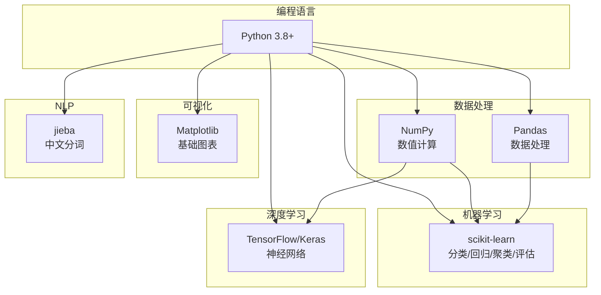

# 项目概述

> 📚 [文档中心](./README.md) | 📍 项目概述 | ➡ [需求规格](./04-需求规格说明书.md) | 🏠 [项目首页](../readme.md)

---

## 1. 项目简介

### 1.1 项目名称

**Python 数据挖掘学习路径**（python-data-mining）

### 1.2 项目定位

本项目是一个**系统化的数据挖掘知识库与代码实现集**，以 Python 为主要编程语言，完整覆盖从数据仓库到深度学习、从基础算法到行业应用的数据挖掘知识体系。项目遵循 **CRISP-DM**（Cross-Industry Standard Process for Data Mining）标准流程组织内容，使学习者按照"认知与数据 → 预测建模 → 模式发现 → 场景实战"的4阶段路线渐进学习。

### 1.3 项目目标

| 目标 | 说明 |
|------|------|
| **知识覆盖** | 覆盖 Han & Kamber《数据挖掘：概念与技术》核心章节内容 |
| **代码可运行** | 每个模块均为独立可运行的 Python 脚本，含完整示例数据 |
| **教学导向** | 从手动实现到 sklearn 调用，从理论到实践双线并行 |
| **企业可用** | 新成员可通过本项目快速掌握数据挖掘全栈技能 |

### 1.4 目标用户

- 数据挖掘/机器学习方向的初学者
- 企业数据团队新入职成员
- 需要快速查阅特定算法实现的学习者
- 数据挖掘课程的教学参考

---

## 2. 技术栈

### 2.1 核心技术栈



### 2.2 依赖清单

| 库 | 版本 | 用途 | 使用模块 |
|----|------|------|----------|
| numpy | ≥1.20 | 数值计算、矩阵运算 | 全部模块 |
| pandas | ≥1.3 | 数据处理、ETL演示 | 01数据仓库、02数据探索 |
| matplotlib | ≥3.4 | 数据可视化 | 02数据可视化、03回归、04分类 |
| scikit-learn | ≥1.0 | 机器学习算法与评估 | 02~08全部算法模块 |
| tensorflow | ≥2.6 | 深度学习 | 08深度学习 |
| h5py | ≥3.0 | 模型存储 | 08深度学习 |
| jieba | ≥0.42 | 中文分词 | 09应用领域/NLP |
| scipy | ≥1.7 | 统计检验、优化 | 03回归分析 |

### 2.3 开发环境

| 项目 | 推荐 |
|------|------|
| 操作系统 | Windows / macOS / Linux |
| IDE | VS Code（推荐） / PyCharm |
| Python | 3.8+ |
| 包管理 | pip / conda |

---

## 3. 快速上手

### 3.1 环境搭建

```bash
# 1. 克隆项目
git clone <repository-url>
cd python-data-mining

# 2. 创建虚拟环境（推荐）
python -m venv venv

# Windows 激活
venv\Scripts\activate

# macOS/Linux 激活
source venv/bin/activate

# 3. 安装依赖
pip install numpy pandas matplotlib scikit-learn scipy
pip install tensorflow h5py jieba  # 可选：深度学习和NLP
```

### 3.2 运行第一个模块

```bash
# 从项目根目录运行
python "00_数据挖掘导论/数据挖掘导论.py"
```

运行后将输出：
- 数据挖掘任务分类体系（描述性/预测性）
- CRISP-DM 标准流程
- 数据类型与数据质量
- 6种距离/相似度度量示例
- 数据挖掘典型应用场景

### 3.3 按学习路线运行


每个 `.py` 文件均可独立运行，无跨模块依赖。

---

## 4. 项目统计

| 指标 | 数值 |
|------|------|
| 顶级模块数 | 10 |
| Python 源文件数 | 55 |
| 知识方向数 | 4阶段 / 10模块 / 30+子方向 |
| 涵盖算法 | KNN、朴素贝叶斯、ID3/C4.5/CART、SVM、线性/逻辑回归、KMeans/DBSCAN/GMM、Apriori/FP-Growth、PCA/SVD、孤立森林/LOF、CNN、AdaBoost/GBDT/XGBoost、PageRank 等 |
| 参考标准 | CRISP-DM、Han & Kamber 第3版 |

---

## 5. 项目结构概览

```
python-data-mining/
├── 00_数据挖掘导论/          # CRISP-DM、任务分类、距离度量
├── 01_数据仓库与OLAP/        # 数据仓库架构、ETL、OLAP操作
├── 02_数据探索与处理/         # 预处理、特征工程、可视化
├── 03_回归分析/              # 01_线性回归、02_逻辑回归
├── 04_分类算法/              # KNN、贝叶斯、决策树、SVM、半监督
├── 05_模型评估与调优/         # 01_评估指标、02_不平衡处理
├── 06_集成学习/              # Bagging、Boosting、Stacking
├── 07_无监督学习/            # 聚类、关联规则、降维、异常检测
├── 08_深度学习/              # 神经网络、CNN文本分类
├── 09_应用领域/              # NLP、时序、推荐、图挖掘、Web、流数据
├── docs/                    # 📚 项目文档（本目录）
└── readme.md                # 学习路线总览
```

---

## 6. 与同类项目对比

| 特性 | 本项目 | 典型教程仓库 | 纯理论课程 |
|------|--------|-------------|-----------|
| 代码可运行 | ✅ 独立运行 | ⚠️ 需额外配置 | ❌ 无代码 |
| 手动实现 | ✅ 从零实现核心算法 | ⚠️ 仅sklearn调用 | ❌ |
| 知识体系完整 | ✅ 覆盖10大方向 | ⚠️ 常见3-5个方向 | ✅ |
| 数据仓库/OLAP | ✅ 权威教材级别 | ❌ 通常缺失 | ⚠️ |
| 应用领域 | ✅ 6大方向 | ⚠️ 1-2个 | ⚠️ |
| CRISP-DM流程 | ✅ 学习路线遵循 | ❌ | ⚠️ |
