# 算法速查

> 🏠 [项目首页](../README.md) | 📚 [文档中心](./README.md) | ⬅ [源码导读](./03-源码导读.md) | 📍 算法速查 | ➡ [练习与自检](./05-练习与自检.md)

---

本文档提供项目所有算法的快速索引，按类型分类，包含原理概要、源码定位、sklearn 对比、复杂度与适用场景。

---

## 目录

- [一、回归算法](#一回归算法)
- [二、分类算法](#二分类算法)
- [三、集成算法](#三集成算法)
- [四、聚类算法](#四聚类算法)
- [五、关联规则](#五关联规则)
- [六、降维算法](#六降维算法)
- [七、异常检测](#七异常检测)
- [八、深度学习](#八深度学习)
- [九、可解释 AI](#九可解释-ai)
- [十、图算法](#十图算法)
- [十一、联邦学习](#十一联邦学习)
- [十二、算法选择决策图](#十二算法选择决策图)
- [十三、复杂度与适用场景总览](#十三复杂度与适用场景总览)

---

## 一、回归算法

| 算法 | 原理（一句话） | 源码位置 | sklearn 对比 | 时间复杂度 | 适用场景 |
|------|---------------|---------|-------------|-----------|---------|
| 简单线性回归 | 最小二乘法拟合 y=wx+b，最小化残差平方和 | [01_线性回归.py](../03_回归分析/01_线性回归.py#L31) · [VSCode](file:///d:/Dev/DevWorkSpace/VS%20Code/Python/python-data-mining/03_回归分析/01_线性回归.py#L31) | `sklearn.linear_model.LinearRegression` | O(n) | 单特征线性关系、基线模型 |
| 多元线性回归(梯度下降) | 梯度下降迭代优化多维权重向量 | [01_线性回归.py](../03_回归分析/01_线性回归.py#L54) · [VSCode](file:///d:/Dev/DevWorkSpace/VS%20Code/Python/python-data-mining/03_回归分析/01_线性回归.py#L54) | `sklearn.linear_model.SGDRegressor` | O(n·d·iter) | 多特征、大规模数据 |
| Ridge | L2 正则化约束权重，防止过拟合 | [01_线性回归.py](../03_回归分析/01_线性回归.py#L88) · [VSCode](file:///d:/Dev/DevWorkSpace/VS%20Code/Python/python-data-mining/03_回归分析/01_线性回归.py#L88) | `sklearn.linear_model.Ridge` | O(d³) | 多重共线性、高维数据 |
| Lasso | L1 正则化产生稀疏解，自动特征选择 | [01_线性回归.py](../03_回归分析/01_线性回归.py#L88) · [VSCode](file:///d:/Dev/DevWorkSpace/VS%20Code/Python/python-data-mining/03_回归分析/01_线性回归.py#L88) | `sklearn.linear_model.Lasso` | O(n·d·iter) | 特征选择、稀疏建模 |
| ElasticNet | L1+L2 混合正则化，兼顾稀疏与稳定性 | [01_线性回归.py](../03_回归分析/01_线性回归.py#L88) · [VSCode](file:///d:/Dev/DevWorkSpace/VS%20Code/Python/python-data-mining/03_回归分析/01_线性回归.py#L88) | `sklearn.linear_model.ElasticNet` | O(n·d·iter) | 高维相关特征、Lasso 不稳定时 |
| 逻辑回归 | Sigmoid 函数将线性输出映射为概率，最大似然估计 | [02_逻辑回归.py](../03_回归分析/02_逻辑回归.py#L34) · [VSCode](file:///d:/Dev/DevWorkSpace/VS%20Code/Python/python-data-mining/03_回归分析/02_逻辑回归.py#L34) | `sklearn.linear_model.LogisticRegression` | O(n·d·iter) | 二分类、概率输出需求 |
| Softmax 回归 | 多类逻辑回归，输出各类别概率分布 | [02_逻辑回归.py](../03_回归分析/02_逻辑回归.py#L93) · [VSCode](file:///d:/Dev/DevWorkSpace/VS%20Code/Python/python-data-mining/03_回归分析/02_逻辑回归.py#L93) | `sklearn.linear_model.LogisticRegression(multi_class='multinomial')` | O(n·d·k·iter) | 多分类、互斥类别 |

---

## 二、分类算法

| 算法 | 原理（一句话） | 源码位置 | sklearn 对比 | 时间复杂度 | 适用场景 |
|------|---------------|---------|-------------|-----------|---------|
| KNN | 计算待分类样本与所有训练样本的距离，取最近 k 个邻居投票 | [K近邻算法.py](../04_分类算法/01_K近邻算法/K近邻算法.py#L48) · [VSCode](file:///d:/Dev/DevWorkSpace/VS%20Code/Python/python-data-mining/04_分类算法/01_K近邻算法/K近邻算法.py#L48) | `sklearn.neighbors.KNeighborsClassifier` | O(n·d) 预测 | 低维数据、小规模、非线性边界 |
| 朴素贝叶斯 | 基于条件独立性假设，用贝叶斯定理计算后验概率 | [朴素贝叶斯算法.py](../04_分类算法/02_朴素贝叶斯/朴素贝叶斯算法.py#L62) · [VSCode](file:///d:/Dev/DevWorkSpace/VS%20Code/Python/python-data-mining/04_分类算法/02_朴素贝叶斯/朴素贝叶斯算法.py#L62) | `sklearn.naive_bayes.MultinomialNB` | O(n·d) 训练 | 文本分类、高维稀疏数据、实时预测 |
| ID3 | 信息增益最大化为分裂准则，构建多叉决策树 | [trees.py](../04_分类算法/03_决策树/01_ID3决策树/trees.py#L35) · [VSCode](file:///d:/Dev/DevWorkSpace/VS%20Code/Python/python-data-mining/04_分类算法/03_决策树/01_ID3决策树/trees.py#L35) | 无直接对应（sklearn 使用 CART） | O(n·d·log n) | 离散特征分类、可解释性需求 |
| C4.5 | 信息增益率替代信息增益，克服偏向多值属性问题 | [C45决策树.py](../04_分类算法/03_决策树/02_C45决策树/C45决策树.py#L47) · [VSCode](file:///d:/Dev/DevWorkSpace/VS%20Code/Python/python-data-mining/04_分类算法/03_决策树/02_C45决策树/C45决策树.py#L47) | 无直接对应 | O(n·d·log n) | 连续+离散混合特征、ID3 改进 |
| CART | 基尼指数/平方误差为分裂准则，二叉递归分割 | [CART.py](../04_分类算法/03_决策树/03_CART回归树/CART.py#L135) · [VSCode](file:///d:/Dev/DevWorkSpace/VS%20Code/Python/python-data-mining/04_分类算法/03_决策树/03_CART回归树/CART.py#L135) | `sklearn.tree.DecisionTreeRegressor/Classifier` | O(n·d·log n) | 回归+分类、剪枝控制复杂度 |
| SVM | 最大化分类间隔的超平面，核函数映射非线性 | [SVM算法.py](../04_分类算法/04_支持向量机/SVM算法.py#L62) · [VSCode](file:///d:/Dev/DevWorkSpace/VS%20Code/Python/python-data-mining/04_分类算法/04_支持向量机/SVM算法.py#L62) | `sklearn.svm.SVC` | O(n²~n³) 训练 | 中小规模、高维、非线性分类 |
| 半监督-自训练 | 用已标注数据训练初始模型，对未标注数据预测后加入训练集 | [半监督学习与迁移学习.py](../04_分类算法/05_半监督学习与迁移学习/半监督学习与迁移学习.py#L65) · [VSCode](file:///d:/Dev/DevWorkSpace/VS%20Code/Python/python-data-mining/04_分类算法/05_半监督学习与迁移学习/半监督学习与迁移学习.py#L65) | `sklearn.semi_supervised.SelfTrainingClassifier` | 取决于基分类器 | 标注数据少、未标注数据多 |
| 半监督-协同训练 | 两个分类器在独立特征视图上互相标注 | [半监督学习与迁移学习.py](../04_分类算法/05_半监督学习与迁移学习/半监督学习与迁移学习.py#L139) · [VSCode](file:///d:/Dev/DevWorkSpace/VS%20Code/Python/python-data-mining/04_分类算法/05_半监督学习与迁移学习/半监督学习与迁移学习.py#L139) | 无直接对应 | 取决于基分类器 | 双视图数据、自然语言+图像 |
| 半监督-标签传播 | 构建样本相似图，标签沿图边传播 | [半监督学习与迁移学习.py](../04_分类算法/05_半监督学习与迁移学习/半监督学习与迁移学习.py#L229) · [VSCode](file:///d:/Dev/DevWorkSpace/VS%20Code/Python/python-data-mining/04_分类算法/05_半监督学习与迁移学习/半监督学习与迁移学习.py#L229) | `sklearn.semi_supervised.LabelPropagation` | O(n³) | 流形结构数据、少量标注 |
| 迁移学习-TrAdaBoost | 源域数据加权辅助目标域学习，错误分类的源域样本降权 | [半监督学习与迁移学习.py](../04_分类算法/05_半监督学习与迁移学习/半监督学习与迁移学习.py#L290) · [VSCode](file:///d:/Dev/DevWorkSpace/VS%20Code/Python/python-data-mining/04_分类算法/05_半监督学习与迁移学习/半监督学习与迁移学习.py#L290) | 无直接对应 | O(T·n·d) | 源域与目标域分布不同 |

---

## 三、集成算法

| 算法 | 原理（一句话） | 源码位置 | sklearn 对比 | 时间复杂度 | 适用场景 |
|------|---------------|---------|-------------|-----------|---------|
| Bagging/随机森林 | Bootstrap 采样训练多棵树，投票/平均输出 | [集成学习.py](../06_集成学习/集成学习.py#L39) · [VSCode](file:///d:/Dev/DevWorkSpace/VS%20Code/Python/python-data-mining/06_集成学习/集成学习.py#L39) | `sklearn.ensemble.RandomForestClassifier` | O(T·n·d·log n) | 高维数据、并行训练、基线集成 |
| AdaBoost | 串行训练弱分类器，错分样本加权，加权投票 | [集成学习.py](../06_集成学习/集成学习.py#L69) · [VSCode](file:///d:/Dev/DevWorkSpace/VS%20Code/Python/python-data-mining/06_集成学习/集成学习.py#L69) | `sklearn.ensemble.AdaBoostClassifier` | O(T·n·d) | 二分类、弱分类器提升 |
| GBDT | 串行拟合前一轮残差（梯度），逐步降低损失 | [集成学习.py](../06_集成学习/集成学习.py#L107) · [VSCode](file:///d:/Dev/DevWorkSpace/VS%20Code/Python/python-data-mining/06_集成学习/集成学习.py#L107) | `sklearn.ensemble.GradientBoostingClassifier` | O(T·n·d·log n) | 回归/分类、特征重要性 |
| XGBoost | GBDT + 正则化 + 二阶导数 + 列采样 | [集成学习.py](../06_集成学习/集成学习.py#L207) · [VSCode](file:///d:/Dev/DevWorkSpace/VS%20Code/Python/python-data-mining/06_集成学习/集成学习.py#L207) | `xgboost.XGBClassifier` | O(T·d·n·log n) | 竞赛、结构化数据、高精度 |
| LightGBM | 直方图加速 + Leaf-wise 生长 + GOSS/EFB | [现代梯度提升.py](../06_集成学习/02_现代梯度提升/现代梯度提升.py#L47) · [VSCode](file:///d:/Dev/DevWorkSpace/VS%20Code/Python/python-data-mining/06_集成学习/02_现代梯度提升/现代梯度提升.py#L47) | `lightgbm.LGBMClassifier` | O(T·n·d) | 大规模数据、训练速度优先 |
| CatBoost | 有序目标编码 + 对称树 + 无偏提升 | [现代梯度提升.py](../06_集成学习/02_现代梯度提升/现代梯度提升.py#L96) · [VSCode](file:///d:/Dev/DevWorkSpace/VS%20Code/Python/python-data-mining/06_集成学习/02_现代梯度提升/现代梯度提升.py#L96) | `catboost.CatBoostClassifier` | O(T·n·d) | 类别特征多、少调参 |
| Stacking | 多基模型输出作为元特征，训练元学习器 | [集成学习.py](../06_集成学习/集成学习.py#L171) · [VSCode](file:///d:/Dev/DevWorkSpace/VS%20Code/Python/python-data-mining/06_集成学习/集成学习.py#L171) | `sklearn.ensemble.StackingClassifier` | 取决于基模型 | 异构模型融合、最高精度 |
| Bagging 手动实现 | 从零实现 Bootstrap 聚合流程 | [集成学习.py](../06_集成学习/集成学习.py#L228) · [VSCode](file:///d:/Dev/DevWorkSpace/VS%20Code/Python/python-data-mining/06_集成学习/集成学习.py#L228) | — | O(T·n·d·log n) | 理解 Bagging 原理 |
| AdaBoost 手动实现 | 从零实现 AdaBoost 权重更新与加权投票 | [集成学习.py](../06_集成学习/集成学习.py#L286) · [VSCode](file:///d:/Dev/DevWorkSpace/VS%20Code/Python/python-data-mining/06_集成学习/集成学习.py#L286) | — | O(T·n·d) | 理解 Boosting 原理 |

---

## 四、聚类算法

| 算法 | 原理（一句话） | 源码位置 | sklearn 对比 | 时间复杂度 | 适用场景 |
|------|---------------|---------|-------------|-----------|---------|
| KMeans | 迭代更新聚类中心，最小化样本到中心距离之和 | [KMeans聚类.py](../07_无监督学习/01_聚类分析/KMeans聚类.py#L29) · [VSCode](file:///d:/Dev/DevWorkSpace/VS%20Code/Python/python-data-mining/07_无监督学习/01_聚类分析/KMeans聚类.py#L29) | `sklearn.cluster.KMeans` | O(n·k·d·iter) | 球形簇、大规模数据 |
| DBSCAN | 基于密度核心点扩展聚类，自动发现任意形状簇 | [高级聚类.py](../07_无监督学习/01_聚类分析/高级聚类.py#L30) · [VSCode](file:///d:/Dev/DevWorkSpace/VS%20Code/Python/python-data-mining/07_无监督学习/01_聚类分析/高级聚类.py#L30) | `sklearn.cluster.DBSCAN` | O(n·log n) ~ O(n²) | 任意形状簇、含噪声数据 |
| 层次聚类 | 自底向上合并/自顶向下分裂，构建树状图 | [高级聚类.py](../07_无监督学习/01_聚类分析/高级聚类.py#L51) · [VSCode](file:///d:/Dev/DevWorkSpace/VS%20Code/Python/python-data-mining/07_无监督学习/01_聚类分析/高级聚类.py#L51) | `sklearn.cluster.AgglomerativeClustering` | O(n²~n³) | 层次结构、小规模数据 |
| GMM | 假设数据由多个高斯分布混合生成，EM 估计参数 | [高级聚类.py](../07_无监督学习/01_聚类分析/高级聚类.py#L77) · [VSCode](file:///d:/Dev/DevWorkSpace/VS%20Code/Python/python-data-mining/07_无监督学习/01_聚类分析/高级聚类.py#L77) | `sklearn.mixture.GaussianMixture` | O(n·k·d²·iter) | 椭圆簇、软聚类、概率输出 |
| 谱聚类 | 构建相似图拉普拉斯矩阵，在特征空间做 KMeans | [高级聚类.py](../07_无监督学习/01_聚类分析/高级聚类.py#L115) · [VSCode](file:///d:/Dev/DevWorkSpace/VS%20Code/Python/python-data-mining/07_无监督学习/01_聚类分析/高级聚类.py#L115) | `sklearn.cluster.SpectralClustering` | O(n³) | 非凸簇、图结构数据 |
| DBSCAN 手动实现 | 从零实现核心点/边界点/噪声点判定与簇扩展 | [高级聚类.py](../07_无监督学习/01_聚类分析/高级聚类.py#L179) · [VSCode](file:///d:/Dev/DevWorkSpace/VS%20Code/Python/python-data-mining/07_无监督学习/01_聚类分析/高级聚类.py#L179) | — | O(n²) | 理解密度聚类原理 |

---

## 五、关联规则

| 算法 | 原理（一句话） | 源码位置 | sklearn 对比 | 时间复杂度 | 适用场景 |
|------|---------------|---------|-------------|-----------|---------|
| Apriori | 逐层搜索频繁项集，利用先验性质剪枝 | [Apriori.py](../07_无监督学习/02_关联规则挖掘/01_Apriori算法/Apriori.py#L147) · [VSCode](file:///d:/Dev/DevWorkSpace/VS%20Code/Python/python-data-mining/07_无监督学习/02_关联规则挖掘/01_Apriori算法/Apriori.py#L147) | 无（使用 `mlxtend`） | O(2^d) 最坏 | 交易数据、购物篮分析 |
| FP-Growth | 构建 FP 树压缩存储，无需候选集直接挖掘频繁模式 | [FP_Growth算法.py](../07_无监督学习/02_关联规则挖掘/02_FPGrowth算法/FP_Growth算法.py#L18) · [VSCode](file:///d:/Dev/DevWorkSpace/VS%20Code/Python/python-data-mining/07_无监督学习/02_关联规则挖掘/02_FPGrowth算法/FP_Growth算法.py#L18) | 无（使用 `mlxtend`） | O(n·d) 平均 | 大规模交易数据、比 Apriori 快 |
| PrefixSpan | 基于前缀投影的模式增长，挖掘序列频繁模式 | [序列模式挖掘.py](../07_无监督学习/02_关联规则挖掘/03_序列模式挖掘/序列模式挖掘.py#L163) · [VSCode](file:///d:/Dev/DevWorkSpace/VS%20Code/Python/python-data-mining/07_无监督学习/02_关联规则挖掘/03_序列模式挖掘/序列模式挖掘.py#L163) | 无 | O(n·L·d) | 序列数据、用户行为路径 |
| AprioriAll | Apriori 的序列扩展，逐层搜索序列频繁模式 | [序列模式挖掘.py](../07_无监督学习/02_关联规则挖掘/03_序列模式挖掘/序列模式挖掘.py#L70) · [VSCode](file:///d:/Dev/DevWorkSpace/VS%20Code/Python/python-data-mining/07_无监督学习/02_关联规则挖掘/03_序列模式挖掘/序列模式挖掘.py#L70) | 无 | O(2^L) 最坏 | 序列数据、对比 PrefixSpan |

---

## 六、降维算法

| 算法 | 原理（一句话） | 源码位置 | sklearn 对比 | 时间复杂度 | 适用场景 |
|------|---------------|---------|-------------|-----------|---------|
| PCA | 最大化方差方向投影，正交变换去相关 | [PCA.py](../07_无监督学习/03_降维与矩阵分解/01_PCA主成分分析/PCA.py#L50) · [VSCode](file:///d:/Dev/DevWorkSpace/VS%20Code/Python/python-data-mining/07_无监督学习/03_降维与矩阵分解/01_PCA主成分分析/PCA.py#L50) | `sklearn.decomposition.PCA` | O(d³) | 高维可视化、去噪、特征压缩 |
| SVD | 矩阵分解为 UΣVᵀ，低秩近似降维 | [SVD.py](../07_无监督学习/03_降维与矩阵分解/02_SVD推荐系统/SVD.py#L54) · [VSCode](file:///d:/Dev/DevWorkSpace/VS%20Code/Python/python-data-mining/07_无监督学习/03_降维与矩阵分解/02_SVD推荐系统/SVD.py#L54) | `sklearn.decomposition.TruncatedSVD` | O(m·n·k) | 推荐系统、图像压缩、文本 LSA |

---

## 七、异常检测

| 算法 | 原理（一句话） | 源码位置 | sklearn 对比 | 时间复杂度 | 适用场景 |
|------|---------------|---------|-------------|-----------|---------|
| Z-Score | 样本偏离均值超过阈值倍标准差即为异常 | [异常检测.py](../07_无监督学习/04_异常检测/异常检测.py#L62) · [VSCode](file:///d:/Dev/DevWorkSpace/VS%20Code/Python/python-data-mining/07_无监督学习/04_异常检测/异常检测.py#L62) | 无（手动实现） | O(n) | 单变量、正态分布假设 |
| IQR | 四分位距法，超出 1.5×IQR 为异常 | [异常检测.py](../07_无监督学习/04_异常检测/异常检测.py#L74) · [VSCode](file:///d:/Dev/DevWorkSpace/VS%20Code/Python/python-data-mining/07_无监督学习/04_异常检测/异常检测.py#L74) | 无（手动实现） | O(n) | 单变量、非正态分布 |
| 孤立森林 | 随机分割隔离异常点，路径短即为异常 | [异常检测.py](../07_无监督学习/04_异常检测/异常检测.py#L90) · [VSCode](file:///d:/Dev/DevWorkSpace/VS%20Code/Python/python-data-mining/07_无监督学习/04_异常检测/异常检测.py#L90) | `sklearn.ensemble.IsolationForest` | O(T·n·log n) | 高维数据、大规模 |
| LOF | 比较局部密度与邻居密度，密度比低为异常 | [异常检测.py](../07_无监督学习/04_异常检测/异常检测.py#L103) · [VSCode](file:///d:/Dev/DevWorkSpace/VS%20Code/Python/python-data-mining/07_无监督学习/04_异常检测/异常检测.py#L103) | `sklearn.neighbors.LocalOutlierFactor` | O(n²) | 局部密度不均、簇状异常 |
| One-Class SVM | 学习包围正常数据的最小超球面/超平面 | [异常检测.py](../07_无监督学习/04_异常检测/异常检测.py#L116) · [VSCode](file:///d:/Dev/DevWorkSpace/VS%20Code/Python/python-data-mining/07_无监督学习/04_异常检测/异常检测.py#L116) | `sklearn.svm.OneClassSVM` | O(n²~n³) | 小样本高维、边界精确 |
| PCA 重构误差 | PCA 降维后重构，重构误差大为异常 | [异常检测.py](../07_无监督学习/04_异常检测/异常检测.py#L130) · [VSCode](file:///d:/Dev/DevWorkSpace/VS%20Code/Python/python-data-mining/07_无监督学习/04_异常检测/异常检测.py#L130) | 无（手动实现） | O(d³+n·d) | 线性相关数据、降维+检测 |

---

## 八、深度学习

| 算法 | 原理（一句话） | 源码位置 | sklearn 对比 | 时间复杂度 | 适用场景 |
|------|---------------|---------|-------------|-----------|---------|
| 感知机 | 单层线性分类器，误分类驱动权重更新 | [神经网络基础.py](../08_深度学习/01_神经网络基础/神经网络基础.py#L26) · [VSCode](file:///d:/Dev/DevWorkSpace/VS%20Code/Python/python-data-mining/08_深度学习/01_神经网络基础/神经网络基础.py#L26) | `sklearn.linear_model.Perceptron` | O(n·d·iter) | 线性可分数据、神经网络入门 |
| MLP | 多层前馈网络，反向传播更新权重 | [神经网络基础.py](../08_深度学习/01_神经网络基础/神经网络基础.py#L108) · [VSCode](file:///d:/Dev/DevWorkSpace/VS%20Code/Python/python-data-mining/08_深度学习/01_神经网络基础/神经网络基础.py#L108) | `sklearn.neural_network.MLPClassifier` | O(n·d·h·iter) | 非线性分类/回归、通用近似 |
| CNN | 卷积核局部感受野 + 权值共享提取空间特征 | [CNN文本分类.py](../08_深度学习/02_文本分类模型对比/CNN文本分类.py#L1) · [VSCode](file:///d:/Dev/DevWorkSpace/VS%20Code/Python/python-data-mining/08_深度学习/02_文本分类模型对比/CNN文本分类.py#L1) | 无（使用 PyTorch/TensorFlow） | O(n·k²·c·h·w) | 图像/文本分类、空间特征 |
| Autoencoder | 编码器压缩 + 解码器重构，学习低维表示 | [自编码器与VAE.py](../08_深度学习/03_自编码器与生成模型/自编码器与VAE.py#L80) · [VSCode](file:///d:/Dev/DevWorkSpace/VS%20Code/Python/python-data-mining/08_深度学习/03_自编码器与生成模型/自编码器与VAE.py#L80) | 无 | O(n·d·h·iter) | 降维、去噪、异常检测 |
| VAE | 编码器输出分布参数 + 重参数化 + KL 散度正则 | [自编码器与VAE.py](../08_深度学习/03_自编码器与生成模型/自编码器与VAE.py#L320) · [VSCode](file:///d:/Dev/DevWorkSpace/VS%20Code/Python/python-data-mining/08_深度学习/03_自编码器与生成模型/自编码器与VAE.py#L320) | 无 | O(n·d·h·iter) | 生成模型、潜在空间探索 |
| 对比学习(SimCLR) | 同一样本不同增强视图拉近，不同样本推远 | [对比学习与自监督学习.py](../08_深度学习/04_对比学习与自监督学习/对比学习与自监督学习.py#L118) · [VSCode](file:///d:/Dev/DevWorkSpace/VS%20Code/Python/python-data-mining/08_深度学习/04_对比学习与自监督学习/对比学习与自监督学习.py#L118) | 无 | O(n·b·d·iter) | 无标注预训练、表征学习 |
| Transformer | 自注意力机制捕获全局依赖，并行计算 | [Transformer与注意力机制.py](../08_深度学习/05_Transformer与注意力机制/Transformer与注意力机制.py#L226) · [VSCode](file:///d:/Dev/DevWorkSpace/VS%20Code/Python/python-data-mining/08_深度学习/05_Transformer与注意力机制/Transformer与注意力机制.py#L226) | 无 | O(n·L²·d) | 序列建模、NLP、多模态 |

---

## 九、可解释 AI

| 算法 | 原理（一句话） | 源码位置 | sklearn 对比 | 时间复杂度 | 适用场景 |
|------|---------------|---------|-------------|-----------|---------|
| LIME | 局部线性近似黑盒模型，扰动样本拟合解释 | [可解释AI.py](../05_模型评估与调优/03_可解释AI/可解释AI.py#L80) · [VSCode](file:///d:/Dev/DevWorkSpace/VS%20Code/Python/python-data-mining/05_模型评估与调优/03_可解释AI/可解释AI.py#L80) | `lime.lime_tabular.LimeTabularExplainer` | O(n_sample·d) | 单样本局部解释、任意模型 |
| SHAP | 基于 Shapley 值的博弈论方法，公平分配特征贡献 | [可解释AI.py](../05_模型评估与调优/03_可解释AI/可解释AI.py#L144) · [VSCode](file:///d:/Dev/DevWorkSpace/VS%20Code/Python/python-data-mining/05_模型评估与调优/03_可解释AI/可解释AI.py#L144) | `shap.Explainer` | O(2^d) 精确 / O(n·d) 近似 | 全局+局部解释、特征贡献 |
| PDP/ICE | 固定其他特征，观察目标特征对预测的平均/个体影响 | [可解释AI.py](../05_模型评估与调优/03_可解释AI/可解释AI.py#L196) · [VSCode](file:///d:/Dev/DevWorkSpace/VS%20Code/Python/python-data-mining/05_模型评估与调优/03_可解释AI/可解释AI.py#L196) | `sklearn.inspection.PartialDependenceDisplay` | O(n·grid·d) | 全局特征效应、交互效应 |

---

## 十、图算法

| 算法 | 原理（一句话） | 源码位置 | sklearn 对比 | 时间复杂度 | 适用场景 |
|------|---------------|---------|-------------|-----------|---------|
| GCN | 谱域图卷积，聚合邻居特征并线性变换 | [图神经网络.py](../09_应用领域/04_图与网络挖掘/02_图神经网络/图神经网络.py#L69) · [VSCode](file:///d:/Dev/DevWorkSpace/VS%20Code/Python/python-data-mining/09_应用领域/04_图与网络挖掘/02_图神经网络/图神经网络.py#L69) | 无（使用 PyG） | O(L·|E|·d) | 节点分类、图分类 |
| GAT | 注意力加权聚合邻居特征，自适应学习邻居重要性 | [图神经网络.py](../09_应用领域/04_图与网络挖掘/02_图神经网络/图神经网络.py#L166) · [VSCode](file:///d:/Dev/DevWorkSpace/VS%20Code/Python/python-data-mining/09_应用领域/04_图与网络挖掘/02_图神经网络/图神经网络.py#L166) | 无（使用 PyG） | O(L·|E|·d) | 异构图、邻居重要性差异大 |
| PageRank | 随机游走稳态分布衡量节点重要性 | [图与网络挖掘.py](../09_应用领域/04_图与网络挖掘/图与网络挖掘.py#L226) · [VSCode](file:///d:/Dev/DevWorkSpace/VS%20Code/Python/python-data-mining/09_应用领域/04_图与网络挖掘/图与网络挖掘.py#L226) | `networkx.pagerank` | O(iter·|V|) | 网页排名、节点重要性 |

---

## 十一、联邦学习

| 算法 | 原理（一句话） | 源码位置 | sklearn 对比 | 时间复杂度 | 适用场景 |
|------|---------------|---------|-------------|-----------|---------|
| FedAvg | 各客户端本地训练，服务器加权平均模型参数 | [联邦学习与隐私保护.py](../09_应用领域/07_联邦学习与隐私保护/联邦学习与隐私保护.py#L76) · [VSCode](file:///d:/Dev/DevWorkSpace/VS%20Code/Python/python-data-mining/09_应用领域/07_联邦学习与隐私保护/联邦学习与隐私保护.py#L76) | 无 | O(C·E·n_c·d) | 分布式训练、数据不出域 |
| DPSGD | 梯度裁剪 + 噪声添加，满足差分隐私的 SGD | [联邦学习与隐私保护.py](../09_应用领域/07_联邦学习与隐私保护/联邦学习与隐私保护.py#L307) · [VSCode](file:///d:/Dev/DevWorkSpace/VS%20Code/Python/python-data-mining/09_应用领域/07_联邦学习与隐私保护/联邦学习与隐私保护.py#L307) | 无 | O(n·d·iter) | 隐私保护训练、敏感数据 |
| 差分隐私 | 拉普拉斯/高斯机制添加校准噪声保护隐私 | [联邦学习与隐私保护.py](../09_应用领域/07_联邦学习与隐私保护/联邦学习与隐私保护.py#L214) · [VSCode](file:///d:/Dev/DevWorkSpace/VS%20Code/Python/python-data-mining/09_应用领域/07_联邦学习与隐私保护/联邦学习与隐私保护.py#L214) | 无 | O(1) 单次 | 隐私预算控制、数据发布 |

---

## 十二、算法选择决策图

从问题类型出发，逐步引导到具体算法选择的决策流程图：

```mermaid
flowchart TD
    START([🤔 我要解决什么问题？]) --> PROB_TYPE{问题类型}

    PROB_TYPE -->|预测连续值| REG[回归问题]
    PROB_TYPE -->|预测离散类别| CLS[分类问题]
    PROB_TYPE -->|无标签分组| CLU[聚类问题]
    PROB_TYPE -->|发现关联模式| ASSOC[关联规则]
    PROB_TYPE -->|降维/压缩| DIM[降维问题]
    PROB_TYPE -->|检测异常| ANOM[异常检测]
    PROB_TYPE -->|深度表征| DL[深度学习]
    PROB_TYPE -->|模型解释| XAI[可解释AI]
    PROB_TYPE -->|图结构数据| GRAPH[图算法]
    PROB_TYPE -->|隐私保护训练| FL[联邦学习]

    %% ===== 回归 =====
    REG --> REG_FEAT{特征数量}
    REG_FEAT -->|单特征| SLR[简单线性回归]
    REG_FEAT -->|多特征| REG_MULTI{是否过拟合？}
    REG_MULTI -->|否| MLR[多元线性回归<br/>梯度下降]
    REG_MULTI -->|是| REG_REG{正则化偏好}
    REG_REG -->|L2 岭回归| RIDGE[Ridge]
    REG_REG -->|L1 稀疏| LASSO[Lasso]
    REG_REG -->|L1+L2 混合| EN[ElasticNet]

    %% ===== 分类 =====
    CLS --> CLS_LABELED{有标签数据量}
    CLS_LABELED -->|充足| CLS_FULL{数据特征}
    CLS_LABELED -->|少量+大量无标签| SEMI[半监督学习]
    CLS_LABELED -->|源域数据可用| TRANS[迁移学习]

    CLS_FULL --> CLS_N{类别数}
    CLS_N -->|二分类| CLS_BIN{数据特点}
    CLS_N -->|多分类| CLS_MULTI{数据特点}

    CLS_BIN -->|线性可分| CLS_BIN_LIN{概率需求？}
    CLS_BIN_LIN -->|需要概率| LR[逻辑回归]
    CLS_BIN_LIN -->|不需要| PERC[感知机]
    CLS_BIN -->|非线性边界| CLS_BIN_NL{数据规模}
    CLS_BIN_NL -->|小规模| SVM_RBF[SVM-RBF]
    CLS_BIN_NL -->|大规模| KNN_CLS[KNN]

    CLS_MULTI -->|需要概率| SOFTMAX[Softmax回归]
    CLS_MULTI -->|特征独立| NB[朴素贝叶斯]
    CLS_MULTI -->|可解释性| DT{决策树类型}
    CLS_MULTI -->|最大间隔| SVM_CLS[SVM]
    CLS_MULTI -->|距离投票| KNN_M[KNN]

    DT -->|离散特征| ID3[ID3]
    DT -->|连续+离散| C45[C4.5]
    DT -->|回归+分类| CART[CART]

    SEMI --> SEMI_TYPE{数据特点}
    SEMI_TYPE -->|单视图高置信| SELF[自训练]
    SEMI_TYPE -->|双视图| CO[协同训练]
    SEMI_TYPE -->|流形结构| LP[标签传播]

    TRANS --> TRADABOOST[TrAdaBoost]

    %% ===== 集成 =====
    CLS_FULL --> ENSEMBLE{需要更高精度？}
    ENSEMBLE -->|是| ENS_TYPE{集成策略}
    ENS_TYPE -->|并行+多样性| BAG[Bagging/随机森林]
    ENS_TYPE -->|串行+纠错| BOOST{提升方式}
    ENS_TYPE -->|异构融合| STACK[Stacking]

    BOOST --> BOOST_TYPE{框架选择}
    BOOST_TYPE -->|经典二分类| ADABOOST[AdaBoost]
    BOOST_TYPE -->|通用残差拟合| GBDT[GBDT]
    BOOST_TYPE -->|正则化+二阶导| XGB[XGBoost]
    BOOST_TYPE -->|直方图加速| LGBM[LightGBM]
    BOOST_TYPE -->|类别特征友好| CATB[CatBoost]

    %% ===== 聚类 =====
    CLU --> CLU_SHAPE{簇形状}
    CLU_SHAPE -->|球形| KM[KMeans]
    CLU_SHAPE -->|任意形状| CLU_DENS{密度分布}
    CLU_SHAPE -->|层次结构| AGG[层次聚类]
    CLU_SHAPE -->|椭圆/软聚类| GMM[GMM]
    CLU_SHAPE -->|非凸/图结构| SPEC[谱聚类]

    CLU_DENS -->|均匀密度| DBSCAN[DBSCAN]
    CLU_DENS -->|密度不均| LOF_CLU[LOF + 密度聚类]

    %% ===== 关联规则 =====
    ASSOC --> ASSOC_TYPE{数据类型}
    ASSOC_TYPE -->|交易项集| ASSOC_ALG{规模}
    ASSOC_TYPE -->|序列模式| SEQ_TYPE{算法偏好}

    ASSOC_ALG -->|小规模| APRIORI[Apriori]
    ASSOC_ALG -->|大规模| FPG[FP-Growth]

    SEQ_TYPE -->|逐层搜索| APRIORIALL[AprioriAll]
    SEQ_TYPE -->|模式增长| PREFIXSPAN[PrefixSpan]

    %% ===== 降维 =====
    DIM --> DIM_TYPE{目标}
    DIM_TYPE -->|去相关/可视化| PCA_ALG[PCA]
    DIM_TYPE -->|矩阵分解/推荐| SVD_ALG[SVD]

    %% ===== 异常检测 =====
    ANOM --> ANOM_DIM{数据维度}
    ANOM_DIM -->|单变量| ANOM_UNI{分布假设}
    ANOM_DIM -->|多变量| ANOM_MULTI{方法偏好}

    ANOM_UNI -->|正态分布| ZSCORE[Z-Score]
    ANOM_UNI -->|非正态| IQR[IQR]

    ANOM_MULTI -->|统计+重构| PCA_ANOM[PCA重构误差]
    ANOM_MULTI -->|隔离策略| ISOF[孤立森林]
    ANOM_MULTI -->|局部密度| LOF_ANOM[LOF]
    ANOM_MULTI -->|边界精确| OCSVM[One-Class SVM]

    %% ===== 深度学习 =====
    DL --> DL_TASK{任务类型}
    DL_TASK -->|线性可分入门| PERCEPTRON[感知机]
    DL_TASK -->|非线性通用| MLP_ALG[MLP]
    DL_TASK -->|空间特征| CNN_ALG[CNN]
    DL_TASK -->|序列建模| DL_SEQ{注意力需求}
    DL_TASK -->|降维/生成| DL_GEN{生成需求}
    DL_TASK -->|无标注预训练| DL_SSL[对比学习 SimCLR]

    DL_SEQ -->|局部依赖| RNN_LIKE[MLP/RNN]
    DL_SEQ -->|全局依赖| TRANSFORMER[Transformer]

    DL_GEN -->|仅重构| AE[Autoencoder]
    DL_GEN -->|生成样本| VAE_ALG[VAE]

    %% ===== 可解释AI =====
    XAI --> XAI_SCOPE{解释范围}
    XAI_SCOPE -->|局部解释| XAI_LOCAL{方法}
    XAI_SCOPE -->|全局解释| XAI_GLOBAL{方法}

    XAI_LOCAL -->|扰动近似| LIME_XAI[LIME]
    XAI_LOCAL -->|博弈论| SHAP_XAI[SHAP]

    XAI_GLOBAL -->|特征贡献| SHAP_G[SHAP 摘要图]
    XAI_GLOBAL -->|特征效应| PDP_ICE[PDP/ICE]

    %% ===== 图算法 =====
    GRAPH --> GRAPH_TASK{任务类型}
    GRAPH_TASK -->|节点分类| GRAPH_NN{注意力需求}
    GRAPH_TASK -->|节点重要性| GRAPH_IMP{方法}
    GRAPH_TASK -->|社区发现| GRAPH_COMM[Girvan-Newman]
    GRAPH_TASK -->|链接预测| GRAPH_LINK[Jaccard/Adamic-Adar]

    GRAPH_NN -->|谱域卷积| GCN_ALG[GCN]
    GRAPH_NN -->|注意力聚合| GAT_ALG[GAT]

    GRAPH_IMP -->|随机游走| PAGERANK[PageRank]
    GRAPH_IMP -->|中心性| GRAPH_CENT[度/介数/特征向量中心性]

    %% ===== 联邦学习 =====
    FL --> FL_TYPE{需求}
    FL_TYPE -->|分布式训练| FEDAVG[FedAvg]
    FL_TYPE -->|隐私保护训练| FL_PRIV{隐私机制}
    FL_PRIV -->|梯度扰动| DPSGD_ALG[DP-SGD]
    FL_PRIV -->|数据发布| DP[差分隐私]

    %% 样式
    classDef category fill:#4A90D9,stroke:#2C5F8A,color:#fff,font-weight:bold
    classDef algorithm fill:#F5A623,stroke:#C77E00,color:#fff,font-weight:bold
    classDef decision fill:#7ED321,stroke:#5A9A18,color:#fff
    classDef startend fill:#BD10E0,stroke:#8B0AA5,color:#fff

    class START startend
    class REG,CLS,CLU,ASSOC,DIM,ANOM,DL,XAI,GRAPH,FL category
    class SLR,MLR,RIDGE,LASSO,EN,LR,SOFTMAX,PERC,KNN_CLS,KNN_M,NB,ID3,C45,CART,SVM_RBF,SVM_CLS,SELF,CO,LP,TRADABOOST,BAG,ADABOOST,GBDT,XGB,LGBM,CATB,STACK,KM,DBSCAN,AGG,GMM,SPEC,APRIORI,FPG,APRIORIALL,PREFIXSPAN,PCA_ALG,SVD_ALG,ZSCORE,IQR,ISOF,LOF_ANOM,OCSVM,PCA_ANOM,PERCEPTRON,MLP_ALG,CNN_ALG,AE,VAE_ALG,TRANSFORMER,RNN_LIKE,DL_SSL,LIME_XAI,SHAP_XAI,SHAP_G,PDP_ICE,GCN_ALG,GAT_ALG,PAGERANK,GRAPH_CENT,GRAPH_COMM,GRAPH_LINK,FEDAVG,DPSGD_ALG,DP,LOF_CLU algorithm
    class REG_FEAT,REG_MULTI,REG_REG,CLS_LABELED,CLS_FULL,CLS_N,CLS_BIN,CLS_BIN_LIN,CLS_BIN_NL,CLS_MULTI,DT,SEMI_TYPE,ENS_TYPE,BOOST_TYPE,CLU_SHAPE,CLU_DENS,ASSOC_TYPE,ASSOC_ALG,SEQ_TYPE,DIM_TYPE,ANOM_DIM,ANOM_UNI,ANOM_MULTI,DL_TASK,DL_SEQ,DL_GEN,XAI_SCOPE,XAI_LOCAL,XAI_GLOBAL,GRAPH_TASK,GRAPH_NN,GRAPH_IMP,FL_TYPE,FL_PRIV,ENSEMBLE decision
```

---

## 十三、复杂度与适用场景总览

### 13.1 时间复杂度对比

| 算法 | 训练复杂度 | 预测复杂度 | 内存开销 |
|------|-----------|-----------|---------|
| 简单线性回归 | O(n) | O(1) | O(1) |
| 多元线性回归(梯度下降) | O(n·d·iter) | O(d) | O(d) |
| Ridge | O(d³) | O(d) | O(d²) |
| Lasso | O(n·d·iter) | O(d) | O(d) |
| ElasticNet | O(n·d·iter) | O(d) | O(d) |
| 逻辑回归 | O(n·d·iter) | O(d) | O(d) |
| Softmax 回归 | O(n·d·k·iter) | O(d·k) | O(d·k) |
| KNN | O(1) | O(n·d) | O(n·d) |
| 朴素贝叶斯 | O(n·d) | O(d·k) | O(d·k) |
| ID3 | O(n·d·log n) | O(log n) | O(n·d) |
| C4.5 | O(n·d·log n) | O(log n) | O(n·d) |
| CART | O(n·d·log n) | O(log n) | O(n·d) |
| SVM | O(n²~n³) | O(n·d) | O(n²) |
| 自训练 | 取决于基分类器 | 取决于基分类器 | 取决于基分类器 |
| 协同训练 | 取决于基分类器 | 取决于基分类器 | 取决于基分类器 |
| 标签传播 | O(n³) | O(1) | O(n²) |
| TrAdaBoost | O(T·n·d) | O(T·d) | O(n·d) |
| Bagging/随机森林 | O(T·n·d·log n) | O(T·log n) | O(T·n·d) |
| AdaBoost | O(T·n·d) | O(T·d) | O(T·d) |
| GBDT | O(T·n·d·log n) | O(T·log n) | O(T·n·d) |
| XGBoost | O(T·d·n·log n) | O(T·log n) | O(T·n·d) |
| LightGBM | O(T·n·d) | O(T·log n) | O(T·n·d) |
| CatBoost | O(T·n·d) | O(T·log n) | O(T·n·d) |
| Stacking | 取决于基模型 | 取决于基模型 | 取决于基模型 |
| KMeans | O(n·k·d·iter) | O(k·d) | O(k·d) |
| DBSCAN | O(n·log n)~O(n²) | O(1) | O(n²) |
| 层次聚类 | O(n²~n³) | O(1) | O(n²) |
| GMM | O(n·k·d²·iter) | O(k·d²) | O(k·d²) |
| 谱聚类 | O(n³) | O(1) | O(n²) |
| Apriori | O(2^d) 最坏 | — | O(2^d) |
| FP-Growth | O(n·d) 平均 | — | O(n·d) |
| PrefixSpan | O(n·L·d) | — | O(n·L·d) |
| AprioriAll | O(2^L) 最坏 | — | O(2^L) |
| PCA | O(d³) | O(d·k) | O(d²) |
| SVD | O(m·n·k) | O(m·k+n·k) | O(m·k+n·k) |
| Z-Score | O(n) | O(1) | O(1) |
| IQR | O(n) | O(1) | O(1) |
| 孤立森林 | O(T·n·log n) | O(T·log n) | O(T·n) |
| LOF | O(n²) | O(n) | O(n²) |
| One-Class SVM | O(n²~n³) | O(n·d) | O(n²) |
| PCA 重构误差 | O(d³+n·d) | O(d·k) | O(d²) |
| 感知机 | O(n·d·iter) | O(d) | O(d) |
| MLP | O(n·d·h·iter) | O(d·h) | O(d·h) |
| CNN | O(n·k²·c·h·w) | O(k²·c·h·w) | O(k²·c·h·w) |
| Autoencoder | O(n·d·h·iter) | O(d·h) | O(d·h) |
| VAE | O(n·d·h·iter) | O(d·h) | O(d·h) |
| SimCLR | O(n·b·d·iter) | O(d) | O(d) |
| Transformer | O(n·L²·d) | O(L²·d) | O(L²·d) |
| LIME | O(n_sample·d) | O(d) | O(n_sample·d) |
| SHAP | O(2^d) 精确 | O(2^d) | O(2^d) |
| PDP/ICE | O(n·grid·d) | O(grid·d) | O(grid·d) |
| GCN | O(L·\|E\|·d) | O(L·\|E\|·d) | O(\|E\|·d) |
| GAT | O(L·\|E\|·d) | O(L·\|E\|·d) | O(\|E\|·d) |
| PageRank | O(iter·\|V\|) | O(1) | O(\|V\|) |
| FedAvg | O(C·E·n_c·d) | O(d) | O(C·d) |
| DPSGD | O(n·d·iter) | O(d) | O(d) |
| 差分隐私 | O(1) 单次 | O(1) | O(1) |

### 13.2 适用场景速查

| 场景 | 推荐算法 | 理由 |
|------|---------|------|
| 小数据集线性回归 | 简单线性回归 / 多元线性回归 | 解析解或快速收敛 |
| 多重共线性 | Ridge | L2 正则化稳定系数 |
| 高维特征选择 | Lasso | L1 稀疏性自动选特征 |
| 二分类概率输出 | 逻辑回归 | Sigmoid 输出概率 |
| 多分类互斥类别 | Softmax 回归 | 直接输出类概率分布 |
| 文本分类 | 朴素贝叶斯 | 高维稀疏友好、训练快 |
| 可解释分类 | ID3 / C4.5 / CART | 决策路径直观 |
| 非线性小样本 | SVM-RBF | 核技巧处理非线性 |
| 大规模非线性 | KNN | 无训练、预测时计算 |
| 少标注多无标注 | 自训练 / 协同训练 / 标签传播 | 利用无标注数据 |
| 跨域迁移 | TrAdaBoost | 源域辅助目标域 |
| 基线集成 | 随机森林 | 并行训练、抗过拟合 |
| 二分类提升 | AdaBoost | 逐步纠错 |
| 结构化数据竞赛 | XGBoost / LightGBM / CatBoost | 高精度、工程优化 |
| 异构模型融合 | Stacking | 充分利用模型多样性 |
| 球形簇快速聚类 | KMeans | 简单高效 |
| 任意形状含噪声 | DBSCAN | 密度定义簇、自动去噪 |
| 层次结构 | 层次聚类 | 树状图展示层级 |
| 软聚类概率 | GMM | EM 估计、概率归属 |
| 非凸图结构 | 谱聚类 | 拉普拉斯特征映射 |
| 购物篮分析 | Apriori / FP-Growth | 频繁项集挖掘 |
| 用户行为序列 | PrefixSpan / AprioriAll | 序列模式挖掘 |
| 高维可视化 | PCA | 降维到 2D/3D |
| 推荐系统 | SVD | 矩阵分解补全评分 |
| 单变量异常 | Z-Score / IQR | 简单阈值判定 |
| 高维异常 | 孤立森林 | 随机隔离高效 |
| 局部密度异常 | LOF | 局部离群因子 |
| 小样本高维异常 | One-Class SVM | 精确边界 |
| 线性相关异常 | PCA 重构误差 | 低维重构偏差 |
| 神经网络入门 | 感知机 → MLP | 由浅入深 |
| 图像/文本空间特征 | CNN | 卷积核局部感受野 |
| 降维去噪 | Autoencoder | 压缩重构 |
| 生成模型 | VAE | 潜在空间采样生成 |
| 无标注预训练 | SimCLR | 对比学习表征 |
| 序列/全局依赖 | Transformer | 自注意力并行 |
| 单样本局部解释 | LIME | 扰动线性近似 |
| 全局特征贡献 | SHAP | Shapley 公平分配 |
| 特征效应曲线 | PDP/ICE | 边际效应可视化 |
| 图节点分类 | GCN / GAT | 邻居特征聚合 |
| 节点重要性 | PageRank | 随机游走排序 |
| 分布式隐私训练 | FedAvg + DP-SGD | 联邦聚合+差分隐私 |
| 数据发布隐私 | 差分隐私 | 噪声机制保护 |

### 13.3 算法特性雷达对比

| 特性 | 线性模型 | 决策树 | SVM | 集成方法 | 深度学习 | 贝叶斯 |
|------|---------|--------|-----|---------|---------|--------|
| 可解释性 | ⭐⭐⭐⭐⭐ | ⭐⭐⭐⭐⭐ | ⭐⭐ | ⭐⭐ | ⭐ | ⭐⭐⭐ |
| 非线性能力 | ⭐ | ⭐⭐⭐⭐ | ⭐⭐⭐⭐ | ⭐⭐⭐⭐⭐ | ⭐⭐⭐⭐⭐ | ⭐⭐ |
| 训练速度 | ⭐⭐⭐⭐⭐ | ⭐⭐⭐⭐ | ⭐⭐ | ⭐⭐⭐ | ⭐ | ⭐⭐⭐⭐⭐ |
| 预测速度 | ⭐⭐⭐⭐⭐ | ⭐⭐⭐⭐⭐ | ⭐⭐⭐ | ⭐⭐⭐ | ⭐⭐⭐ | ⭐⭐⭐⭐⭐ |
| 数据量需求 | 少量 | 少量 | 中等 | 中等 | 大量 | 少量 |
| 过拟合风险 | 低 | 高 | 中 | 低 | 高 | 低 |
| 特征工程 | 需要 | 不需要 | 需要 | 不需要 | 不需要 | 需要 |
| 概率输出 | ✅ 逻辑回归 | ❌ | ❌ | ❌ | ✅ Softmax | ✅ |
| 大规模数据 | ✅ | ⚠️ | ❌ | ✅ | ✅ GPU | ✅ |

> **图例**：⭐ 越多表示该特性越强；✅ 支持；❌ 不支持；⚠️ 视情况而定

---

*本文档涵盖 50+ 算法，覆盖项目全部源码实现。如需深入理解算法细节，请参考对应源码文件。*
