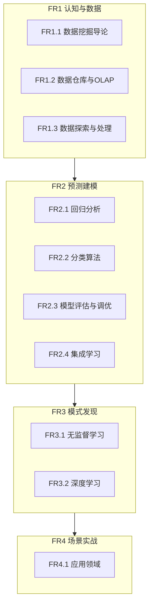

# 需求规格说明书

> 📚 [文档中心](./README.md) | ⬅ [项目概述](./03-项目概述.md) | 📍 需求规格说明书 | ➡ [架构设计](./05-架构设计文档.md) | 🏠 [项目首页](../readme.md)

---

## 1. 引言

### 1.1 编写目的

本文档定义 Python 数据挖掘学习路径项目的功能需求和非功能需求，明确项目覆盖的知识体系范围。

### 1.2 项目范围

本项目覆盖数据挖掘核心知识体系，从数据仓库到深度学习，从基础算法到行业应用，共4阶段10模块30+子方向。

---

## 2. 功能需求

### 2.1 功能需求概览

### 2.2 FR1 认知与数据

| 需求编号 | 需求名称 | 说明 | 源码位置 |
|---------|---------|------|----------|
| FR1.1 | 数据挖掘导论 | CRISP-DM流程、任务分类、数据类型、距离度量 | 00_数据挖掘导论/数据挖掘导论.py |
| FR1.2 | 数据仓库与OLAP | 数据仓库架构、多维数据模型、ETL、OLAP操作 | 01_数据仓库与OLAP/ |
| FR1.3 | 数据探索与处理 | 预处理、特征工程、数据可视化 | 02_数据探索与处理/ |

### 2.3 FR2 预测建模

| 需求编号 | 需求名称 | 说明 | 源码位置 |
|---------|---------|------|----------|
| FR2.1 | 回归分析 | 线性回归、逻辑回归、正则化 | 03_回归分析/ |
| FR2.2 | 分类算法 | KNN、朴素贝叶斯、决策树、SVM、半监督学习 | 04_分类算法/ |
| FR2.3 | 模型评估与调优 | 评估指标、交叉验证、网格搜索、不平衡处理 | 05_模型评估与调优/ |
| FR2.4 | 集成学习 | Bagging、Boosting、Stacking | 06_集成学习/集成学习.py |

### 2.4 FR3 模式发现

| 需求编号 | 需求名称 | 说明 | 源码位置 |
|---------|---------|------|----------|
| FR3.1 | 无监督学习 | 聚类、关联规则、降维、异常检测 | 07_无监督学习/ |
| FR3.2 | 深度学习 | 神经网络基础、CNN文本分类 | 08_深度学习/ |

### 2.5 FR4 场景实战

| 需求编号 | 需求名称 | 说明 | 源码位置 |
|---------|---------|------|----------|
| FR4.1 | 自然语言处理 | 分词、TF-IDF、情感分析、主题模型 | 09_应用领域/01_自然语言处理/ |
| FR4.2 | 时间序列分析 | 平稳性检验、ARIMA、指数平滑 | 09_应用领域/02_时间序列分析/ |
| FR4.3 | 推荐系统 | 协同过滤、矩阵分解、NDCG评估 | 09_应用领域/03_推荐系统/ |
| FR4.4 | 图与网络挖掘 | PageRank、社区发现、链接预测 | 09_应用领域/04_图与网络挖掘/ |
| FR4.5 | Web挖掘 | PageRank/HITS、TF-IDF内容、日志模式 | 09_应用领域/05_Web挖掘/ |
| FR4.6 | 流数据挖掘 | 滑动窗口、概念漂移、在线聚类 | 09_应用领域/06_流数据挖掘/ |

---

## 3. 非功能需求

| 编号 | 需求 | 说明 |
|------|------|------|
| NFR1 | 独立可运行 | 每个 .py 文件可独立运行，无跨模块依赖 |
| NFR2 | 自包含数据 | 所有示例数据内嵌代码，无需额外数据文件 |
| NFR3 | 教学注释 | 关键算法含详细中文注释和直觉解释 |
| NFR4 | 手动实现优先 | 核心算法先手动实现，再对比sklearn |
| NFR5 | 可视化充分 | 每个模块包含 Matplotlib 可视化输出 |

---

## 4. 知识体系覆盖矩阵

> 对标 Han & Kamber《数据挖掘：概念与技术》第3版

| 教材章节 | 主题 | 本项目覆盖模块 |
|---------|------|--------------|
| 第1章 | 引言 | 00_数据挖掘导论 |
| 第2章 | 数据 | 02_数据探索与处理 |
| 第3章 | 数据仓库 | 01_数据仓库与OLAP |
| 第4章 | 数据预处理 | 02_数据探索与处理/01_数据预处理与特征工程 |
| 第6章 | 分类：基本概念 | 04_分类算法/01_K近邻算法、02_朴素贝叶斯 |
| 第7章 | 分类：高级方法 | 04_分类算法/03_决策树、04_支持向量机 |
| 第8章 | 聚类 | 07_无监督学习/01_聚类分析 |
| 第9章 | 异常检测 | 07_无监督学习/04_异常检测 |
| 第10章 | 回归 | 03_回归分析 |
| 第11章 | 频繁模式挖掘 | 07_无监督学习/02_关联规则挖掘 |
| — | 集成学习 | 06_集成学习 |
| — | 深度学习 | 08_深度学习 |
| — | 模型评估 | 05_模型评估与调优 |
| — | 应用领域 | 09_应用领域 |
