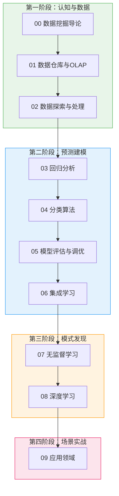
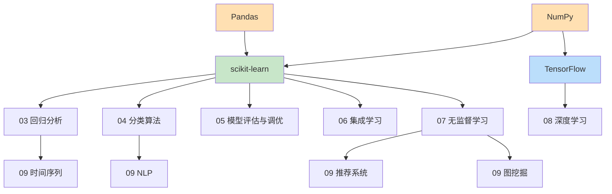
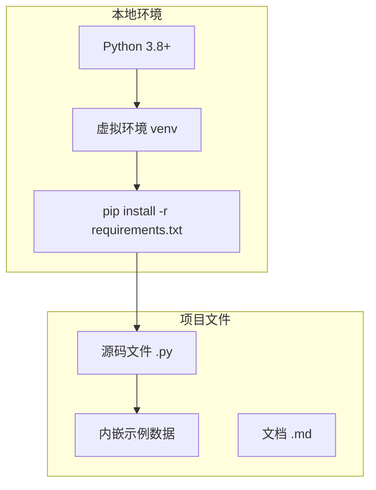

# 架构设计文档

> 📚 [文档中心](./README.md) | ⬅ [需求规格](./04-需求规格说明书.md) | 📍 架构设计 | ➡ [详细设计](./06-详细设计文档.md) | 🏠 [项目首页](../readme.md)

---

## 1. 系统架构

### 1.1 4阶段学习架构

### 1.2 架构原则

| 原则 | 说明 |
|------|------|
| 独立运行 | 每个模块无跨模块依赖，可单独学习 |
| 编号即顺序 | 目录/文件编号直接映射学习顺序 |
| 渐进深入 | 从概念→算法→评估→应用的递进结构 |
| 双线并行 | 每个算法先手动实现，再对比sklearn |

---

## 2. 模块图

```mermaid
graph LR
    subgraph 认知与数据
        A1["00 数据挖掘导论<br/>CRISP-DM/距离度量"]
        A2["01 数据仓库与OLAP<br/>ETL/OLAP操作"]
        A3["02 数据探索与处理<br/>预处理/特征工程/可视化"]
    end

    subgraph 预测建模
        B1["03 回归分析<br/>线性回归/逻辑回归"]
        B2["04 分类算法<br/>KNN/贝叶斯/决策树/SVM"]
        B3["05 模型评估与调优<br/>评估指标/不平衡处理"]
        B4["06 集成学习<br/>Bagging/Boosting/Stacking"]
    end

    subgraph 模式发现
        C1["07 无监督学习<br/>聚类/关联/降维/异常"]
        C2["08 深度学习<br/>神经网络/CNN"]
    end

    subgraph 场景实战
        D1["09 应用领域<br/>NLP/时序/推荐/图/Web/流"]
    end

    A1 --> A2 --> A3 --> B1
    B1 --> B2 --> B3 --> B4
    B4 --> C1 --> C2
    C2 --> D1
```

---

## 3. 依赖关系图

---

## 4. 部署图

项目为纯 Python 脚本集，无需服务器部署，本地运行即可。
