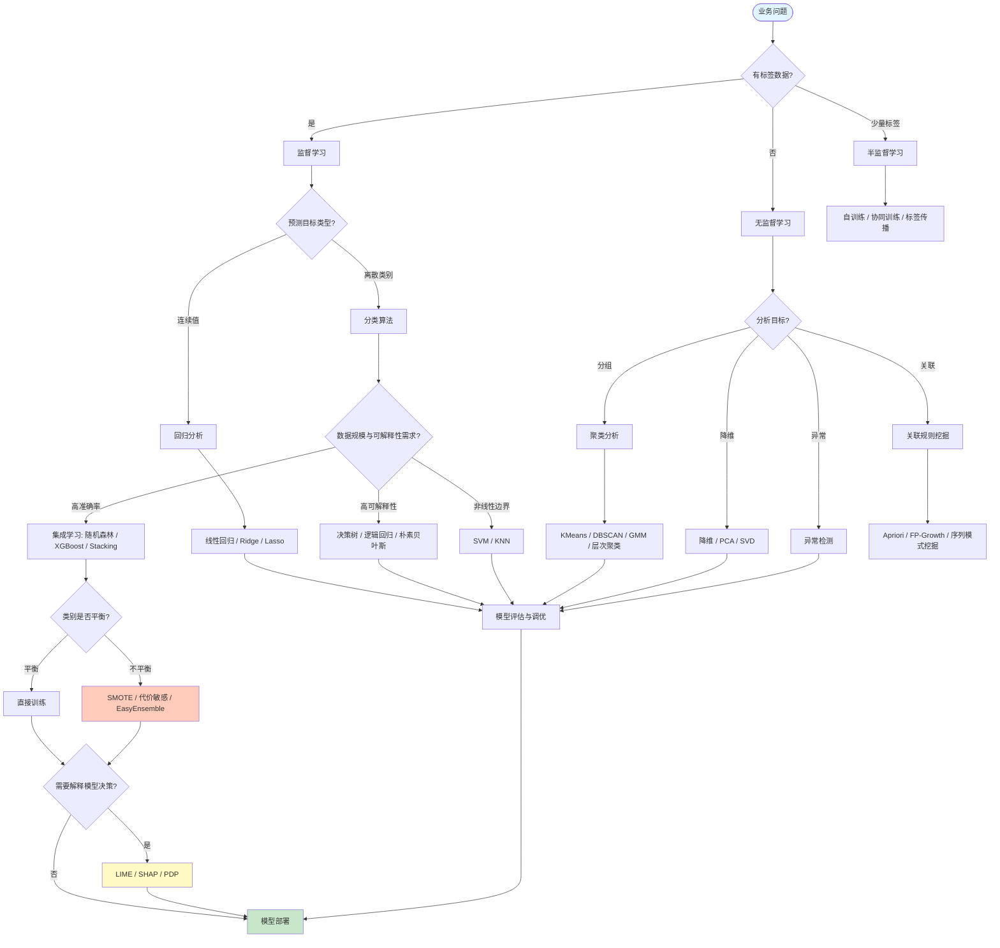
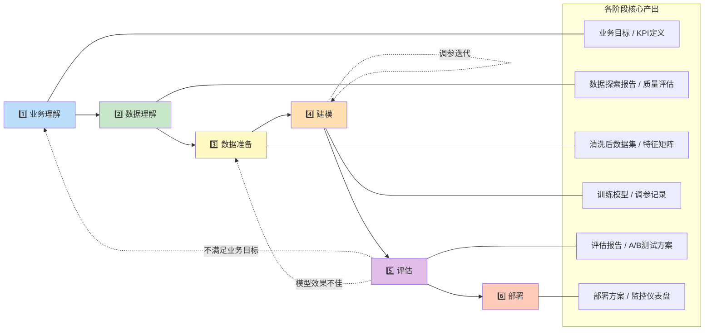
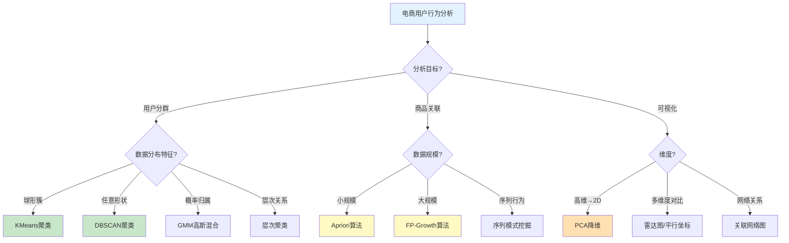
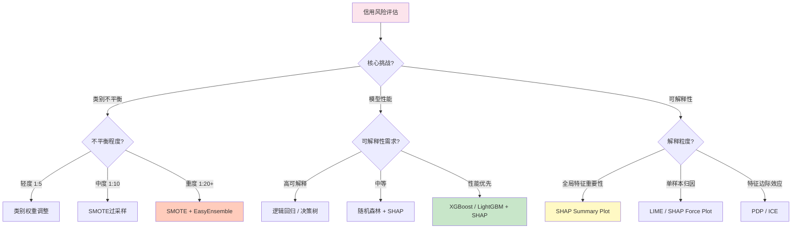
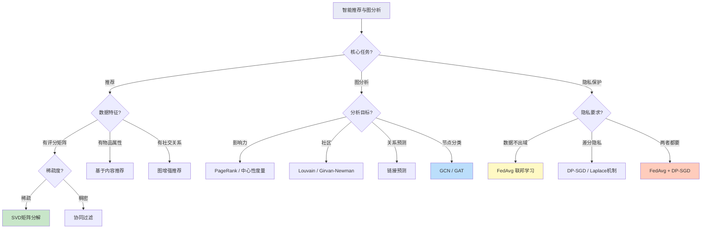
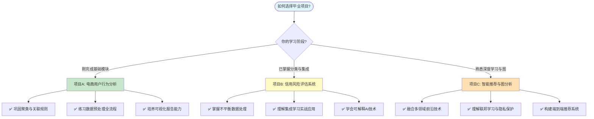

# 毕业项目

> 🏠 [项目首页](../README.md) | 📚 [文档中心](./README.md) | ⬅ [练习与自检](./05-练习与自检.md) | 📍 毕业项目 | ➡ [架构设计与知识体系图解](./07-架构设计与知识体系图解.md)

---

本文档提供三个综合实战项目，覆盖基础→进阶→高级三个难度层级，引导你将本项目中学习的 115+ 算法融会贯通，完成从业务理解到模型部署的完整数据挖掘流程。

---

## 📋 项目总览

| 项目 | 难度 | 应用场景 | 核心技术栈 | 预计工时 |
|------|------|----------|------------|----------|
| **项目A** 电商用户行为分析 | ⭐ 基础 | 用户画像与营销 | 聚类 + 关联规则 + 可视化 | 2~3 天 |
| **项目B** 信用风险评估系统 | ⭐⭐ 进阶 | 金融风控 | 分类 + 集成学习 + 可解释AI + 不平衡处理 | 4~5 天 |
| **项目C** 智能推荐与图分析 | ⭐⭐⭐ 高级 | 推荐与社交网络 | 推荐系统 + 图神经网络 + 联邦学习 | 6~8 天 |

---

## 🗺️ 数据挖掘方法选择指南

从业务问题出发，选择合适的算法组合：

---

## 🔄 从需求到部署的完整流程

展示 CRISP-DM 在真实项目中的应用：

---

## 🅰️ 项目A：电商用户行为分析（基础）

### 项目背景与目标

电商平台积累了大量用户浏览、点击、购买行为数据。本项目通过聚类分析识别用户群体，利用关联规则挖掘商品搭配模式，结合可视化呈现用户画像，为精准营销提供数据支撑。

**核心目标：**
- 将用户划分为不同行为群体（高价值/低价值/潜力用户等）
- 发现商品间的关联购买模式
- 构建用户行为可视化仪表盘

### 数据描述

使用 `sklearn` 合成数据模拟电商场景：

| 数据集 | 来源 | 规模 | 特征说明 |
|--------|------|------|----------|
| 用户行为数据 | `make_blobs` 合成 | 1000 用户 × 8 特征 | 浏览时长、点击次数、购买频次、客单价、退货率、活跃天数、收藏数、分享数 |
| 交易流水数据 | 手动合成 | 5000 笔交易 | 每笔交易包含 1~8 个商品SKU |

### 任务分解（CRISP-DM）

#### 1️⃣ 业务理解

| 任务 | 说明 |
|------|------|
| 明确分析目标 | 用户分群、商品关联、营销策略建议 |
| 定义成功标准 | 聚类轮廓系数 > 0.5，关联规则提升度 > 1.5 |
| 识别利益相关者 | 运营团队、产品经理、营销部门 |

#### 2️⃣ 数据理解

| 任务 | 说明 | 参考源码 |
|------|------|----------|
| 数据加载与概览 | 查看数据形状、类型、分布 | GitHub [数据预处理.py](../02_数据探索与处理/01_数据预处理与特征工程/数据预处理.py#L22) · VSCode [数据预处理.py](file:///d:/Dev/DevWorkSpace/VS%20Code/Python/python-data-mining/02_数据探索与处理/01_数据预处理与特征工程/数据预处理.py#L22) |
| 探索性数据分析 | 统计摘要、分布可视化 | GitHub [数据可视化.py](../02_数据探索与处理/02_数据可视化/数据可视化.py#L27) · VSCode [数据可视化.py](file:///d:/Dev/DevWorkSpace/VS%20Code/Python/python-data-mining/02_数据探索与处理/02_数据可视化/数据可视化.py#L27) |

#### 3️⃣ 数据准备

| 任务 | 说明 | 参考源码 |
|------|------|----------|
| 缺失值与异常值处理 | 清洗、填充、截断 | GitHub [数据预处理.py](../02_数据探索与处理/01_数据预处理与特征工程/数据预处理.py#L22) · VSCode [数据预处理.py](file:///d:/Dev/DevWorkSpace/VS%20Code/Python/python-data-mining/02_数据探索与处理/01_数据预处理与特征工程/数据预处理.py#L22) |
| 特征标准化 | StandardScaler / MinMaxScaler | GitHub [数据预处理.py](../02_数据探索与处理/01_数据预处理与特征工程/数据预处理.py#L14) · VSCode [数据预处理.py](file:///d:/Dev/DevWorkSpace/VS%20Code/Python/python-data-mining/02_数据探索与处理/01_数据预处理与特征工程/数据预处理.py#L14) |
| 特征选择与构造 | RFM模型特征构造 | GitHub [特征工程.py](../02_数据探索与处理/01_数据预处理与特征工程/特征工程.py#L27) · VSCode [特征工程.py](file:///d:/Dev/DevWorkSpace/VS%20Code/Python/python-data-mining/02_数据探索与处理/01_数据预处理与特征工程/特征工程.py#L27) |

#### 4️⃣ 建模

| 任务 | 说明 | 参考源码 |
|------|------|----------|
| K-Means 用户聚类 | 手动实现 + sklearn对比 | GitHub [KMeans聚类.py](../07_无监督学习/01_聚类分析/KMeans聚类.py#L29) · VSCode [KMeans聚类.py](file:///d:/Dev/DevWorkSpace/VS%20Code/Python/python-data-mining/07_无监督学习/01_聚类分析/KMeans聚类.py#L29) |
| 肘部法则与轮廓系数 | 确定最优K值 | GitHub [KMeans聚类.py](../07_无监督学习/01_聚类分析/KMeans聚类.py#L6) · VSCode [KMeans聚类.py](file:///d:/Dev/DevWorkSpace/VS%20Code/Python/python-data-mining/07_无监督学习/01_聚类分析/KMeans聚类.py#L6) |
| DBSCAN 密度聚类 | 发现任意形状簇 | GitHub [高级聚类.py](../07_无监督学习/01_聚类分析/高级聚类.py#L30) · VSCode [高级聚类.py](file:///d:/Dev/DevWorkSpace/VS%20Code/Python/python-data-mining/07_无监督学习/01_聚类分析/高级聚类.py#L30) |
| Apriori 关联规则 | 商品搭配挖掘 | GitHub [Apriori.py](../07_无监督学习/02_关联规则挖掘/01_Apriori算法/Apriori.py#L1) · VSCode [Apriori.py](file:///d:/Dev/DevWorkSpace/VS%20Code/Python/python-data-mining/07_无监督学习/02_关联规则挖掘/01_Apriori算法/Apriori.py#L1) |
| FP-Growth 关联规则 | 高效频繁项集挖掘 | GitHub [FP_Growth算法.py](../07_无监督学习/02_关联规则挖掘/02_FPGrowth算法/FP_Growth算法.py#L18) · VSCode [FP_Growth算法.py](file:///d:/Dev/DevWorkSpace/VS%20Code/Python/python-data-mining/07_无监督学习/02_关联规则挖掘/02_FPGrowth算法/FP_Growth算法.py#L18) |
| PCA 降维可视化 | 高维数据2D/3D投影 | GitHub [PCA.py](../07_无监督学习/03_降维与矩阵分解/01_PCA主成分分析/PCA.py#L1) · VSCode [PCA.py](file:///d:/Dev/DevWorkSpace/VS%20Code/Python/python-data-mining/07_无监督学习/03_降维与矩阵分解/01_PCA主成分分析/PCA.py#L1) |

#### 5️⃣ 评估

| 任务 | 说明 | 参考源码 |
|------|------|----------|
| 聚类质量评估 | 轮廓系数、CH指数 | GitHub [KMeans聚类.py](../07_无监督学习/01_聚类分析/KMeans聚类.py#L19) · VSCode [KMeans聚类.py](file:///d:/Dev/DevWorkSpace/VS%20Code/Python/python-data-mining/07_无监督学习/01_聚类分析/KMeans聚类.py#L19) |
| 关联规则评估 | 支持度、置信度、提升度 | GitHub [Apriori.py](../07_无监督学习/02_关联规则挖掘/01_Apriori算法/Apriori.py#L1) · VSCode [Apriori.py](file:///d:/Dev/DevWorkSpace/VS%20Code/Python/python-data-mining/07_无监督学习/02_关联规则挖掘/01_Apriori算法/Apriori.py#L1) |
| 业务指标验证 | 群体差异显著性、规则可操作性 | — |

#### 6️⃣ 部署

| 任务 | 说明 |
|------|------|
| 结果输出 | 用户分群标签表、关联规则清单 |
| 可视化报告 | 用户画像雷达图、商品关联网络图 |
| 策略建议 | 按群体制定差异化营销策略 |

### 评估指标

| 维度 | 指标 | 目标值 |
|------|------|--------|
| 聚类质量 | 轮廓系数 (Silhouette Score) | > 0.5 |
| 聚类质量 | Calinski-Harabasz 指数 | 越大越好 |
| 关联规则 | 最小支持度 | ≥ 0.05 |
| 关联规则 | 最小置信度 | ≥ 0.6 |
| 关联规则 | 提升度 (Lift) | > 1.5 |
| 业务价值 | 群体间特征差异显著性 | p < 0.05 |

### 方法选择指南

---

## 🅱️ 项目B：信用风险评估系统（进阶）

### 项目背景与目标

金融机构在发放贷款时需要评估借款人的违约风险。本项目构建信用风险评估系统，处理类别不平衡问题，利用集成学习提升预测性能，并通过可解释AI技术让模型决策透明化，满足金融监管合规要求。

**核心目标：**
- 构建高召回率的违约预测模型（宁可误拒，不可漏判）
- 处理正负样本严重不平衡（违约率通常 < 5%）
- 提供可解释的风险评估报告

### 数据描述

| 数据集 | 来源 | 规模 | 特征说明 |
|--------|------|------|----------|
| 信用数据集 | `sklearn.datasets.load_breast_cancer`（类比） | 569 样本 × 30 特征 | 模拟信用评分特征（收入、负债比、信用历史等） |
| 不平衡合成数据 | `make_classification` | 10000 样本 × 20 特征 | 正负比 1:20，模拟真实违约场景 |

### 任务分解（CRISP-DM）

#### 1️⃣ 业务理解

| 任务 | 说明 |
|------|------|
| 明确业务目标 | 预测借款人是否违约，最小化漏判率 |
| 定义代价矩阵 | 漏判违约（FN）代价远高于误拒（FP） |
| 合规要求 | 模型决策可解释，满足公平信贷法规 |
| 定义成功标准 | 召回率 > 0.85，AUC > 0.90，SHAP可解释 |

#### 2️⃣ 数据理解

| 任务 | 说明 | 参考源码 |
|------|------|----------|
| 数据加载与概览 | 特征分布、缺失率、类别分布 | GitHub [数据预处理.py](../02_数据探索与处理/01_数据预处理与特征工程/数据预处理.py#L22) · VSCode [数据预处理.py](file:///d:/Dev/DevWorkSpace/VS%20Code/Python/python-data-mining/02_数据探索与处理/01_数据预处理与特征工程/数据预处理.py#L22) |
| 类别不平衡分析 | 正负样本比、少数类分布 | GitHub [类别不平衡处理.py](../05_模型评估与调优/02_类别不平衡处理.py#L1) · VSCode [类别不平衡处理.py](file:///d:/Dev/DevWorkSpace/VS%20Code/Python/python-data-mining/05_模型评估与调优/02_类别不平衡处理.py#L1) |
| 特征相关性分析 | 共线性检测、与标签的相关性 | GitHub [特征工程.py](../02_数据探索与处理/01_数据预处理与特征工程/特征工程.py#L1) · VSCode [特征工程.py](file:///d:/Dev/DevWorkSpace/VS%20Code/Python/python-data-mining/02_数据探索与处理/01_数据预处理与特征工程/特征工程.py#L1) |

#### 3️⃣ 数据准备

| 任务 | 说明 | 参考源码 |
|------|------|----------|
| 缺失值处理 | 数值型中位数填充、类别型众数填充 | GitHub [数据预处理.py](../02_数据探索与处理/01_数据预处理与特征工程/数据预处理.py#L18) · VSCode [数据预处理.py](file:///d:/Dev/DevWorkSpace/VS%20Code/Python/python-data-mining/02_数据探索与处理/01_数据预处理与特征工程/数据预处理.py#L18) |
| 特征编码 | One-Hot / Label Encoding | GitHub [数据预处理.py](../02_数据探索与处理/01_数据预处理与特征工程/数据预处理.py#L15) · VSCode [数据预处理.py](file:///d:/Dev/DevWorkSpace/VS%20Code/Python/python-data-mining/02_数据探索与处理/01_数据预处理与特征工程/数据预处理.py#L15) |
| 过采样平衡 | SMOTE / ADASYN | GitHub [类别不平衡处理.py](../05_模型评估与调优/02_类别不平衡处理.py#L6) · VSCode [类别不平衡处理.py](file:///d:/Dev/DevWorkSpace/VS%20Code/Python/python-data-mining/05_模型评估与调优/02_类别不平衡处理.py#L6) |
| 欠采样平衡 | RandomUnderSampler / Tomek Links | GitHub [类别不平衡处理.py](../05_模型评估与调优/02_类别不平衡处理.py#L8) · VSCode [类别不平衡处理.py](file:///d:/Dev/DevWorkSpace/VS%20Code/Python/python-data-mining/05_模型评估与调优/02_类别不平衡处理.py#L8) |
| 特征选择 | 方差阈值 + 互信息 + RFE | GitHub [特征工程.py](../02_数据探索与处理/01_数据预处理与特征工程/特征工程.py#L30) · VSCode [特征工程.py](file:///d:/Dev/DevWorkSpace/VS%20Code/Python/python-data-mining/02_数据探索与处理/01_数据预处理与特征工程/特征工程.py#L30) |

#### 4️⃣ 建模

| 任务 | 说明 | 参考源码 |
|------|------|----------|
| 基线模型：逻辑回归 | 可解释的线性基线 | GitHub [逻辑回归.py](../03_回归分析/02_逻辑回归.py#L1) · VSCode [逻辑回归.py](file:///d:/Dev/DevWorkSpace/VS%20Code/Python/python-data-mining/03_回归分析/02_逻辑回归.py#L1) |
| 基线模型：决策树 | 规则可解释基线 | GitHub [trees.py](../04_分类算法/03_决策树/01_ID3决策树/trees.py#L1) · VSCode [trees.py](file:///d:/Dev/DevWorkSpace/VS%20Code/Python/python-data-mining/04_分类算法/03_决策树/01_ID3决策树/trees.py#L1) |
| 集成模型：随机森林 | Bagging代表 | GitHub [集成学习.py](../06_集成学习/集成学习.py#L5) · VSCode [集成学习.py](file:///d:/Dev/DevWorkSpace/VS%20Code/Python/python-data-mining/06_集成学习/集成学习.py#L5) |
| 集成模型：XGBoost/LightGBM | Boosting代表 | GitHub [现代梯度提升.py](../06_集成学习/02_现代梯度提升/现代梯度提升.py#L1) · VSCode [现代梯度提升.py](file:///d:/Dev/DevWorkSpace/VS%20Code/Python/python-data-mining/06_集成学习/02_现代梯度提升/现代梯度提升.py#L1) |
| 集成模型：Stacking | 多模型堆叠 | GitHub [集成学习.py](../06_集成学习/集成学习.py#L8) · VSCode [集成学习.py](file:///d:/Dev/DevWorkSpace/VS%20Code/Python/python-data-mining/06_集成学习/集成学习.py#L8) |
| 代价敏感学习 | 调整类别权重 | GitHub [类别不平衡处理.py](../05_模型评估与调优/02_类别不平衡处理.py#L9) · VSCode [类别不平衡处理.py](file:///d:/Dev/DevWorkSpace/VS%20Code/Python/python-data-mining/05_模型评估与调优/02_类别不平衡处理.py#L9) |
| EasyEnsemble 集成 | 不平衡专用集成 | GitHub [类别不平衡处理.py](../05_模型评估与调优/02_类别不平衡处理.py#L10) · VSCode [类别不平衡处理.py](file:///d:/Dev/DevWorkSpace/VS%20Code/Python/python-data-mining/05_模型评估与调优/02_类别不平衡处理.py#L10) |

#### 5️⃣ 评估

| 任务 | 说明 | 参考源码 |
|------|------|----------|
| 分类指标评估 | Precision / Recall / F1 / AUC | GitHub [模型评估与调优.py](../05_模型评估与调优/01_模型评估与调优.py#L5) · VSCode [模型评估与调优.py](file:///d:/Dev/DevWorkSpace/VS%20Code/Python/python-data-mining/05_模型评估与调优/01_模型评估与调优.py#L5) |
| 交叉验证 | 分层K折交叉验证 | GitHub [模型评估与调优.py](../05_模型评估与调优/01_模型评估与调优.py#L7) · VSCode [模型评估与调优.py](file:///d:/Dev/DevWorkSpace/VS%20Code/Python/python-data-mining/05_模型评估与调优/01_模型评估与调优.py#L7) |
| 超参调优 | GridSearch / RandomSearch | GitHub [模型评估与调优.py](../05_模型评估与调优/01_模型评估与调优.py#L8) · VSCode [模型评估与调优.py](file:///d:/Dev/DevWorkSpace/VS%20Code/Python/python-data-mining/05_模型评估与调优/01_模型评估与调优.py#L8) |
| LIME 局部解释 | 单笔贷款风险归因 | GitHub [可解释AI.py](../05_模型评估与调优/03_可解释AI/可解释AI.py#L6) · VSCode [可解释AI.py](file:///d:/Dev/DevWorkSpace/VS%20Code/Python/python-data-mining/05_模型评估与调优/03_可解释AI/可解释AI.py#L6) |
| SHAP 全局解释 | 特征重要性排序 | GitHub [可解释AI.py](../05_模型评估与调优/03_可解释AI/可解释AI.py#L7) · VSCode [可解释AI.py](file:///d:/Dev/DevWorkSpace/VS%20Code/Python/python-data-mining/05_模型评估与调优/03_可解释AI/可解释AI.py#L7) |
| PDP 部分依赖 | 关键特征边际效应 | GitHub [可解释AI.py](../05_模型评估与调优/03_可解释AI/可解释AI.py#L8) · VSCode [可解释AI.py](file:///d:/Dev/DevWorkSpace/VS%20Code/Python/python-data-mining/05_模型评估与调优/03_可解释AI/可解释AI.py#L8) |

#### 6️⃣ 部署

| 任务 | 说明 |
|------|------|
| 风险评分输出 | 0~100风险评分 + 风险等级（低/中/高） |
| 可解释报告 | 每笔申请的SHAP归因图 + 决策理由 |
| 监控指标 | 模型漂移检测、PSI指标、召回率监控 |
| 合规审计 | 模型决策日志、公平性检验 |

### 评估指标

| 维度 | 指标 | 目标值 | 说明 |
|------|------|--------|------|
| 分类性能 | Recall（召回率） | > 0.85 | 违约样本的识别率，金融场景最关键 |
| 分类性能 | AUC-ROC | > 0.90 | 整体判别能力 |
| 分类性能 | F1-Score | > 0.70 | 精确率与召回率的调和 |
| 分类性能 | Precision@Recall=0.85 | 尽量高 | 在满足召回率前提下的精确率 |
| 不平衡处理 | 少数类 F1 | > 0.60 | 违约类的F1 |
| 可解释性 | SHAP一致性 | — | 局部与全局解释不矛盾 |
| 业务价值 | 预期损失降低率 | > 20% | 相比规则引擎的改进 |

### 方法选择指南

---

## 🅲 项目C：智能推荐与图分析（高级）

### 项目背景与目标

社交电商平台需要同时解决推荐与社交网络分析两大问题。本项目融合推荐系统、图神经网络和联邦学习三大前沿方向，构建隐私保护下的智能推荐与图分析系统。

**核心目标：**
- 构建多策略融合推荐系统（协同过滤 + 内容推荐 + 图增强）
- 利用图神经网络捕获社交关系中的高阶结构信息
- 在联邦学习框架下实现隐私保护的模型训练

### 数据描述

| 数据集 | 来源 | 规模 | 特征说明 |
|--------|------|------|----------|
| 用户-物品评分矩阵 | 手动合成 | 200 用户 × 50 物品 | 评分 1~5，稀疏度约 85% |
| 社交网络图 | `networkx` 合成 | 200 节点 / ~800 边 | 用户社交关系（关注/好友） |
| 物品属性表 | 手动合成 | 50 物品 × 10 特征 | 类别、价格、品牌等 |
| 联邦训练数据 | `make_classification` 合成 | 5 客户端各 2000 样本 | Non-IID 分布模拟 |

### 任务分解（CRISP-DM）

#### 1️⃣ 业务理解

| 任务 | 说明 |
|------|------|
| 明确业务目标 | 提升推荐点击率、发现社交影响力节点、隐私合规推荐 |
| 定义成功标准 | NDCG@10 > 0.6，社区发现ARI > 0.7，联邦学习精度损失 < 5% |
| 隐私约束 | 用户数据不出本地，满足数据安全法规 |
| 识别利益相关者 | 推荐团队、社交产品线、法务合规部门 |

#### 2️⃣ 数据理解

| 任务 | 说明 | 参考源码 |
|------|------|----------|
| 评分矩阵分析 | 稀疏度、评分分布、冷启动比例 | GitHub [推荐系统.py](../09_应用领域/03_推荐系统/推荐系统.py#L27) · VSCode [推荐系统.py](file:///d:/Dev/DevWorkSpace/VS%20Code/Python/python-data-mining/09_应用领域/03_推荐系统/推荐系统.py#L27) |
| 社交网络分析 | 度分布、连通分量、社区结构 | GitHub [图与网络挖掘.py](../09_应用领域/04_图与网络挖掘/图与网络挖掘.py#L27) · VSCode [图与网络挖掘.py](file:///d:/Dev/DevWorkSpace/VS%20Code/Python/python-data-mining/09_应用领域/04_图与网络挖掘/图与网络挖掘.py#L27) |
| 物品属性分析 | 类别分布、特征覆盖度 | GitHub [特征工程.py](../02_数据探索与处理/01_数据预处理与特征工程/特征工程.py#L1) · VSCode [特征工程.py](file:///d:/Dev/DevWorkSpace/VS%20Code/Python/python-data-mining/02_数据探索与处理/01_数据预处理与特征工程/特征工程.py#L1) |

#### 3️⃣ 数据准备

| 任务 | 说明 | 参考源码 |
|------|------|----------|
| 评分矩阵填充 | 均值填充 / SVD分解 | GitHub [SVD.py](../07_无监督学习/03_降维与矩阵分解/02_SVD推荐系统/SVD.py#L24) · VSCode [SVD.py](file:///d:/Dev/DevWorkSpace/VS%20Code/Python/python-data-mining/07_无监督学习/03_降维与矩阵分解/02_SVD推荐系统/SVD.py#L24) |
| 图数据构建 | 邻接矩阵、特征矩阵、度矩阵 | GitHub [图神经网络.py](../09_应用领域/04_图与网络挖掘/02_图神经网络/图神经网络.py#L28) · VSCode [图神经网络.py](file:///d:/Dev/DevWorkSpace/VS%20Code/Python/python-data-mining/09_应用领域/04_图与网络挖掘/02_图神经网络/图神经网络.py#L28) |
| Non-IID数据划分 | Dirichlet分布划分联邦客户端数据 | GitHub [联邦学习与隐私保护.py](../09_应用领域/07_联邦学习与隐私保护/联邦学习与隐私保护.py#L8) · VSCode [联邦学习与隐私保护.py](file:///d:/Dev/DevWorkSpace/VS%20Code/Python/python-data-mining/09_应用领域/07_联邦学习与隐私保护/联邦学习与隐私保护.py#L8) |
| 特征工程 | 文本特征TF-IDF、类别编码 | GitHub [特征工程.py](../02_数据探索与处理/01_数据预处理与特征工程/特征工程.py#L24) · VSCode [特征工程.py](file:///d:/Dev/DevWorkSpace/VS%20Code/Python/python-data-mining/02_数据探索与处理/01_数据预处理与特征工程/特征工程.py#L24) |

#### 4️⃣ 建模

| 任务 | 说明 | 参考源码 |
|------|------|----------|
| 协同过滤推荐 | 用户-based / 物品-based | GitHub [推荐系统.py](../09_应用领域/03_推荐系统/推荐系统.py#L5) · VSCode [推荐系统.py](file:///d:/Dev/DevWorkSpace/VS%20Code/Python/python-data-mining/09_应用领域/03_推荐系统/推荐系统.py#L5) |
| SVD矩阵分解推荐 | 隐语义模型 | GitHub [推荐系统.py](../09_应用领域/03_推荐系统/推荐系统.py#L6) · VSCode [推荐系统.py](file:///d:/Dev/DevWorkSpace/VS%20Code/Python/python-data-mining/09_应用领域/03_推荐系统/推荐系统.py#L6) |
| 基于内容推荐 | 物品特征相似度 | GitHub [推荐系统.py](../09_应用领域/03_推荐系统/推荐系统.py#L7) · VSCode [推荐系统.py](file:///d:/Dev/DevWorkSpace/VS%20Code/Python/python-data-mining/09_应用领域/03_推荐系统/推荐系统.py#L7) |
| GCN 图卷积网络 | 社交关系增强推荐 | GitHub [图神经网络.py](../09_应用领域/04_图与网络挖掘/02_图神经网络/图神经网络.py#L6) · VSCode [图神经网络.py](file:///d:/Dev/DevWorkSpace/VS%20Code/Python/python-data-mining/09_应用领域/04_图与网络挖掘/02_图神经网络/图神经网络.py#L6) |
| GAT 图注意力网络 | 注意力加权邻居聚合 | GitHub [图神经网络.py](../09_应用领域/04_图与网络挖掘/02_图神经网络/图神经网络.py#L7) · VSCode [图神经网络.py](file:///d:/Dev/DevWorkSpace/VS%20Code/Python/python-data-mining/09_应用领域/04_图与网络挖掘/02_图神经网络/图神经网络.py#L7) |
| PageRank 影响力分析 | 节点重要性排序 | GitHub [图与网络挖掘.py](../09_应用领域/04_图与网络挖掘/图与网络挖掘.py#L8) · VSCode [图与网络挖掘.py](file:///d:/Dev/DevWorkSpace/VS%20Code/Python/python-data-mining/09_应用领域/04_图与网络挖掘/图与网络挖掘.py#L8) |
| 社区发现 | Louvain / Girvan-Newman | GitHub [图与网络挖掘.py](../09_应用领域/04_图与网络挖掘/图与网络挖掘.py#L9) · VSCode [图与网络挖掘.py](file:///d:/Dev/DevWorkSpace/VS%20Code/Python/python-data-mining/09_应用领域/04_图与网络挖掘/图与网络挖掘.py#L9) |
| 链接预测 | 社交关系预测 | GitHub [图与网络挖掘.py](../09_应用领域/04_图与网络挖掘/图与网络挖掘.py#L10) · VSCode [图与网络挖掘.py](file:///d:/Dev/DevWorkSpace/VS%20Code/Python/python-data-mining/09_应用领域/04_图与网络挖掘/图与网络挖掘.py#L10) |
| FedAvg 联邦训练 | 多客户端聚合训练 | GitHub [联邦学习与隐私保护.py](../09_应用领域/07_联邦学习与隐私保护/联邦学习与隐私保护.py#L7) · VSCode [联邦学习与隐私保护.py](file:///d:/Dev/DevWorkSpace/VS%20Code/Python/python-data-mining/09_应用领域/07_联邦学习与隐私保护/联邦学习与隐私保护.py#L7) |
| 差分隐私保护 | Laplace / Gaussian 机制 | GitHub [联邦学习与隐私保护.py](../09_应用领域/07_联邦学习与隐私保护/联邦学习与隐私保护.py#L9) · VSCode [联邦学习与隐私保护.py](file:///d:/Dev/DevWorkSpace/VS%20Code/Python/python-data-mining/09_应用领域/07_联邦学习与隐私保护/联邦学习与隐私保护.py#L9) |
| DP-SGD 训练 | 差分隐私随机梯度下降 | GitHub [联邦学习与隐私保护.py](../09_应用领域/07_联邦学习与隐私保护/联邦学习与隐私保护.py#L10) · VSCode [联邦学习与隐私保护.py](file:///d:/Dev/DevWorkSpace/VS%20Code/Python/python-data-mining/09_应用领域/07_联邦学习与隐私保护/联邦学习与隐私保护.py#L10) |

#### 5️⃣ 评估

| 任务 | 说明 | 参考源码 |
|------|------|----------|
| 推荐系统评估 | Precision@K / Recall@K / NDCG / MAP | GitHub [推荐系统.py](../09_应用领域/03_推荐系统/推荐系统.py#L8) · VSCode [推荐系统.py](file:///d:/Dev/DevWorkSpace/VS%20Code/Python/python-data-mining/09_应用领域/03_推荐系统/推荐系统.py#L8) |
| 图模型评估 | 节点分类准确率 / ARI | GitHub [图神经网络.py](../09_应用领域/04_图与网络挖掘/02_图神经网络/图神经网络.py#L9) · VSCode [图神经网络.py](file:///d:/Dev/DevWorkSpace/VS%20Code/Python/python-data-mining/09_应用领域/04_图与网络挖掘/02_图神经网络/图神经网络.py#L9) |
| 联邦学习评估 | 全局模型精度 / 客户端精度方差 | GitHub [联邦学习与隐私保护.py](../09_应用领域/07_联邦学习与隐私保护/联邦学习与隐私保护.py#L11) · VSCode [联邦学习与隐私保护.py](file:///d:/Dev/DevWorkSpace/VS%20Code/Python/python-data-mining/09_应用领域/07_联邦学习与隐私保护/联邦学习与隐私保护.py#L11) |
| 隐私-效用权衡 | 精度 vs 隐私预算(ε)曲线 | GitHub [联邦学习与隐私保护.py](../09_应用领域/07_联邦学习与隐私保护/联邦学习与隐私保护.py#L12) · VSCode [联邦学习与隐私保护.py](file:///d:/Dev/DevWorkSpace/VS%20Code/Python/python-data-mining/09_应用领域/07_联邦学习与隐私保护/联邦学习与隐私保护.py#L12) |
| 交叉验证 | 分层K折 + 时间序列分割 | GitHub [模型评估与调优.py](../05_模型评估与调优/01_模型评估与调优.py#L7) · VSCode [模型评估与调优.py](file:///d:/Dev/DevWorkSpace/VS%20Code/Python/python-data-mining/05_模型评估与调优/01_模型评估与调优.py#L7) |

#### 6️⃣ 部署

| 任务 | 说明 |
|------|------|
| 推荐服务 | 实时推荐API（Top-N推荐列表） |
| 图分析服务 | 社区发现 / 影响力分析 / 链接预测 |
| 联邦训练平台 | 多客户端协同训练调度器 |
| 隐私审计 | 差分隐私预算追踪、合规报告 |
| 监控告警 | 推荐覆盖率、联邦收敛监控、隐私预算预警 |

### 评估指标

| 维度 | 指标 | 目标值 | 说明 |
|------|------|--------|------|
| 推荐精度 | NDCG@10 | > 0.60 | 排序质量 |
| 推荐精度 | Precision@10 | > 0.30 | Top-10推荐命中率 |
| 推荐覆盖 | Coverage | > 0.60 | 被推荐物品占总物品比例 |
| 推荐多样 | Diversity | > 0.50 | 推荐列表的多样性 |
| 图分析 | ARI（社区发现） | > 0.70 | 与真实社区的一致性 |
| 图分析 | 节点分类准确率 | > 0.80 | GCN/GAT节点分类 |
| 联邦学习 | 全局模型精度 | > 集中训练 × 0.95 | 联邦 vs 集中训练精度比 |
| 联邦学习 | 收敛轮次 | < 50 轮 | 达到目标精度的通信轮次 |
| 隐私保护 | 隐私预算 ε | < 10.0 | 差分隐私预算上限 |
| 隐私保护 | 精度损失 | < 5% | 加隐私保护后的精度下降 |

### 方法选择指南

---

## 📚 全部源码索引

以下是三个项目涉及的全部源码文件，按模块归类：

### 数据探索与处理

| 文件 | GitHub | VSCode |
|------|--------|--------|
| 数据预处理.py | [数据预处理.py](../02_数据探索与处理/01_数据预处理与特征工程/数据预处理.py) | [数据预处理.py](file:///d:/Dev/DevWorkSpace/VS%20Code/Python/python-data-mining/02_数据探索与处理/01_数据预处理与特征工程/数据预处理.py) |
| 特征工程.py | [特征工程.py](../02_数据探索与处理/01_数据预处理与特征工程/特征工程.py) | [特征工程.py](file:///d:/Dev/DevWorkSpace/VS%20Code/Python/python-data-mining/02_数据探索与处理/01_数据预处理与特征工程/特征工程.py) |
| 数据可视化.py | [数据可视化.py](../02_数据探索与处理/02_数据可视化/数据可视化.py) | [数据可视化.py](file:///d:/Dev/DevWorkSpace/VS%20Code/Python/python-data-mining/02_数据探索与处理/02_数据可视化/数据可视化.py) |

### 回归分析

| 文件 | GitHub | VSCode |
|------|--------|--------|
| 线性回归.py | [线性回归.py](../03_回归分析/01_线性回归.py) | [线性回归.py](file:///d:/Dev/DevWorkSpace/VS%20Code/Python/python-data-mining/03_回归分析/01_线性回归.py) |
| 逻辑回归.py | [逻辑回归.py](../03_回归分析/02_逻辑回归.py) | [逻辑回归.py](file:///d:/Dev/DevWorkSpace/VS%20Code/Python/python-data-mining/03_回归分析/02_逻辑回归.py) |

### 分类算法

| 文件 | GitHub | VSCode |
|------|--------|--------|
| K近邻算法.py | [K近邻算法.py](../04_分类算法/01_K近邻算法/K近邻算法.py) | [K近邻算法.py](file:///d:/Dev/DevWorkSpace/VS%20Code/Python/python-data-mining/04_分类算法/01_K近邻算法/K近邻算法.py) |
| 朴素贝叶斯算法.py | [朴素贝叶斯算法.py](../04_分类算法/02_朴素贝叶斯/朴素贝叶斯算法.py) | [朴素贝叶斯算法.py](file:///d:/Dev/DevWorkSpace/VS%20Code/Python/python-data-mining/04_分类算法/02_朴素贝叶斯/朴素贝叶斯算法.py) |
| trees.py (ID3决策树) | [trees.py](../04_分类算法/03_决策树/01_ID3决策树/trees.py) | [trees.py](file:///d:/Dev/DevWorkSpace/VS%20Code/Python/python-data-mining/04_分类算法/03_决策树/01_ID3决策树/trees.py) |
| C45决策树.py | [C45决策树.py](../04_分类算法/03_决策树/02_C45决策树/C45决策树.py) | [C45决策树.py](file:///d:/Dev/DevWorkSpace/VS%20Code/Python/python-data-mining/04_分类算法/03_决策树/02_C45决策树/C45决策树.py) |
| CART.py | [CART.py](../04_分类算法/03_决策树/03_CART回归树/CART.py) | [CART.py](file:///d:/Dev/DevWorkSpace/VS%20Code/Python/python-data-mining/04_分类算法/03_决策树/03_CART回归树/CART.py) |
| SVM算法.py | [SVM算法.py](../04_分类算法/04_支持向量机/SVM算法.py) | [SVM算法.py](file:///d:/Dev/DevWorkSpace/VS%20Code/Python/python-data-mining/04_分类算法/04_支持向量机/SVM算法.py) |
| 半监督学习与迁移学习.py | [半监督学习与迁移学习.py](../04_分类算法/05_半监督学习与迁移学习/半监督学习与迁移学习.py) | [半监督学习与迁移学习.py](file:///d:/Dev/DevWorkSpace/VS%20Code/Python/python-data-mining/04_分类算法/05_半监督学习与迁移学习/半监督学习与迁移学习.py) |

### 模型评估与调优

| 文件 | GitHub | VSCode |
|------|--------|--------|
| 模型评估与调优.py | [模型评估与调优.py](../05_模型评估与调优/01_模型评估与调优.py) | [模型评估与调优.py](file:///d:/Dev/DevWorkSpace/VS%20Code/Python/python-data-mining/05_模型评估与调优/01_模型评估与调优.py) |
| 类别不平衡处理.py | [类别不平衡处理.py](../05_模型评估与调优/02_类别不平衡处理.py) | [类别不平衡处理.py](file:///d:/Dev/DevWorkSpace/VS%20Code/Python/python-data-mining/05_模型评估与调优/02_类别不平衡处理.py) |
| 可解释AI.py | [可解释AI.py](../05_模型评估与调优/03_可解释AI/可解释AI.py) | [可解释AI.py](file:///d:/Dev/DevWorkSpace/VS%20Code/Python/python-data-mining/05_模型评估与调优/03_可解释AI/可解释AI.py) |

### 集成学习

| 文件 | GitHub | VSCode |
|------|--------|--------|
| 集成学习.py | [集成学习.py](../06_集成学习/集成学习.py) | [集成学习.py](file:///d:/Dev/DevWorkSpace/VS%20Code/Python/python-data-mining/06_集成学习/集成学习.py) |
| 现代梯度提升.py | [现代梯度提升.py](../06_集成学习/02_现代梯度提升/现代梯度提升.py) | [现代梯度提升.py](file:///d:/Dev/DevWorkSpace/VS%20Code/Python/python-data-mining/06_集成学习/02_现代梯度提升/现代梯度提升.py) |

### 无监督学习

| 文件 | GitHub | VSCode |
|------|--------|--------|
| KMeans聚类.py | [KMeans聚类.py](../07_无监督学习/01_聚类分析/KMeans聚类.py) | [KMeans聚类.py](file:///d:/Dev/DevWorkSpace/VS%20Code/Python/python-data-mining/07_无监督学习/01_聚类分析/KMeans聚类.py) |
| 高级聚类.py | [高级聚类.py](../07_无监督学习/01_聚类分析/高级聚类.py) | [高级聚类.py](file:///d:/Dev/DevWorkSpace/VS%20Code/Python/python-data-mining/07_无监督学习/01_聚类分析/高级聚类.py) |
| Apriori.py | [Apriori.py](../07_无监督学习/02_关联规则挖掘/01_Apriori算法/Apriori.py) | [Apriori.py](file:///d:/Dev/DevWorkSpace/VS%20Code/Python/python-data-mining/07_无监督学习/02_关联规则挖掘/01_Apriori算法/Apriori.py) |
| FP_Growth算法.py | [FP_Growth算法.py](../07_无监督学习/02_关联规则挖掘/02_FPGrowth算法/FP_Growth算法.py) | [FP_Growth算法.py](file:///d:/Dev/DevWorkSpace/VS%20Code/Python/python-data-mining/07_无监督学习/02_关联规则挖掘/02_FPGrowth算法/FP_Growth算法.py) |
| 序列模式挖掘.py | [序列模式挖掘.py](../07_无监督学习/02_关联规则挖掘/03_序列模式挖掘/序列模式挖掘.py) | [序列模式挖掘.py](file:///d:/Dev/DevWorkSpace/VS%20Code/Python/python-data-mining/07_无监督学习/02_关联规则挖掘/03_序列模式挖掘/序列模式挖掘.py) |
| PCA.py | [PCA.py](../07_无监督学习/03_降维与矩阵分解/01_PCA主成分分析/PCA.py) | [PCA.py](file:///d:/Dev/DevWorkSpace/VS%20Code/Python/python-data-mining/07_无监督学习/03_降维与矩阵分解/01_PCA主成分分析/PCA.py) |
| SVD.py（推荐系统） | [SVD.py](../07_无监督学习/03_降维与矩阵分解/02_SVD推荐系统/SVD.py) | [SVD.py](file:///d:/Dev/DevWorkSpace/VS%20Code/Python/python-data-mining/07_无监督学习/03_降维与矩阵分解/02_SVD推荐系统/SVD.py) |
| 异常检测.py | [异常检测.py](../07_无监督学习/04_异常检测/异常检测.py) | [异常检测.py](file:///d:/Dev/DevWorkSpace/VS%20Code/Python/python-data-mining/07_无监督学习/04_异常检测/异常检测.py) |

### 深度学习

| 文件 | GitHub | VSCode |
|------|--------|--------|
| 神经网络基础.py | [神经网络基础.py](../08_深度学习/01_神经网络基础/神经网络基础.py) | [神经网络基础.py](file:///d:/Dev/DevWorkSpace/VS%20Code/Python/python-data-mining/08_深度学习/01_神经网络基础/神经网络基础.py) |
| 自编码器与VAE.py | [自编码器与VAE.py](../08_深度学习/03_自编码器与生成模型/自编码器与VAE.py) | [自编码器与VAE.py](file:///d:/Dev/DevWorkSpace/VS%20Code/Python/python-data-mining/08_深度学习/03_自编码器与生成模型/自编码器与VAE.py) |
| 对比学习与自监督学习.py | [对比学习与自监督学习.py](../08_深度学习/04_对比学习与自监督学习/对比学习与自监督学习.py) | [对比学习与自监督学习.py](file:///d:/Dev/DevWorkSpace/VS%20Code/Python/python-data-mining/08_深度学习/04_对比学习与自监督学习/对比学习与自监督学习.py) |
| Transformer与注意力机制.py | [Transformer与注意力机制.py](../08_深度学习/05_Transformer与注意力机制/Transformer与注意力机制.py) | [Transformer与注意力机制.py](file:///d:/Dev/DevWorkSpace/VS%20Code/Python/python-data-mining/08_深度学习/05_Transformer与注意力机制/Transformer与注意力机制.py) |

### 应用领域

| 文件 | GitHub | VSCode |
|------|--------|--------|
| NLP基础.py | [NLP基础.py](../09_应用领域/01_自然语言处理/NLP基础.py) | [NLP基础.py](file:///d:/Dev/DevWorkSpace/VS%20Code/Python/python-data-mining/09_应用领域/01_自然语言处理/NLP基础.py) |
| 时间序列分析.py | [时间序列分析.py](../09_应用领域/02_时间序列分析/时间序列分析.py) | [时间序列分析.py](file:///d:/Dev/DevWorkSpace/VS%20Code/Python/python-data-mining/09_应用领域/02_时间序列分析/时间序列分析.py) |
| 推荐系统.py | [推荐系统.py](../09_应用领域/03_推荐系统/推荐系统.py) | [推荐系统.py](file:///d:/Dev/DevWorkSpace/VS%20Code/Python/python-data-mining/09_应用领域/03_推荐系统/推荐系统.py) |
| 图与网络挖掘.py | [图与网络挖掘.py](../09_应用领域/04_图与网络挖掘/图与网络挖掘.py) | [图与网络挖掘.py](file:///d:/Dev/DevWorkSpace/VS%20Code/Python/python-data-mining/09_应用领域/04_图与网络挖掘/图与网络挖掘.py) |
| 图神经网络.py | [图神经网络.py](../09_应用领域/04_图与网络挖掘/02_图神经网络/图神经网络.py) | [图神经网络.py](file:///d:/Dev/DevWorkSpace/VS%20Code/Python/python-data-mining/09_应用领域/04_图与网络挖掘/02_图神经网络/图神经网络.py) |
| Web挖掘.py | [Web挖掘.py](../09_应用领域/05_Web挖掘/Web挖掘.py) | [Web挖掘.py](file:///d:/Dev/DevWorkSpace/VS%20Code/Python/python-data-mining/09_应用领域/05_Web挖掘/Web挖掘.py) |
| 流数据挖掘.py | [流数据挖掘.py](../09_应用领域/06_流数据挖掘/流数据挖掘.py) | [流数据挖掘.py](file:///d:/Dev/DevWorkSpace/VS%20Code/Python/python-data-mining/09_应用领域/06_流数据挖掘/流数据挖掘.py) |
| 联邦学习与隐私保护.py | [联邦学习与隐私保护.py](../09_应用领域/07_联邦学习与隐私保护/联邦学习与隐私保护.py) | [联邦学习与隐私保护.py](file:///d:/Dev/DevWorkSpace/VS%20Code/Python/python-data-mining/09_应用领域/07_联邦学习与隐私保护/联邦学习与隐私保护.py) |

---

## 🎯 项目选择建议

---

> 💡 **提示**：三个项目循序渐进，建议按 A → B → C 顺序完成。每个项目都严格遵循 CRISP-DM 流程，所有源码均可从本仓库对应模块中找到参考实现。完成全部项目后，你将具备独立承担数据挖掘项目的能力。
