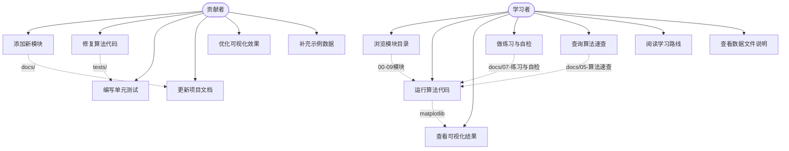
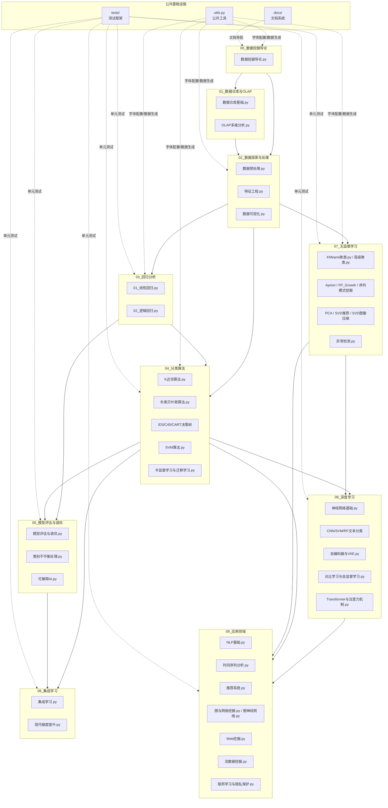
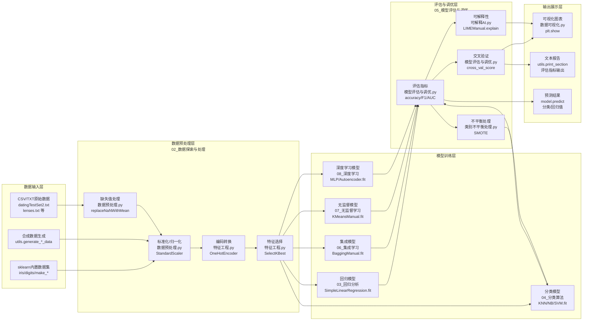
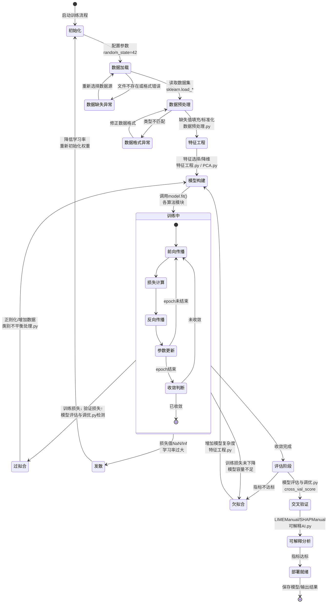
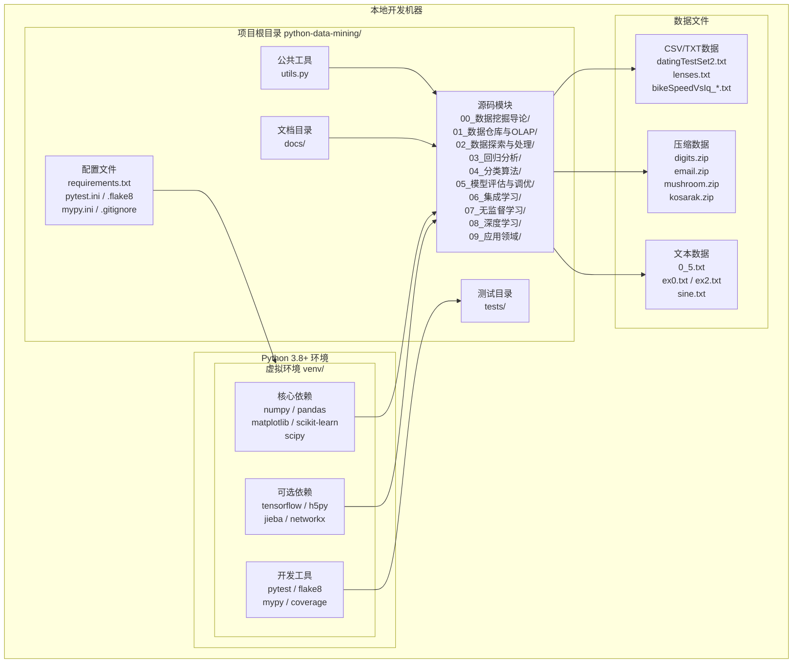

# 知识体系图解

> 🏠 [项目首页](../README.md) | 📚 [文档中心](./README.md) | ⬅ [算法速查](./05-算法速查.md) | 📍 知识体系图解 | ➡ [练习与自检](./07-练习与自检.md)

---

本文档通过 6 种软件工程图，全方位展示 Python 数据挖掘项目的知识体系、模块关系、类结构、数据流转、状态变迁和部署架构。所有图均基于项目实际结构绘制。

---

## 一、用例图（Use Case Diagram）

展示学习者与贡献者两大角色与系统之间的交互关系。

**说明：**

- **学习者**是主要角色，通过浏览 `00_数据挖掘导论/` 至 `09_应用领域/` 的模块目录学习知识，运行各 `.py` 文件查看算法效果，借助 `docs/07-练习与自检.md` 进行自我检测
- **贡献者**负责项目维护，包括在 `tests/` 下编写测试、更新 `docs/` 文档、修复源码 Bug 等
- 虚线表示用例之间的依赖关系，如浏览模块后才能运行代码，查看速查后定位到具体算法

---

## 二、组件图（Component Diagram）

展示 10 个功能模块的内部组件及模块间的知识依赖关系。

**说明：**

- 10 个模块按 CRISP-DM 流程排列，实线箭头表示知识依赖方向（前置→后继）
- `00_数据挖掘导论` 是入口模块，`02_数据探索与处理` 是多数算法的前置基础
- `04_分类算法` 和 `07_无监督学习` 是核心枢纽，分别向 `08_深度学习` 和 `09_应用领域` 辐射
- `utils.py` 为多个模块提供中文字体配置和数据生成函数，`tests/` 覆盖模块 03-09 的单元测试

---

## 三、类图（Class Diagram）

展示项目中核心算法的类结构、继承关系和关键方法。

```mermaid
classDiagram
    class SimpleLinearRegression {
        +fit(X, y)
        +predict(X)
        +score(X, y)
    }

    class LinearRegressionGD {
        +fit(X, y)
        +predict(X)
    }

    class LogisticRegressionGD {
        -lr: float
        -n_iters: int
        -weights: ndarray
        -bias: float
        +fit(X, y)
        +predict(X)
        +predict_proba(X)
    }

    class SoftmaxRegression {
        +fit(X, y)
        +predict(X)
        +predict_proba(X)
    }

    class KMeansManual {
        -n_clusters: int
        -max_iters: int
        -centroids: ndarray
        +fit(X)
        +predict(X)
    }

    class DBSCANManual {
        -eps: float
        -min_samples: int
        +fit(X)
        +predict(X)
    }

    class BaggingManual {
        -n_estimators: int
        -base_estimator
        +fit(X, y)
        +predict(X)
    }

    class AdaBoostManual {
        -n_estimators: int
        -learning_rate: float
        +fit(X, y)
        +predict(X)
    }

    class Perceptron {
        -lr: float
        -n_iters: int
        +fit(X, y)
        +predict(X)
    }

    class MLP {
        -layers: list
        -lr: float
        +fit(X, y)
        +predict(X)
        -forward(X)
        -backward(X, y)
    }

    class AutoencoderManual {
        -encoding_dim: int
        -lr: float
        +fit(X)
        +encode(X)
        +decode(X)
        +predict(X)
    }

    class DenoisingAutoencoder {
        -noise_factor: float
        +fit(X)
        +add_noise(X)
    }

    class VAEManual {
        -latent_dim: int
        -lr: float
        +fit(X)
        +encode(X)
        +decode(Z)
        +sample(n_samples)
        -reparameterize(mu, log_var)
    }

    class SimCLRManual {
        -temperature: float
        -projection_dim: int
        +fit(X)
        +get_representations(X)
        -nt_xent_loss(z_i, z_j)
    }

    class MultiHeadAttention {
        -d_model: int
        -n_heads: int
        +forward(Q, K, V)
        -scaled_dot_product(Q, K, V)
    }

    class TransformerEncoderLayer {
        -d_model: int
        -nhead: int
        +forward(X)
        -feed_forward(X)
    }

    class LIMEManual {
        -n_samples: int
        -kernel_width: float
        +explain(instance, predict_fn)
        -generate_perturbations(instance)
        -fit_local_model(perturbations, predictions)
    }

    class SHAPManual {
        -n_samples: int
        +explain(instance, predict_fn, X_background)
        -shapley_value(feature, instance)
        -monte_carlo_sampling(instance)
    }

    class GCNManual {
        -n_hidden: int
        -n_classes: int
        +fit(X, A, y)
        +predict(X, A)
        -gcn_layer(X, A, W)
    }

    class GATManual {
        -n_heads: int
        -n_hidden: int
        +fit(X, A, y)
        +predict(X, A)
        -attention_mechanism(X, A)
    }

    class FedAvgManual {
        -n_clients: int
        -n_rounds: int
        +fit(X, y)
        -client_update(client_data)
        -server_aggregate(client_weights)
    }

    class DPSGDManual {
        -noise_multiplier: float
        -clip_bound: float
        +fit(X, y)
        -clip_gradients(grads)
        -add_noise(grads)
    }

    class optStruct {
        -X: ndarray
        -labelMat: ndarray
        -C: float
        -toler: float
        -kTup: tuple
        +calcEkK(k)
    }

    class treeNode {
        -name: str
        -numOccur: int
        -nodeLink: treeNode
        -children: dict
        +inc(num)
        +disp(ind)
    }

    class Graph {
        -adj_list: dict
        -n_nodes: int
        +add_edge(u, v, w)
        +bfs(start)
        +dfs(start)
        +pagerank()
    }

    class SlidingWindow {
        -window_size: int
        -data: list
        +add(item)
        +get_statistics()
    }

    class TextPreprocessor {
        +tokenize(text)
        +remove_stopwords(tokens)
        +clean(text)
    }

    SimpleLinearRegression <|-- LinearRegressionGD
    LinearRegressionGD <|-- LogisticRegressionGD
    LogisticRegressionGD <|-- SoftmaxRegression
    AutoencoderManual <|-- DenoisingAutoencoder
    AutoencoderManual <|-- VAEManual
    Perceptron <|-- MLP
    GCNManual <|-- GATManual
    FedAvgManual <|-- DPSGDManual
```

**说明：**

- **回归系列**：`SimpleLinearRegression` → `LinearRegressionGD` → `LogisticRegressionGD` → `SoftmaxRegression`，逐步从解析解到梯度下降，从二分类到多分类
- **深度学习系列**：`Perceptron` → `MLP` 构成神经网络基础；`AutoencoderManual` 派生出 `DenoisingAutoencoder` 和 `VAEManual`；`MultiHeadAttention` 与 `TransformerEncoderLayer` 组成 Transformer 架构
- **图神经网络**：`GCNManual` → `GATManual`，从基础图卷积到注意力图卷积
- **联邦学习**：`FedAvgManual` → `DPSGDManual`，在联邦聚合基础上增加差分隐私保护
- **可解释AI**：`LIMEManual` 和 `SHAPManual` 为独立类，分别实现局部可解释和 Shapley 值解释
- `optStruct` 为 SVM 的 SMO 优化数据结构，`treeNode` 为 FP-Growth 的树节点，`Graph` 为图挖掘基础类

---

## 四、数据流图（Data Flow Diagram）

展示数据从原始输入到最终输出的完整流转过程。

**说明：**

- **数据输入层**：三种数据来源——项目自带的 CSV/TXT 文件（如 `datingTestSet2.txt`）、sklearn 内置数据集（`digits`、`iris`）、以及 `utils.py` 中的合成数据生成函数
- **预处理层**：对应 `02_数据探索与处理/` 模块，依次经过缺失值处理、标准化、编码和特征选择
- **模型训练层**：5 类模型分别对应 `03-08` 模块，所有模型均接收预处理后的特征矩阵
- **评估层**：对应 `05_模型评估与调优/`，包含指标计算、交叉验证、可解释性分析和类别不平衡处理
- **输出层**：通过 `数据可视化.py` 和 `utils.print_section()` 输出图表与文本报告

---

## 五、状态图（State Diagram）

展示模型从初始化到部署的完整状态转换过程，包含正常流程和异常状态。

**说明：**

- **正常流程**：初始化 → 数据加载 → 预处理 → 特征工程 → 训练中（迭代前向/反向传播）→ 收敛 → 评估 → 部署
- **训练中**的内部状态展示了每个 epoch 的前向传播→损失计算→反向传播→参数更新的循环
- **三种异常状态**：
  - **过拟合**：训练损失持续下降但验证损失上升，需通过正则化或数据增强解决
  - **欠拟合**：训练损失无法下降，需增加模型复杂度或改进特征
  - **发散**：损失变为 NaN/Inf，通常因学习率过大导致，需降低学习率重新训练
- 评估阶段包含交叉验证和可解释性分析，确保模型质量

---

## 六、部署图（Deployment Diagram）

展示本地开发环境的部署架构，包含 Python 环境、依赖包、项目文件和数据文件的关系。

**说明：**

- **Python 环境**：推荐使用虚拟环境（venv）隔离项目依赖，核心依赖（numpy、pandas、matplotlib、scikit-learn、scipy）为必装项，tensorflow/jieba/networkx 为可选依赖
- **项目根目录**：包含 10 个功能模块（`00-09`）、公共工具 `utils.py`、测试目录 `tests/`、文档目录 `docs/` 和各类配置文件
- **数据文件**：分布在各模块子目录下，包括 CSV/TXT 格式的结构化数据、ZIP 压缩包和纯文本数据
- **配置文件**：`requirements.txt` 管理依赖清单，`pytest.ini`、`.flake8`、`mypy.ini` 分别配置测试、代码检查和类型检查规则
