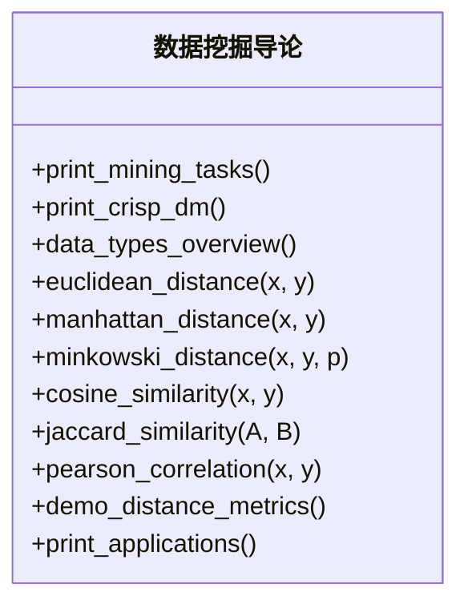
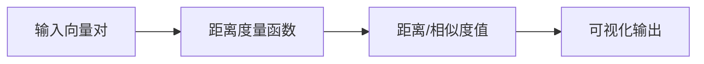
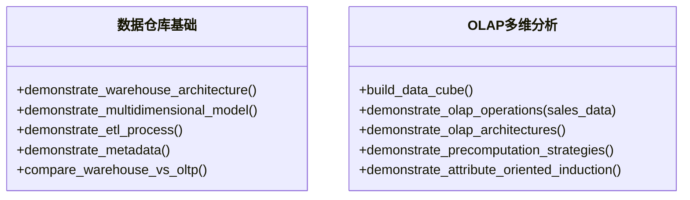
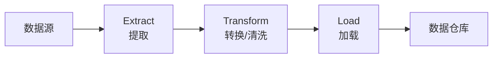
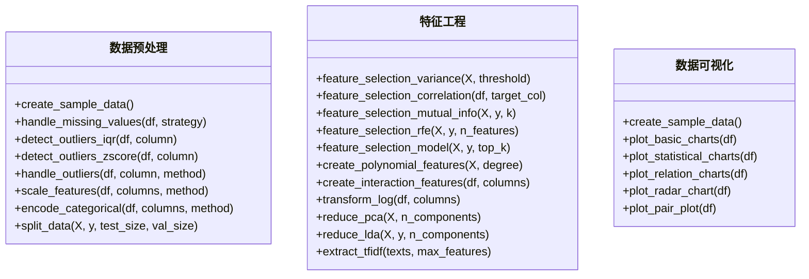
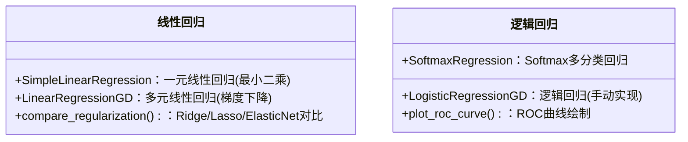
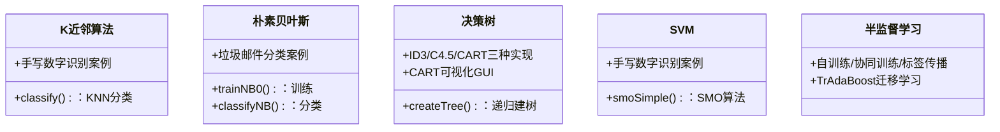
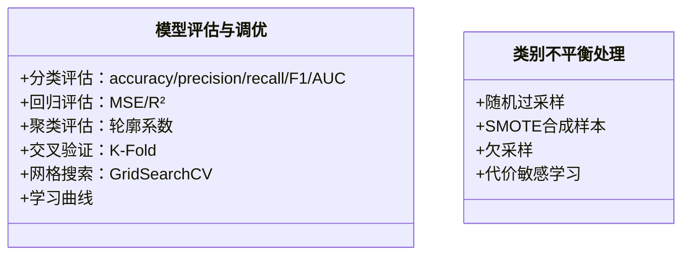
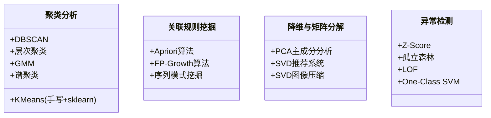
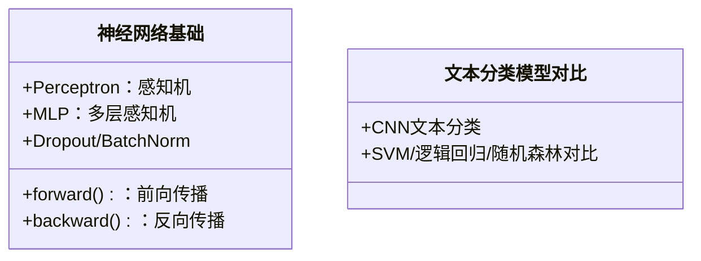

# 详细设计文档

> 📚 [文档中心](./README.md) | ⬅ [架构设计](./05-架构设计文档.md) | 📍 详细设计 | ➡ [实施与开发](./07-实施与开发文档.md) | 🏠 [项目首页](../readme.md)

---

## 1. 模块详细设计

### 1.1 模块00：数据挖掘导论

**类图：**

**数据流图：**

> 源码位置：[数据挖掘导论.py](../00_数据挖掘导论/数据挖掘导论.py)

---

### 1.2 模块01：数据仓库与OLAP

**ETL流程图：**

> 源码位置：[数据仓库基础.py](../01_数据仓库与OLAP/01_数据仓库基础/数据仓库基础.py) | [OLAP多维分析.py](../01_数据仓库与OLAP/02_OLAP多维分析/OLAP多维分析.py)

---

### 1.3 模块02：数据探索与处理

---

### 1.4 模块03：回归分析

> 源码位置：[01_线性回归.py](../03_回归分析/01_线性回归.py) | [02_逻辑回归.py](../03_回归分析/02_逻辑回归.py)

---

### 1.5 模块04：分类算法

---

### 1.6 模块05：模型评估与调优

> 源码位置：[01_模型评估与调优.py](../05_模型评估与调优/01_模型评估与调优.py) | [02_类别不平衡处理.py](../05_模型评估与调优/02_类别不平衡处理.py)

---

### 1.7 模块07：无监督学习

---

### 1.8 模块08：深度学习

> 源码位置：[神经网络基础.py](../08_深度学习/01_神经网络基础/神经网络基础.py) | [CNN文本分类.py](../08_深度学习/02_文本分类模型对比/CNN文本分类.py)
