# 架构设计与知识体系图解

> 🏠 [项目首页](../README.md) | 📚 [文档中心](./README.md) | ⬅ [毕业项目](./06-毕业项目.md) | 📍 架构设计与知识体系图解 | ➡ [需求规格](./08-需求规格说明书.md)

---

本文档整合系统架构设计与知识体系可视化，通过架构说明和 6 种 Mermaid 图（用例图、组件图、类图、数据流图、状态图、部署图），全方位展示 Python 数据挖掘项目的结构、关系与运行机制。

---

## 1. 系统架构

### 1.1 4阶段学习架构

项目采用4阶段渐进式学习架构，从认知基础到场景实战逐步深入，共覆盖10个主模块、7个新增前沿方向。

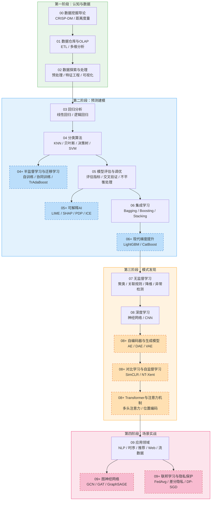

> 虚线边框节点为7个新增前沿方向模块。

### 1.2 架构原则

| 原则 | 说明 |
|------|------|
| 独立运行 | 每个模块无跨模块依赖，可单独学习 |
| 编号即顺序 | 目录/文件编号直接映射学习顺序 |
| 渐进深入 | 从概念→算法→评估→应用的递进结构 |
| 双线并行 | 每个算法先手动实现，再对比sklearn |
| 前沿扩展 | 新增方向以子模块形式嵌入现有模块，保持编号体系一致 |
| 自包含数据 | 所有示例数据内嵌代码或使用sklearn内置数据集 |

---

## 2. 知识体系图解

### 2.1 用例图

展示学习者与贡献者两大角色与系统之间的交互关系。

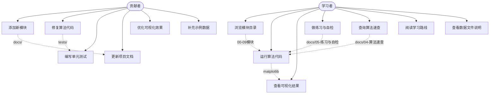

**说明：**

- **学习者**是主要角色，通过浏览 `00_数据挖掘导论/` 至 `09_应用领域/` 的模块目录学习知识，运行各 `.py` 文件查看算法效果，借助 `docs/05-练习与自检.md` 进行自我检测
- **贡献者**负责项目维护，包括在 `tests/` 下编写测试、更新 `docs/` 文档、修复源码 Bug 等
- 虚线表示用例之间的依赖关系，如浏览模块后才能运行代码，查看速查后定位到具体算法

### 2.2 组件图

展示 10 个功能模块的内部组件、模块间的知识依赖关系及公共基础设施。

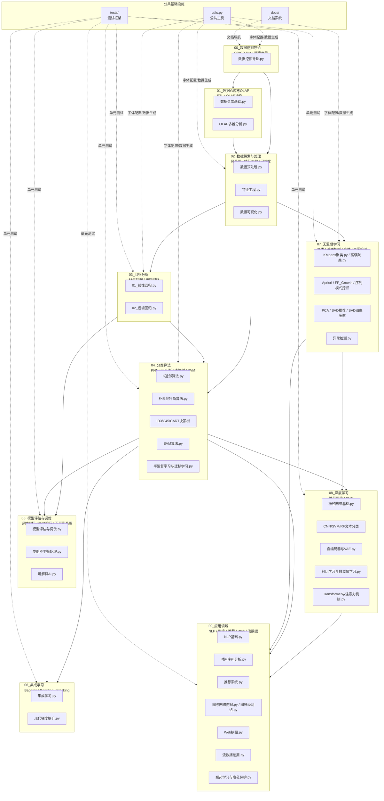

**说明：**

- 10 个模块按 CRISP-DM 流程排列，实线箭头表示知识依赖方向（前置→后继）
- `00_数据挖掘导论` 是入口模块，`02_数据探索与处理` 是多数算法的前置基础
- `04_分类算法` 和 `07_无监督学习` 是核心枢纽，分别向 `08_深度学习` 和 `09_应用领域` 辐射
- `utils.py` 为多个模块提供中文字体配置和数据生成函数，`tests/` 覆盖模块 03-09 的单元测试

#### 子模块详细图

```mermaid
graph TB
    subgraph M00G["00 数据挖掘导论"]
        M00A["CRISP-DM流程"]
        M00B["数据挖掘任务分类"]
        M00C["距离度量<br/>欧氏/曼哈顿/闵可夫斯基/余弦/Jaccard"]
        M00D["数据类型与相似性"]
    end

    subgraph M01G["01 数据仓库与OLAP"]
        M01A["数据仓库基础<br/>架构/多维模型/ETL/元数据"]
        M01B["OLAP多维分析<br/>数据立方体/上卷/下钻/切片/切块"]
    end

    subgraph M02G["02 数据探索与处理"]
        M02A["数据预处理<br/>缺失值/异常值/标准化/编码"]
        M02B["特征工程<br/>选择/构造/降维/TF-IDF"]
        M02C["数据可视化<br/>基础图/统计图/关系图/雷达图"]
    end

    subgraph M03G["03 回归分析"]
        M03A["线性回归<br/>最小二乘/梯度下降/正则化"]
        M03B["逻辑回归<br/>逻辑回归/Softmax/ROC"]
    end

    subgraph M04G["04 分类算法"]
        M04A["K近邻算法<br/>KNN分类/手写数字识别"]
        M04B["朴素贝叶斯<br/>训练/分类/垃圾邮件过滤"]
        M04C["决策树<br/>ID3/C4.5/CART/可视化GUI"]
        M04D["支持向量机<br/>SMO算法/核函数/手写数字识别"]
        M04E["半监督学习与迁移学习<br/>自训练/协同训练/标签传播/TrAdaBoost"]
    end

    subgraph M05G["05 模型评估与调优"]
        M05A["模型评估与调优<br/>分类/回归/聚类评估/交叉验证/网格搜索"]
        M05B["类别不平衡处理<br/>过采样/SMOTE/欠采样/代价敏感"]
        M05C["可解释AI<br/>LIME/SHAP/PDP/ICE"]
    end

    subgraph M06G["06 集成学习"]
        M06A["集成学习<br/>Bagging/Boosting/Stacking/XGBoost"]
        M06B["现代梯度提升<br/>LightGBM/CatBoost/三大框架对比"]
    end

    subgraph M07G["07 无监督学习"]
        M07A["聚类分析<br/>KMeans/DBSCAN/层次聚类/GMM/谱聚类"]
        M07B["关联规则挖掘<br/>Apriori/FP-Growth/序列模式挖掘"]
        M07C["降维与矩阵分解<br/>PCA/SVD推荐/SVD图像压缩"]
        M07D["异常检测<br/>Z-Score/孤立森林/LOF/One-Class SVM"]
    end

    subgraph M08G["08 深度学习"]
        M08A["神经网络基础<br/>感知机/MLP/前向传播/反向传播"]
        M08B["文本分类模型对比<br/>CNN/SVM/逻辑回归/随机森林"]
        M08C["自编码器与生成模型<br/>AE/DAE/VAE/重参数化"]
        M08D["对比学习与自监督学习<br/>SimCLR/对比损失/线性评估"]
        M08E["Transformer与注意力机制<br/>缩放点积/多头注意力/位置编码"]
    end

    subgraph M09G["09 应用领域"]
        M09A["自然语言处理<br/>分词/TF-IDF/情感分析/主题模型"]
        M09B["时间序列分析<br/>平稳性/ARIMA/指数平滑"]
        M09C["推荐系统<br/>协同过滤/矩阵分解/NDCG"]
        M09D["图与网络挖掘<br/>PageRank/社区发现/链接预测"]
        M09E["图神经网络<br/>GCN/GAT/GraphSAGE/节点分类"]
        M09F["Web挖掘<br/>PageRank-HITS/TF-IDF/日志模式"]
        M09G["流数据挖掘<br/>滑动窗口/概念漂移/在线聚类"]
        M09H["联邦学习与隐私保护<br/>FedAvg/差分隐私/DP-SGD"]
    end

    M00G --> M01G --> M02G --> M03G
    M03G --> M04G --> M05G --> M06G
    M06G --> M07G --> M08G --> M09G
```

#### 源码索引

| 模块 | 子模块 | 源码文件 |
|------|--------|----------|
| 00 数据挖掘导论 | — | GitHub [数据挖掘导论.py](../00_数据挖掘导论/数据挖掘导论.py) · VSCode [数据挖掘导论.py](file:///d:/Dev/DevWorkSpace/VS%20Code/Python/python-data-mining/00_数据挖掘导论/数据挖掘导论.py) |
| 01 数据仓库与OLAP | 数据仓库基础 | GitHub [数据仓库基础.py](../01_数据仓库与OLAP/01_数据仓库基础/数据仓库基础.py) · VSCode [数据仓库基础.py](file:///d:/Dev/DevWorkSpace/VS%20Code/Python/python-data-mining/01_数据仓库与OLAP/01_数据仓库基础/数据仓库基础.py) |
| 01 数据仓库与OLAP | OLAP多维分析 | GitHub [OLAP多维分析.py](../01_数据仓库与OLAP/02_OLAP多维分析/OLAP多维分析.py) · VSCode [OLAP多维分析.py](file:///d:/Dev/DevWorkSpace/VS%20Code/Python/python-data-mining/01_数据仓库与OLAP/02_OLAP多维分析/OLAP多维分析.py) |
| 02 数据探索与处理 | 数据预处理 | GitHub [数据预处理.py](../02_数据探索与处理/01_数据预处理与特征工程/数据预处理.py) · VSCode [数据预处理.py](file:///d:/Dev/DevWorkSpace/VS%20Code/Python/python-data-mining/02_数据探索与处理/01_数据预处理与特征工程/数据预处理.py) |
| 02 数据探索与处理 | 特征工程 | GitHub [特征工程.py](../02_数据探索与处理/01_数据预处理与特征工程/特征工程.py) · VSCode [特征工程.py](file:///d:/Dev/DevWorkSpace/VS%20Code/Python/python-data-mining/02_数据探索与处理/01_数据预处理与特征工程/特征工程.py) |
| 02 数据探索与处理 | 数据可视化 | GitHub [数据可视化.py](../02_数据探索与处理/02_数据可视化/数据可视化.py) · VSCode [数据可视化.py](file:///d:/Dev/DevWorkSpace/VS%20Code/Python/python-data-mining/02_数据探索与处理/02_数据可视化/数据可视化.py) |
| 03 回归分析 | 线性回归 | GitHub [01_线性回归.py](../03_回归分析/01_线性回归.py) · VSCode [01_线性回归.py](file:///d:/Dev/DevWorkSpace/VS%20Code/Python/python-data-mining/03_回归分析/01_线性回归.py) |
| 03 回归分析 | 逻辑回归 | GitHub [02_逻辑回归.py](../03_回归分析/02_逻辑回归.py) · VSCode [02_逻辑回归.py](file:///d:/Dev/DevWorkSpace/VS%20Code/Python/python-data-mining/03_回归分析/02_逻辑回归.py) |
| 04 分类算法 | K近邻算法 | GitHub [K近邻算法.py](../04_分类算法/01_K近邻算法/K近邻算法.py) · VSCode [K近邻算法.py](file:///d:/Dev/DevWorkSpace/VS%20Code/Python/python-data-mining/04_分类算法/01_K近邻算法/K近邻算法.py) |
| 04 分类算法 | 朴素贝叶斯 | GitHub [朴素贝叶斯算法.py](../04_分类算法/02_朴素贝叶斯/朴素贝叶斯算法.py) · VSCode [朴素贝叶斯算法.py](file:///d:/Dev/DevWorkSpace/VS%20Code/Python/python-data-mining/04_分类算法/02_朴素贝叶斯/朴素贝叶斯算法.py) |
| 04 分类算法 | ID3决策树 | GitHub [trees.py](../04_分类算法/03_决策树/01_ID3决策树/trees.py) · VSCode [trees.py](file:///d:/Dev/DevWorkSpace/VS%20Code/Python/python-data-mining/04_分类算法/03_决策树/01_ID3决策树/trees.py) |
| 04 分类算法 | C4.5决策树 | GitHub [C45决策树.py](../04_分类算法/03_决策树/02_C45决策树/C45决策树.py) · VSCode [C45决策树.py](file:///d:/Dev/DevWorkSpace/VS%20Code/Python/python-data-mining/04_分类算法/03_决策树/02_C45决策树/C45决策树.py) |
| 04 分类算法 | CART回归树 | GitHub [CART.py](../04_分类算法/03_决策树/03_CART回归树/CART.py) · VSCode [CART.py](file:///d:/Dev/DevWorkSpace/VS%20Code/Python/python-data-mining/04_分类算法/03_决策树/03_CART回归树/CART.py) |
| 04 分类算法 | 支持向量机 | GitHub [SVM算法.py](../04_分类算法/04_支持向量机/SVM算法.py) · VSCode [SVM算法.py](file:///d:/Dev/DevWorkSpace/VS%20Code/Python/python-data-mining/04_分类算法/04_支持向量机/SVM算法.py) |
| 04 分类算法 | 半监督与迁移学习 | GitHub [半监督学习与迁移学习.py](../04_分类算法/05_半监督学习与迁移学习/半监督学习与迁移学习.py) · VSCode [半监督学习与迁移学习.py](file:///d:/Dev/DevWorkSpace/VS%20Code/Python/python-data-mining/04_分类算法/05_半监督学习与迁移学习/半监督学习与迁移学习.py) |
| 05 模型评估与调优 | 模型评估与调优 | GitHub [01_模型评估与调优.py](../05_模型评估与调优/01_模型评估与调优.py) · VSCode [01_模型评估与调优.py](file:///d:/Dev/DevWorkSpace/VS%20Code/Python/python-data-mining/05_模型评估与调优/01_模型评估与调优.py) |
| 05 模型评估与调优 | 类别不平衡处理 | GitHub [02_类别不平衡处理.py](../05_模型评估与调优/02_类别不平衡处理.py) · VSCode [02_类别不平衡处理.py](file:///d:/Dev/DevWorkSpace/VS%20Code/Python/python-data-mining/05_模型评估与调优/02_类别不平衡处理.py) |
| 05 模型评估与调优 | 可解释AI | GitHub [可解释AI.py](../05_模型评估与调优/03_可解释AI/可解释AI.py) · VSCode [可解释AI.py](file:///d:/Dev/DevWorkSpace/VS%20Code/Python/python-data-mining/05_模型评估与调优/03_可解释AI/可解释AI.py) |
| 06 集成学习 | 集成学习 | GitHub [集成学习.py](../06_集成学习/集成学习.py) · VSCode [集成学习.py](file:///d:/Dev/DevWorkSpace/VS%20Code/Python/python-data-mining/06_集成学习/集成学习.py) |
| 06 集成学习 | 现代梯度提升 | GitHub [现代梯度提升.py](../06_集成学习/02_现代梯度提升/现代梯度提升.py) · VSCode [现代梯度提升.py](file:///d:/Dev/DevWorkSpace/VS%20Code/Python/python-data-mining/06_集成学习/02_现代梯度提升/现代梯度提升.py) |
| 07 无监督学习 | KMeans聚类 | GitHub [KMeans聚类.py](../07_无监督学习/01_聚类分析/KMeans聚类.py) · VSCode [KMeans聚类.py](file:///d:/Dev/DevWorkSpace/VS%20Code/Python/python-data-mining/07_无监督学习/01_聚类分析/KMeans聚类.py) |
| 07 无监督学习 | 高级聚类 | GitHub [高级聚类.py](../07_无监督学习/01_聚类分析/高级聚类.py) · VSCode [高级聚类.py](file:///d:/Dev/DevWorkSpace/VS%20Code/Python/python-data-mining/07_无监督学习/01_聚类分析/高级聚类.py) |
| 07 无监督学习 | Apriori算法 | GitHub [Apriori.py](../07_无监督学习/02_关联规则挖掘/01_Apriori算法/Apriori.py) · VSCode [Apriori.py](file:///d:/Dev/DevWorkSpace/VS%20Code/Python/python-data-mining/07_无监督学习/02_关联规则挖掘/01_Apriori算法/Apriori.py) |
| 07 无监督学习 | FP-Growth算法 | GitHub [FP_Growth算法.py](../07_无监督学习/02_关联规则挖掘/02_FPGrowth算法/FP_Growth算法.py) · VSCode [FP_Growth算法.py](file:///d:/Dev/DevWorkSpace/VS%20Code/Python/python-data-mining/07_无监督学习/02_关联规则挖掘/02_FPGrowth算法/FP_Growth算法.py) |
| 07 无监督学习 | 序列模式挖掘 | GitHub [序列模式挖掘.py](../07_无监督学习/02_关联规则挖掘/03_序列模式挖掘/序列模式挖掘.py) · VSCode [序列模式挖掘.py](file:///d:/Dev/DevWorkSpace/VS%20Code/Python/python-data-mining/07_无监督学习/02_关联规则挖掘/03_序列模式挖掘/序列模式挖掘.py) |
| 07 无监督学习 | PCA主成分分析 | GitHub [PCA.py](../07_无监督学习/03_降维与矩阵分解/01_PCA主成分分析/PCA.py) · VSCode [PCA.py](file:///d:/Dev/DevWorkSpace/VS%20Code/Python/python-data-mining/07_无监督学习/03_降维与矩阵分解/01_PCA主成分分析/PCA.py) |
| 07 无监督学习 | SVD推荐系统 | GitHub [SVD.py](../07_无监督学习/03_降维与矩阵分解/02_SVD推荐系统/SVD.py) · VSCode [SVD.py](file:///d:/Dev/DevWorkSpace/VS%20Code/Python/python-data-mining/07_无监督学习/03_降维与矩阵分解/02_SVD推荐系统/SVD.py) |
| 07 无监督学习 | SVD图像压缩 | GitHub [SVD.py](../07_无监督学习/03_降维与矩阵分解/03_SVD图像压缩/SVD.py) · VSCode [SVD.py](file:///d:/Dev/DevWorkSpace/VS%20Code/Python/python-data-mining/07_无监督学习/03_降维与矩阵分解/03_SVD图像压缩/SVD.py) |
| 07 无监督学习 | 异常检测 | GitHub [异常检测.py](../07_无监督学习/04_异常检测/异常检测.py) · VSCode [异常检测.py](file:///d:/Dev/DevWorkSpace/VS%20Code/Python/python-data-mining/07_无监督学习/04_异常检测/异常检测.py) |
| 08 深度学习 | 神经网络基础 | GitHub [神经网络基础.py](../08_深度学习/01_神经网络基础/神经网络基础.py) · VSCode [神经网络基础.py](file:///d:/Dev/DevWorkSpace/VS%20Code/Python/python-data-mining/08_深度学习/01_神经网络基础/神经网络基础.py) |
| 08 深度学习 | CNN文本分类 | GitHub [CNN文本分类.py](../08_深度学习/02_文本分类模型对比/CNN文本分类.py) · VSCode [CNN文本分类.py](file:///d:/Dev/DevWorkSpace/VS%20Code/Python/python-data-mining/08_深度学习/02_文本分类模型对比/CNN文本分类.py) |
| 08 深度学习 | 自编码器与VAE | GitHub [自编码器与VAE.py](../08_深度学习/03_自编码器与生成模型/自编码器与VAE.py) · VSCode [自编码器与VAE.py](file:///d:/Dev/DevWorkSpace/VS%20Code/Python/python-data-mining/08_深度学习/03_自编码器与生成模型/自编码器与VAE.py) |
| 08 深度学习 | 对比学习与自监督学习 | GitHub [对比学习与自监督学习.py](../08_深度学习/04_对比学习与自监督学习/对比学习与自监督学习.py) · VSCode [对比学习与自监督学习.py](file:///d:/Dev/DevWorkSpace/VS%20Code/Python/python-data-mining/08_深度学习/04_对比学习与自监督学习/对比学习与自监督学习.py) |
| 08 深度学习 | Transformer与注意力机制 | GitHub [Transformer与注意力机制.py](../08_深度学习/05_Transformer与注意力机制/Transformer与注意力机制.py) · VSCode [Transformer与注意力机制.py](file:///d:/Dev/DevWorkSpace/VS%20Code/Python/python-data-mining/08_深度学习/05_Transformer与注意力机制/Transformer与注意力机制.py) |
| 09 应用领域 | NLP基础 | GitHub [NLP基础.py](../09_应用领域/01_自然语言处理/NLP基础.py) · VSCode [NLP基础.py](file:///d:/Dev/DevWorkSpace/VS%20Code/Python/python-data-mining/09_应用领域/01_自然语言处理/NLP基础.py) |
| 09 应用领域 | 时间序列分析 | GitHub [时间序列分析.py](../09_应用领域/02_时间序列分析/时间序列分析.py) · VSCode [时间序列分析.py](file:///d:/Dev/DevWorkSpace/VS%20Code/Python/python-data-mining/09_应用领域/02_时间序列分析/时间序列分析.py) |
| 09 应用领域 | 推荐系统 | GitHub [推荐系统.py](../09_应用领域/03_推荐系统/推荐系统.py) · VSCode [推荐系统.py](file:///d:/Dev/DevWorkSpace/VS%20Code/Python/python-data-mining/09_应用领域/03_推荐系统/推荐系统.py) |
| 09 应用领域 | 图与网络挖掘 | GitHub [图与网络挖掘.py](../09_应用领域/04_图与网络挖掘/图与网络挖掘.py) · VSCode [图与网络挖掘.py](file:///d:/Dev/DevWorkSpace/VS%20Code/Python/python-data-mining/09_应用领域/04_图与网络挖掘/图与网络挖掘.py) |
| 09 应用领域 | 图神经网络 | GitHub [图神经网络.py](../09_应用领域/04_图与网络挖掘/02_图神经网络/图神经网络.py) · VSCode [图神经网络.py](file:///d:/Dev/DevWorkSpace/VS%20Code/Python/python-data-mining/09_应用领域/04_图与网络挖掘/02_图神经网络/图神经网络.py) |
| 09 应用领域 | Web挖掘 | GitHub [Web挖掘.py](../09_应用领域/05_Web挖掘/Web挖掘.py) · VSCode [Web挖掘.py](file:///d:/Dev/DevWorkSpace/VS%20Code/Python/python-data-mining/09_应用领域/05_Web挖掘/Web挖掘.py) |
| 09 应用领域 | 流数据挖掘 | GitHub [流数据挖掘.py](../09_应用领域/06_流数据挖掘/流数据挖掘.py) · VSCode [流数据挖掘.py](file:///d:/Dev/DevWorkSpace/VS%20Code/Python/python-data-mining/09_应用领域/06_流数据挖掘/流数据挖掘.py) |
| 09 应用领域 | 联邦学习与隐私保护 | GitHub [联邦学习与隐私保护.py](../09_应用领域/07_联邦学习与隐私保护/联邦学习与隐私保护.py) · VSCode [联邦学习与隐私保护.py](file:///d:/Dev/DevWorkSpace/VS%20Code/Python/python-data-mining/09_应用领域/07_联邦学习与隐私保护/联邦学习与隐私保护.py) |

### 2.3 类图

展示项目中核心算法的类结构、继承关系和关键方法。

```mermaid
classDiagram
    class SimpleLinearRegression {
        +fit(X, y)
        +predict(X)
        +score(X, y)
    }

    class LinearRegressionGD {
        +fit(X, y)
        +predict(X)
    }

    class LogisticRegressionGD {
        -lr: float
        -n_iters: int
        -weights: ndarray
        -bias: float
        +fit(X, y)
        +predict(X)
        +predict_proba(X)
    }

    class SoftmaxRegression {
        +fit(X, y)
        +predict(X)
        +predict_proba(X)
    }

    class KMeansManual {
        -n_clusters: int
        -max_iters: int
        -centroids: ndarray
        +fit(X)
        +predict(X)
    }

    class DBSCANManual {
        -eps: float
        -min_samples: int
        +fit(X)
        +predict(X)
    }

    class BaggingManual {
        -n_estimators: int
        -base_estimator
        +fit(X, y)
        +predict(X)
    }

    class AdaBoostManual {
        -n_estimators: int
        -learning_rate: float
        +fit(X, y)
        +predict(X)
    }

    class Perceptron {
        -lr: float
        -n_iters: int
        +fit(X, y)
        +predict(X)
    }

    class MLP {
        -layers: list
        -lr: float
        +fit(X, y)
        +predict(X)
        -forward(X)
        -backward(X, y)
    }

    class AutoencoderManual {
        -encoding_dim: int
        -lr: float
        +fit(X)
        +encode(X)
        +decode(X)
        +predict(X)
    }

    class DenoisingAutoencoder {
        -noise_factor: float
        +fit(X)
        +add_noise(X)
    }

    class VAEManual {
        -latent_dim: int
        -lr: float
        +fit(X)
        +encode(X)
        +decode(Z)
        +sample(n_samples)
        -reparameterize(mu, log_var)
    }

    class SimCLRManual {
        -temperature: float
        -projection_dim: int
        +fit(X)
        +get_representations(X)
        -nt_xent_loss(z_i, z_j)
    }

    class MultiHeadAttention {
        -d_model: int
        -n_heads: int
        +forward(Q, K, V)
        -scaled_dot_product(Q, K, V)
    }

    class TransformerEncoderLayer {
        -d_model: int
        -nhead: int
        +forward(X)
        -feed_forward(X)
    }

    class LIMEManual {
        -n_samples: int
        -kernel_width: float
        +explain(instance, predict_fn)
        -generate_perturbations(instance)
        -fit_local_model(perturbations, predictions)
    }

    class SHAPManual {
        -n_samples: int
        +explain(instance, predict_fn, X_background)
        -shapley_value(feature, instance)
        -monte_carlo_sampling(instance)
    }

    class GCNManual {
        -n_hidden: int
        -n_classes: int
        +fit(X, A, y)
        +predict(X, A)
        -gcn_layer(X, A, W)
    }

    class GATManual {
        -n_heads: int
        -n_hidden: int
        +fit(X, A, y)
        +predict(X, A)
        -attention_mechanism(X, A)
    }

    class FedAvgManual {
        -n_clients: int
        -n_rounds: int
        +fit(X, y)
        -client_update(client_data)
        -server_aggregate(client_weights)
    }

    class DPSGDManual {
        -noise_multiplier: float
        -clip_bound: float
        +fit(X, y)
        -clip_gradients(grads)
        -add_noise(grads)
    }

    class optStruct {
        -X: ndarray
        -labelMat: ndarray
        -C: float
        -toler: float
        -kTup: tuple
        +calcEkK(k)
    }

    class treeNode {
        -name: str
        -numOccur: int
        -nodeLink: treeNode
        -children: dict
        +inc(num)
        +disp(ind)
    }

    class Graph {
        -adj_list: dict
        -n_nodes: int
        +add_edge(u, v, w)
        +bfs(start)
        +dfs(start)
        +pagerank()
    }

    class SlidingWindow {
        -window_size: int
        -data: list
        +add(item)
        +get_statistics()
    }

    class TextPreprocessor {
        +tokenize(text)
        +remove_stopwords(tokens)
        +clean(text)
    }

    SimpleLinearRegression <|-- LinearRegressionGD
    LinearRegressionGD <|-- LogisticRegressionGD
    LogisticRegressionGD <|-- SoftmaxRegression
    AutoencoderManual <|-- DenoisingAutoencoder
    AutoencoderManual <|-- VAEManual
    Perceptron <|-- MLP
    GCNManual <|-- GATManual
    FedAvgManual <|-- DPSGDManual
```

**说明：**

- **回归系列**：`SimpleLinearRegression` → `LinearRegressionGD` → `LogisticRegressionGD` → `SoftmaxRegression`，逐步从解析解到梯度下降，从二分类到多分类
- **深度学习系列**：`Perceptron` → `MLP` 构成神经网络基础；`AutoencoderManual` 派生出 `DenoisingAutoencoder` 和 `VAEManual`；`MultiHeadAttention` 与 `TransformerEncoderLayer` 组成 Transformer 架构
- **图神经网络**：`GCNManual` → `GATManual`，从基础图卷积到注意力图卷积
- **联邦学习**：`FedAvgManual` → `DPSGDManual`，在联邦聚合基础上增加差分隐私保护
- **可解释AI**：`LIMEManual` 和 `SHAPManual` 为独立类，分别实现局部可解释和 Shapley 值解释
- `optStruct` 为 SVM 的 SMO 优化数据结构，`treeNode` 为 FP-Growth 的树节点，`Graph` 为图挖掘基础类

### 2.4 数据流图

展示数据从原始输入到最终输出的完整流转过程。

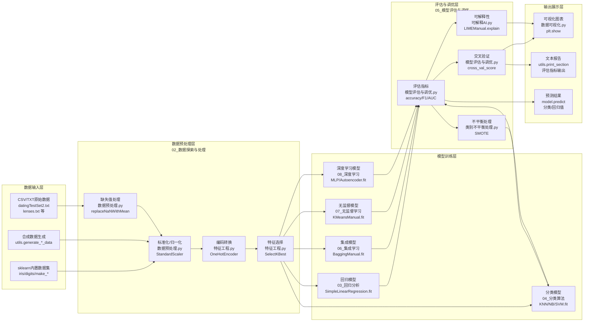

**说明：**

- **数据输入层**：三种数据来源——项目自带的 CSV/TXT 文件（如 `datingTestSet2.txt`）、sklearn 内置数据集（`digits`、`iris`）、以及 `utils.py` 中的合成数据生成函数
- **预处理层**：对应 `02_数据探索与处理/` 模块，依次经过缺失值处理、标准化、编码和特征选择
- **模型训练层**：5 类模型分别对应 `03-08` 模块，所有模型均接收预处理后的特征矩阵
- **评估层**：对应 `05_模型评估与调优/`，包含指标计算、交叉验证、可解释性分析和类别不平衡处理
- **输出层**：通过 `数据可视化.py` 和 `utils.print_section()` 输出图表与文本报告

### 2.5 状态图

展示模型从初始化到部署的完整状态转换过程，包含正常流程和异常状态。

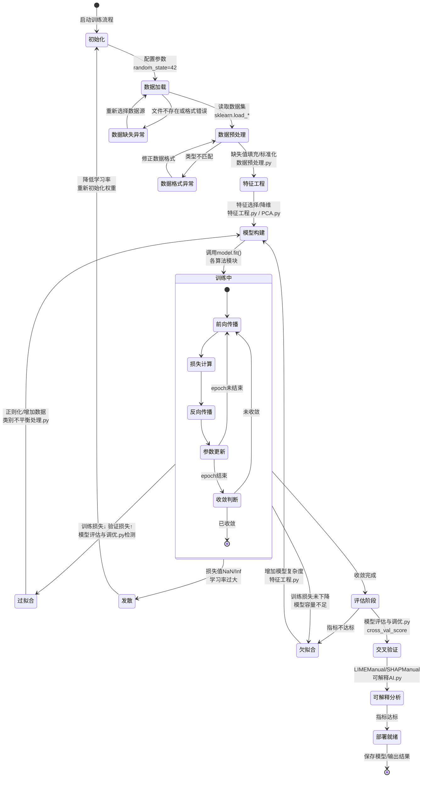

**说明：**

- **正常流程**：初始化 → 数据加载 → 预处理 → 特征工程 → 训练中（迭代前向/反向传播）→ 收敛 → 评估 → 部署
- **训练中**的内部状态展示了每个 epoch 的前向传播→损失计算→反向传播→参数更新的循环
- **三种异常状态**：
  - **过拟合**：训练损失持续下降但验证损失上升，需通过正则化或数据增强解决
  - **欠拟合**：训练损失无法下降，需增加模型复杂度或改进特征
  - **发散**：损失变为 NaN/Inf，通常因学习率过大导致，需降低学习率重新训练
- 评估阶段包含交叉验证和可解释性分析，确保模型质量

### 2.6 部署图

展示本地开发环境的部署架构，包含 Python 环境、依赖包、项目文件和数据文件的关系。

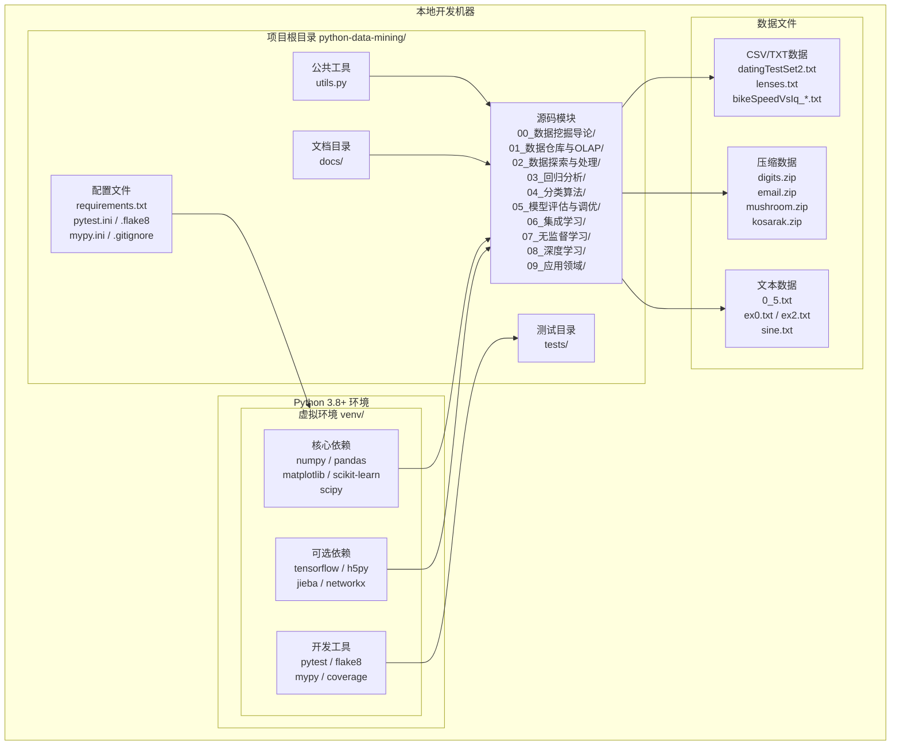

**说明：**

- **Python 环境**：推荐使用虚拟环境（venv）隔离项目依赖，核心依赖（numpy、pandas、matplotlib、scikit-learn、scipy）为必装项，tensorflow/jieba/networkx 为可选依赖
- **项目根目录**：包含 10 个功能模块（`00-09`）、公共工具 `utils.py`、测试目录 `tests/`、文档目录 `docs/` 和各类配置文件
- **数据文件**：分布在各模块子目录下，包括 CSV/TXT 格式的结构化数据、ZIP 压缩包和纯文本数据
- **配置文件**：`requirements.txt` 管理依赖清单，`pytest.ini`、`.flake8`、`mypy.ini` 分别配置测试、代码检查和类型检查规则

---

## 3. 模块依赖关系

### 3.1 核心依赖层次

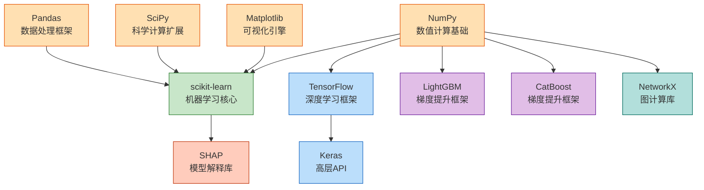

### 3.2 模块依赖映射

```mermaid
graph TB
    sklearn["scikit-learn"] --> M03["03 回归分析"]
    sklearn --> M04["04 分类算法"]
    sklearn --> M05["05 模型评估与调优"]
    sklearn --> M06["06 集成学习"]
    sklearn --> M07["07 无监督学习"]

    tensorflow["TensorFlow"] --> M08A["08 神经网络基础"]
    tensorflow --> M08B["08 CNN文本分类"]
    tensorflow --> M08C["08 自编码器与VAE"]
    tensorflow --> M08D["08 对比学习与自监督"]
    tensorflow --> M08E["08 Transformer"]

    lightgbm["LightGBM"] --> M06N["06+ 现代梯度提升"]
    catboost["CatBoost"] --> M06N

    networkx["NetworkX"] --> M09D["09 图与网络挖掘"]
    networkx --> M09E["09 图神经网络"]

    shap["SHAP"] --> M05N["05+ 可解释AI"]

    M03 --> M09B["09 时间序列分析"]
    M04 --> M09A["09 NLP"]
    M07 --> M09C["09 推荐系统"]
    M07 --> M09D
    M08A --> M08C
    M08A --> M08D
    M08A --> M08E

    jieba["jieba"] --> M09A

    style sklearn fill:#c8e6c9,stroke:#2e7d32
    style tensorflow fill:#bbdefb,stroke:#1565c0
    style lightgbm fill:#e1bee7,stroke:#6a1b9a
    style catboost fill:#e1bee7,stroke:#6a1b9a
    style networkx fill:#b2dfdb,stroke:#00695c
    style shap fill:#ffccbc,stroke:#bf360c
    style jieba fill:#fff9c4,stroke:#f57f17
```

### 3.3 依赖清单

| 分类 | 依赖包 | 版本要求 | 使用模块 |
|------|--------|---------|----------|
| 核心依赖 | numpy | >=1.20 | 全部模块 |
| 核心依赖 | pandas | >=1.3 | 全部模块 |
| 核心依赖 | matplotlib | >=3.4 | 全部模块 |
| 核心依赖 | scikit-learn | >=1.0 | 03-07 模块 |
| 核心依赖 | scipy | >=1.7 | 02/05/07 模块 |
| 深度学习 | tensorflow | >=2.6 | 08 深度学习 |
| 深度学习 | h5py | >=3.0 | 08 深度学习 |
| 梯度提升 | lightgbm | >=3.0 | 06+ 现代梯度提升 |
| 梯度提升 | catboost | >=1.0 | 06+ 现代梯度提升 |
| 图计算 | networkx | >=2.6 | 09 图与网络挖掘 / 图神经网络 |
| NLP | jieba | >=0.42 | 09 NLP |
| 模型解释 | shap | >=0.40 | 05+ 可解释AI |

---

## 4. 本地部署

### 4.1 本地部署架构

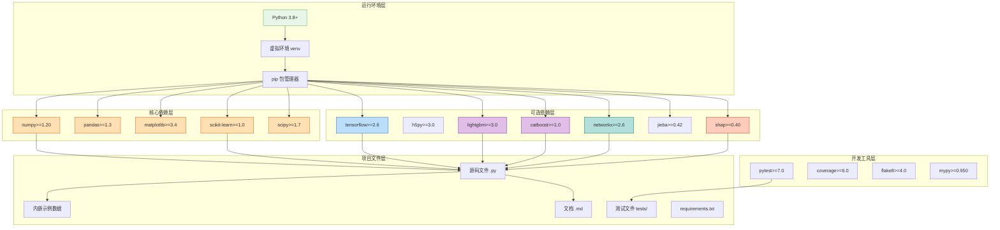

### 4.2 安装流程

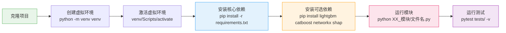

### 4.3 部署说明

项目为纯 Python 脚本集，无需服务器部署，本地运行即可。具体说明如下：

| 项目 | 说明 |
|------|------|
| 运行方式 | `python XX_模块/文件名.py`，每个文件可独立运行 |
| 环境要求 | Python 3.8+，推荐 3.10 |
| 核心安装 | `pip install numpy pandas matplotlib scikit-learn scipy` |
| 可选安装 | `pip install tensorflow h5py lightgbm catboost networkx jieba shap` |
| 开发工具 | `pip install pytest coverage flake8 mypy` |
| 图形界面 | 无 GUI 环境下需设置 `matplotlib.use('Agg')` |
| 中文字体 | `plt.rcParams['font.sans-serif'] = ['SimHei', 'Microsoft YaHei']` |
| 随机种子 | 固定 `random_state=42` 或 `np.random.seed(42)` |
