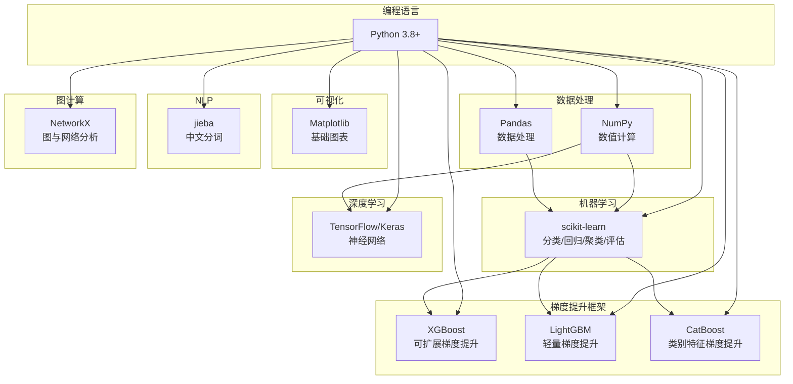

# 项目概述

> 🏠 [项目首页](../README.md) | 📚 [文档中心](./README.md) | ⬅ [毕业项目](./08-毕业项目.md) | 📍 项目概述 | ➡ [需求规格](./10-需求规格说明书.md)

---

## 1. 项目简介

### 1.1 项目名称

**Python 数据挖掘学习路径**（python-data-mining）

### 1.2 项目定位

本项目是一个**系统化的数据挖掘知识库与代码实现集**，以 Python 为主要编程语言，完整覆盖从数据仓库到深度学习、从基础算法到行业应用的数据挖掘知识体系。项目遵循 **CRISP-DM**（Cross-Industry Standard Process for Data Mining）标准流程组织内容，使学习者按照"认知与数据 → 预测建模 → 模式发现 → 场景实战"的4阶段路线渐进学习。

### 1.3 项目目标

| 目标 | 说明 |
|------|------|
| **知识覆盖** | 覆盖 Han & Kamber《数据挖掘：概念与技术》核心章节内容 |
| **代码可运行** | 每个模块均为独立可运行的 Python 脚本，含完整示例数据 |
| **教学导向** | 从手动实现到 sklearn 调用，从理论到实践双线并行 |
| **企业可用** | 新成员可通过本项目快速掌握数据挖掘全栈技能 |

### 1.4 目标用户

- 数据挖掘/机器学习方向的初学者
- 企业数据团队新入职成员
- 需要快速查阅特定算法实现的学习者
- 数据挖掘课程的教学参考

---

## 2. 技术栈

### 2.1 核心技术栈



### 2.2 依赖清单

| 库 | 版本 | 用途 | 使用模块 |
|----|------|------|----------|
| numpy | ≥1.20 | 数值计算、矩阵运算 | 全部模块 |
| pandas | ≥1.3 | 数据处理、ETL演示 | 01数据仓库、02数据探索 |
| matplotlib | ≥3.4 | 数据可视化 | 02数据可视化、03回归、04分类 |
| scikit-learn | ≥1.0 | 机器学习算法与评估 | 02~09全部算法模块 |
| tensorflow | ≥2.6 | 深度学习 | 08深度学习 |
| h5py | ≥3.0 | 模型存储 | 08深度学习 |
| jieba | ≥0.42 | 中文分词 | 09应用领域/NLP |
| scipy | ≥1.7 | 统计检验、优化 | 03回归分析 |
| lightgbm | ≥3.3 | 轻量梯度提升框架 | 06集成学习/现代梯度提升 |
| catboost | ≥1.0 | 类别特征梯度提升框架 | 06集成学习/现代梯度提升 |
| networkx | ≥2.6 | 图与网络分析 | 09应用领域/图与网络挖掘、图神经网络 |

### 2.3 开发环境

| 项目 | 推荐 |
|------|------|
| 操作系统 | Windows / macOS / Linux |
| IDE | VS Code（推荐） / PyCharm |
| Python | 3.8+ |
| 包管理 | pip / conda |

---

## 3. 快速上手

### 3.1 环境搭建

```bash
# 1. 克隆项目
git clone <repository-url>
cd python-data-mining

# 2. 创建虚拟环境（推荐）
python -m venv venv

# Windows 激活
venv\Scripts\activate

# macOS/Linux 激活
source venv/bin/activate

# 3. 安装核心依赖
pip install numpy pandas matplotlib scikit-learn scipy

# 4. 安装可选依赖
pip install tensorflow h5py jieba lightgbm catboost networkx
```

### 3.2 运行第一个模块

```bash
# 从项目根目录运行
python "00_数据挖掘导论/数据挖掘导论.py"
```

运行后将输出：
- 数据挖掘任务分类体系（描述性/预测性）
- CRISP-DM 标准流程
- 数据类型与数据质量
- 6种距离/相似度度量示例
- 数据挖掘典型应用场景

### 3.3 按学习路线运行

```mermaid
graph LR
    A["00_数据挖掘导论.py"] --> B["01_数据仓库基础.py"]
    B --> C["02_数据预处理.py"]
    C --> D["03_01_线性回归.py"]
    D --> E["04_K近邻算法.py"]
    E --> F["05_01_模型评估与调优.py"]
    F --> G["06_集成学习.py"]
    G --> H["07_KMeans聚类.py"]
    H --> I["08_01_神经网络基础.py"]
    I --> J["09_NLP基础.py"]
```



每个 `.py` 文件均可独立运行，无跨模块依赖。

---

## 4. 项目统计

| 指标 | 数值 |
|------|------|
| 顶级模块数 | 10 |
| Python 文件总数 | 78（67 源码 + 11 测试） |
| 知识方向数 | 4阶段 / 10模块 / 30+子方向 |
| 涵盖算法 | 115+ |
| 测试用例数 | 119 |
| 测试文件数 | 11 |
| 参考标准 | CRISP-DM、Han & Kamber 第3版 |

### 4.1 算法覆盖一览

| 模块 | 核心算法 |
|------|----------|
| 00 数据挖掘导论 | CRISP-DM、欧氏/曼哈顿/余弦/闵可夫斯基/马氏距离、Jaccard相似度 |
| 01 数据仓库与OLAP | 星型/雪花模型、ETL流水线、ROLAP/MOLAP、上卷/下钻/切片/切块 |
| 02 数据探索与处理 | 缺失值处理、标准化/归一化、独热编码/目标编码、PCA特征选择、箱线图/散点图/热力图 |
| 03 回归分析 | 线性回归（正规方程/梯度下降）、岭回归/Lasso、逻辑回归、Softmax回归 |
| 04 分类算法 | KNN、朴素贝叶斯、ID3/C4.5/CART决策树、SVM（线性/RBF/SMO）、半监督学习（自训练/协同训练）、迁移学习 |
| 05 模型评估与调优 | 交叉验证、网格搜索/随机搜索、ROC-AUC/PR曲线、过采样/欠采样/SMOTE、LIME/SHAP/PDP/ICE |
| 06 集成学习 | Bagging/随机森林、AdaBoost/GBDT/XGBoost、LightGBM（GOSS/EFB）、CatBoost（有序目标编码）、Stacking |
| 07 无监督学习 | KMeans/Mini-Batch KMeans/DBSCAN/GMM/层次聚类、Apriori/FP-Growth/序列模式、PCA/SVD、孤立森林/LOF |
| 08 深度学习 | BP神经网络、CNN文本分类、自编码器/去噪自编码器/VAE、SimCLR/NT-Xent、Transformer/多头注意力/位置编码 |
| 09 应用领域 | TF-IDF/TextRank、ARIMA/指数平滑、协同过滤/SVD推荐、PageRank/GCN/GAT/GraphSAGE、DP-SGD/FedAvg |

---

## 5. 项目结构概览

```
python-data-mining/
├── 00_数据挖掘导论/                    # CRISP-DM、任务分类、距离度量
│   └── 数据挖掘导论.py
├── 01_数据仓库与OLAP/                  # 数据仓库架构、ETL、OLAP操作
│   ├── 01_数据仓库基础/数据仓库基础.py
│   └── 02_OLAP多维分析/OLAP多维分析.py
├── 02_数据探索与处理/                   # 预处理、特征工程、可视化
│   ├── 01_数据预处理与特征工程/
│   │   ├── 数据预处理.py
│   │   └── 特征工程.py
│   └── 02_数据可视化/数据可视化.py
├── 03_回归分析/                        # 线性回归、逻辑回归
│   ├── 01_线性回归.py
│   └── 02_逻辑回归.py
├── 04_分类算法/                        # KNN、贝叶斯、决策树、SVM、半监督
│   ├── 01_K近邻算法/
│   ├── 02_朴素贝叶斯/
│   ├── 03_决策树/                      # ID3/C4.5/CART + 可视化GUI
│   ├── 04_支持向量机/
│   └── 05_半监督学习与迁移学习/
├── 05_模型评估与调优/                   # 评估指标、不平衡处理、可解释AI
│   ├── 01_模型评估与调优.py
│   ├── 02_类别不平衡处理.py
│   └── 03_可解释AI/可解释AI.py         # 🆕 LIME/SHAP/PDP/ICE
├── 06_集成学习/                        # Bagging、Boosting、Stacking
│   ├── 集成学习.py
│   └── 02_现代梯度提升/现代梯度提升.py  # 🆕 LightGBM/CatBoost/XGBoost对比
├── 07_无监督学习/                      # 聚类、关联规则、降维、异常检测
│   ├── 01_聚类分析/                    # KMeans + 高级聚类(DBSCAN/GMM)
│   ├── 02_关联规则挖掘/                # Apriori/FP-Growth/序列模式
│   ├── 03_降维与矩阵分解/              # PCA/SVD推荐/SVD图像压缩
│   └── 04_异常检测/异常检测.py
├── 08_深度学习/                        # 神经网络、CNN、自编码器、对比学习、Transformer
│   ├── 01_神经网络基础/神经网络基础.py
│   ├── 02_文本分类模型对比/            # CNN/SVM/逻辑回归/随机森林
│   ├── 03_自编码器与生成模型/自编码器与VAE.py  # 🆕 AE/DAE/VAE
│   ├── 04_对比学习与自监督学习/对比学习与自监督学习.py  # 🆕 SimCLR/NT-Xent
│   └── 05_Transformer与注意力机制/Transformer与注意力机制.py  # 🆕 多头注意力/位置编码
├── 09_应用领域/                        # NLP、时序、推荐、图挖掘、Web、流数据、联邦学习
│   ├── 01_自然语言处理/NLP基础.py
│   ├── 02_时间序列分析/时间序列分析.py
│   ├── 03_推荐系统/推荐系统.py
│   ├── 04_图与网络挖掘/
│   │   ├── 图与网络挖掘.py
│   │   └── 02_图神经网络/图神经网络.py  # 🆕 GCN/GAT/GraphSAGE
│   ├── 05_Web挖掘/Web挖掘.py
│   ├── 06_流数据挖掘/流数据挖掘.py
│   └── 07_联邦学习与隐私保护/联邦学习与隐私保护.py  # 🆕 FedAvg/DP-SGD
├── tests/                             # 🧪 11个测试文件，119个测试用例
├── docs/                              # 📚 项目文档（本目录）
└── README.md                          # 学习路线总览
```

### 5.1 新增模块说明

| 新增模块 | 所属 | 核心内容 | 源码链接 |
|----------|------|----------|----------|
| 可解释AI | 05_模型评估与调优 | LIME手动实现、SHAP值、PDP/ICE | GitHub [可解释AI.py](../05_模型评估与调优/03_可解释AI/可解释AI.py) · VSCode [可解释AI.py](file:///d:/Dev/DevWorkSpace/VS%20Code/Python/python-data-mining/05_模型评估与调优/03_可解释AI/可解释AI.py) |
| 现代梯度提升 | 06_集成学习 | LightGBM、CatBoost、三大框架对比 | GitHub [现代梯度提升.py](../06_集成学习/02_现代梯度提升/现代梯度提升.py) · VSCode [现代梯度提升.py](file:///d:/Dev/DevWorkSpace/VS%20Code/Python/python-data-mining/06_集成学习/02_现代梯度提升/现代梯度提升.py) |
| 自编码器与VAE | 08_深度学习 | AE/DAE/VAE手动实现、异常检测 | GitHub [自编码器与VAE.py](../08_深度学习/03_自编码器与生成模型/自编码器与VAE.py) · VSCode [自编码器与VAE.py](file:///d:/Dev/DevWorkSpace/VS%20Code/Python/python-data-mining/08_深度学习/03_自编码器与生成模型/自编码器与VAE.py) |
| 对比学习与自监督学习 | 08_深度学习 | SimCLR、NT-Xent损失、线性评估 | GitHub [对比学习与自监督学习.py](../08_深度学习/04_对比学习与自监督学习/对比学习与自监督学习.py) · VSCode [对比学习与自监督学习.py](file:///d:/Dev/DevWorkSpace/VS%20Code/Python/python-data-mining/08_深度学习/04_对比学习与自监督学习/对比学习与自监督学习.py) |
| Transformer与注意力机制 | 08_深度学习 | 缩放点积注意力、多头注意力、位置编码 | GitHub [Transformer与注意力机制.py](../08_深度学习/05_Transformer与注意力机制/Transformer与注意力机制.py) · VSCode [Transformer与注意力机制.py](file:///d:/Dev/DevWorkSpace/VS%20Code/Python/python-data-mining/08_深度学习/05_Transformer与注意力机制/Transformer与注意力机制.py) |
| 图神经网络 | 09_应用领域 | GCN、GAT、GraphSAGE、节点分类 | GitHub [图神经网络.py](../09_应用领域/04_图与网络挖掘/02_图神经网络/图神经网络.py) · VSCode [图神经网络.py](file:///d:/Dev/DevWorkSpace/VS%20Code/Python/python-data-mining/09_应用领域/04_图与网络挖掘/02_图神经网络/图神经网络.py) |
| 联邦学习与隐私保护 | 09_应用领域 | FedAvg、差分隐私、DP-SGD | GitHub [联邦学习与隐私保护.py](../09_应用领域/07_联邦学习与隐私保护/联邦学习与隐私保护.py) · VSCode [联邦学习与隐私保护.py](file:///d:/Dev/DevWorkSpace/VS%20Code/Python/python-data-mining/09_应用领域/07_联邦学习与隐私保护/联邦学习与隐私保护.py) |

---

## 6. 与同类项目对比

| 特性 | 本项目 | 典型教程仓库 | 纯理论课程 |
|------|--------|-------------|-----------|
| 代码可运行 | ✅ 独立运行 | ⚠️ 需额外配置 | ❌ 无代码 |
| 手动实现 | ✅ 从零实现核心算法 | ⚠️ 仅sklearn调用 | ❌ |
| 知识体系完整 | ✅ 覆盖10大方向30+子方向 | ⚠️ 常见3-5个方向 | ✅ |
| 数据仓库/OLAP | ✅ 权威教材级别 | ❌ 通常缺失 | ⚠️ |
| 应用领域 | ✅ 7大方向（NLP/时序/推荐/图/Web/流数据/联邦学习） | ⚠️ 1-2个 | ⚠️ |
| CRISP-DM流程 | ✅ 学习路线遵循 | ❌ | ⚠️ |
| 可解释AI | ✅ LIME/SHAP/PDP/ICE | ❌ 通常缺失 | ⚠️ |
| 现代梯度提升 | ✅ LightGBM/CatBoost/XGBoost对比 | ⚠️ 仅XGBoost | ⚠️ |
| 深度学习前沿 | ✅ VAE/对比学习/Transformer | ⚠️ 仅基础CNN | ⚠️ |
| 图神经网络 | ✅ GCN/GAT/GraphSAGE | ❌ 通常缺失 | ⚠️ |
| 联邦学习 | ✅ FedAvg/DP-SGD | ❌ 通常缺失 | ⚠️ |
| 测试覆盖 | ✅ 119个测试用例 | ❌ 通常无测试 | ❌ |
| 算法数量 | ✅ 115+ | ⚠️ 20-30 | ✅ |
