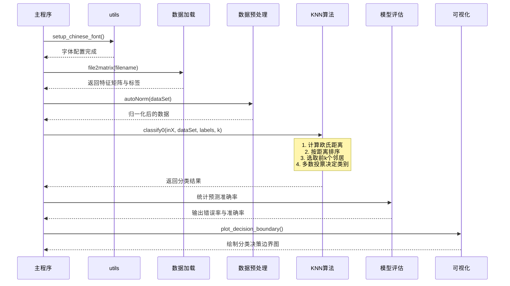

# 实施与开发文档

> 🏠 [项目首页](../README.md) | 📚 [文档中心](./README.md) | ⬅ [详细设计](./09-详细设计文档.md) | 📍 实施与开发文档 | ➡ [测试与质量](./11-测试与质量文档.md)

---

## 1. 开发规范

### 1.1 编码规范

| 规范 | 说明 |
|------|------|
| 语言 | Python 3.8+ |
| 命名 | 函数/变量用 snake_case，类用 PascalCase |
| 注释 | 关键算法含详细中文注释 |
| 文件编码 | UTF-8 |
| 导入顺序 | 标准库 → 第三方库 → 本地模块（utils） |
| 类型注解 | 核心函数添加 type hints |
| 输入验证 | 核心算法函数检查输入合法性 |
| 中文字体 | 统一使用 `utils.setup_chinese_font()` 替代手动 `rcParams` 配置 |
| 命名空间 | 禁止 `from numpy import *`，使用 `import numpy as np` 显式引用 |
| 资源管理 | 文件操作使用 `with open()` 上下文管理器，确保资源自动释放 |
| 随机种子 | 固定 `random_state=42` 或 `np.random.seed(42)`，保证结果可复现 |
| 分节标记 | 使用 `# ====...====` 分隔代码逻辑段落 |

### 1.2 文件命名规范

| 层级 | 格式 | 示例 |
|------|------|------|
| 顶级目录 | `编号_模块名` | `03_回归分析/` |
| 子目录 | `编号_子方向名` | `01_聚类分析/` |
| 核心算法文件 | `中文名称.py` | `K近邻算法.py` |
| 案例文件 | `编号_案例名称.py` | `02_手写数字识别.py` |
| 辅助模块 | `英文名称.py` | `treePlotter.py` |

---

## 2. 目录结构

```
python-data-mining/
├── 00_数据挖掘导论/
│   └── 数据挖掘导论.py
├── 01_数据仓库与OLAP/
│   ├── 01_数据仓库基础/
│   │   └── 数据仓库基础.py
│   └── 02_OLAP多维分析/
│       └── OLAP多维分析.py
├── 02_数据探索与处理/
│   ├── 01_数据预处理与特征工程/
│   │   ├── 数据预处理.py
│   │   └── 特征工程.py
│   └── 02_数据可视化/
│       └── 数据可视化.py
├── 03_回归分析/
│   ├── 01_线性回归.py
│   └── 02_逻辑回归.py
├── 04_分类算法/
│   ├── 01_K近邻算法/
│   │   ├── K近邻算法.py
│   │   └── 02_手写数字识别.py
│   ├── 02_朴素贝叶斯/
│   │   ├── 朴素贝叶斯算法.py
│   │   └── 02_垃圾邮件分类.py
│   ├── 03_决策树/
│   │   ├── 01_ID3决策树/
│   │   │   ├── ID3补充实现.py
│   │   │   ├── ID3分类案例.py
│   │   │   ├── trees.py
│   │   │   └── treePlotter.py
│   │   ├── 02_C45决策树/
│   │   │   └── C45决策树.py
│   │   ├── 03_CART回归树/
│   │   │   ├── CART.py
│   │   │   ├── CART回归树案例.py
│   │   │   ├── regTrees.py
│   │   │   └── treeExplore.py
│   │   └── 04_CART可视化GUI/
│   │       ├── CART.py
│   │       └── GUI.py
│   ├── 04_支持向量机/
│   │   ├── SVM算法.py
│   │   └── 02_手写数字识别.py
│   └── 05_半监督学习与迁移学习/
│       └── 半监督学习与迁移学习.py
├── 05_模型评估与调优/
│   ├── 01_模型评估与调优.py
│   ├── 02_类别不平衡处理.py
│   └── 03_可解释AI/                          ★ 新增
│       └── 可解释AI.py
├── 06_集成学习/
│   ├── 集成学习.py
│   └── 02_现代梯度提升/                       ★ 新增
│       └── 现代梯度提升.py
├── 07_无监督学习/
│   ├── 01_聚类分析/
│   │   ├── KMeans聚类.py
│   │   └── 高级聚类.py
│   ├── 02_关联规则挖掘/
│   │   ├── 01_Apriori算法/
│   │   │   └── Apriori.py
│   │   ├── 02_FPGrowth算法/
│   │   │   ├── FP_Growth算法.py
│   │   │   ├── FP_Growth.py
│   │   │   └── fpGrowth.py
│   │   └── 03_序列模式挖掘/                   ★ 新增
│   │       └── 序列模式挖掘.py
│   ├── 03_降维与矩阵分解/
│   │   ├── 01_PCA主成分分析/
│   │   │   └── PCA.py
│   │   ├── 02_SVD推荐系统/
│   │   │   └── SVD.py
│   │   └── 03_SVD图像压缩/
│   │       └── SVD.py
│   └── 04_异常检测/
│       └── 异常检测.py
├── 08_深度学习/
│   ├── 01_神经网络基础/
│   │   └── 神经网络基础.py
│   ├── 02_文本分类模型对比/
│   │   ├── CNN文本分类.py
│   │   ├── SVM文本分类.py
│   │   ├── 逻辑回归文本分类.py
│   │   └── 随机森林文本分类.py
│   ├── 03_自编码器与生成模型/                  ★ 新增
│   │   └── 自编码器与VAE.py
│   ├── 04_对比学习与自监督学习/                ★ 新增
│   │   └── 对比学习与自监督学习.py
│   └── 05_Transformer与注意力机制/             ★ 新增
│       └── Transformer与注意力机制.py
├── 09_应用领域/
│   ├── 01_自然语言处理/
│   │   └── NLP基础.py
│   ├── 02_时间序列分析/
│   │   └── 时间序列分析.py
│   ├── 03_推荐系统/
│   │   └── 推荐系统.py
│   ├── 04_图与网络挖掘/
│   │   ├── 图与网络挖掘.py
│   │   └── 02_图神经网络/
│   │       └── 图神经网络.py
│   ├── 05_Web挖掘/
│   │   └── Web挖掘.py
│   ├── 06_流数据挖掘/
│   │   └── 流数据挖掘.py
│   └── 07_联邦学习与隐私保护/                 ★ 新增
│       └── 联邦学习与隐私保护.py
├── docs/
├── tests/                                     # 自动化测试（11个文件）
│   ├── __init__.py
│   ├── test_00_数据挖掘导论.py
│   ├── test_03_线性回归.py
│   ├── test_04_分类算法.py                    ★ 新增
│   ├── test_05_模型评估与调优.py               ★ 新增
│   ├── test_06_集成学习.py                     ★ 新增
│   ├── test_07_KMeans聚类.py
│   ├── test_07_无监督学习.py                   ★ 新增
│   ├── test_08_深度学习.py                     ★ 新增
│   ├── test_09_应用领域.py                     ★ 新增
│   └── test_utils.py
├── utils.py                                   # 公共工具模块
├── CONTRIBUTING.md
├── LICENSE
├── DISCLAIMER
├── README.md
└── requirements.txt
```

> ★ 标记为本次新增的 7 个模块和 7 个测试文件

---

## 3. 源码导读与跳转

> 源码链接提供双格式：**GitHub**（相对路径，适合在线浏览）和 **VSCode**（绝对路径，适合本地跳转）

### 3.0 公共工具模块

| 函数 | 功能 | GitHub | VSCode |
|------|------|--------|--------|
| `setup_chinese_font()` | 中文字体统一配置 | [utils.py#L17](../utils.py#L17) | [utils.py#L17](file:///d:/Dev/DevWorkSpace/VS%20Code/Python/python-data-mining/utils.py#L17) |
| `setup_non_interactive_backend()` | 无GUI后端设置 | [utils.py#L30](../utils.py#L30) | [utils.py#L30](file:///d:/Dev/DevWorkSpace/VS%20Code/Python/python-data-mining/utils.py#L30) |
| `generate_classification_data()` | 分类数据生成 | [utils.py#L37](../utils.py#L37) | [utils.py#L37](file:///d:/Dev/DevWorkSpace/VS%20Code/Python/python-data-mining/utils.py#L37) |
| `generate_regression_data()` | 回归数据生成 | [utils.py#L48](../utils.py#L48) | [utils.py#L48](file:///d:/Dev/DevWorkSpace/VS%20Code/Python/python-data-mining/utils.py#L48) |
| `generate_cluster_data()` | 聚类数据生成 | [utils.py#L58](../utils.py#L58) | [utils.py#L58](file:///d:/Dev/DevWorkSpace/VS%20Code/Python/python-data-mining/utils.py#L58) |
| `print_section()` | 分节标题打印 | [utils.py#L68](../utils.py#L68) | [utils.py#L68](file:///d:/Dev/DevWorkSpace/VS%20Code/Python/python-data-mining/utils.py#L68) |
| `print_subsection()` | 子节标题打印 | [utils.py#L75](../utils.py#L75) | [utils.py#L75](file:///d:/Dev/DevWorkSpace/VS%20Code/Python/python-data-mining/utils.py#L75) |

### 3.1 模块00：数据挖掘导论

| 函数 | 功能 | GitHub | VSCode |
|------|------|--------|--------|
| `print_mining_tasks()` | 任务分类体系 | [数据挖掘导论.py#L30](../00_数据挖掘导论/数据挖掘导论.py#L30) | [数据挖掘导论.py#L30](file:///d:/Dev/DevWorkSpace/VS%20Code/Python/python-data-mining/00_数据挖掘导论/数据挖掘导论.py#L30) |
| `print_crisp_dm()` | CRISP-DM流程 | [数据挖掘导论.py#L60](../00_数据挖掘导论/数据挖掘导论.py#L60) | [数据挖掘导论.py#L60](file:///d:/Dev/DevWorkSpace/VS%20Code/Python/python-data-mining/00_数据挖掘导论/数据挖掘导论.py#L60) |
| `data_types_overview()` | 数据类型概览 | [数据挖掘导论.py#L90](../00_数据挖掘导论/数据挖掘导论.py#L90) | [数据挖掘导论.py#L90](file:///d:/Dev/DevWorkSpace/VS%20Code/Python/python-data-mining/00_数据挖掘导论/数据挖掘导论.py#L90) |
| `euclidean_distance()` | 欧氏距离 | [数据挖掘导论.py#L128](../00_数据挖掘导论/数据挖掘导论.py#L128) | [数据挖掘导论.py#L128](file:///d:/Dev/DevWorkSpace/VS%20Code/Python/python-data-mining/00_数据挖掘导论/数据挖掘导论.py#L128) |
| `manhattan_distance()` | 曼哈顿距离 | [数据挖掘导论.py#L135](../00_数据挖掘导论/数据挖掘导论.py#L135) | [数据挖掘导论.py#L135](file:///d:/Dev/DevWorkSpace/VS%20Code/Python/python-data-mining/00_数据挖掘导论/数据挖掘导论.py#L135) |
| `cosine_similarity()` | 余弦相似度 | [数据挖掘导论.py#L149](../00_数据挖掘导论/数据挖掘导论.py#L149) | [数据挖掘导论.py#L149](file:///d:/Dev/DevWorkSpace/VS%20Code/Python/python-data-mining/00_数据挖掘导论/数据挖掘导论.py#L149) |
| `demo_distance_metrics()` | 距离度量演示 | [数据挖掘导论.py#L180](../00_数据挖掘导论/数据挖掘导论.py#L180) | [数据挖掘导论.py#L180](file:///d:/Dev/DevWorkSpace/VS%20Code/Python/python-data-mining/00_数据挖掘导论/数据挖掘导论.py#L180) |
| `print_applications()` | 应用领域介绍 | [数据挖掘导论.py#L207](../00_数据挖掘导论/数据挖掘导论.py#L207) | [数据挖掘导论.py#L207](file:///d:/Dev/DevWorkSpace/VS%20Code/Python/python-data-mining/00_数据挖掘导论/数据挖掘导论.py#L207) |
| `visualize_distance_metrics()` | 距离度量可视化 | [数据挖掘导论.py#L248](../00_数据挖掘导论/数据挖掘导论.py#L248) | [数据挖掘导论.py#L248](file:///d:/Dev/DevWorkSpace/VS%20Code/Python/python-data-mining/00_数据挖掘导论/数据挖掘导论.py#L248) |

### 3.2 模块01：数据仓库与OLAP

| 函数 | 功能 | GitHub | VSCode |
|------|------|--------|--------|
| `demonstrate_warehouse_architecture()` | 数据仓库架构 | [数据仓库基础.py#L31](../01_数据仓库与OLAP/01_数据仓库基础/数据仓库基础.py#L31) | [数据仓库基础.py#L31](file:///d:/Dev/DevWorkSpace/VS%20Code/Python/python-data-mining/01_数据仓库与OLAP/01_数据仓库基础/数据仓库基础.py#L31) |
| `demonstrate_multidimensional_model()` | 多维数据模型 | [数据仓库基础.py#L71](../01_数据仓库与OLAP/01_数据仓库基础/数据仓库基础.py#L71) | [数据仓库基础.py#L71](file:///d:/Dev/DevWorkSpace/VS%20Code/Python/python-data-mining/01_数据仓库与OLAP/01_数据仓库基础/数据仓库基础.py#L71) |
| `demonstrate_etl_process()` | ETL过程 | [数据仓库基础.py#L150](../01_数据仓库与OLAP/01_数据仓库基础/数据仓库基础.py#L150) | [数据仓库基础.py#L150](file:///d:/Dev/DevWorkSpace/VS%20Code/Python/python-data-mining/01_数据仓库与OLAP/01_数据仓库基础/数据仓库基础.py#L150) |
| `demonstrate_metadata()` | 元数据管理 | [数据仓库基础.py#L211](../01_数据仓库与OLAP/01_数据仓库基础/数据仓库基础.py#L211) | [数据仓库基础.py#L211](file:///d:/Dev/DevWorkSpace/VS%20Code/Python/python-data-mining/01_数据仓库与OLAP/01_数据仓库基础/数据仓库基础.py#L211) |
| `build_data_cube()` | 构建数据立方体 | [OLAP多维分析.py#L30](../01_数据仓库与OLAP/02_OLAP多维分析/OLAP多维分析.py#L30) | [OLAP多维分析.py#L30](file:///d:/Dev/DevWorkSpace/VS%20Code/Python/python-data-mining/01_数据仓库与OLAP/02_OLAP多维分析/OLAP多维分析.py#L30) |
| `demonstrate_olap_operations()` | OLAP五大操作 | [OLAP多维分析.py#L75](../01_数据仓库与OLAP/02_OLAP多维分析/OLAP多维分析.py#L75) | [OLAP多维分析.py#L75](file:///d:/Dev/DevWorkSpace/VS%20Code/Python/python-data-mining/01_数据仓库与OLAP/02_OLAP多维分析/OLAP多维分析.py#L75) |
| `demonstrate_attribute_oriented_induction()` | 面向属性归纳 | [OLAP多维分析.py#L189](../01_数据仓库与OLAP/02_OLAP多维分析/OLAP多维分析.py#L189) | [OLAP多维分析.py#L189](file:///d:/Dev/DevWorkSpace/VS%20Code/Python/python-data-mining/01_数据仓库与OLAP/02_OLAP多维分析/OLAP多维分析.py#L189) |

### 3.3 模块02：数据探索与处理

| 函数 | 功能 | GitHub | VSCode |
|------|------|--------|--------|
| `handle_missing_values()` | 缺失值处理 | [数据预处理.py#L51](../02_数据探索与处理/01_数据预处理与特征工程/数据预处理.py#L51) | [数据预处理.py#L51](file:///d:/Dev/DevWorkSpace/VS%20Code/Python/python-data-mining/02_数据探索与处理/01_数据预处理与特征工程/数据预处理.py#L51) |
| `detect_outliers_iqr()` | IQR异常检测 | [数据预处理.py#L74](../02_数据探索与处理/01_数据预处理与特征工程/数据预处理.py#L74) | [数据预处理.py#L74](file:///d:/Dev/DevWorkSpace/VS%20Code/Python/python-data-mining/02_数据探索与处理/01_数据预处理与特征工程/数据预处理.py#L74) |
| `scale_features()` | 标准化/归一化 | [数据预处理.py#L118](../02_数据探索与处理/01_数据预处理与特征工程/数据预处理.py#L118) | [数据预处理.py#L118](file:///d:/Dev/DevWorkSpace/VS%20Code/Python/python-data-mining/02_数据探索与处理/01_数据预处理与特征工程/数据预处理.py#L118) |
| `encode_categorical()` | 类别编码 | [数据预处理.py#L146](../02_数据探索与处理/01_数据预处理与特征工程/数据预处理.py#L146) | [数据预处理.py#L146](file:///d:/Dev/DevWorkSpace/VS%20Code/Python/python-data-mining/02_数据探索与处理/01_数据预处理与特征工程/数据预处理.py#L146) |
| `split_data()` | 数据集划分 | [数据预处理.py#L172](../02_数据探索与处理/01_数据预处理与特征工程/数据预处理.py#L172) | [数据预处理.py#L172](file:///d:/Dev/DevWorkSpace/VS%20Code/Python/python-data-mining/02_数据探索与处理/01_数据预处理与特征工程/数据预处理.py#L172) |
| `feature_selection_rfe()` | RFE特征选择 | [特征工程.py#L59](../02_数据探索与处理/01_数据预处理与特征工程/特征工程.py#L59) | [特征工程.py#L59](file:///d:/Dev/DevWorkSpace/VS%20Code/Python/python-data-mining/02_数据探索与处理/01_数据预处理与特征工程/特征工程.py#L59) |
| `reduce_pca()` | PCA降维 | [特征工程.py#L134](../02_数据探索与处理/01_数据预处理与特征工程/特征工程.py#L134) | [特征工程.py#L134](file:///d:/Dev/DevWorkSpace/VS%20Code/Python/python-data-mining/02_数据探索与处理/01_数据预处理与特征工程/特征工程.py#L134) |
| `extract_tfidf()` | TF-IDF提取 | [特征工程.py#L157](../02_数据探索与处理/01_数据预处理与特征工程/特征工程.py#L157) | [特征工程.py#L157](file:///d:/Dev/DevWorkSpace/VS%20Code/Python/python-data-mining/02_数据探索与处理/01_数据预处理与特征工程/特征工程.py#L157) |
| `plot_basic_charts()` | 基础图表绘制 | [数据可视化.py#L48](../02_数据探索与处理/02_数据可视化/数据可视化.py#L48) | [数据可视化.py#L48](file:///d:/Dev/DevWorkSpace/VS%20Code/Python/python-data-mining/02_数据探索与处理/02_数据可视化/数据可视化.py#L48) |
| `plot_statistical_charts()` | 统计图表绘制 | [数据可视化.py#L82](../02_数据探索与处理/02_数据可视化/数据可视化.py#L82) | [数据可视化.py#L82](file:///d:/Dev/DevWorkSpace/VS%20Code/Python/python-data-mining/02_数据探索与处理/02_数据可视化/数据可视化.py#L82) |
| `plot_radar_chart()` | 雷达图绘制 | [数据可视化.py#L192](../02_数据探索与处理/02_数据可视化/数据可视化.py#L192) | [数据可视化.py#L192](file:///d:/Dev/DevWorkSpace/VS%20Code/Python/python-data-mining/02_数据探索与处理/02_数据可视化/数据可视化.py#L192) |

### 3.4 模块03：回归分析

| 函数/类 | 功能 | GitHub | VSCode |
|---------|------|--------|--------|
| `SimpleLinearRegression` | 一元线性回归 | [01_线性回归.py#L31](../03_回归分析/01_线性回归.py#L31) | [01_线性回归.py#L31](file:///d:/Dev/DevWorkSpace/VS%20Code/Python/python-data-mining/03_回归分析/01_线性回归.py#L31) |
| `LinearRegressionGD` | 多元线性回归(梯度下降) | [01_线性回归.py#L54](../03_回归分析/01_线性回归.py#L54) | [01_线性回归.py#L54](file:///d:/Dev/DevWorkSpace/VS%20Code/Python/python-data-mining/03_回归分析/01_线性回归.py#L54) |
| `compare_regularization()` | Ridge/Lasso/ElasticNet | [01_线性回归.py#L87](../03_回归分析/01_线性回归.py#L87) | [01_线性回归.py#L87](file:///d:/Dev/DevWorkSpace/VS%20Code/Python/python-data-mining/03_回归分析/01_线性回归.py#L87) |
| `regression_diagnostics()` | 回归诊断 | [01_线性回归.py#L113](../03_回归分析/01_线性回归.py#L113) | [01_线性回归.py#L113](file:///d:/Dev/DevWorkSpace/VS%20Code/Python/python-data-mining/03_回归分析/01_线性回归.py#L113) |
| `LogisticRegressionGD` | 逻辑回归 | [02_逻辑回归.py#L34](../03_回归分析/02_逻辑回归.py#L34) | [02_逻辑回归.py#L34](file:///d:/Dev/DevWorkSpace/VS%20Code/Python/python-data-mining/03_回归分析/02_逻辑回归.py#L34) |
| `SoftmaxRegression` | Softmax多分类 | [02_逻辑回归.py#L93](../03_回归分析/02_逻辑回归.py#L93) | [02_逻辑回归.py#L93](file:///d:/Dev/DevWorkSpace/VS%20Code/Python/python-data-mining/03_回归分析/02_逻辑回归.py#L93) |
| `plot_roc_curve()` | ROC曲线 | [02_逻辑回归.py#L151](../03_回归分析/02_逻辑回归.py#L151) | [02_逻辑回归.py#L151](file:///d:/Dev/DevWorkSpace/VS%20Code/Python/python-data-mining/03_回归分析/02_逻辑回归.py#L151) |
| `plot_decision_boundary()` | 决策边界可视化 | [02_逻辑回归.py#L168](../03_回归分析/02_逻辑回归.py#L168) | [02_逻辑回归.py#L168](file:///d:/Dev/DevWorkSpace/VS%20Code/Python/python-data-mining/03_回归分析/02_逻辑回归.py#L168) |

### 3.5 模块04：分类算法

| 函数/类 | 功能 | GitHub | VSCode |
|---------|------|--------|--------|
| `classify0()` | KNN分类核心 | [K近邻算法.py#L48](../04_分类算法/01_K近邻算法/K近邻算法.py#L48) | [K近邻算法.py#L48](file:///d:/Dev/DevWorkSpace/VS%20Code/Python/python-data-mining/04_分类算法/01_K近邻算法/K近邻算法.py#L48) |
| `file2matrix()` | 文件解析 | [K近邻算法.py#L67](../04_分类算法/01_K近邻算法/K近邻算法.py#L67) | [K近邻算法.py#L67](file:///d:/Dev/DevWorkSpace/VS%20Code/Python/python-data-mining/04_分类算法/01_K近邻算法/K近邻算法.py#L67) |
| `autoNorm()` | 归一化 | [K近邻算法.py#L82](../04_分类算法/01_K近邻算法/K近邻算法.py#L82) | [K近邻算法.py#L82](file:///d:/Dev/DevWorkSpace/VS%20Code/Python/python-data-mining/04_分类算法/01_K近邻算法/K近邻算法.py#L82) |
| `datingClassTest()` | 约会分类测试 | [K近邻算法.py#L92](../04_分类算法/01_K近邻算法/K近邻算法.py#L92) | [K近邻算法.py#L92](file:///d:/Dev/DevWorkSpace/VS%20Code/Python/python-data-mining/04_分类算法/01_K近邻算法/K近邻算法.py#L92) |
| `handwritingClassTest()` | 手写数字识别 | [K近邻算法.py#L117](../04_分类算法/01_K近邻算法/K近邻算法.py#L117) | [K近邻算法.py#L117](file:///d:/Dev/DevWorkSpace/VS%20Code/Python/python-data-mining/04_分类算法/01_K近邻算法/K近邻算法.py#L117) |
| `trainNB0()` | 朴素贝叶斯训练 | [朴素贝叶斯算法.py#L62](../04_分类算法/02_朴素贝叶斯/朴素贝叶斯算法.py#L62) | [朴素贝叶斯算法.py#L62](file:///d:/Dev/DevWorkSpace/VS%20Code/Python/python-data-mining/04_分类算法/02_朴素贝叶斯/朴素贝叶斯算法.py#L62) |
| `classifyNB()` | 朴素贝叶斯分类 | [朴素贝叶斯算法.py#L79](../04_分类算法/02_朴素贝叶斯/朴素贝叶斯算法.py#L79) | [朴素贝叶斯算法.py#L79](file:///d:/Dev/DevWorkSpace/VS%20Code/Python/python-data-mining/04_分类算法/02_朴素贝叶斯/朴素贝叶斯算法.py#L79) |
| `spamTest()` | 垃圾邮件分类 | [朴素贝叶斯算法.py#L113](../04_分类算法/02_朴素贝叶斯/朴素贝叶斯算法.py#L113) | [朴素贝叶斯算法.py#L113](file:///d:/Dev/DevWorkSpace/VS%20Code/Python/python-data-mining/04_分类算法/02_朴素贝叶斯/朴素贝叶斯算法.py#L113) |
| `smoSimple()` | 简化SMO算法 | [SVM算法.py#L62](../04_分类算法/04_支持向量机/SVM算法.py#L62) | [SVM算法.py#L62](file:///d:/Dev/DevWorkSpace/VS%20Code/Python/python-data-mining/04_分类算法/04_支持向量机/SVM算法.py#L62) |
| `smoP()` | 完整Platt SMO | [SVM算法.py#L184](../04_分类算法/04_支持向量机/SVM算法.py#L184) | [SVM算法.py#L184](file:///d:/Dev/DevWorkSpace/VS%20Code/Python/python-data-mining/04_分类算法/04_支持向量机/SVM算法.py#L184) |
| `kernelTrans()` | 核函数转换 | [SVM算法.py#L103](../04_分类算法/04_支持向量机/SVM算法.py#L103) | [SVM算法.py#L103](file:///d:/Dev/DevWorkSpace/VS%20Code/Python/python-data-mining/04_分类算法/04_支持向量机/SVM算法.py#L103) |
| `self_training_demo()` | 自训练半监督 | [半监督学习与迁移学习.py#L65](../04_分类算法/05_半监督学习与迁移学习/半监督学习与迁移学习.py#L65) | [半监督学习与迁移学习.py#L65](file:///d:/Dev/DevWorkSpace/VS%20Code/Python/python-data-mining/04_分类算法/05_半监督学习与迁移学习/半监督学习与迁移学习.py#L65) |
| `co_training_demo()` | 协同训练 | [半监督学习与迁移学习.py#L139](../04_分类算法/05_半监督学习与迁移学习/半监督学习与迁移学习.py#L139) | [半监督学习与迁移学习.py#L139](file:///d:/Dev/DevWorkSpace/VS%20Code/Python/python-data-mining/04_分类算法/05_半监督学习与迁移学习/半监督学习与迁移学习.py#L139) |
| `label_propagation_demo()` | 标签传播 | [半监督学习与迁移学习.py#L229](../04_分类算法/05_半监督学习与迁移学习/半监督学习与迁移学习.py#L229) | [半监督学习与迁移学习.py#L229](file:///d:/Dev/DevWorkSpace/VS%20Code/Python/python-data-mining/04_分类算法/05_半监督学习与迁移学习/半监督学习与迁移学习.py#L229) |
| `transfer_learning_demo()` | 迁移学习 | [半监督学习与迁移学习.py#L290](../04_分类算法/05_半监督学习与迁移学习/半监督学习与迁移学习.py#L290) | [半监督学习与迁移学习.py#L290](file:///d:/Dev/DevWorkSpace/VS%20Code/Python/python-data-mining/04_分类算法/05_半监督学习与迁移学习/半监督学习与迁移学习.py#L290) |

### 3.6 模块05：模型评估与调优

| 函数/类 | 功能 | GitHub | VSCode |
|---------|------|--------|--------|
| `evaluate_classification()` | 分类评估指标 | [01_模型评估与调优.py#L44](../05_模型评估与调优/01_模型评估与调优.py#L44) | [01_模型评估与调优.py#L44](file:///d:/Dev/DevWorkSpace/VS%20Code/Python/python-data-mining/05_模型评估与调优/01_模型评估与调优.py#L44) |
| `plot_confusion_matrix()` | 混淆矩阵 | [01_模型评估与调优.py#L56](../05_模型评估与调优/01_模型评估与调优.py#L56) | [01_模型评估与调优.py#L56](file:///d:/Dev/DevWorkSpace/VS%20Code/Python/python-data-mining/05_模型评估与调优/01_模型评估与调优.py#L56) |
| `demo_cross_validation()` | 交叉验证 | [01_模型评估与调优.py#L111](../05_模型评估与调优/01_模型评估与调优.py#L111) | [01_模型评估与调优.py#L111](file:///d:/Dev/DevWorkSpace/VS%20Code/Python/python-data-mining/05_模型评估与调优/01_模型评估与调优.py#L111) |
| `demo_grid_search()` | 网格搜索 | [01_模型评估与调优.py#L136](../05_模型评估与调优/01_模型评估与调优.py#L136) | [01_模型评估与调优.py#L136](file:///d:/Dev/DevWorkSpace/VS%20Code/Python/python-data-mining/05_模型评估与调优/01_模型评估与调优.py#L136) |
| `plot_learning_curve_demo()` | 学习曲线 | [01_模型评估与调优.py#L185](../05_模型评估与调优/01_模型评估与调优.py#L185) | [01_模型评估与调优.py#L185](file:///d:/Dev/DevWorkSpace/VS%20Code/Python/python-data-mining/05_模型评估与调优/01_模型评估与调优.py#L185) |
| `smote()` | SMOTE过采样 | [02_类别不平衡处理.py#L106](../05_模型评估与调优/02_类别不平衡处理.py#L106) | [02_类别不平衡处理.py#L106](file:///d:/Dev/DevWorkSpace/VS%20Code/Python/python-data-mining/05_模型评估与调优/02_类别不平衡处理.py#L106) |
| `random_undersample()` | 随机欠采样 | [02_类别不平衡处理.py#L184](../05_模型评估与调优/02_类别不平衡处理.py#L184) | [02_类别不平衡处理.py#L184](file:///d:/Dev/DevWorkSpace/VS%20Code/Python/python-data-mining/05_模型评估与调优/02_类别不平衡处理.py#L184) |
| `LIMEManual` | LIME局部解释 | [可解释AI.py#L80](../05_模型评估与调优/03_可解释AI/可解释AI.py#L80) | [可解释AI.py#L80](file:///d:/Dev/DevWorkSpace/VS%20Code/Python/python-data-mining/05_模型评估与调优/03_可解释AI/可解释AI.py#L80) |
| `SHAPManual` | SHAP全局解释 | [可解释AI.py#L144](../05_模型评估与调优/03_可解释AI/可解释AI.py#L144) | [可解释AI.py#L144](file:///d:/Dev/DevWorkSpace/VS%20Code/Python/python-data-mining/05_模型评估与调优/03_可解释AI/可解释AI.py#L144) |
| `compute_pdp()` | PDP部分依赖 | [可解释AI.py#L196](../05_模型评估与调优/03_可解释AI/可解释AI.py#L196) | [可解释AI.py#L196](file:///d:/Dev/DevWorkSpace/VS%20Code/Python/python-data-mining/05_模型评估与调优/03_可解释AI/可解释AI.py#L196) |
| `compute_ice()` | ICE个体条件期望 | [可解释AI.py#L215](../05_模型评估与调优/03_可解释AI/可解释AI.py#L215) | [可解释AI.py#L215](file:///d:/Dev/DevWorkSpace/VS%20Code/Python/python-data-mining/05_模型评估与调优/03_可解释AI/可解释AI.py#L215) |

### 3.7 模块06：集成学习

| 函数/类 | 功能 | GitHub | VSCode |
|---------|------|--------|--------|
| `demo_random_forest()` | 随机森林 | [集成学习.py#L39](../06_集成学习/集成学习.py#L39) | [集成学习.py#L39](file:///d:/Dev/DevWorkSpace/VS%20Code/Python/python-data-mining/06_集成学习/集成学习.py#L39) |
| `demo_adaboost()` | AdaBoost | [集成学习.py#L69](../06_集成学习/集成学习.py#L69) | [集成学习.py#L69](file:///d:/Dev/DevWorkSpace/VS%20Code/Python/python-data-mining/06_集成学习/集成学习.py#L69) |
| `demo_gbdt()` | GBDT梯度提升 | [集成学习.py#L107](../06_集成学习/集成学习.py#L107) | [集成学习.py#L107](file:///d:/Dev/DevWorkSpace/VS%20Code/Python/python-data-mining/06_集成学习/集成学习.py#L107) |
| `demo_stacking()` | Stacking | [集成学习.py#L171](../06_集成学习/集成学习.py#L171) | [集成学习.py#L171](file:///d:/Dev/DevWorkSpace/VS%20Code/Python/python-data-mining/06_集成学习/集成学习.py#L171) |
| `BaggingManual` | Bagging手动实现 | [集成学习.py#L228](../06_集成学习/集成学习.py#L228) | [集成学习.py#L228](file:///d:/Dev/DevWorkSpace/VS%20Code/Python/python-data-mining/06_集成学习/集成学习.py#L228) |
| `AdaBoostManual` | AdaBoost手动实现 | [集成学习.py#L286](../06_集成学习/集成学习.py#L286) | [集成学习.py#L286](file:///d:/Dev/DevWorkSpace/VS%20Code/Python/python-data-mining/06_集成学习/集成学习.py#L286) |
| `explain_lightgbm()` | LightGBM原理 | [现代梯度提升.py#L47](../06_集成学习/02_现代梯度提升/现代梯度提升.py#L47) | [现代梯度提升.py#L47](file:///d:/Dev/DevWorkSpace/VS%20Code/Python/python-data-mining/06_集成学习/02_现代梯度提升/现代梯度提升.py#L47) |
| `explain_catboost()` | CatBoost原理 | [现代梯度提升.py#L96](../06_集成学习/02_现代梯度提升/现代梯度提升.py#L96) | [现代梯度提升.py#L96](file:///d:/Dev/DevWorkSpace/VS%20Code/Python/python-data-mining/06_集成学习/02_现代梯度提升/现代梯度提升.py#L96) |
| `compare_frameworks()` | 框架性能对比 | [现代梯度提升.py#L139](../06_集成学习/02_现代梯度提升/现代梯度提升.py#L139) | [现代梯度提升.py#L139](file:///d:/Dev/DevWorkSpace/VS%20Code/Python/python-data-mining/06_集成学习/02_现代梯度提升/现代梯度提升.py#L139) |

### 3.8 模块07：无监督学习

| 函数/类 | 功能 | GitHub | VSCode |
|---------|------|--------|--------|
| `KMeansManual` | K-Means手动实现 | [KMeans聚类.py#L29](../07_无监督学习/01_聚类分析/KMeans聚类.py#L29) | [KMeans聚类.py#L29](file:///d:/Dev/DevWorkSpace/VS%20Code/Python/python-data-mining/07_无监督学习/01_聚类分析/KMeans聚类.py#L29) |
| `find_optimal_k()` | 最优K值选择 | [KMeans聚类.py#L74](../07_无监督学习/01_聚类分析/KMeans聚类.py#L74) | [KMeans聚类.py#L74](file:///d:/Dev/DevWorkSpace/VS%20Code/Python/python-data-mining/07_无监督学习/01_聚类分析/KMeans聚类.py#L74) |
| `DBSCANManual` | DBSCAN手动实现 | [高级聚类.py#L179](../07_无监督学习/01_聚类分析/高级聚类.py#L179) | [高级聚类.py#L179](file:///d:/Dev/DevWorkSpace/VS%20Code/Python/python-data-mining/07_无监督学习/01_聚类分析/高级聚类.py#L179) |
| `apriori()` | Apriori频繁项集 | [Apriori.py#L147](../07_无监督学习/02_关联规则挖掘/01_Apriori算法/Apriori.py#L147) | [Apriori.py#L147](file:///d:/Dev/DevWorkSpace/VS%20Code/Python/python-data-mining/07_无监督学习/02_关联规则挖掘/01_Apriori算法/Apriori.py#L147) |
| `generateRules()` | 关联规则生成 | [Apriori.py#L183](../07_无监督学习/02_关联规则挖掘/01_Apriori算法/Apriori.py#L183) | [Apriori.py#L183](file:///d:/Dev/DevWorkSpace/VS%20Code/Python/python-data-mining/07_无监督学习/02_关联规则挖掘/01_Apriori算法/Apriori.py#L183) |
| `treeNode` | FP树节点 | [FP_Growth算法.py#L18](../07_无监督学习/02_关联规则挖掘/02_FPGrowth算法/FP_Growth算法.py#L18) | [FP_Growth算法.py#L18](file:///d:/Dev/DevWorkSpace/VS%20Code/Python/python-data-mining/07_无监督学习/02_关联规则挖掘/02_FPGrowth算法/FP_Growth算法.py#L18) |
| `is_subsequence()` | 子序列判断 | [序列模式挖掘.py#L39](../07_无监督学习/02_关联规则挖掘/03_序列模式挖掘/序列模式挖掘.py#L39) | [序列模式挖掘.py#L39](file:///d:/Dev/DevWorkSpace/VS%20Code/Python/python-data-mining/07_无监督学习/02_关联规则挖掘/03_序列模式挖掘/序列模式挖掘.py#L39) |
| `apriori_all()` | AprioriAll序列挖掘 | [序列模式挖掘.py#L70](../07_无监督学习/02_关联规则挖掘/03_序列模式挖掘/序列模式挖掘.py#L70) | [序列模式挖掘.py#L70](file:///d:/Dev/DevWorkSpace/VS%20Code/Python/python-data-mining/07_无监督学习/02_关联规则挖掘/03_序列模式挖掘/序列模式挖掘.py#L70) |
| `prefix_span()` | PrefixSpan序列挖掘 | [序列模式挖掘.py#L163](../07_无监督学习/02_关联规则挖掘/03_序列模式挖掘/序列模式挖掘.py#L163) | [序列模式挖掘.py#L163](file:///d:/Dev/DevWorkSpace/VS%20Code/Python/python-data-mining/07_无监督学习/02_关联规则挖掘/03_序列模式挖掘/序列模式挖掘.py#L163) |
| `pca()` | PCA降维 | [PCA.py#L50](../07_无监督学习/03_降维与矩阵分解/01_PCA主成分分析/PCA.py#L50) | [PCA.py#L50](file:///d:/Dev/DevWorkSpace/VS%20Code/Python/python-data-mining/07_无监督学习/03_降维与矩阵分解/01_PCA主成分分析/PCA.py#L50) |
| `detect_isolation_forest()` | 孤立森林 | [异常检测.py#L90](../07_无监督学习/04_异常检测/异常检测.py#L90) | [异常检测.py#L90](file:///d:/Dev/DevWorkSpace/VS%20Code/Python/python-data-mining/07_无监督学习/04_异常检测/异常检测.py#L90) |
| `detect_lof()` | LOF局部异常因子 | [异常检测.py#L103](../07_无监督学习/04_异常检测/异常检测.py#L103) | [异常检测.py#L103](file:///d:/Dev/DevWorkSpace/VS%20Code/Python/python-data-mining/07_无监督学习/04_异常检测/异常检测.py#L103) |

### 3.9 模块08：深度学习

| 函数/类 | 功能 | GitHub | VSCode |
|---------|------|--------|--------|
| `Perceptron` | 感知机 | [神经网络基础.py#L26](../08_深度学习/01_神经网络基础/神经网络基础.py#L26) | [神经网络基础.py#L26](file:///d:/Dev/DevWorkSpace/VS%20Code/Python/python-data-mining/08_深度学习/01_神经网络基础/神经网络基础.py#L26) |
| `MLP` | 多层感知机 | [神经网络基础.py#L108](../08_深度学习/01_神经网络基础/神经网络基础.py#L108) | [神经网络基础.py#L108](file:///d:/Dev/DevWorkSpace/VS%20Code/Python/python-data-mining/08_深度学习/01_神经网络基础/神经网络基础.py#L108) |
| `AutoencoderManual` | 自编码器手动实现 | [自编码器与VAE.py#L80](../08_深度学习/03_自编码器与生成模型/自编码器与VAE.py#L80) | [自编码器与VAE.py#L80](file:///d:/Dev/DevWorkSpace/VS%20Code/Python/python-data-mining/08_深度学习/03_自编码器与生成模型/自编码器与VAE.py#L80) |
| `DenoisingAutoencoder` | 降噪自编码器 | [自编码器与VAE.py#L197](../08_深度学习/03_自编码器与生成模型/自编码器与VAE.py#L197) | [自编码器与VAE.py#L197](file:///d:/Dev/DevWorkSpace/VS%20Code/Python/python-data-mining/08_深度学习/03_自编码器与生成模型/自编码器与VAE.py#L197) |
| `VAEManual` | VAE变分自编码器 | [自编码器与VAE.py#L320](../08_深度学习/03_自编码器与生成模型/自编码器与VAE.py#L320) | [自编码器与VAE.py#L320](file:///d:/Dev/DevWorkSpace/VS%20Code/Python/python-data-mining/08_深度学习/03_自编码器与生成模型/自编码器与VAE.py#L320) |
| `nt_xent_loss()` | NT-Xent对比损失 | [对比学习与自监督学习.py#L100](../08_深度学习/04_对比学习与自监督学习/对比学习与自监督学习.py#L100) | [对比学习与自监督学习.py#L100](file:///d:/Dev/DevWorkSpace/VS%20Code/Python/python-data-mining/08_深度学习/04_对比学习与自监督学习/对比学习与自监督学习.py#L100) |
| `SimCLRManual` | SimCLR框架 | [对比学习与自监督学习.py#L118](../08_深度学习/04_对比学习与自监督学习/对比学习与自监督学习.py#L118) | [对比学习与自监督学习.py#L118](file:///d:/Dev/DevWorkSpace/VS%20Code/Python/python-data-mining/08_深度学习/04_对比学习与自监督学习/对比学习与自监督学习.py#L118) |
| `scaled_dot_product_attention()` | 缩放点积注意力 | [Transformer与注意力机制.py#L57](../08_深度学习/05_Transformer与注意力机制/Transformer与注意力机制.py#L57) | [Transformer与注意力机制.py#L57](file:///d:/Dev/DevWorkSpace/VS%20Code/Python/python-data-mining/08_深度学习/05_Transformer与注意力机制/Transformer与注意力机制.py#L57) |
| `MultiHeadAttention` | 多头注意力 | [Transformer与注意力机制.py#L88](../08_深度学习/05_Transformer与注意力机制/Transformer与注意力机制.py#L88) | [Transformer与注意力机制.py#L88](file:///d:/Dev/DevWorkSpace/VS%20Code/Python/python-data-mining/08_深度学习/05_Transformer与注意力机制/Transformer与注意力机制.py#L88) |
| `positional_encoding()` | 位置编码 | [Transformer与注意力机制.py#L145](../08_深度学习/05_Transformer与注意力机制/Transformer与注意力机制.py#L145) | [Transformer与注意力机制.py#L145](file:///d:/Dev/DevWorkSpace/VS%20Code/Python/python-data-mining/08_深度学习/05_Transformer与注意力机制/Transformer与注意力机制.py#L145) |
| `TransformerEncoderLayer` | Transformer编码层 | [Transformer与注意力机制.py#L170](../08_深度学习/05_Transformer与注意力机制/Transformer与注意力机制.py#L170) | [Transformer与注意力机制.py#L170](file:///d:/Dev/DevWorkSpace/VS%20Code/Python/python-data-mining/08_深度学习/05_Transformer与注意力机制/Transformer与注意力机制.py#L170) |
| `SimpleTransformerClassifier` | Transformer分类器 | [Transformer与注意力机制.py#L226](../08_深度学习/05_Transformer与注意力机制/Transformer与注意力机制.py#L226) | [Transformer与注意力机制.py#L226](file:///d:/Dev/DevWorkSpace/VS%20Code/Python/python-data-mining/08_深度学习/05_Transformer与注意力机制/Transformer与注意力机制.py#L226) |

### 3.10 模块09：应用领域

| 函数/类 | 功能 | GitHub | VSCode |
|---------|------|--------|--------|
| `TextPreprocessor` | 文本预处理器 | [NLP基础.py#L29](../09_应用领域/01_自然语言处理/NLP基础.py#L29) | [NLP基础.py#L29](file:///d:/Dev/DevWorkSpace/VS%20Code/Python/python-data-mining/09_应用领域/01_自然语言处理/NLP基础.py#L29) |
| `NaiveBayesText` | 朴素贝叶斯文本分类 | [NLP基础.py#L175](../09_应用领域/01_自然语言处理/NLP基础.py#L175) | [NLP基础.py#L175](file:///d:/Dev/DevWorkSpace/VS%20Code/Python/python-data-mining/09_应用领域/01_自然语言处理/NLP基础.py#L175) |
| `demo_sentiment_analysis()` | 情感分析 | [NLP基础.py#L204](../09_应用领域/01_自然语言处理/NLP基础.py#L204) | [NLP基础.py#L204](file:///d:/Dev/DevWorkSpace/VS%20Code/Python/python-data-mining/09_应用领域/01_自然语言处理/NLP基础.py#L204) |
| `demo_arima()` | ARIMA时间序列 | [时间序列分析.py#L128](../09_应用领域/02_时间序列分析/时间序列分析.py#L128) | [时间序列分析.py#L128](file:///d:/Dev/DevWorkSpace/VS%20Code/Python/python-data-mining/09_应用领域/02_时间序列分析/时间序列分析.py#L128) |
| `user_based_predict()` | 基于用户协同过滤 | [推荐系统.py#L57](../09_应用领域/03_推荐系统/推荐系统.py#L57) | [推荐系统.py#L57](file:///d:/Dev/DevWorkSpace/VS%20Code/Python/python-data-mining/09_应用领域/03_推荐系统/推荐系统.py#L57) |
| `svd_recommend()` | SVD推荐 | [推荐系统.py#L153](../09_应用领域/03_推荐系统/推荐系统.py#L153) | [推荐系统.py#L153](file:///d:/Dev/DevWorkSpace/VS%20Code/Python/python-data-mining/09_应用领域/03_推荐系统/推荐系统.py#L153) |
| `Graph` | 图数据结构 | [图与网络挖掘.py#L27](../09_应用领域/04_图与网络挖掘/图与网络挖掘.py#L27) | [图与网络挖掘.py#L27](file:///d:/Dev/DevWorkSpace/VS%20Code/Python/python-data-mining/09_应用领域/04_图与网络挖掘/图与网络挖掘.py#L27) |
| `pagerank()` | PageRank | [图与网络挖掘.py#L226](../09_应用领域/04_图与网络挖掘/图与网络挖掘.py#L226) | [图与网络挖掘.py#L226](file:///d:/Dev/DevWorkSpace/VS%20Code/Python/python-data-mining/09_应用领域/04_图与网络挖掘/图与网络挖掘.py#L226) |
| `GCNManual` | GCN图卷积网络 | [图神经网络.py#L69](../09_应用领域/04_图与网络挖掘/02_图神经网络/图神经网络.py#L69) | [图神经网络.py#L69](file:///d:/Dev/DevWorkSpace/VS%20Code/Python/python-data-mining/09_应用领域/04_图与网络挖掘/02_图神经网络/图神经网络.py#L69) |
| `GATManual` | GAT图注意力网络 | [图神经网络.py#L166](../09_应用领域/04_图与网络挖掘/02_图神经网络/图神经网络.py#L166) | [图神经网络.py#L166](file:///d:/Dev/DevWorkSpace/VS%20Code/Python/python-data-mining/09_应用领域/04_图与网络挖掘/02_图神经网络/图神经网络.py#L166) |
| `SlidingWindow` | 滑动窗口 | [流数据挖掘.py#L68](../09_应用领域/06_流数据挖掘/流数据挖掘.py#L68) | [流数据挖掘.py#L68](file:///d:/Dev/DevWorkSpace/VS%20Code/Python/python-data-mining/09_应用领域/06_流数据挖掘/流数据挖掘.py#L68) |
| `OnlineKMeans` | 在线K-Means | [流数据挖掘.py#L307](../09_应用领域/06_流数据挖掘/流数据挖掘.py#L307) | [流数据挖掘.py#L307](file:///d:/Dev/DevWorkSpace/VS%20Code/Python/python-data-mining/09_应用领域/06_流数据挖掘/流数据挖掘.py#L307) |
| `FedAvgManual` | FedAvg联邦平均 | [联邦学习与隐私保护.py#L76](../09_应用领域/07_联邦学习与隐私保护/联邦学习与隐私保护.py#L76) | [联邦学习与隐私保护.py#L76](file:///d:/Dev/DevWorkSpace/VS%20Code/Python/python-data-mining/09_应用领域/07_联邦学习与隐私保护/联邦学习与隐私保护.py#L76) |
| `laplace_mechanism()` | 拉普拉斯机制 | [联邦学习与隐私保护.py#L214](../09_应用领域/07_联邦学习与隐私保护/联邦学习与隐私保护.py#L214) | [联邦学习与隐私保护.py#L214](file:///d:/Dev/DevWorkSpace/VS%20Code/Python/python-data-mining/09_应用领域/07_联邦学习与隐私保护/联邦学习与隐私保护.py#L214) |
| `DPSGDManual` | 差分隐私SGD | [联邦学习与隐私保护.py#L307](../09_应用领域/07_联邦学习与隐私保护/联邦学习与隐私保护.py#L307) | [联邦学习与隐私保护.py#L307](file:///d:/Dev/DevWorkSpace/VS%20Code/Python/python-data-mining/09_应用领域/07_联邦学习与隐私保护/联邦学习与隐私保护.py#L307) |

---

## 4. 模块运行序列图

以 KNN 分类为例，展示典型模块运行时的调用序列：



---

## 5. 扩展指南

### 5.1 添加新模块

1. 在对应阶段目录下创建 `编号_模块名/` 目录
2. 编号延续当前最大值（如 04 分类算法下新增 `06_新算法/`）
3. 每个文件可独立运行，内嵌示例数据或使用 sklearn 内置数据集
4. 关键算法先手动实现，再对比 sklearn 验证
5. 文件开头调用 `utils.setup_chinese_font()` 确保中文正常显示
6. 使用 `import numpy as np` 替代 `from numpy import *`
7. 文件读写使用 `with open()` 上下文管理器

### 5.2 添加新应用方向

1. 在 `09_应用领域/` 下创建 `编号_方向名/` 目录
2. 标注前序知识依赖
3. 确保能独立运行
4. 当前已有 7 个应用方向：NLP、时间序列、推荐系统、图与网络挖掘、Web挖掘、流数据挖掘、联邦学习与隐私保护

### 5.3 添加深度学习模块

1. 在 `08_深度学习/` 下创建 `编号_方向名/` 目录
2. 优先使用 NumPy 手动实现核心计算，降低外部依赖
3. 提供与 sklearn/PyTorch 的对比验证
4. 当前已有 5 个子方向：神经网络基础、文本分类模型对比、自编码器与生成模型、对比学习与自监督学习、Transformer与注意力机制

### 5.4 添加单元测试

1. 在 `tests/` 目录下创建 `test_模块名.py`
2. 使用 `importlib.import_module()` 导入中文命名的模块
3. 测试核心算法函数的输入输出正确性
4. 运行 `pytest tests/ -v` 验证
5. 当前已有 11 个测试文件，覆盖所有主要模块

### 5.5 添加可解释AI内容

1. 在 `05_模型评估与调优/03_可解释AI/` 下扩展
2. 当前已实现 LIME、SHAP、PDP、ICE 四种解释方法
3. 新增方法需提供手动实现与可视化

---

## 6. 测试文件说明

| 测试文件 | 覆盖模块 | 核心测试类 |
|----------|----------|------------|
| `test_utils.py` | 公共工具 | `TestSetupChineseFont`, `TestGenerateClassificationData`, `TestGenerateRegressionData`, `TestGenerateClusterData`, `TestPrintHelpers` |
| `test_00_数据挖掘导论.py` | 模块00 | `TestDistanceMetrics` |
| `test_03_线性回归.py` | 模块03 | `TestSimpleLinearRegression`, `TestLinearRegressionGD` |
| `test_04_分类算法.py` | 模块04 | `TestKNN`, `TestNaiveBayes`, `TestDecisionTree` |
| `test_05_模型评估与调优.py` | 模块05 | `TestLIMEManual`, `TestSHAPManual`, `TestComputePDP` |
| `test_06_集成学习.py` | 模块06 | `TestBaggingManual`, `TestAdaBoostManual` |
| `test_07_KMeans聚类.py` | 模块07 | `TestKMeansManual` |
| `test_07_无监督学习.py` | 模块07 | `TestApriori`, `TestAnomalyDetection` |
| `test_08_深度学习.py` | 模块08 | `TestAutoencoderManual`, `TestScaledDotProductAttention`, `TestPositionalEncoding` |
| `test_09_应用领域.py` | 模块09 | `TestGCNManual`, `TestLaplaceMechanism`, `TestGaussianMechanism`, `TestSplitIID` |
