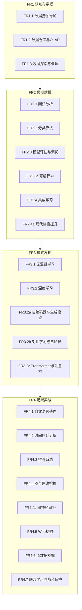

# 需求规格说明书

> 🏠 [项目首页](../README.md) | 📚 [文档中心](./README.md) | ⬅ [项目概述](./09-项目概述.md) | 📍 需求规格说明书 | ➡ [架构设计](./11-架构设计文档.md)

---

## 1. 引言

### 1.1 编写目的

本文档定义 Python 数据挖掘学习路径项目的功能需求和非功能需求，明确项目覆盖的知识体系范围，为开发、测试和验收提供依据。

### 1.2 项目范围

本项目覆盖数据挖掘核心知识体系，从数据仓库到深度学习，从基础算法到行业应用，共4阶段10模块37+子方向。项目遵循 CRISP-DM 标准流程组织内容，使学习者按照"认知与数据 → 预测建模 → 模式发现 → 场景实战"的4阶段路线渐进学习。

### 1.3 术语与缩略语

| 术语 | 全称 | 说明 |
|------|------|------|
| CRISP-DM | Cross-Industry Standard Process for Data Mining | 跨行业数据挖掘标准流程 |
| XAI | eXplainable Artificial Intelligence | 可解释人工智能 |
| LIME | Local Interpretable Model-agnostic Explanations | 局部可解释模型无关解释 |
| SHAP | SHapley Additive exPlanations | 基于Shapley值的加性解释 |
| PDP | Partial Dependence Plot | 部分依赖图 |
| ICE | Individual Conditional Expectation | 个体条件期望图 |
| AE | Autoencoder | 自编码器 |
| VAE | Variational Autoencoder | 变分自编码器 |
| DAE | Denoising Autoencoder | 去噪自编码器 |
| SimCLR | Simple Framework for Contrastive Learning of Visual Representations | 简单对比学习框架 |
| NT-Xent | Normalized Temperature-scaled Cross Entropy | 归一化温度缩放交叉熵 |
| MHA | Multi-Head Attention | 多头注意力 |
| GCN | Graph Convolutional Network | 图卷积网络 |
| GAT | Graph Attention Network | 图注意力网络 |
| FedAvg | Federated Averaging | 联邦平均算法 |
| DP-SGD | Differentially Private Stochastic Gradient Descent | 差分隐私随机梯度下降 |

---

## 2. 功能需求

### 2.1 功能需求概览

### 2.2 FR1 认知与数据

| 需求编号 | 需求名称 | 说明 | 源码位置 |
|---------|---------|------|----------|
| FR1.1 | 数据挖掘导论 | CRISP-DM流程、任务分类、数据类型、距离度量 | GitHub [数据挖掘导论.py](../00_数据挖掘导论/数据挖掘导论.py) · VSCode [数据挖掘导论.py](file:///d:/Dev/DevWorkSpace/VS%20Code/Python/python-data-mining/00_数据挖掘导论/数据挖掘导论.py) |
| FR1.2 | 数据仓库与OLAP | 数据仓库架构、多维数据模型、ETL、OLAP操作 | GitHub [数据仓库基础.py](../01_数据仓库与OLAP/数据仓库基础.py) · VSCode [数据仓库基础.py](file:///d:/Dev/DevWorkSpace/VS%20Code/Python/python-data-mining/01_数据仓库与OLAP/数据仓库基础.py) |
| FR1.3 | 数据探索与处理 | 预处理、特征工程、数据可视化 | 02_数据探索与处理/ |

### 2.3 FR2 预测建模

| 需求编号 | 需求名称 | 说明 | 源码位置 |
|---------|---------|------|----------|
| FR2.1 | 回归分析 | 线性回归、逻辑回归、正则化 | 03_回归分析/ |
| FR2.2 | 分类算法 | KNN、朴素贝叶斯、决策树、SVM、半监督学习 | 04_分类算法/ |
| FR2.3 | 模型评估与调优 | 评估指标、交叉验证、网格搜索、不平衡处理 | GitHub [模型评估与调优.py](../05_模型评估与调优/01_模型评估与调优.py) · VSCode [模型评估与调优.py](file:///d:/Dev/DevWorkSpace/VS%20Code/Python/python-data-mining/05_模型评估与调优/01_模型评估与调优.py) |
| FR2.3a | 可解释AI | LIME局部线性近似、SHAP值(KernelSHAP)、PDP/ICE部分依赖图 | GitHub [可解释AI.py](../05_模型评估与调优/03_可解释AI/可解释AI.py) · VSCode [可解释AI.py](file:///d:/Dev/DevWorkSpace/VS%20Code/Python/python-data-mining/05_模型评估与调优/03_可解释AI/可解释AI.py) |
| FR2.4 | 集成学习 | Bagging、Boosting、Stacking | GitHub [集成学习.py](../06_集成学习/集成学习.py) · VSCode [集成学习.py](file:///d:/Dev/DevWorkSpace/VS%20Code/Python/python-data-mining/06_集成学习/集成学习.py) |
| FR2.4a | 现代梯度提升 | LightGBM(直方图/GOSS/EFB)、CatBoost(有序编码/对称树)、三大框架对比 | GitHub [现代梯度提升.py](../06_集成学习/02_现代梯度提升/现代梯度提升.py) · VSCode [现代梯度提升.py](file:///d:/Dev/DevWorkSpace/VS%20Code/Python/python-data-mining/06_集成学习/02_现代梯度提升/现代梯度提升.py) |

### 2.4 FR3 模式发现

| 需求编号 | 需求名称 | 说明 | 源码位置 |
|---------|---------|------|----------|
| FR3.1 | 无监督学习 | 聚类、关联规则、降维、异常检测 | 07_无监督学习/ |
| FR3.2 | 深度学习 | 神经网络基础、CNN文本分类 | 08_深度学习/ |
| FR3.2a | 自编码器与生成模型 | AE手动实现、DAE去噪自编码器、VAE变分自编码器(重参数化/KL散度)、异常检测应用 | GitHub [自编码器与VAE.py](../08_深度学习/03_自编码器与生成模型/自编码器与VAE.py) · VSCode [自编码器与VAE.py](file:///d:/Dev/DevWorkSpace/VS%20Code/Python/python-data-mining/08_深度学习/03_自编码器与生成模型/自编码器与VAE.py) |
| FR3.2b | 对比学习与自监督 | 数据增强、NT-Xent损失手动实现、SimCLR简化实现、线性评估协议 | GitHub [对比学习与自监督学习.py](../08_深度学习/04_对比学习与自监督学习/对比学习与自监督学习.py) · VSCode [对比学习与自监督学习.py](file:///d:/Dev/DevWorkSpace/VS%20Code/Python/python-data-mining/08_深度学习/04_对比学习与自监督学习/对比学习与自监督学习.py) |
| FR3.2c | Transformer与注意力 | 缩放点积注意力、多头注意力(MHA)、Sinusoidal位置编码、Transformer编码器层 | GitHub [Transformer与注意力机制.py](../08_深度学习/05_Transformer与注意力机制/Transformer与注意力机制.py) · VSCode [Transformer与注意力机制.py](file:///d:/Dev/DevWorkSpace/VS%20Code/Python/python-data-mining/08_深度学习/05_Transformer与注意力机制/Transformer与注意力机制.py) |

### 2.5 FR4 场景实战

| 需求编号 | 需求名称 | 说明 | 源码位置 |
|---------|---------|------|----------|
| FR4.1 | 自然语言处理 | 分词、TF-IDF、情感分析、主题模型 | GitHub [NLP基础.py](../09_应用领域/01_自然语言处理/NLP基础.py) · VSCode [NLP基础.py](file:///d:/Dev/DevWorkSpace/VS%20Code/Python/python-data-mining/09_应用领域/01_自然语言处理/NLP基础.py) |
| FR4.2 | 时间序列分析 | 平稳性检验、ARIMA、指数平滑 | GitHub [时间序列分析.py](../09_应用领域/02_时间序列分析/时间序列分析.py) · VSCode [时间序列分析.py](file:///d:/Dev/DevWorkSpace/VS%20Code/Python/python-data-mining/09_应用领域/02_时间序列分析/时间序列分析.py) |
| FR4.3 | 推荐系统 | 协同过滤、矩阵分解、NDCG评估 | GitHub [推荐系统.py](../09_应用领域/03_推荐系统/推荐系统.py) · VSCode [推荐系统.py](file:///d:/Dev/DevWorkSpace/VS%20Code/Python/python-data-mining/09_应用领域/03_推荐系统/推荐系统.py) |
| FR4.4 | 图与网络挖掘 | PageRank、社区发现、链接预测 | GitHub [图与网络挖掘.py](../09_应用领域/04_图与网络挖掘/图与网络挖掘.py) · VSCode [图与网络挖掘.py](file:///d:/Dev/DevWorkSpace/VS%20Code/Python/python-data-mining/09_应用领域/04_图与网络挖掘/图与网络挖掘.py) |
| FR4.4a | 图神经网络 | 消息传递框架、GCN图卷积网络、GAT图注意力网络、GraphSAGE、节点分类 | GitHub [图神经网络.py](../09_应用领域/04_图与网络挖掘/02_图神经网络/图神经网络.py) · VSCode [图神经网络.py](file:///d:/Dev/DevWorkSpace/VS%20Code/Python/python-data-mining/09_应用领域/04_图与网络挖掘/02_图神经网络/图神经网络.py) |
| FR4.5 | Web挖掘 | PageRank/HITS、TF-IDF内容、日志模式 | GitHub [Web挖掘.py](../09_应用领域/05_Web挖掘/Web挖掘.py) · VSCode [Web挖掘.py](file:///d:/Dev/DevWorkSpace/VS%20Code/Python/python-data-mining/09_应用领域/05_Web挖掘/Web挖掘.py) |
| FR4.6 | 流数据挖掘 | 滑动窗口、概念漂移、在线聚类 | GitHub [流数据挖掘.py](../09_应用领域/06_流数据挖掘/流数据挖掘.py) · VSCode [流数据挖掘.py](file:///d:/Dev/DevWorkSpace/VS%20Code/Python/python-data-mining/09_应用领域/06_流数据挖掘/流数据挖掘.py) |
| FR4.7 | 联邦学习与隐私保护 | FedAvg手动实现、Non-IID数据划分、差分隐私(Laplace/Gaussian)、DP-SGD | GitHub [联邦学习与隐私保护.py](../09_应用领域/07_联邦学习与隐私保护/联邦学习与隐私保护.py) · VSCode [联邦学习与隐私保护.py](file:///d:/Dev/DevWorkSpace/VS%20Code/Python/python-data-mining/09_应用领域/07_联邦学习与隐私保护/联邦学习与隐私保护.py) |

---

## 3. 用例图

```mermaid
graph TB
    Actor_Learner["👤 学习者"]
    Actor_Contributor["🛠️ 贡献者"]

    UC1["浏览学习路线"]
    UC2["运行算法示例"]
    UC3["查看可视化输出"]
    UC4["阅读算法注释"]
    UC5["按阶段渐进学习"]
    UC6["查阅算法速查表"]
    UC7["完成练习与自检"]
    UC8["执行毕业项目"]

    UC9["提交新模块"]
    UC10["修复代码缺陷"]
    UC11["补充算法实现"]
    UC12["编写测试用例"]
    UC13["审查代码质量"]

    UC_XAI["学习可解释AI<br/>LIME/SHAP/PDP"]
    UC_GBM["学习现代梯度提升<br/>LightGBM/CatBoost"]
    UC_AE["学习自编码器与生成模型<br/>AE/VAE"]
    UC_CL["学习对比学习与自监督<br/>SimCLR/NT-Xent"]
    UC_TF["学习Transformer与注意力<br/>MHA/位置编码"]
    UC_GNN["学习图神经网络<br/>GCN/GAT"]
    UC_FL["学习联邦学习与隐私保护<br/>FedAvg/DP-SGD"]

    Actor_Learner --> UC1
    Actor_Learner --> UC2
    Actor_Learner --> UC3
    Actor_Learner --> UC4
    Actor_Learner --> UC5
    Actor_Learner --> UC6
    Actor_Learner --> UC7
    Actor_Learner --> UC8
    Actor_Learner --> UC_XAI
    Actor_Learner --> UC_GBM
    Actor_Learner --> UC_AE
    Actor_Learner --> UC_CL
    Actor_Learner --> UC_TF
    Actor_Learner --> UC_GNN
    Actor_Learner --> UC_FL

    Actor_Contributor --> UC9
    Actor_Contributor --> UC10
    Actor_Contributor --> UC11
    Actor_Contributor --> UC12
    Actor_Contributor --> UC13
    Actor_Contributor --> UC_XAI
    Actor_Contributor --> UC_GBM
    Actor_Contributor --> UC_AE
    Actor_Contributor --> UC_CL
    Actor_Contributor --> UC_TF
    Actor_Contributor --> UC_GNN
    Actor_Contributor --> UC_FL

    UC5 -.-> UC1
    UC5 -.-> UC2
    UC2 --> UC3
    UC2 --> UC4
    UC9 --> UC11
    UC11 --> UC12
    UC12 --> UC13
```

### 3.1 用例描述

| 用例编号 | 用例名称 | 参与者 | 前置条件 | 主要流程 |
|---------|---------|--------|---------|---------|
| UC1 | 浏览学习路线 | 学习者 | 访问项目文档 | 打开文档中心 → 查看4阶段路线 → 选择目标模块 |
| UC2 | 运行算法示例 | 学习者 | Python环境已配置 | 选择模块文件 → 执行脚本 → 查看控制台输出 |
| UC3 | 查看可视化输出 | 学习者 | 脚本运行完成 | Matplotlib生成图表 → 分析可视化结果 |
| UC4 | 阅读算法注释 | 学习者 | 打开源码文件 | 阅读模块docstring → 理解算法原理 → 对照代码实现 |
| UC5 | 按阶段渐进学习 | 学习者 | 无 | FR1认知 → FR2预测 → FR3模式 → FR4实战 |
| UC6 | 查阅算法速查表 | 学习者 | 访问文档 | 打开算法速查 → 按分类查找 → 对比适用场景 |
| UC7 | 完成练习与自检 | 学习者 | 完成对应模块学习 | 做练习题 → 对照自检清单 → 巩固薄弱环节 |
| UC8 | 执行毕业项目 | 学习者 | 完成全部阶段学习 | 选择项目主题 → 数据准备 → 建模 → 评估 → 部署 |
| UC-XAI | 学习可解释AI | 学习者/贡献者 | 已掌握模型评估基础 | 理解XAI分类 → 运行LIME/SHAP/PDP示例 → 分析解释结果 |
| UC-GBM | 学习现代梯度提升 | 学习者/贡献者 | 已掌握集成学习基础 | 理解LightGBM/CatBoost原理 → 运行对比实验 → 分析结果 |
| UC-AE | 学习自编码器与生成模型 | 学习者/贡献者 | 已掌握神经网络基础 | 理解AE/VAE原理 → 运行手动实现 → 分析潜在空间与生成样本 |
| UC-CL | 学习对比学习与自监督 | 学习者/贡献者 | 已掌握深度学习基础 | 理解SimCLR框架 → 运行NT-Xent损失实现 → 评估特征质量 |
| UC-TF | 学习Transformer与注意力 | 学习者/贡献者 | 已掌握深度学习基础 | 理解MHA/位置编码 → 运行编码器层实现 → 分析注意力模式 |
| UC-GNN | 学习图神经网络 | 学习者/贡献者 | 已掌握图与网络挖掘基础 | 理解消息传递 → 运行GCN/GAT实现 → 分析节点分类结果 |
| UC-FL | 学习联邦学习与隐私保护 | 学习者/贡献者 | 已掌握机器学习基础 | 理解FedAvg流程 → 运行差分隐私实现 → 分析隐私-效用权衡 |
| UC9 | 提交新模块 | 贡献者 | 遵循项目编码规范 | 编写模块代码 → 本地测试 → 提交PR |
| UC10 | 修复代码缺陷 | 贡献者 | 发现并确认缺陷 | 定位问题 → 修复代码 → 验证通过 |
| UC11 | 补充算法实现 | 贡献者 | 遵循手动实现优先原则 | 手动实现算法 → 对比sklearn → 补充可视化 |
| UC12 | 编写测试用例 | 贡献者 | 模块代码已就绪 | 编写单元测试 → 覆盖核心函数 → 确保通过 |
| UC13 | 审查代码质量 | 贡献者 | 代码已提交 | 运行flake8/mypy → 检查PEP 8 → 审查注释质量 |

---

## 4. 非功能需求

| 编号 | 需求 | 说明 |
|------|------|------|
| NFR1 | 独立可运行 | 每个 .py 文件可独立运行，无跨模块硬编码依赖 |
| NFR2 | 自包含数据 | 所有示例数据内嵌代码或使用sklearn内置数据集，无需额外数据文件 |
| NFR3 | 教学注释 | 关键算法含详细中文注释和直觉解释 |
| NFR4 | 手动实现优先 | 核心算法先手动实现（纯NumPy），再对比sklearn/框架调用 |
| NFR5 | 可视化充分 | 每个模块包含 Matplotlib 可视化输出 |
| NFR6 | 编码规范 | 遵循 PEP 8 代码风格，flake8 --max-line-length=120 检查通过 |
| NFR7 | 类型安全 | mypy --ignore-missing-imports --no-strict-optional 检查通过 |
| NFR8 | 随机可复现 | 随机种子固定 random_state=42 或 np.random.seed(42) |
| NFR9 | 中文字体适配 | Matplotlib 配置 SimHei/Microsoft YaHei 中文字体，无GUI环境使用Agg后端 |
| NFR10 | 依赖可选 | 深度学习/现代框架相关依赖（tensorflow, lightgbm, catboost等）为可选，缺失时优雅降级 |
| NFR11 | 模块分节 | 使用 `# ====...====` 分节标记，结构清晰可读 |
| NFR12 | 导入有序 | 导入顺序：标准库 → 第三方库 → 本地模块 |

---

## 5. 知识体系覆盖矩阵

> 对标 Han & Kamber《数据挖掘：概念与技术》第3版 及前沿扩展

| 教材章节 | 主题 | 本项目覆盖模块 | 需求编号 |
|---------|------|--------------|---------|
| 第1章 | 引言 | 00_数据挖掘导论 | FR1.1 |
| 第2章 | 数据 | 02_数据探索与处理 | FR1.3 |
| 第3章 | 数据仓库 | 01_数据仓库与OLAP | FR1.2 |
| 第4章 | 数据预处理 | 02_数据探索与处理/01_数据预处理与特征工程 | FR1.3 |
| 第6章 | 分类：基本概念 | 04_分类算法/01_K近邻算法、02_朴素贝叶斯 | FR2.2 |
| 第7章 | 分类：高级方法 | 04_分类算法/03_决策树、04_支持向量机 | FR2.2 |
| 第8章 | 聚类 | 07_无监督学习/01_聚类分析 | FR3.1 |
| 第9章 | 异常检测 | 07_无监督学习/04_异常检测 | FR3.1 |
| 第10章 | 回归 | 03_回归分析 | FR2.1 |
| 第11章 | 频繁模式挖掘 | 07_无监督学习/02_关联规则挖掘 | FR3.1 |
| — | 集成学习 | 06_集成学习 | FR2.4 |
| — | 现代梯度提升 | 06_集成学习/02_现代梯度提升 | FR2.4a |
| — | 深度学习 | 08_深度学习 | FR3.2 |
| — | 自编码器与生成模型 | 08_深度学习/03_自编码器与生成模型 | FR3.2a |
| — | 对比学习与自监督 | 08_深度学习/04_对比学习与自监督学习 | FR3.2b |
| — | Transformer与注意力 | 08_深度学习/05_Transformer与注意力机制 | FR3.2c |
| — | 模型评估 | 05_模型评估与调优 | FR2.3 |
| — | 可解释AI | 05_模型评估与调优/03_可解释AI | FR2.3a |
| — | 应用领域 | 09_应用领域 | FR4.1-FR4.6 |
| — | 图神经网络 | 09_应用领域/04_图与网络挖掘/02_图神经网络 | FR4.4a |
| — | 联邦学习与隐私保护 | 09_应用领域/07_联邦学习与隐私保护 | FR4.7 |

### 5.1 新增模块覆盖分析

| 新增模块 | 覆盖的知识点 | 对应前沿领域 |
|---------|-------------|-------------|
| FR2.3a 可解释AI | LIME、SHAP(KernelSHAP)、PDP/ICE、全局/局部解释 | 可解释人工智能(XAI) |
| FR2.4a 现代梯度提升 | LightGBM直方图/GOSS/EFB、CatBoost有序编码/对称树 | 工业级梯度提升框架 |
| FR3.2a 自编码器与生成模型 | AE、DAE、VAE(重参数化/KL散度)、异常检测 | 生成模型与表示学习 |
| FR3.2b 对比学习与自监督 | 数据增强、NT-Xent损失、SimCLR、线性评估 | 自监督表示学习 |
| FR3.2c Transformer与注意力 | 缩放点积注意力、MHA、位置编码、编码器层 | 大模型基础架构 |
| FR4.4a 图神经网络 | 消息传递、GCN、GAT、GraphSAGE、节点分类 | 图表示学习 |
| FR4.7 联邦学习与隐私保护 | FedAvg、Non-IID、差分隐私(Laplace/Gaussian)、DP-SGD | 隐私计算与联邦学习 |

---

## 6. 需求追踪

### 6.1 需求优先级

| 优先级 | 需求范围 | 说明 |
|--------|---------|------|
| P0-必须 | FR1.1-FR1.3, FR2.1-FR2.4, FR3.1-FR3.2, FR4.1-FR4.6 | 数据挖掘核心知识体系 |
| P1-重要 | FR2.3a, FR2.4a, FR3.2a | 可解释AI、现代梯度提升、自编码器与生成模型 |
| P2-增强 | FR3.2b, FR3.2c, FR4.4a, FR4.7 | 对比学习、Transformer、图神经网络、联邦学习 |

### 6.2 需求与源码追溯

| 需求编号 | 源码文件 | 验证方式 |
|---------|---------|---------|
| FR2.3a | 05_模型评估与调优/03_可解释AI/可解释AI.py | python -m py_compile + 运行LIME/SHAP/PDP输出 |
| FR2.4a | 06_集成学习/02_现代梯度提升/现代梯度提升.py | python -m py_compile + 运行三大框架对比实验 |
| FR3.2a | 08_深度学习/03_自编码器与生成模型/自编码器与VAE.py | python -m py_compile + 运行AE/VAE重构与生成 |
| FR3.2b | 08_深度学习/04_对比学习与自监督学习/对比学习与自监督学习.py | python -m py_compile + 运行SimCLR对比学习 |
| FR3.2c | 08_深度学习/05_Transformer与注意力机制/Transformer与注意力机制.py | python -m py_compile + 运行注意力热力图可视化 |
| FR4.4a | 09_应用领域/04_图与网络挖掘/02_图神经网络/图神经网络.py | python -m py_compile + 运行GCN/GAT节点分类 |
| FR4.7 | 09_应用领域/07_联邦学习与隐私保护/联邦学习与隐私保护.py | python -m py_compile + 运行FedAvg/DP-SGD实验 |
