# 详细设计文档

> 🏠 [项目首页](../README.md) | 📚 [文档中心](./README.md) | ⬅ [架构设计](./11-架构设计文档.md) | 📍 详细设计 | ➡ [实施与开发](./13-实施与开发文档.md)

---

## 1. 模块详细设计

### 1.1 模块00：数据挖掘导论

**类图：**

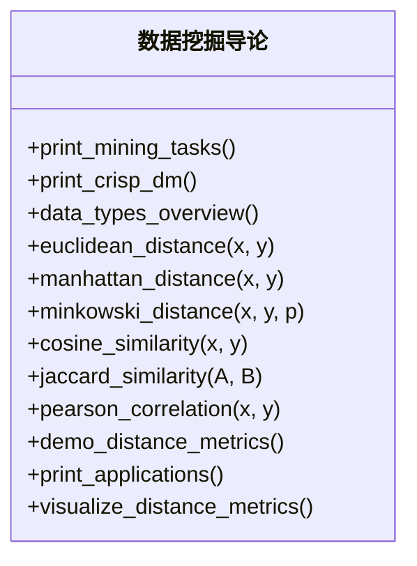

**数据流图：**


> 源码位置：GitHub [数据挖掘导论.py](../00_数据挖掘导论/数据挖掘导论.py) | VSCode [数据挖掘导论.py](file:///d:/Dev/DevWorkSpace/VS%20Code/Python/python-data-mining/00_数据挖掘导论/数据挖掘导论.py)

---

### 1.2 模块01：数据仓库与OLAP

**类图：**

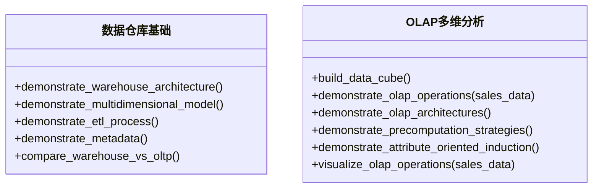

**ETL流程图：**


> 源码位置：GitHub [数据仓库基础.py](../01_数据仓库与OLAP/01_数据仓库基础/数据仓库基础.py) | VSCode [数据仓库基础.py](file:///d:/Dev/DevWorkSpace/VS%20Code/Python/python-data-mining/01_数据仓库与OLAP/01_数据仓库基础/数据仓库基础.py) | GitHub [OLAP多维分析.py](../01_数据仓库与OLAP/02_OLAP多维分析/OLAP多维分析.py) | VSCode [OLAP多维分析.py](file:///d:/Dev/DevWorkSpace/VS%20Code/Python/python-data-mining/01_数据仓库与OLAP/02_OLAP多维分析/OLAP多维分析.py)

---

### 1.3 模块02：数据探索与处理

**类图：**

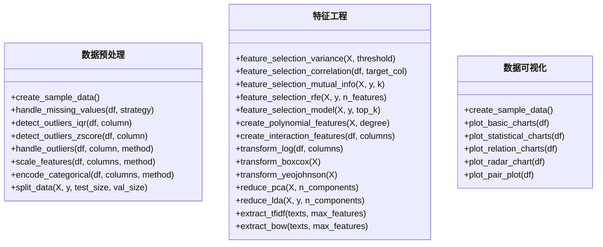

**数据流图：**

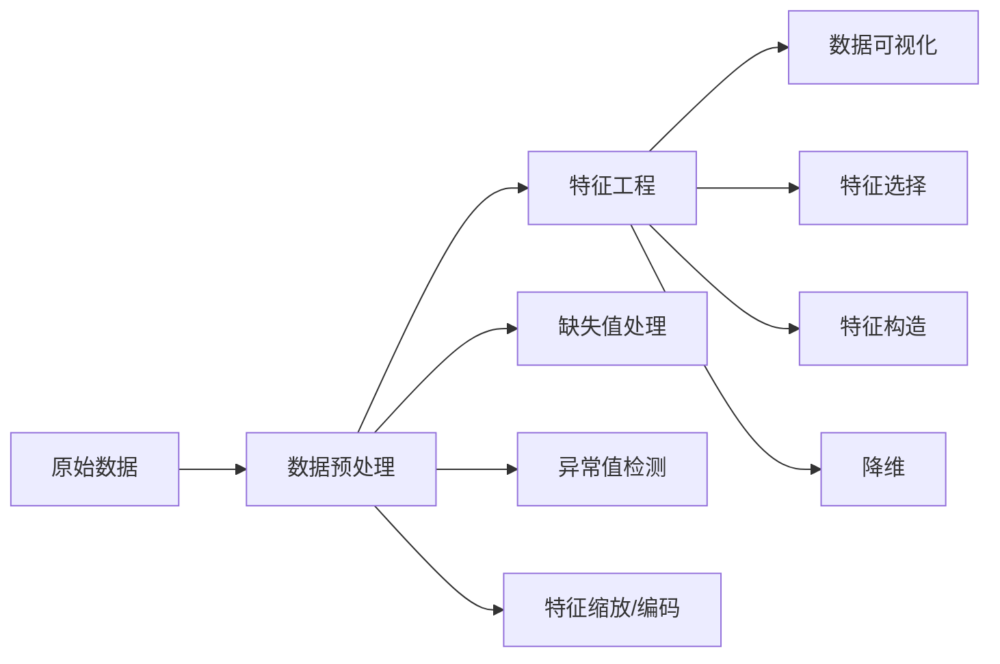

> 源码位置：GitHub [数据预处理.py](../02_数据探索与处理/01_数据预处理与特征工程/数据预处理.py) | VSCode [数据预处理.py](file:///d:/Dev/DevWorkSpace/VS%20Code/Python/python-data-mining/02_数据探索与处理/01_数据预处理与特征工程/数据预处理.py) | GitHub [特征工程.py](../02_数据探索与处理/01_数据预处理与特征工程/特征工程.py) | VSCode [特征工程.py](file:///d:/Dev/DevWorkSpace/VS%20Code/Python/python-data-mining/02_数据探索与处理/01_数据预处理与特征工程/特征工程.py) | GitHub [数据可视化.py](../02_数据探索与处理/02_数据可视化/数据可视化.py) | VSCode [数据可视化.py](file:///d:/Dev/DevWorkSpace/VS%20Code/Python/python-data-mining/02_数据探索与处理/02_数据可视化/数据可视化.py)

---

### 1.4 模块03：回归分析

**类图：**

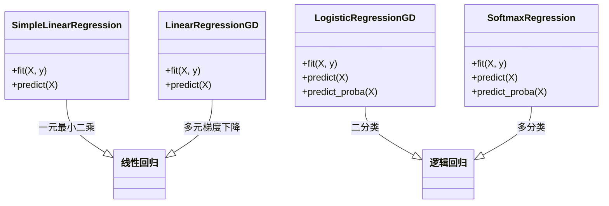

**数据流图：**


> 源码位置：GitHub [01_线性回归.py](../03_回归分析/01_线性回归.py#L31) | VSCode [01_线性回归.py](file:///d:/Dev/DevWorkSpace/VS%20Code/Python/python-data-mining/03_回归分析/01_线性回归.py#L31) | GitHub [02_逻辑回归.py](../03_回归分析/02_逻辑回归.py#L34) | VSCode [02_逻辑回归.py](file:///d:/Dev/DevWorkSpace/VS%20Code/Python/python-data-mining/03_回归分析/02_逻辑回归.py#L34)

---

### 1.5 模块04：分类算法

**类图：**

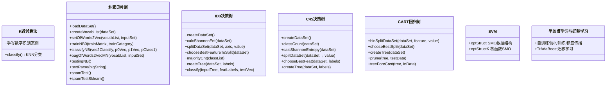

**数据流图：**

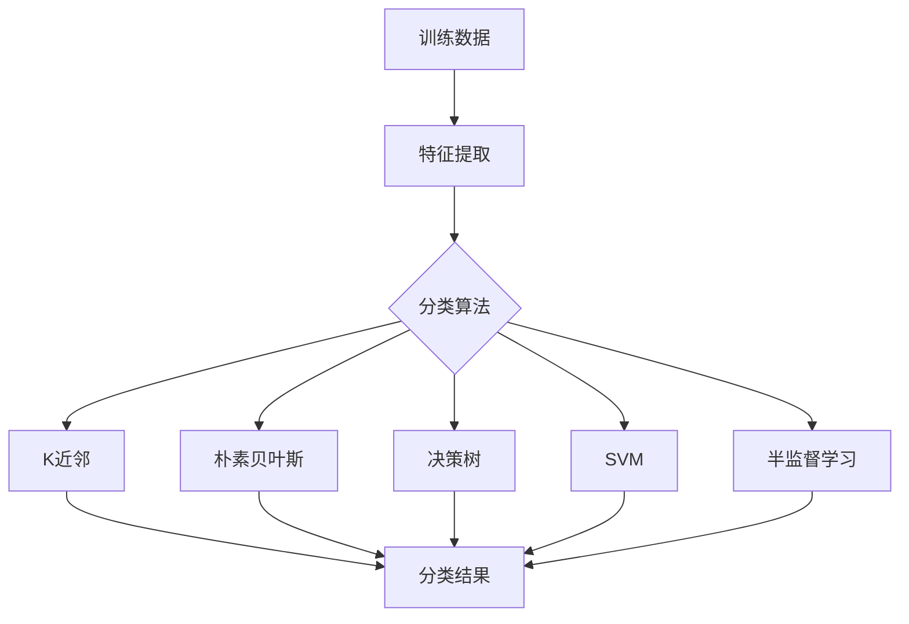

> 源码位置：GitHub [K近邻算法.py](../04_分类算法/01_K近邻算法/K近邻算法.py) | VSCode [K近邻算法.py](file:///d:/Dev/DevWorkSpace/VS%20Code/Python/python-data-mining/04_分类算法/01_K近邻算法/K近邻算法.py) | GitHub [朴素贝叶斯算法.py](../04_分类算法/02_朴素贝叶斯/朴素贝叶斯算法.py#L38) | VSCode [朴素贝叶斯算法.py](file:///d:/Dev/DevWorkSpace/VS%20Code/Python/python-data-mining/04_分类算法/02_朴素贝叶斯/朴素贝叶斯算法.py#L38) | GitHub [trees.py](../04_分类算法/03_决策树/01_ID3决策树/trees.py#L25) | VSCode [trees.py](file:///d:/Dev/DevWorkSpace/VS%20Code/Python/python-data-mining/04_分类算法/03_决策树/01_ID3决策树/trees.py#L25) | GitHub [C45决策树.py](../04_分类算法/03_决策树/02_C45决策树/C45决策树.py#L25) | VSCode [C45决策树.py](file:///d:/Dev/DevWorkSpace/VS%20Code/Python/python-data-mining/04_分类算法/03_决策树/02_C45决策树/C45决策树.py#L25) | GitHub [CART.py](../04_分类算法/03_决策树/03_CART回归树/CART.py#L22) | VSCode [CART.py](file:///d:/Dev/DevWorkSpace/VS%20Code/Python/python-data-mining/04_分类算法/03_决策树/03_CART回归树/CART.py#L22) | GitHub [SVM算法.py](../04_分类算法/04_支持向量机/SVM算法.py#L116) | VSCode [SVM算法.py](file:///d:/Dev/DevWorkSpace/VS%20Code/Python/python-data-mining/04_分类算法/04_支持向量机/SVM算法.py#L116) | GitHub [半监督学习与迁移学习.py](../04_分类算法/05_半监督学习与迁移学习/半监督学习与迁移学习.py) | VSCode [半监督学习与迁移学习.py](file:///d:/Dev/DevWorkSpace/VS%20Code/Python/python-data-mining/04_分类算法/05_半监督学习与迁移学习/半监督学习与迁移学习.py)

---

### 1.6 模块05：模型评估与调优

**类图：**

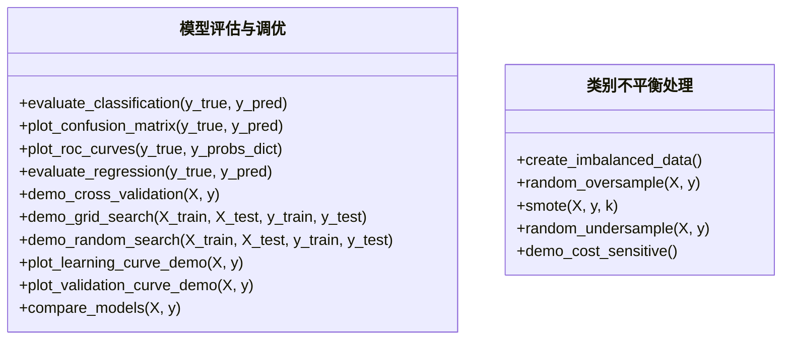

**数据流图：**

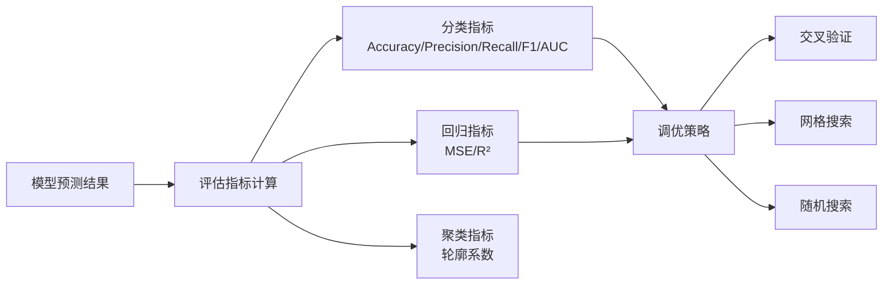

> 源码位置：GitHub [01_模型评估与调优.py](../05_模型评估与调优/01_模型评估与调优.py#L44) | VSCode [01_模型评估与调优.py](file:///d:/Dev/DevWorkSpace/VS%20Code/Python/python-data-mining/05_模型评估与调优/01_模型评估与调优.py#L44) | GitHub [02_类别不平衡处理.py](../05_模型评估与调优/02_类别不平衡处理.py#L35) | VSCode [02_类别不平衡处理.py](file:///d:/Dev/DevWorkSpace/VS%20Code/Python/python-data-mining/05_模型评估与调优/02_类别不平衡处理.py#L35)

---

### 1.7 模块05-3：可解释AI

**类图：**

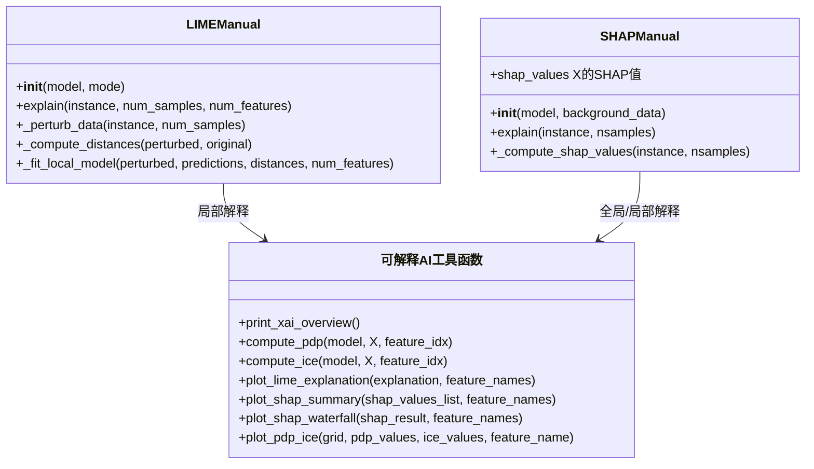

**数据流图：**

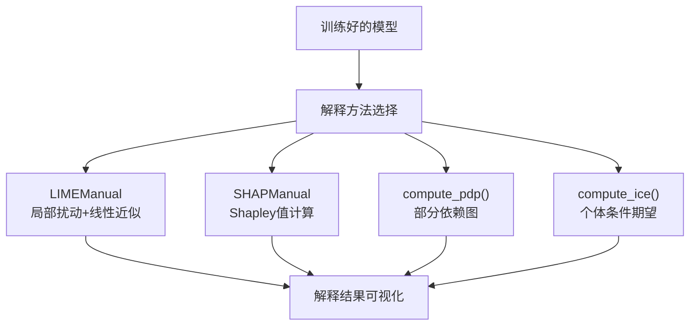

> 源码位置：GitHub [可解释AI.py](../05_模型评估与调优/03_可解释AI/可解释AI.py#L80) | VSCode [可解释AI.py](file:///d:/Dev/DevWorkSpace/VS%20Code/Python/python-data-mining/05_模型评估与调优/03_可解释AI/可解释AI.py#L80)

---

### 1.8 模块06：集成学习

**类图：**

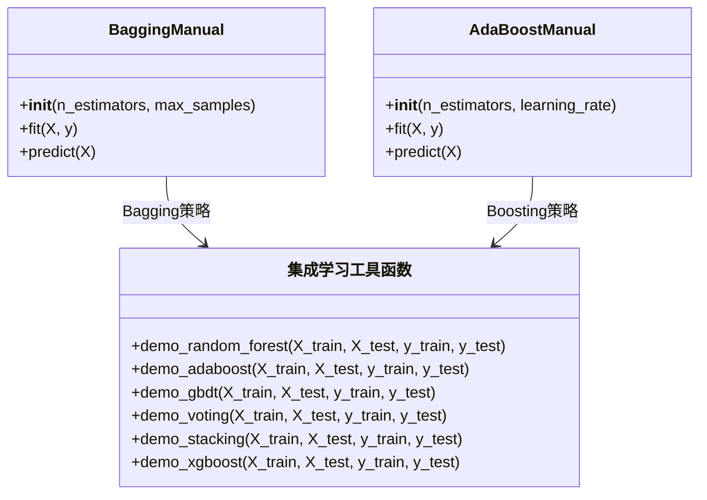

**数据流图：**

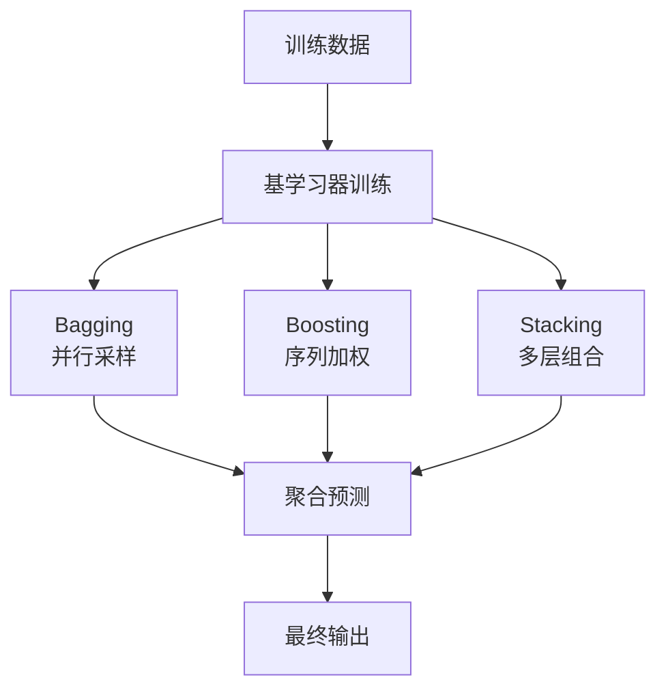

> 源码位置：GitHub [集成学习.py](../06_集成学习/集成学习.py#L228) | VSCode [集成学习.py](file:///d:/Dev/DevWorkSpace/VS%20Code/Python/python-data-mining/06_集成学习/集成学习.py#L228)

---

### 1.9 模块06-2：现代梯度提升

**类图：**

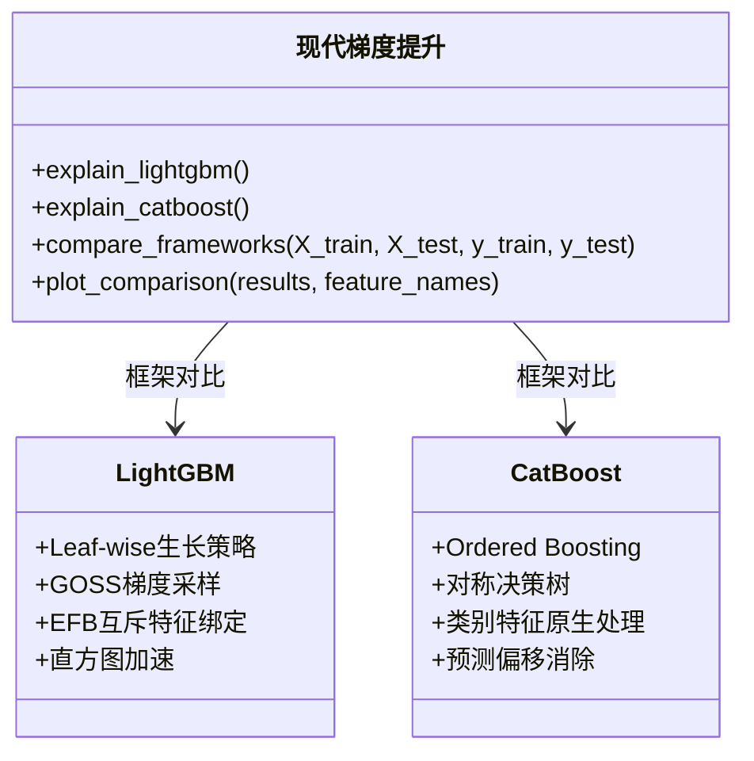

**数据流图：**

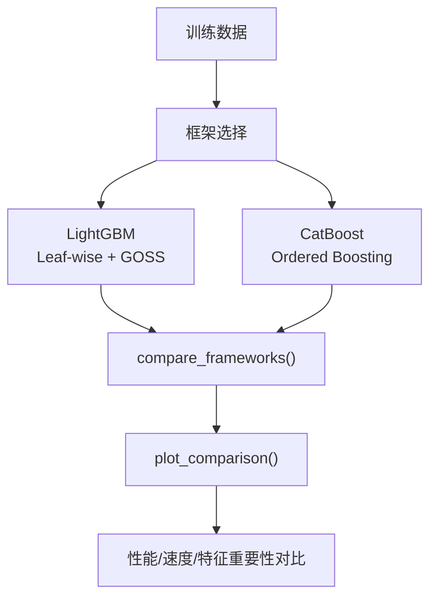

> 源码位置：GitHub [现代梯度提升.py](../06_集成学习/02_现代梯度提升/现代梯度提升.py#L47) | VSCode [现代梯度提升.py](file:///d:/Dev/DevWorkSpace/VS%20Code/Python/python-data-mining/06_集成学习/02_现代梯度提升/现代梯度提升.py#L47)

---

### 1.10 模块07：无监督学习

**类图：**

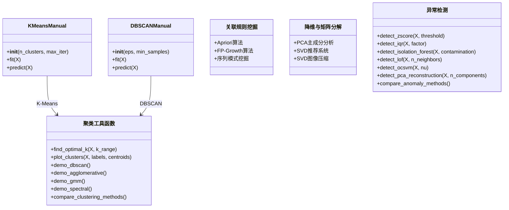

**数据流图：**

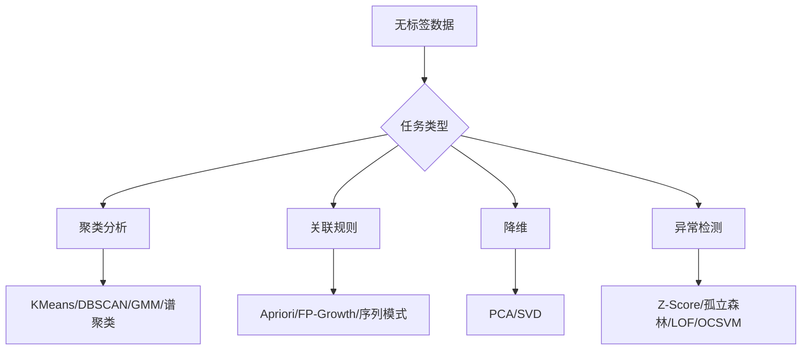

> 源码位置：GitHub [KMeans聚类.py](../07_无监督学习/01_聚类分析/KMeans聚类.py#L29) | VSCode [KMeans聚类.py](file:///d:/Dev/DevWorkSpace/VS%20Code/Python/python-data-mining/07_无监督学习/01_聚类分析/KMeans聚类.py#L29) | GitHub [高级聚类.py](../07_无监督学习/01_聚类分析/高级聚类.py#L179) | VSCode [高级聚类.py](file:///d:/Dev/DevWorkSpace/VS%20Code/Python/python-data-mining/07_无监督学习/01_聚类分析/高级聚类.py#L179) | GitHub [异常检测.py](../07_无监督学习/04_异常检测/异常检测.py#L33) | VSCode [异常检测.py](file:///d:/Dev/DevWorkSpace/VS%20Code/Python/python-data-mining/07_无监督学习/04_异常检测/异常检测.py#L33)

---

### 1.11 模块08：深度学习

**类图：**

```mermaid
classDiagram
    class Perceptron {
        +__init__(input_size, lr)
        +forward(x)
        +train(X, y, epochs)
        +predict(X)
    }

    class MLP {
        +__init__(layer_sizes, lr)
        +forward(x)
        +backward(y)
        +train(X, y, epochs)
        +predict(X)
    }

    Perceptron --> MLP : 扩展为多层
```

**数据流图：**

```mermaid
graph LR
    A["输入数据"] --> B["前向传播 forward()"]
    B --> C["损失计算"]
    C --> D["反向传播 backward()"]
    D --> E["参数更新"]
    E --> B
    B --> F["预测输出"]
```

> 源码位置：GitHub [神经网络基础.py](../08_深度学习/01_神经网络基础/神经网络基础.py#L26) | VSCode [神经网络基础.py](file:///d:/Dev/DevWorkSpace/VS%20Code/Python/python-data-mining/08_深度学习/01_神经网络基础/神经网络基础.py#L26) | GitHub [CNN文本分类.py](../08_深度学习/02_文本分类模型对比/CNN文本分类.py) | VSCode [CNN文本分类.py](file:///d:/Dev/DevWorkSpace/VS%20Code/Python/python-data-mining/08_深度学习/02_文本分类模型对比/CNN文本分类.py)

---

### 1.12 模块08-3：自编码器与VAE

**类图：**

```mermaid
classDiagram
    class AutoencoderManual {
        +__init__(input_dim, hidden_dims, latent_dim)
        +encode(x)
        +decode(z)
        +forward(x)
        +fit(X, epochs, batch_size)
        +reconstruct(X)
        +get_latent(X)
    }

    class DenoisingAutoencoder {
        +__init__(input_dim, hidden_dims, latent_dim, noise_factor)
        +add_noise(x)
        +encode(x)
        +decode(z)
        +forward(x)
        +fit(X, epochs, batch_size)
        +reconstruct(X)
    }

    class VAEManual {
        +__init__(input_dim, hidden_dims, latent_dim)
        +encode(x)
        +reparameterize(mu, log_var)
        +decode(z)
        +forward(x)
        +loss_function(x_recon, x, mu, log_var)
        +fit(X, epochs, batch_size)
        +sample(n_samples)
        +reconstruct(X)
        +get_latent(X)
    }

    AutoencoderManual <|-- DenoisingAutoencoder : 去噪扩展
    AutoencoderManual <|-- VAEManual : 变分扩展
```

**数据流图：**

```mermaid
graph TD
    A["输入数据 X"] --> B["编码器 encode()"]
    B --> C["潜在表示 Z"]
    C --> D["解码器 decode()"]
    D --> E["重构数据 X'"]
    E --> F["重构损失计算"]
    A --> F
    F --> G["参数更新"]
    G --> B

    subgraph "VAE变分推断"
        B --> B1["μ 均值"]
        B --> B2["log_σ² 对数方差"]
        B1 --> C1["重参数化 reparameterize()"]
        B2 --> C1
        C1 --> C
    end
```

> 源码位置：GitHub [自编码器与VAE.py](../08_深度学习/03_自编码器与生成模型/自编码器与VAE.py#L80) | VSCode [自编码器与VAE.py](file:///d:/Dev/DevWorkSpace/VS%20Code/Python/python-data-mining/08_深度学习/03_自编码器与生成模型/自编码器与VAE.py#L80)

---

### 1.13 模块08-4：对比学习与自监督学习

**类图：**

```mermaid
classDiagram
    class SimCLRManual {
        +__init__(input_dim, hidden_dim, projection_dim, temperature)
        +encode(x)
        +project(h)
        +forward(x)
        +fit(X, epochs, batch_size)
        +get_embeddings(X)
    }

    class SupervisedNet {
        +__init__(encoder, input_dim, num_classes)
        +forward(x)
        +fit(X_train, y_train, X_val, y_val, epochs)
        +predict(X)
        +evaluate(X, y)
    }

    class 对比学习工具函数 {
        +gaussian_noise(X, scale)
        +random_mask(X, mask_ratio)
        +random_crop(X, crop_ratio)
        +color_jitter_1d(X, brightness, contrast)
        +nt_xent_loss(features1, features2, temperature)
        +linear_evaluation(X_train, y_train, X_test, y_test)
        +visualize_tsne(X, y, encoders, titles)
        +visualize_loss_curve(loss_histories, labels)
        +visualize_accuracy_comparison(methods, accuracies)
    }

    SimCLRManual --> 对比学习工具函数 : 自监督预训练
    SimCLRManual --> SupervisedNet : 编码器迁移
    对比学习工具函数 --> nt_xent_loss : 对比损失
```

**数据流图：**

```mermaid
graph TD
    A["输入样本"] --> B["数据增强<br/>gaussian_noise/random_mask/crop"]
    B --> C1["增强视图1"]
    B --> C2["增强视图2"]
    C1 --> D["编码器 encode()"]
    C2 --> D
    D --> E1["投影头 project()"]
    D --> E2["投影头 project()"]
    E1 --> F["nt_xent_loss()"]
    E2 --> F
    F --> G["SimCLR预训练"]
    G --> H["SupervisedNet<br/>线性评估/微调"]
    H --> I["下游任务预测"]
```

> 源码位置：GitHub [对比学习与自监督学习.py](../08_深度学习/04_对比学习与自监督学习/对比学习与自监督学习.py#L118) | VSCode [对比学习与自监督学习.py](file:///d:/Dev/DevWorkSpace/VS%20Code/Python/python-data-mining/08_深度学习/04_对比学习与自监督学习/对比学习与自监督学习.py#L118)

---

### 1.14 模块08-5：Transformer与注意力机制

**类图：**

```mermaid
classDiagram
    class MultiHeadAttention {
        +__init__(d_model, n_heads)
        +forward(Q, K, V, mask)
        +split_heads(x)
        +combine_heads(x)
    }

    class TransformerEncoderLayer {
        +__init__(d_model, n_heads, d_ff, dropout)
        +forward(x, mask)
    }

    class SimpleTransformerClassifier {
        +__init__(input_dim, d_model, n_heads, d_ff, n_layers, n_classes)
        +forward(x)
        +fit(X_train, y_train, X_val, y_val, epochs)
        +predict(X)
        +evaluate(X, y)
    }

    class BaselineClassifier {
        +__init__(input_dim, hidden_dim, n_classes)
        +forward(x)
        +fit(X_train, y_train, X_val, y_val, epochs)
        +predict(X)
    }

    class Transformer工具函数 {
        +scaled_dot_product_attention(Q, K, V, mask)
        +positional_encoding(seq_len, d_model)
        +generate_sequence_data(n_samples, seq_len, d_model)
        +plot_attention_heatmap(attn_weights, title)
        +plot_positional_encoding(pe, title)
        +plot_multihead_attention(attn_weights_list, title)
        +plot_training_comparison(transformer_losses, baseline_losses)
    }

    MultiHeadAttention --> Transformer工具函数 : 使用scaled_dot_product_attention
    TransformerEncoderLayer --> MultiHeadAttention : 包含
    SimpleTransformerClassifier --> TransformerEncoderLayer : 堆叠
    SimpleTransformerClassifier --> BaselineClassifier : 对比基线
```

**数据流图：**

```mermaid
graph TD
    A["输入序列"] --> B["位置编码 positional_encoding()"]
    B --> C["TransformerEncoderLayer"]
    C --> D["MultiHeadAttention"]
    D --> D1["scaled_dot_product_attention()"]
    D1 --> D2["注意力权重"]
    D2 --> D3["加权求和输出"]
    D3 --> E["前馈网络 FFN"]
    E --> F["残差连接 + LayerNorm"]
    F --> G["分类头"]
    G --> H["分类结果"]
```

> 源码位置：GitHub [Transformer与注意力机制.py](../08_深度学习/05_Transformer与注意力机制/Transformer与注意力机制.py#L88) | VSCode [Transformer与注意力机制.py](file:///d:/Dev/DevWorkSpace/VS%20Code/Python/python-data-mining/08_深度学习/05_Transformer与注意力机制/Transformer与注意力机制.py#L88)

---

### 1.15 模块09：应用领域

**类图：**

```mermaid
classDiagram
    class TextPreprocessor {
        +__init__()
        +fit(texts)
        +transform(texts)
        +fit_transform(texts)
    }

    class BoWVectorizer {
        +__init__(max_features)
        +fit(texts)
        +transform(texts)
    }

    class TfidfVectorizerManual {
        +__init__(max_features)
        +fit(texts)
        +transform(texts)
    }

    class NaiveBayesText {
        +__init__(alpha)
        +fit(X, y)
        +predict(X)
    }

    class Graph {
        +__init__()
        +add_edge(u, v, weight)
        +get_neighbors(node)
        +get_nodes()
        +get_edges()
    }

    class SlidingWindow {
        +__init__(window_size, stride)
        +update(new_value)
        +get_statistics()
    }

    class FadingSummarizer {
        +__init__(decay_factor)
        +update(item)
        +get_summary()
    }

    class OnlineKMeans {
        +__init__(n_clusters)
        +partial_fit(X)
        +predict(X)
    }

    TextPreprocessor --> BoWVectorizer : 文本预处理
    TextPreprocessor --> TfidfVectorizerManual : 文本预处理
    BoWVectorizer --> NaiveBayesText : 特征输入
    TfidfVectorizerManual --> NaiveBayesText : 特征输入
```

**数据流图：**

```mermaid
graph TD
    A["应用领域"] --> B1["自然语言处理"]
    A --> B2["时间序列分析"]
    A --> B3["推荐系统"]
    A --> B4["图与网络挖掘"]
    A --> B5["Web挖掘"]
    A --> B6["流数据挖掘"]
    B1 --> C1["TextPreprocessor → BoW/TF-IDF → NaiveBayesText"]
    B2 --> C2["基础分析 → 分解 → ARIMA/指数平滑"]
    B3 --> C3["协同过滤 → SVD推荐 → 评估指标"]
    B4 --> C4["Graph → 中心性 → PageRank → 社区检测"]
    B5 --> C5["PageRank → HITS → 内容挖掘/日志挖掘"]
    B6 --> C6["SlidingWindow → FadingSummarizer → OnlineKMeans"]
```

> 源码位置：GitHub [NLP基础.py](../09_应用领域/01_自然语言处理/NLP基础.py#L29) | VSCode [NLP基础.py](file:///d:/Dev/DevWorkSpace/VS%20Code/Python/python-data-mining/09_应用领域/01_自然语言处理/NLP基础.py#L29) | GitHub [时间序列分析.py](../09_应用领域/02_时间序列分析/时间序列分析.py#L28) | VSCode [时间序列分析.py](file:///d:/Dev/DevWorkSpace/VS%20Code/Python/python-data-mining/09_应用领域/02_时间序列分析/时间序列分析.py#L28) | GitHub [推荐系统.py](../09_应用领域/03_推荐系统/推荐系统.py#L27) | VSCode [推荐系统.py](file:///d:/Dev/DevWorkSpace/VS%20Code/Python/python-data-mining/09_应用领域/03_推荐系统/推荐系统.py#L27) | GitHub [图与网络挖掘.py](../09_应用领域/04_图与网络挖掘/图与网络挖掘.py#L27) | VSCode [图与网络挖掘.py](file:///d:/Dev/DevWorkSpace/VS%20Code/Python/python-data-mining/09_应用领域/04_图与网络挖掘/图与网络挖掘.py#L27) | GitHub [Web挖掘.py](../09_应用领域/05_Web挖掘/Web挖掘.py#L27) | VSCode [Web挖掘.py](file:///d:/Dev/DevWorkSpace/VS%20Code/Python/python-data-mining/09_应用领域/05_Web挖掘/Web挖掘.py#L27) | GitHub [流数据挖掘.py](../09_应用领域/06_流数据挖掘/流数据挖掘.py#L68) | VSCode [流数据挖掘.py](file:///d:/Dev/DevWorkSpace/VS%20Code/Python/python-data-mining/09_应用领域/06_流数据挖掘/流数据挖掘.py#L68)

---

### 1.16 模块09-4-2：图神经网络

**类图：**

```mermaid
classDiagram
    class GCNManual {
        +__init__(n_features, n_hidden, n_classes)
        +forward(A, X)
        +fit(A, X, y, train_mask, val_mask, epochs)
        +predict(A, X)
        +evaluate(A, X, y, mask)
    }

    class GATManual {
        +__init__(n_features, n_hidden, n_classes, n_heads)
        +forward(A, X)
        +_attention_coefficients(A, X)
        +fit(A, X, y, train_mask, val_mask, epochs)
        +predict(A, X)
        +evaluate(A, X, y, mask)
    }

    class 图神经网络工具函数 {
        +demo_gnn_basics()
        +demo_gat_concepts()
        +demo_graphsage_concepts()
        +create_synthetic_graph(n_nodes_per_community, n_communities)
        +run_node_classification()
        +visualize_results(A, X, y, G, gcn, gat)
    }

    GCNManual --> 图神经网络工具函数 : 图卷积网络
    GATManual --> 图神经网络工具函数 : 图注意力网络
    GCNManual : 聚合邻居特征
    GATManual : 注意力加权聚合
```

**数据流图：**

```mermaid
graph TD
    A["图结构 A + 节点特征 X"] --> B["GCNManual"]
    A --> C["GATManual"]
    B --> B1["邻接矩阵归一化"]
    B1 --> B2["特征传播 ·X·W"]
    B2 --> B3["激活函数"]
    C --> C1["注意力系数计算"]
    C1 --> C2["加权邻居聚合"]
    C2 --> C3["多头注意力拼接"]
    B3 --> D["节点分类结果"]
    C3 --> D
    D --> E["visualize_results()"]
```

> 源码位置：GitHub [图神经网络.py](../09_应用领域/04_图与网络挖掘/02_图神经网络/图神经网络.py#L69) | VSCode [图神经网络.py](file:///d:/Dev/DevWorkSpace/VS%20Code/Python/python-data-mining/09_应用领域/04_图与网络挖掘/02_图神经网络/图神经网络.py#L69)

---

### 1.17 模块09-7：联邦学习与隐私保护

**类图：**

```mermaid
classDiagram
    class FedAvgManual {
        +__init__(n_clients, n_features, local_epochs, lr)
        +_create_client_model()
        +_local_train(client_model, X_client, y_client)
        +_aggregate_weights(client_weights_list)
        +fit(X_list, y_list, n_rounds)
        +predict(X)
        +evaluate(X, y)
    }

    class DPSGDManual {
        +__init__(n_features, lr, epsilon, delta, max_grad_norm)
        +forward(x)
        +_clip_gradients(grads)
        +_add_noise(grads, batch_size)
        +fit(X, y, epochs, batch_size)
        +predict(X)
        +evaluate(X, y)
    }

    class StandardSGDManual {
        +__init__(n_features, lr)
        +forward(x)
        +fit(X, y, epochs, batch_size)
        +predict(X)
        +evaluate(X, y)
    }

    class 联邦学习工具函数 {
        +print_federated_learning_overview()
        +sigmoid(z)
        +binary_cross_entropy(y_true, y_pred)
        +split_noniid(X, y, n_clients, alpha)
        +split_iid(X, y, n_clients)
        +visualize_label_distribution(X_list_iid, y_list_iid, X_list_noniid, y_list_noniid)
        +laplace_mechanism(value, sensitivity, epsilon)
        +gaussian_mechanism(value, sensitivity, epsilon, delta)
        +demonstrate_privacy_utility_tradeoff()
        +visualize_privacy_utility(epsilons, laplace_accs, gaussian_accs)
        +compare_dpsgd_vs_sgd(X_train, X_test, y_train, y_test)
        +visualize_dpsgd_comparison(sgd_losses, dp_results, sgd_acc)
        +visualize_fedavg_convergence(iid_accuracies, noniid_accuracies)
    }

    FedAvgManual --> 联邦学习工具函数 : 联邦聚合
    DPSGDManual --> 联邦学习工具函数 : 差分隐私SGD
    StandardSGDManual --> DPSGDManual : 隐私增强对比
    联邦学习工具函数 --> split_iid : IID数据划分
    联邦学习工具函数 --> split_noniid : Non-IID数据划分
    联邦学习工具函数 --> laplace_mechanism : 拉普拉斯机制
    联邦学习工具函数 --> gaussian_mechanism : 高斯机制
```

**数据流图：**

```mermaid
graph TD
    A["全局数据"] --> B["数据划分"]
    B --> B1["split_iid()<br/>独立同分布"]
    B --> B2["split_noniid()<br/>非独立同分布"]
    B1 --> C["各客户端本地数据"]
    B2 --> C
    C --> D["FedAvgManual<br/>本地训练 + 模型聚合"]
    D --> D1["_local_train()<br/>客户端训练"]
    D1 --> D2["_aggregate_weights()<br/>参数聚合"]
    D2 --> D3["下一轮全局模型"]
    D3 --> D1

    subgraph "差分隐私保护"
        E["DPSGDManual"] --> E1["梯度裁剪 _clip_gradients()"]
        E1 --> E2["噪声添加 _add_noise()"]
        E2 --> E3["laplace_mechanism()"]
        E2 --> E4["gaussian_mechanism()"]
    end

    D --> F["全局模型评估"]
    E --> F
```

> 源码位置：GitHub [联邦学习与隐私保护.py](../09_应用领域/07_联邦学习与隐私保护/联邦学习与隐私保护.py#L76) | VSCode [联邦学习与隐私保护.py](file:///d:/Dev/DevWorkSpace/VS%20Code/Python/python-data-mining/09_应用领域/07_联邦学习与隐私保护/联邦学习与隐私保护.py#L76)

---

## 2. 模型训练状态图

### 2.1 通用模型训练生命周期

```mermaid
stateDiagram-v2
    [*] --> 初始化 : 创建模型实例

    初始化 --> 数据加载 : 加载训练数据
    数据加载 --> 预处理 : 数据清洗/增强/划分

    预处理 --> 训练中 : 开始迭代训练

    state 训练中 {
        [*] --> 前向传播
        前向传播 --> 损失计算
        损失计算 --> 反向传播
        反向传播 --> 参数更新
        参数更新 --> 前向传播 : 继续下一轮
        参数更新 --> 收敛检查 : 每轮结束
    }

    收敛检查 --> 收敛 : 损失稳定/达到阈值
    收敛检查 --> 训练中 : 未收敛继续

    收敛 --> 评估 : 在测试集上评估
    评估 --> [*] : 模型就绪

    训练中 --> 过拟合 : 训练损失↓ 验证损失↑
    过拟合 --> 正则化 : 添加Dropout/L2/早停
    正则化 --> 训练中 : 重新训练

    训练中 --> 欠拟合 : 训练损失和验证损失均高
    欠拟合 --> 增加容量 : 增大模型/减少正则化
    增加容量 --> 训练中 : 重新训练

    训练中 --> 发散 : 损失NaN/爆炸
    发散 --> 调整超参 : 降低学习率/梯度裁剪
    调整超参 --> 训练中 : 重新训练
```

### 2.2 联邦学习训练状态图

```mermaid
stateDiagram-v2
    [*] --> 初始化全局模型

    初始化全局模型 --> 数据划分 : split_iid/split_noniid
    数据划分 --> 客户端分发 : 广播全局模型

    客户端分发 --> 本地训练 : 各客户端并行训练

    state 本地训练 {
        [*] --> 本地前向传播
        本地前向传播 --> 本地损失计算
        本地损失计算 --> 本地反向传播
        本地反向传播 --> 本地参数更新
        本地参数更新 --> 本地前向传播 : 继续本地轮次
        本地参数更新 --> 本地完成 : 达到本地轮次
    }

    本地完成 --> 模型聚合 : FedAvg加权平均
    模型聚合 --> 收敛检查 : 计算全局损失

    收敛检查 --> 客户端分发 : 未收敛继续
    收敛检查 --> 全局评估 : 收敛
    全局评估 --> [*] : 联邦模型就绪

    本地训练 --> 隐私保护 : DPSGD梯度裁剪+噪声
    隐私保护 --> 模型聚合 : 差分隐私保护上传
```

### 2.3 对比学习训练状态图

```mermaid
stateDiagram-v2
    [*] --> 初始化编码器

    初始化编码器 --> 数据增强 : 构造正样本对
    数据增强 --> 编码 : 双分支编码器

    编码 --> 投影 : 投影头映射
    投影 --> 对比损失 : nt_xent_loss计算

    对比损失 --> 收敛检查 : 检查损失变化
    收敛检查 --> 编码 : 继续预训练
    收敛检查 --> 线性评估 : 预训练完成

    线性评估 --> 下游微调 : SupervisedNet
    下游微调 --> [*] : 模型就绪

    对比损失 --> 发散 : 温度参数不当
    发散 --> 调整温度 : 调整temperature
    调整温度 --> 编码 : 重新训练
```

---

## 3. 全局数据流总览

```mermaid
graph TD
    subgraph "数据准备层"
        A1["00_数据挖掘导论"]
        A2["01_数据仓库与OLAP"]
        A3["02_数据探索与处理"]
    end

    subgraph "核心算法层"
        B1["03_回归分析"]
        B2["04_分类算法"]
        B3["05_模型评估与调优"]
        B4["05_可解释AI"]
    end

    subgraph "集成与无监督层"
        C1["06_集成学习"]
        C2["06_现代梯度提升"]
        C3["07_无监督学习"]
    end

    subgraph "深度学习层"
        D1["08_神经网络基础"]
        D2["08_自编码器与VAE"]
        D3["08_对比学习"]
        D4["08_Transformer"]
    end

    subgraph "应用领域层"
        E1["09_NLP"]
        E2["09_时间序列"]
        E3["09_推荐系统"]
        E4["09_图挖掘"]
        E5["09_图神经网络"]
        E6["09_Web挖掘"]
        E7["09_流数据挖掘"]
        E8["09_联邦学习"]
    end

    A1 --> A3
    A2 --> A3
    A3 --> B1
    A3 --> B2
    B1 --> B3
    B2 --> B3
    B3 --> B4
    B2 --> C1
    B3 --> C1
    C1 --> C2
    A3 --> C3
    B3 --> D1
    C3 --> D1
    D1 --> D2
    D1 --> D3
    D1 --> D4
    B2 --> E1
    C3 --> E2
    C3 --> E3
    C3 --> E4
    E4 --> E5
    E4 --> E6
    C3 --> E7
    C1 --> E8
    B4 --> E8
```

---

## 4. 设计原则总结

| 原则 | 说明 |
|------|------|
| 模块独立 | 每个模块可独立运行，无跨模块硬编码依赖 |
| 手动实现优先 | 核心算法提供手动实现版本，辅以sklearn对比 |
| 固定随机种子 | 所有随机操作使用 `random_state=42` 或 `np.random.seed(42)` |
| 中文注释 | 关键算法包含详细中文注释说明 |
| 统一接口 | 模型类统一提供 `fit()` / `predict()` / `evaluate()` 接口 |
| 可视化集成 | 每个模块包含结果可视化函数 |
